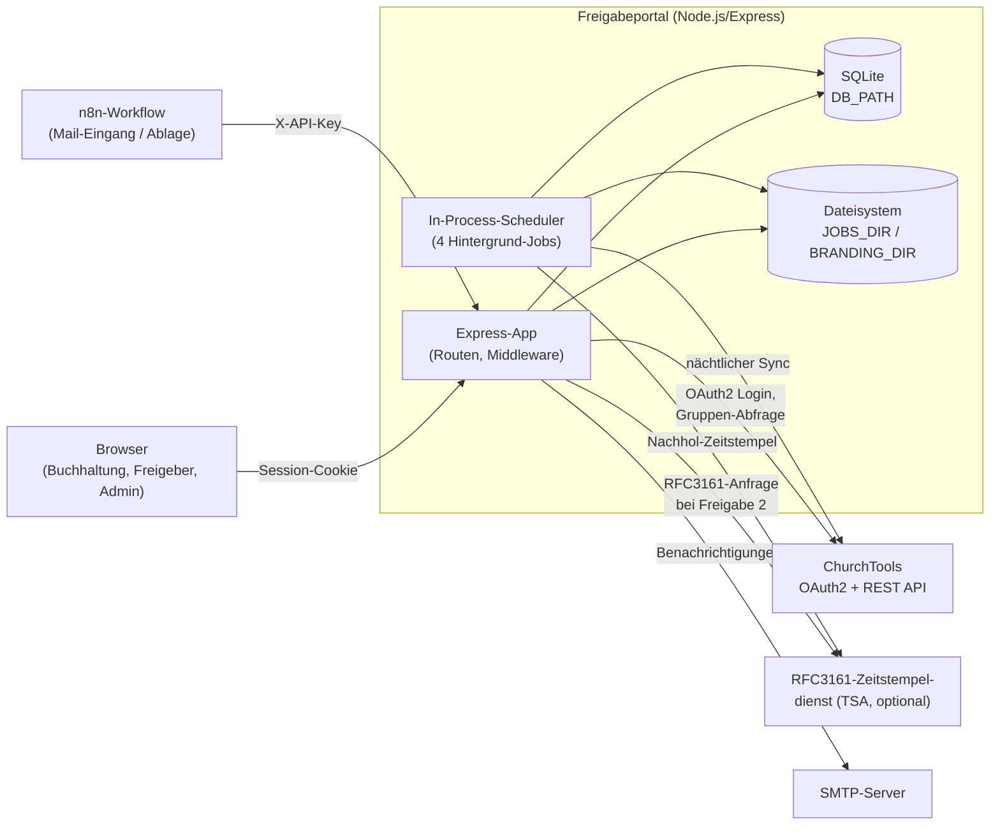
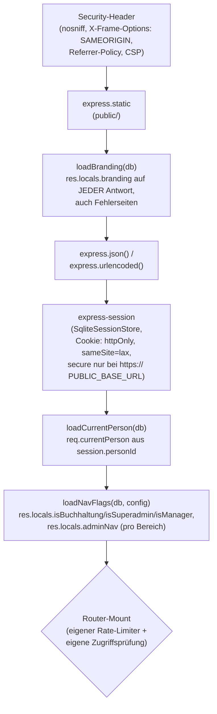

# Architektur

## Tech-Stack

- **Laufzeit**: Node.js ≥ 22.13.0 (ESM, `type: module`), kein Build-Schritt.
- **Web-Framework**: Express 4.
- **Views**: server-seitig gerenderte EJS-Templates (kein Client-Framework, kein SPA-Bundling).
- **Datenbank**: SQLite über das eingebaute `node:sqlite` — eine einzelne Datei (`DB_PATH`), kein separater DB-Server.
- **Dateiablage**: Rechnungs-PDFs/Thumbnails unter `JOBS_DIR`, Branding-Logo unter `BRANDING_DIR` — beides normales Dateisystem, keine Objectstorage-Anbindung.
- **PDF-Verarbeitung**: `mupdf` (Rendering/QR-Scan-Rasterung), `pdf-lib` (Stempel-Seite anhängen, Beleg mergen), `pdf-rfc3161` (RFC3161-Zeitstempel).
- **QR-Code**: `jsqr` (Dekodierung), eigener Parser für das Swiss-QR-Bill-Zeilenformat.
- **Mail**: `nodemailer` gegen ein beliebiges SMTP-Konto.
- **Hosting**: Infomaniak Node.js-Webhosting; der Node-Prozess läuft dauerhaft und übernimmt Scheduling selbst (siehe unten) — kein externer Task-Scheduler nötig.

## Systemüberblick

Es gibt keine separate Backend-API und kein Frontend-Build: jede Seite ist
eine serverseitig gerenderte EJS-Ansicht, Formulare posten klassisch per
`POST`. Die einzige echte JSON-API ist die n8n-Schnittstelle
(`/api/n8n/jobs/*`, siehe [n8n-schnittstelle.md](n8n-schnittstelle.md)) plus
eine kleine interne JSON-Route für den Pool (`/api/pool`).

## Bootstrap (`src/index.js`)

1. `loadConfig()` — liest und validiert alle Umgebungsvariablen; bricht den
   Start sofort mit einer Fehlermeldung ab, wenn ein Pflichtwert fehlt oder
   ein `*_SECRET`/`*_TOKEN`/`*_KEY` kürzer als 32 Zeichen ist oder noch
   `changeme` enthält (`src/config/env.js`).
2. `openDatabase(config.dbPath)` — öffnet/erstellt die SQLite-Datei, wendet
   `schema.sql` an.
3. `seedDefaults(db)` — schreibt Default-Werte in `admin_config`, falls noch
   nicht vorhanden (Eskalationszeiten, Cron-Zeitpläne, Sync-Schwellen, …).
4. `createApp({ db, config })` — baut die Express-App (siehe unten).
5. `startScheduler({ db, config, mailer })` — startet die vier
   In-Process-Hintergrund-Jobs (siehe
   [geplante-jobs-und-benachrichtigungen.md](geplante-jobs-und-benachrichtigungen.md)).
6. `app.listen(config.port)`.

## Middleware-Pipeline (`src/app.js`)

Jede Anfrage durchläuft, in dieser Reihenfolge, folgende globale
Middleware, bevor sie den passenden Router erreicht:

Danach entscheidet jeder Router-Mount selbst über Rate-Limiting
(`src/middleware/rateLimit.js`, drei Tarife: `public`, `session`, `machine`)
und Zugriffskontrolle — siehe
[auth-und-rechte.md](auth-und-rechte.md).

## Router-Übersicht

| Mount | Rate-Limiter | Zugriff | Zweck |
|---|---|---|---|
| `/branding` | public | offen | Logo ausliefern |
| `/admin` + Unterrouten | session | `requireAdminAreaAccess` + pro Bereich unterschiedlich (siehe [admin-bereich.md](admin-bereich.md)) | gesamter Admin-Bereich |
| `/api/n8n/jobs` | machine | `X-API-Key` | Rechnungseingang/-abholung durch n8n |
| `/api/pool` | session | Rolle `buchhaltung` | JSON-Pool-API (Beanspruchen) |
| `/pool` | session | eingeloggt | Dashboard für jede aktive Person |
| `/downloads` | eigene (session bzw. public je Route) | siehe [n8n-schnittstelle.md](n8n-schnittstelle.md) | signierte PDF-/Thumbnail-Auslieferung |
| `/kontierung` | session | eingeloggt + Job-Autorisierung | Kontierung, Aufsplitten |
| `/freigabe2` | session | eingeloggt + Job-Autorisierung | zweite Freigabe |
| `/abgelehnt` | session | eingeloggt + Job-Autorisierung | Überarbeitung abgelehnter Rechnungen |
| `/zeitstempel-pruefen` | session | eingeloggt | Zeitstempel-Verifikation + Zertifikat |
| `/auth` | public | offen | ChurchTools-OAuth2-Login/-Logout |
| `/internal/cron` | machine | `X-Cron-Secret` | manuelles/externes Auslösen der vier Hintergrund-Jobs |
| `/healthz` | keiner | offen | `{status:"ok"}` |
| `/` | public | — | leitet auf `/pool` (eingeloggt) oder `/auth/login` (anonym) weiter |

## Sicherheitsmechanismen (Auszug)

- **Security-Header** auf jeder Antwort: `X-Content-Type-Options: nosniff`,
  `X-Frame-Options: SAMEORIGIN` (nicht `DENY`, weil PDF-Vorschauen als
  same-origin `<iframe>` eingebettet werden), `Referrer-Policy: no-referrer`
  (signierte Download-URLs tragen ihre Signatur in der Query-String),
  restriktive `Content-Security-Policy`.
- **Signierte, zeitlich begrenzte Download-URLs** (`src/services/downloadUrl.js`):
  HMAC-SHA256 über `jobId.expires`, zeitkonstanter Vergleich
  (`crypto.timingSafeEqual`). Nutzt niemand die Session, sondern eine
  Signatur — so kann auch n8n (ohne Login) eine PDF für ein kurzes
  Zeitfenster abrufen.
- **API-Key/Cron-Secret**: gleiche zeitkonstante Vergleichslogik für
  `X-API-Key` (`/api/n8n/jobs`) und `X-Cron-Secret` (`/internal/cron`).
- **Rate-Limiting**, dreistufig: `public` (100/15 Min, IP-basiert),
  `session` (300/15 Min, personen- oder IP-basiert) und `machine`
  (60/1 Min, IP-basiert, für API-Key-/Cron-Aufrufer).
- **Magic-Byte-Prüfung** statt Vertrauen auf den deklarierten
  Content-Type bei jedem Datei-Upload (Rechnungs-PDF, Beleg-Anhang,
  Branding-Logo).
