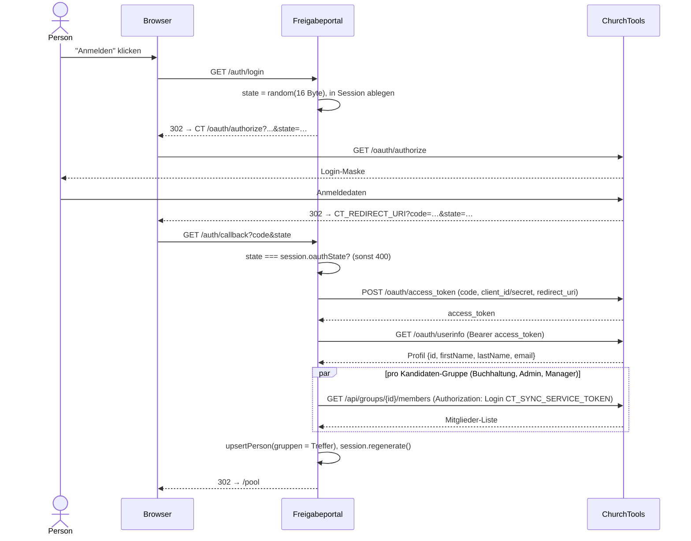
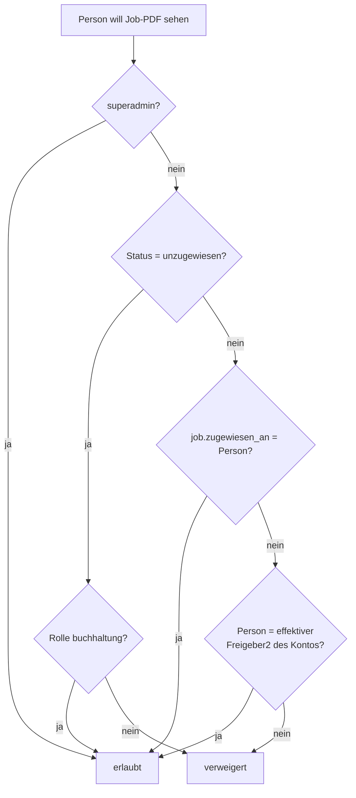

# Authentifizierung und Rechte

Das Portal hat kein eigenes Passwort/Benutzerverwaltung — jeder Login läuft
über ChurchTools-OAuth2. Rechte ergeben sich aus zwei unabhängigen
Quellen: ChurchTools-Gruppenmitgliedschaft (grobe Rollen) und additive,
im Portal selbst vergebene Einzelrechte (feingranular für den
Admin-Bereich).

## ChurchTools-OAuth2-Login

Wichtige Details:

- **Zwei verschiedene Token-Typen**: der frisch geholte OAuth-
  `access_token` funktioniert nur gegen `/oauth/*`. Für die
  Gruppenmitgliedschaft (`/api/groups/{id}/members`) wird stattdessen der
  technische `CT_SYNC_SERVICE_TOKEN` mit dem Schema `Authorization: Login
  <token>` verwendet — dieselbe Anfrage wie im nächtlichen Sync (siehe
  [personen-sync.md](personen-sync.md)).
- **Gruppen werden über die ID abgeglichen, nie über den Namen** — ein
  explizites Lastenheft-Requirement, damit eine Umbenennung der Gruppe in
  ChurchTools den Zugriff nicht stillschweigend bricht. `/oauth/userinfo`
  liefert zwar auch ein `groups`-Feld, das wird bewusst ignoriert, weil es
  nur Namen enthält.
- **Session-Fixation-Schutz**: `session.regenerate()` beim Login — eine vor
  dem Login ausgestellte Session-ID darf nie zu einer authentifizierten
  werden.
- **Kein Gruppenzwang beim Login**: der Login gelingt unabhängig davon, ob
  die Person in einer der drei Gruppen ist — Freigeber/Stellvertreter
  können rein kontobasierte Rollen ohne jede Gruppenmitgliedschaft sein.
  Die eigentliche Autorisierung passiert weiter unten in der Kette, pro
  Route bzw. pro Job.
- **`/pool` ist das Ziel für jeden Login** — es gibt keine separate
  Landingpage; `/` leitet eingeloggte Personen direkt dorthin weiter.

## Rollenmodell (Gruppen)

Drei ChurchTools-Gruppen werden auf drei Rollen abgebildet
(`src/middleware/roles.js`):

| Rolle | Umgebungsvariable | Pflicht? | Bedeutung |
|---|---|---|---|
| `buchhaltung` | `CT_GROUP_ID_BUCHHALTUNG` | ja | sieht den unternehmensweiten Pool unzugewiesener Rechnungen, kann Rechnungen beanspruchen |
| `superadmin` | `CT_GROUP_ID_ADMIN` | ja | voller Zugriff auf den gesamten Admin-Bereich, kann Einzelrechte vergeben, ist Fallback-Empfänger für jede Admin-Eskalation |
| `manager` | `CT_GROUP_ID_MANAGER` | optional | nur Zugriff auf `/admin/personen` (Übersicht) |

`personHasRole(person, config, rolle)` prüft, ob die zugehörige
ChurchTools-Gruppen-ID in `person.gruppen` enthalten ist — dieses Array
wird bei Login und beim nächtlichen Sync neu geschrieben, **nicht** bei
jeder Anfrage live gegen ChurchTools geprüft.

## Additive Einzelrechte (`person_berechtigungen`)

Zusätzlich zum Gruppenmodell gibt es sechs einzeln vergebbare,
additive Rechte, unabhängig von ChurchTools-Gruppen
(`src/middleware/permissions.js`, `src/db/personBerechtigungenRepo.js`):

- `konten_verwalten`
- `debitoren_verwalten`
- `geplante_jobs_verwalten`
- `abgelehnt_verwalten`
- `mails_einsehen`
- `sync_einsehen`

`superadmin` und `manager` erhalten jedes dieser Rechte automatisch über
ihr Rollen-Bundle. Für alle anderen Personen sind sie rein additiv: ein
Recht ohne jede ChurchTools-Gruppenmitgliedschaft. Vergeben werden sie
ausschliesslich von einem `superadmin` unter **Admin → Personen**
(`POST /admin/personen/:id/berechtigungen`).

Drei Admin-Bereiche sind bewusst **nicht** vergebbar und bleiben
`superadmin`-exklusiv: Eskalationszeiten, Erscheinungsbild, Zeitstempel —
strukturell abgesichert (die Datenbank-Tabelle akzeptiert per `CHECK`-
Constraint nur die sechs oben genannten Werte, ein siebter Wert lässt sich
gar nicht erst einfügen).

Details zur Rechte-Matrix pro Admin-Seite: [admin-bereich.md](admin-bereich.md).

## Job-Autorisierung (pro Rechnung)

Unabhängig vom Admin-Bereich hat jede Rechnung ihre eigene, kontextuelle
Autorisierung — wer eine bestimmte Rechnung sehen/bearbeiten darf, hängt
vom aktuellen `status` und den auf dem zugehörigen **Konto** hinterlegten
Personen ab (Details zum Status-Modell: [rechnungs-workflow.md](rechnungs-workflow.md)).

`canViewJobPdf(db, config, person, job)` (`src/services/jobAuthorization.js`)
ist die zentrale, überall geteilte Sichtbarkeitsprüfung für PDF-Vorschau,
Thumbnail und Zeitstempel-Verifikation:

Die einzelnen Seiten-Routen (`/kontierung/:id`, `/freigabe2/:id`,
`/abgelehnt/:id`) implementieren eine engere Variante derselben Logik
zusätzlich zum konkreten Status, den die jeweilige Aktion voraussetzt
(z. B. `/kontierung/:id` nur bei Status `zugewiesen`).

**Vier-Augen-Prinzip, hart erzwungen**: Freigabe 2 prüft bei jeder Anfrage
zusätzlich, ob dieselbe Person bereits Freigabe 1 für genau diesen Job
erteilt hat — unabhängig davon, was zum Zeitpunkt der Konto-Zuweisung
galt (Konto-Rollen können sich zwischendurch geändert haben, oder eine
Person hat sowohl Buchhaltungs- als auch Superadmin-Rolle).
