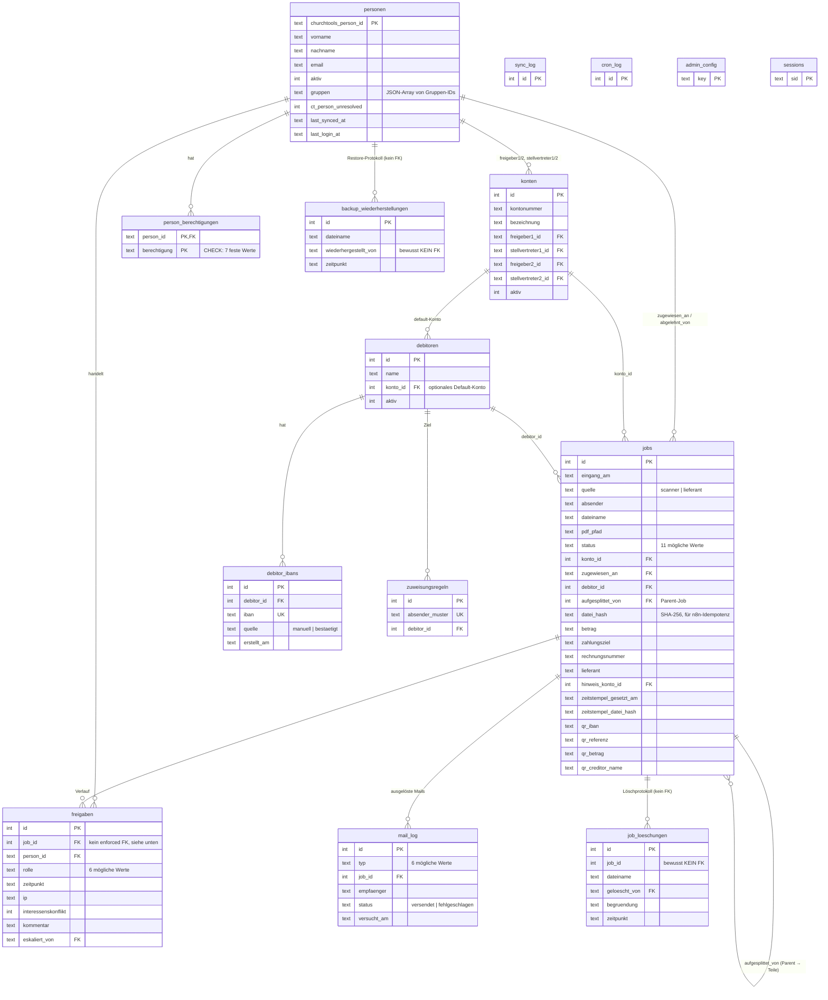

# Datenmodell

SQLite-Datenbank (`schema.sql`), eine Datei unter `DB_PATH`. Kein ORM —
alle Zugriffe laufen über handgeschriebenes SQL in `src/db/*Repo.js`
(jeweils ein Repo pro Tabelle bzw. Konzept).

## ER-Diagramm

## Tabellen im Detail

### `personen`
Lokaler Cache von ChurchTools-Personen, befüllt bei Login und beim
nächtlichen Sync. `gruppen` speichert die Liste der relevanten
ChurchTools-Gruppen-IDs als JSON-Array (nicht die komplette
ChurchTools-Gruppenzugehörigkeit). `ct_person_unresolved` markiert eine
Person, die in ChurchTools nicht mehr auffindbar ist (z. B. nach einem
Personen-Merge) — sie bleibt als historischer Datensatz erhalten statt
gelöscht zu werden. `aktiv = 0` heisst deaktiviert (kein aktiver Sync-Treffer
mehr, siehe [personen-sync.md](personen-sync.md)).

### `person_berechtigungen`
Additive Einzelrechte, siehe [auth-und-rechte.md](auth-und-rechte.md). Ein
`CHECK`-Constraint erlaubt strukturell nur sieben Werte — die drei
`superadmin`-exklusiven Admin-Bereiche lassen sich gar nicht erst
eintragen.

### `konten`
Ein "Konto" ist eine Kostenstelle mit genau vier Rollen: Freigeber 1 +
dessen Stellvertreter, Freigeber 2 + dessen Stellvertreter — alle vier
müssen unterschiedliche, aktive Personen sein
(`validateKontoRoles`). Freigeber 1 kontiert/erstfreigibt, Freigeber 2
erteilt die zweite, unabhängige Freigabe (Vier-Augen-Prinzip).

### `debitoren` und `zuweisungsregeln`
Ein Debitor (Lieferant) kann ein Default-Konto haben. `zuweisungsregeln`
bildet Absender-Muster (exakte E-Mail-Adresse oder Domain) auf einen
Debitor ab — trifft eine Regel beim Rechnungseingang, wird der Job direkt
diesem Debitor/Konto zugewiesen statt in den Pool zu fallen (siehe
[rechnungs-workflow.md](rechnungs-workflow.md)).

### `debitor_ibans`
Ein Debitor kann mehrere bekannte IBANs haben (`quelle`: manuell vom Admin
erfasst, oder `bestaetigt` — automatisch übernommen, wenn eine Person bei
der Kontierung einen unbekannten QR-Code-IBAN explizit bestätigt). Basis
für den Betrugserkennungs-Abgleich, siehe
[qr-bill-und-betrugserkennung.md](qr-bill-und-betrugserkennung.md).

### `jobs`
Die zentrale Tabelle — eine Zeile pro Rechnung/Beleg. `status` ist eine
von elf Werten (State Machine, siehe
[rechnungs-workflow.md](rechnungs-workflow.md)). Die vielen
`*_eskaliert_*`-Spalten protokollieren Interessenskonflikt-Eskalationen
getrennt für Freigabe 1 und Freigabe 2. `aufgesplittet_von` verweist auf
den ursprünglichen Job, wenn diese Zeile aus einer Aufsplittung entstand —
der Elternjob bleibt (Status `aufgesplittet`) als historische Referenz
erhalten. Die `qr_*`-Spalten cachen die beim Eingang aus dem Swiss-QR-Bill
gelesenen Zahlungsdaten.

### `freigaben`
Append-only-Protokoll jeder Freigabe-relevanten Aktion (Freigabe 1/2,
Ablehnung, Eskalation, IBAN-Abweichung) — Grundlage sowohl für die
Autorisierungs-Prüfungen (Vier-Augen-Prinzip) als auch für das
menschenlesbare Audit-Log auf jeder Rechnungsseite
(`src/services/auditLog.js`) und für die Verlauf-Seite, die auf das
finale PDF gestempelt wird. `job_id` hat bewusst **keinen** enforced
Foreign Key.

### `mail_log`
Jeder Zustellversuch (erfolgreich oder fehlgeschlagen), inkl. Volltext —
Basis für **Admin → E-Mail-Protokoll** und die "erneut senden"-Funktion.

### `job_loeschungen`
Protokoll jeder endgültigen Löschung einer abgelehnten Rechnung.
`job_id` ist **absichtlich kein** Foreign Key: der Sinn dieser Tabelle ist
gerade, den Datensatz zu überleben, nachdem die zugehörige `jobs`-Zeile
(seit der Umstellung auf Soft-Delete eigentlich nur noch auf Status
`geloescht` gesetzt, nicht mehr physisch entfernt) nicht mehr aussagekräftig
ist. `dateiname` wird dupliziert, weil sie sonst nach der Löschung nicht
mehr rekonstruierbar wäre.

### `backup_wiederherstellungen`
Audit-Trail jeder Datenbank-Wiederherstellung über **Admin →
Datenbank-Backup** (Dateiname des eingespielten Archivs, auslösende Person,
Zeitpunkt) — Grundlage für den Wiederherstellungs-Verlauf auf dieser Seite.
Eigene schlanke Tabelle statt Zweckentfremdung von `cron_log`, weil hier —
anders als bei den geplanten Jobs — festgehalten werden muss, *welche
Person* die Wiederherstellung ausgelöst hat.

`wiederhergestellt_von` ist **absichtlich kein** Foreign Key auf `personen`
— dieselbe Überlegung wie bei `job_loeschungen.job_id`, nur in die andere
Richtung: Der Eintrag wird nicht in die laufende, sondern in die *gerade
wiederhergestellte* Datenbank geschrieben (das offene File-Handle des
Prozesses hängt nach dem Datei-Swap noch am alten Inode, ein Eintrag über
die Live-Verbindung wäre beim Neustart weg). Deren `personen`-Tabelle stammt
aus dem Archiv und muss die auslösende Person gar nicht enthalten — etwa
beim Restore eines Archivs, das älter ist als deren Konto. Ein erzwungener
FK würde genau dann den Audit-Eintrag scheitern lassen und einen bereits
erfolgreichen Restore als Fehler melden.

### `sync_log`, `cron_log`, `admin_config`, `sessions`
Betriebs-/Konfigurationstabellen: Lauf-Historie des nächtlichen
ChurchTools-Syncs bzw. der vier anderen Hintergrund-Jobs, Key-Value-Store
für alle Admin-Einstellungen (Eskalationszeiten, Cron-Zeitpläne,
Branding, TSA-Konfiguration, …), und der Express-Session-Store.
