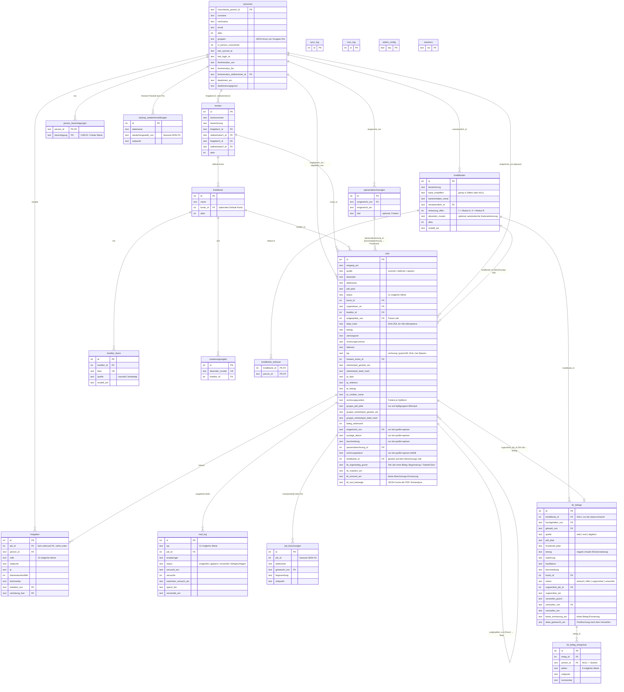

# Datenmodell

SQLite-Datenbank (`schema.sql`), eine Datei unter `DB_PATH`. Kein ORM —
alle Zugriffe laufen über handgeschriebenes SQL in `src/db/*Repo.js`
(jeweils ein Repo pro Tabelle bzw. Konzept).

## ER-Diagramm

```mermaid
erDiagram
    personen ||--o{ jobs : "zugewiesen_an / abgelehnt_von"
    personen ||--o{ konten : "freigeber1/2, stellvertreter1/2"
    personen ||--o{ person_berechtigungen : "hat"
    personen ||--o{ freigaben : "handelt"
    konten ||--o{ jobs : "konto_id"
    konten ||--o{ kreditoren : "default-Konto"
    kreditoren ||--o{ jobs : "kreditor_id"
    kreditoren ||--o{ kreditor_ibans : "hat"
    kreditoren ||--o{ zuweisungsregeln : "Ziel"
    jobs ||--o{ freigaben : "Verlauf"
    jobs ||--o{ mail_log : "ausgelöste Mails"
    jobs ||--o{ jobs : "aufgesplittet_von (Parent → Teile)"
    jobs ||--o{ job_loeschungen : "Löschprotokoll (kein FK)"
    personen ||--o{ backup_wiederherstellungen : "Restore-Protokoll (kein FK)"
    personen ||--o{ spesenabrechnungen : "eingereicht_von"
    spesenabrechnungen ||--o{ jobs : "spesenabrechnung_id (Sammelabrechnung → Positionen)"
    personen ||--o{ jobs : "eingereicht_von (Spesen)"
    personen ||--o{ kreditkarten : "verantwortlich_id"
    kreditkarten ||--o{ kreditkarte_erfasser : "Modus B"
    kreditkarten ||--o{ kk_belege : "kreditkarte_id"
    kreditkarten ||--o{ jobs : "kreditkarte_id (Abrechnungs-Job)"
    kk_belege ||--o{ kk_beleg_ereignisse : "beleg_id"
    jobs ||--o| kk_belege : "zugeordnet_job_id (Teil-Job ← Beleg)"

    personen {
        text churchtools_person_id PK
        text vorname
        text nachname
        text email
        int aktiv
        text gruppen "JSON-Array von Gruppen-IDs"
        int ct_person_unresolved
        text last_synced_at
        text last_login_at
        text ferienmodus_von
        text ferienmodus_bis
        text ferienmodus_stellvertreter_id FK
        text deaktiviert_am
        text deaktivierungsgrund
    }
    person_berechtigungen {
        text person_id PK,FK
        text berechtigung PK "CHECK: 9 feste Werte"
    }
    konten {
        int id PK
        text kontonummer
        text bezeichnung
        text freigeber1_id FK
        text stellvertreter1_id FK
        text freigeber2_id FK
        text stellvertreter2_id FK
        int aktiv
    }
    kreditoren {
        int id PK
        text name
        int konto_id FK "optionales Default-Konto"
        int aktiv
    }
    kreditor_ibans {
        int id PK
        int kreditor_id FK
        text iban UK
        text quelle "manuell | bestaetigt"
        text erstellt_am
    }
    zuweisungsregeln {
        int id PK
        text absender_muster UK
        int kreditor_id FK
    }
    spesenabrechnungen {
        int id PK
        text eingereicht_von FK
        text eingereicht_am
        text titel "optional, Freitext"
    }
    jobs {
        int id PK
        text eingang_am
        text quelle "scanner | lieferant | spesen"
        text absender
        text dateiname
        text pdf_pfad
        text status "11 mögliche Werte"
        int konto_id FK
        text zugewiesen_an FK
        int kreditor_id FK
        int aufgesplittet_von FK "Parent-Job"
        text datei_hash "SHA-256, für n8n-Idempotenz"
        text betrag
        text zahlungsziel
        text rechnungsnummer
        text lieferant
        text typ "rechnung | gutschrift, NULL bei Spesen"
        int hinweis_konto_id FK
        text zeitstempel_gesetzt_am
        text zeitstempel_datei_hash
        text qr_iban
        text qr_referenz
        text qr_betrag
        text qr_creditor_name
        text rechnungsposition "Freitext je Splitkind"
        text gruppe_pdf_pfad "nur auf Splitgruppen-Elternjob"
        text gruppe_zeitstempel_gesetzt_am
        text gruppe_zeitstempel_datei_hash
        int beleg_seitenzahl
        text eingereicht_von FK "nur bei quelle=spesen"
        text auslage_datum "nur bei quelle=spesen"
        text beschreibung "nur bei quelle=spesen"
        int spesenabrechnung_id FK
        text rechnungsdatum "nur bei quelle=spesen befüllt"
        int kreditkarte_id FK "gesetzt auf dem Abrechnungs-Job"
        text kk_eigenbeleg_grund "Teil-Job ohne Beleg: Begründung / 'Gebühr/Zins'"
        text kk_markiert_am
        text kk_erinnert_am "letzte Abrechnungs-Erinnerung"
        text kk_text_betraege "JSON-Cache der PDF-Textanalyse"
    }
    kreditkarten {
        int id PK
        text bezeichnung
        text karte_endziffern "genau 4 Ziffern oder NULL"
        text karteninhaber_name
        text verantwortlich_id FK
        int erfassung_offen "1 = Modus A, 0 = Modus B"
        text absender_muster "optional, automatische Kartenerkennung"
        int aktiv
        text erstellt_am
    }
    kreditkarte_erfasser {
        int kreditkarte_id PK,FK
        text person_id PK,FK
    }
    kk_belege {
        int id PK
        int kreditkarte_id FK "NULL nur bei status=entwurf"
        text hochgeladen_von FK
        text gekauft_von FK
        text quelle "web | mail | abgleich"
        text pdf_pfad
        text thumbnail_pfad
        text betrag "negativ erlaubt (Rückerstattung)"
        text waehrung
        text kaufdatum
        text beschreibung
        int konto_id FK
        text status "entwurf | offen | zugeordnet | verworfen"
        int zugeordnet_job_id FK
        text zugeordnet_am
        text verworfen_grund
        text verworfen_von FK
        text verworfen_am
        text letzte_erinnerung_am "letzte Beleg-Erinnerung"
        text datei_geloescht_am "Fristlöschung nach dem Verwerfen"
    }
    kk_beleg_ereignisse {
        int id PK
        int beleg_id FK
        text person_id FK "NULL = System"
        text aktion "6 mögliche Werte"
        text zeitpunkt
        text kommentar
    }
    freigaben {
        int id PK
        int job_id FK "kein enforced FK, siehe unten"
        text person_id FK
        text rolle "13 mögliche Werte"
        text zeitpunkt
        text ip
        int interessenskonflikt
        text kommentar
        text eskaliert_von FK
        text vertretung_fuer FK
    }
    mail_log {
        int id PK
        text typ "12 mögliche Werte"
        int job_id FK
        text empfaenger
        text status "eingereiht | geplant | versendet | fehlgeschlagen"
        text versucht_am
        int versuche
        text naechster_versuch_am
        text sperre_bis
        text versendet_am
    }
    job_loeschungen {
        int id PK
        int job_id "bewusst KEIN FK"
        text dateiname
        text geloescht_von FK
        text begruendung
        text zeitpunkt
    }
    backup_wiederherstellungen {
        int id PK
        text dateiname
        text wiederhergestellt_von "bewusst KEIN FK"
        text zeitpunkt
    }
    sync_log { int id PK }
    cron_log { int id PK }
    admin_config { text key PK }
    sessions { text sid PK }
```

## Tabellen im Detail

### `personen`
Lokaler Cache von ChurchTools-Personen, befüllt bei Login und beim
nächtlichen Sync. `gruppen` speichert die Liste der relevanten
ChurchTools-Gruppen-IDs als JSON-Array (nicht die komplette
ChurchTools-Gruppenzugehörigkeit). `ct_person_unresolved` markiert eine
Person, die in ChurchTools nicht mehr auffindbar ist (z. B. nach einem
Personen-Merge) — sie bleibt als historischer Datensatz erhalten statt
gelöscht zu werden. `aktiv = 0` heisst deaktiviert: ChurchTools meldet die
Person als gelöscht oder archiviert (`deaktivierungsgrund`
`churchtools_geloescht`/`churchtools_archiviert`, Zeitpunkt in
`deaktiviert_am`). Fehlende Gruppenmitgliedschaft allein deaktiviert nicht,
sie leert nur `gruppen`; ein erneuter Login reaktiviert und löscht beide
Felder — siehe [personen-sync.md](personen-sync.md#zugangsmodell).

**Ferienmodus** (`ferienmodus_von`, `ferienmodus_bis`, `ferienmodus_stellvertreter_id`):
selbstverwalteter, additiver Abwesenheits-Zeitraum mit gewähltem Stellvertreter — siehe
[Ferienmodus](rechnungs-workflow.md#ferienmodus--abwesenheits-stellvertretung). "Aktiv" wird nie
gespeichert, sondern bei jeder Prüfung aus dem heutigen Datum berechnet
(`src/services/vertretung.js`).

### `person_berechtigungen`
Additive Einzelrechte, siehe [auth-und-rechte.md](auth-und-rechte.md). Ein
`CHECK`-Constraint erlaubt strukturell nur sieben Werte — die drei
`superadmin`-exklusiven Admin-Bereiche lassen sich gar nicht erst
eintragen.

### `konten`
Ein "Konto" ist eine Kostenstelle mit genau vier Rollen: Freigeber 1 +
dessen Stellvertreter, Freigeber 2 + dessen Stellvertreter — alle vier
müssen unterschiedliche, aktive Personen sein
(`validateKontoRoles`). Freigeber 1 kontiert/erstfreigibt, Freigeber 2
erteilt die zweite, unabhängige Freigabe (Vier-Augen-Prinzip).

### `kreditoren` und `zuweisungsregeln`
Bis 2026-09-29 hiessen Tabellen und Spalten fachlich falsch `debitoren`,
`debitor_ibans` und `debitor_id`; die Migration und die Leseadapter fuer
historische Snapshots beschreibt [Kreditoren statt Debitoren](kreditoren-statt-debitoren.md).
`kreditoren.id` ist eine interne ID, keine Kreditorennummer der Buchhaltung;
`konto_id` verweist auf das Standard-Konto (`konten`) und wurde nicht veraendert.
Ein Kreditor (Lieferant) kann ein Default-Konto haben. `zuweisungsregeln`
bildet Absender-Muster (exakte E-Mail-Adresse oder Domain) auf einen
Kreditor ab — trifft eine Regel beim Rechnungseingang, wird der Job direkt
diesem Kreditor/Konto zugewiesen statt in den Pool zu fallen (siehe
[rechnungs-workflow.md](rechnungs-workflow.md)).

### `spesenabrechnungen`
Reine Gruppierung für eine Spesen-Sammelabrechnung — kein eigener
Workflow-Status, keine eigene Freigabe. Jede Position lebt und stirbt als
unabhängiger `jobs`-Datensatz; diese Tabelle dient nur dazu, der
einreichenden Person ihre zusammengehörigen Positionen wieder anzuzeigen
(`titel` optional, freier Text). Details:
[spesen-einreichung.md](spesen-einreichung.md).

### `kreditkarten`, `kreditkarte_erfasser`, `kk_belege`, `kk_beleg_ereignisse`
Dritte Domäne neben Rechnungen und Spesen: Kreditkartenbelege lassen sich
vorab hochladen (`kk_belege`, bewusst **keine** `jobs`-Zeilen) und werden
erst beim Abgleich der Monatsabrechnung zu Teil-Jobs
(`kk_belege.zugeordnet_job_id`). `kreditkarte_erfasser` schränkt das
Erfassen optional auf eine gepflegte Liste ein (Modus B, nur ausgewertet
bei `kreditkarten.erfassung_offen = 0`). `kk_beleg_ereignisse` ist ein
eigenes Audit-Log für Belege, solange sie noch keine `jobs`-Zeile haben
(`person_id = NULL` heisst System). Details:
[kreditkarten-belege.md](kreditkarten-belege.md).

### `kreditor_ibans`
Ein Kreditor kann mehrere bekannte IBANs haben (`quelle`: manuell vom Admin
erfasst, oder `bestaetigt` — automatisch übernommen, wenn eine Person bei
der Kontierung einen unbekannten QR-Code-IBAN explizit bestätigt). Basis
für den Betrugserkennungs-Abgleich, siehe
[qr-bill-und-betrugserkennung.md](qr-bill-und-betrugserkennung.md).

### `jobs`
Die zentrale Tabelle — eine Zeile pro Rechnung/Beleg/Spesen-Position.
`status` ist eine von elf Werten (State Machine, siehe
[rechnungs-workflow.md](rechnungs-workflow.md)). Die vielen
`*_eskaliert_*`-Spalten protokollieren Interessenskonflikt-Eskalationen
getrennt für Freigabe 1 und Freigabe 2. `aufgesplittet_von` verweist auf
den ursprünglichen Job, wenn diese Zeile aus einer Aufsplittung entstand —
der Elternjob bleibt (Status `aufgesplittet`) als historische Referenz
erhalten. Die `qr_*`-Spalten cachen die beim Eingang aus dem Swiss-QR-Bill
gelesenen Zahlungsdaten. `typ` (`rechnung`/`gutschrift`, nur bei
`quelle IN ('scanner','lieferant')` gesetzt) unterscheidet Gutschriften
von Rechnungen, ohne den Betrag selbst mit Vorzeichen zu versehen — siehe
[rechnungs-workflow.md](rechnungs-workflow.md#2-kontierung-status-zugewiesen).

**Splitgruppen-Spalten** (`rechnungsposition`, `gruppe_pdf_pfad`,
`gruppe_zeitstempel_gesetzt_am`, `gruppe_zeitstempel_datei_hash`,
`gruppe_abgeholt_am`, `beleg_seitenzahl`): `rechnungsposition` ist Freitext
je Splitkind, die übrigen `gruppe_*`-Spalten leben ausschliesslich auf dem
Elternjob und tragen das Ergebnis des kombinierten Splitgruppen-Exports
(siehe [rechnungs-workflow.md](rechnungs-workflow.md#6-splitgruppen--kombinierter-export-statt-n-einzel-buchungen)).
`beleg_seitenzahl` hält fest, wie viele Seiten der ursprüngliche
Beleg/die Rechnung hatte, bevor eine Stempel- oder Visumseite angehängt
wurde — nötig, um beim Gruppen-Merge exakt die Originalseiten zu
kopieren.

**Spesen-Spalten** (`eingereicht_von`, `auslage_datum`, `beschreibung`,
`spesenabrechnung_id`, `rechnungsdatum`): nur bei `quelle = 'spesen'`
befüllt, siehe [spesen-einreichung.md](spesen-einreichung.md). Alle
rechnungsspezifischen Spalten (`absender`, `lieferant`, `rechnungsnummer`,
`kreditor_id`, `zahlungsziel`, `aufgesplittet_von`, `typ`) bleiben bei
einer Spesen-Position `NULL`.

**Kreditkarten-Spalten** (`kreditkarte_id`, `kk_eigenbeleg_grund`,
`kk_markiert_am`, `kk_erinnert_am`, `kk_text_betraege`): `kreditkarte_id`
steht auf dem Abrechnungs-Job (Elternjob), sobald er einer Karte markiert
wurde; `kk_eigenbeleg_grund` auf einem beim Abgleich entstandenen Teil-Job
ohne Beleg. `kk_erinnert_am` ist der Zeitpunkt der letzten
Abgleich-Erinnerung (`kk-beleg-erinnerungen`-Job). `kk_text_betraege`
cacht das Ergebnis der PDF-Textanalyse der Abrechnung als JSON
`{ betraege, daten, total }` (Fundstellen für Beträge/Daten je Textzeile
plus vorgeschlagenes Abrechnungstotal) — einmal berechnet beim
automatischen n8n-Eingang oder beim ersten Aufruf der Abgleich-Seite,
danach aus der Spalte gelesen statt die Abrechnung erneut zu parsen.
Details: [kreditkarten-belege.md](kreditkarten-belege.md).

**Nachweis-Spalten** (`freigabe_snapshot`, `gruppe_freigabe_snapshot`):
`freigabe_snapshot` friert bei Freigabe 2 Jobzeile, Konto, Stempeldaten und
die bestätigte Zahlung (`zahlung`, Version 2) ein; `gruppe_freigabe_snapshot`
auf dem Elternjob friert Kopf, Positionen und die gemeinsame Zahlung einer
Splitgruppe bei deren Finalisierung ein. Beide sind per Trigger
unveränderlich, sobald gesetzt (auch kein Zurücksetzen auf `NULL`), und die
einzige Quelle für exportierte Metadaten — siehe
[export-und-zahlungsintegritaet.md](export-und-zahlungsintegritaet.md).

### `altfall_entscheidungen`
Append-only (Trigger gegen `UPDATE`/`DELETE`), höchstens eine Zeile je Job
(`UNIQUE job_id`, bei Splitgruppen der Elternjob). Hält die unter
Admin → Altfälle getroffene Entscheidung (`nachbestaetigt`/`nur_archiv`),
den angezeigten Stand mit Herkunft je Wert (`angezeigte_daten`, JSON), den
Fingerprint (`stand`), Person, Namen zum Zeitpunkt, Pflichtbegründung und
Zeitpunkt.

### `freigaben`
Append-only-Protokoll jeder Freigabe-relevanten Aktion (Freigabe 1/2,
Ablehnung, Eskalation, IBAN-Abweichung) — Grundlage sowohl für die
Autorisierungs-Prüfungen (Vier-Augen-Prinzip) als auch für das
menschenlesbare Audit-Log auf jeder Rechnungsseite
(`src/services/auditLog.js`) und für die Verlauf-Seite, die auf das
finale PDF gestempelt wird. `job_id` hat bewusst **keinen** enforced
Foreign Key.

`vertretung_fuer` ist gesetzt, wenn die handelnde Person zum Zeitpunkt der Aktion aktiver
Ferienmodus-Stellvertreter der eigentlich zuständigen Person war — sonst `NULL`.

### `mail_log`
Persistente Warteschlange und Protokoll jeder Benachrichtigung, inkl.
Volltext — Basis für **Admin → E-Mail-Protokoll**, die automatische
Wiederholung (`mail-zustellung`) und die "erneut senden"-Funktion. Eine
Zeile je Empfänger. `status`: `eingereiht` (wartet auf Zustellung bzw.
Wiederholung), `geplant` (wartet auf den Digest), `versendet` (vom
SMTP-Server angenommen, `versendet_am`), `fehlgeschlagen` (endgültig).
`versuche`, `naechster_versuch_am` und `fehler_details` dokumentieren die
Wiederholungen; `sperre_token`/`sperre_bis` sind die befristete
Versandsperre gegen parallele Doppelzustellung, `eingereiht_am` der
Einreihungszeitpunkt. Die Aufbewahrungsfrist löscht nur `versendet` und
`fehlgeschlagen`. Details:
[geplante-jobs-und-benachrichtigungen.md](geplante-jobs-und-benachrichtigungen.md#benachrichtigungen-e-mail).

### `job_loeschungen`
Protokoll jeder endgültigen Löschung einer abgelehnten Rechnung.
`job_id` ist **absichtlich kein** Foreign Key: der Sinn dieser Tabelle ist
gerade, den Datensatz zu überleben, nachdem die zugehörige `jobs`-Zeile
(seit der Umstellung auf Soft-Delete eigentlich nur noch auf Status
`geloescht` gesetzt, nicht mehr physisch entfernt) nicht mehr aussagekräftig
ist. `dateiname` wird dupliziert, weil sie sonst nach der Löschung nicht
mehr rekonstruierbar wäre.

### `backup_wiederherstellungen`
Audit-Trail jeder Datenbank-Wiederherstellung (Dateiname des eingespielten
Archivs, auslösende Person, Zeitpunkt). Geschrieben vom Offline-Restore
(`npm run backup:restore`, siehe [offline-restore.md](offline-restore.md));
**Admin → Datenbank-Backup** zeigt den Verlauf nur an — eine Wiederherstellung
im laufenden Betrieb gibt es nicht mehr.
Eigene schlanke Tabelle statt Zweckentfremdung von `cron_log`, weil hier —
anders als bei den geplanten Jobs — festgehalten werden muss, *welche
Person* die Wiederherstellung ausgelöst hat.

`wiederhergestellt_von` ist **absichtlich kein** Foreign Key auf `personen`
— dieselbe Überlegung wie bei `job_loeschungen.job_id`, nur in die andere
Richtung: Der Eintrag wird nicht in die laufende, sondern in die *gerade
wiederhergestellte* Datenbank geschrieben (das offene File-Handle des
Prozesses hängt nach dem Datei-Swap noch am alten Inode, ein Eintrag über
die Live-Verbindung wäre beim Neustart weg). Deren `personen`-Tabelle stammt
aus dem Archiv und muss die auslösende Person gar nicht enthalten — etwa
beim Restore eines Archivs, das älter ist als deren Konto. Ein erzwungener
FK würde genau dann den Audit-Eintrag scheitern lassen und einen bereits
erfolgreichen Restore als Fehler melden.

### `sync_log`, `cron_log`, `admin_config`, `sessions`
Betriebs-/Konfigurationstabellen: Lauf-Historie des nächtlichen
ChurchTools-Syncs (`sync_log`) bzw. der übrigen Hintergrund-Jobs
(`cron_log`; `sicherheitsalarme` protokolliert stattdessen im Audit-Log),
Key-Value-Store
für alle Admin-Einstellungen (Eskalationszeiten, Cron-Zeitpläne,
Branding, TSA-Konfiguration, …), und der Express-Session-Store.
