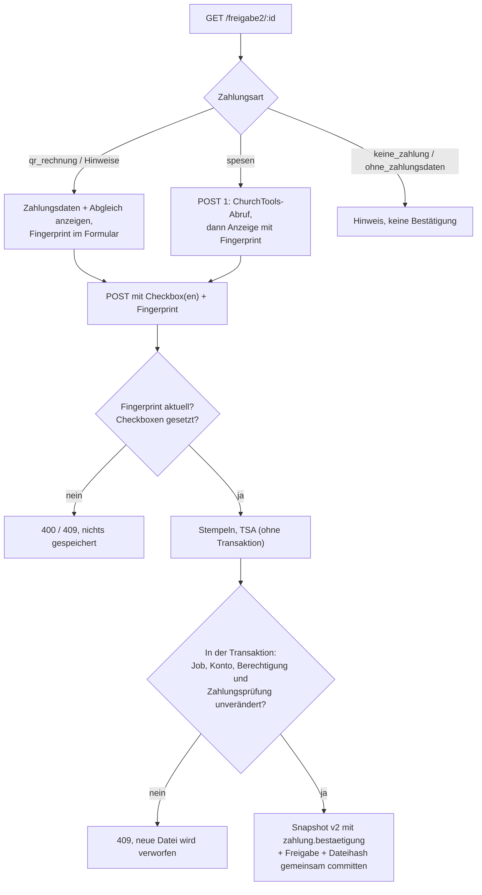

# Export- und Zahlungsintegrität

Stand: 2026-09-28. Paket aus dem Audit-Behebungsplan (Teile von C und F):
vollständige Snapshot-Bindung aller Exportmetadaten, ausdrückliche
Bestätigung der Zahlungsdaten für alle zahlungsauslösenden Belegarten und
abgesicherter Umgang mit Altfällen.

Zielgruppe: Entwickler:innen, Betreiber des n8n-Workflows und alle, die
Freigaben im Portal abnehmen.

## Grundsatz

Was an n8n/Bexio/Paperless übergeben wird, stammt **ausschliesslich** aus
einem unveränderlichen Nachweis:

| Quelle | Wann | Wo |
|---|---|---|
| Freigabe-Snapshot (Version 2) | Freigabe 2 eines Einzelbelegs oder Teilbelegs | `jobs.freigabe_snapshot` |
| Gruppen-Freigabe-Snapshot | Finalisierung einer Splitgruppe | `jobs.gruppe_freigabe_snapshot` (Elternjob) |
| Altfall-Entscheidung | ausdrückliche Entscheidung unter Admin → Altfälle | `altfall_entscheidungen` |

Die aktuelle `jobs`-Zeile, der Kontenstamm, hinterlegte Lieferanten-IBANs
und ChurchTools werden beim Export **nie** gelesen. Einzige Stelle, die
Exportmetadaten zusammenstellt: `src/services/exportSnapshot.js`
(`exportNachweis`). `/abholbereit`, `abholung-bestaetigen` und das
Exportmanifest verwenden sie gemeinsam.

## Bisher live gelesene Felder (behoben)

| Stelle | Vorher live | Jetzt |
|---|---|---|
| `/abholbereit` Einzelbeleg | Betrag, Typ, Lieferant, Rechnungsnummer, Zahlungsziel, Konto-ID, Absender, Beschreibung, QR-Felder | Snapshot |
| `/abholbereit` Splitgruppe | gesamter Kopf inkl. QR-Felder; je Position Betrag, Typ, Konto-ID, Position | Gruppen-Snapshot |
| Exportmanifest | Rückfall auf Live-Zeile ohne Snapshot; Gruppen-Elternjob immer live | Nachweis oder Sperre; unbelegte Werte getrennt |
| Gruppen-Stempelseite | Betrag/Typ je Position, Konto-Rückfall, Namen im Verlauf | Snapshot der Teilbelege |

## Welche Belegart braucht eine Zahlungsbestätigung?

| Belegart | Zahlungsart (`zahlung.art`) | Bestätigung bei Freigabe 2 | Exportierte Zahlung |
|---|---|---|---|
| Spesen | `spesen` | ja: IBAN + Kontoinhaber aus ChurchTools | Rückerstattung an einreichende Person |
| Rechnung mit Swiss-QR-Bill | `qr_rechnung` | ja: Empfänger, IBAN, Referenz, QR-Betrag, IBAN-Abgleich | Zahlung an QR-Empfänger |
| Rechnung mit ungültigen QR-Daten | `ohne_zahlungsdaten` + Hinweis `qr_ungueltig` | ja: "Zahlung wird manuell erfasst" | keine (`freigegeben: false`) |
| Rechnung ohne QR-Bill | `ohne_zahlungsdaten` | nein | keine; Zahlung manuell |
| Gutschrift | `keine_zahlung` | nein | keine |
| Splitgruppe / Kreditkartenabrechnung | wie die Gesamtrechnung (Elternjob) | jedes Kind bestätigt dieselbe Gesamtzahlung | eine Zahlung je Gruppe |

Begründung: Eine Zahlung wird nur für die Spesen-Rückerstattung und für
QR-Rechnungen maschinell vorbereitet. Genau dort kann eine manipulierte
Kontoverbindung Geld umleiten. Bisher wurde der IBAN-Abgleich nur als
Warn-Mail behandelt, und niemand hat die QR-Daten bei der Freigabe gesehen.
Eine Gutschrift löst keine Zahlung aus. Bei Rechnungen ohne QR-Bill fehlen
maschinenlesbare Daten, die n8n verwenden könnte. Deshalb werden dort auch
keine Zahlungsdaten exportiert und nie aus Stammdaten ergänzt.

Zusätzliche Hinweise, die eine zweite Checkbox verlangen:

- `iban_abweichung`: QR-IBAN ist beim gewählten Lieferanten nicht hinterlegt.
- `betrag_abweichung`: QR-Betrag weicht vom erfassten Rechnungsbetrag ab
  (bei Splitgruppen vom Gesamtbetrag).
- `qr_ungueltig`: IBAN mit falscher Prüfziffer bzw. nicht schweizerisch,
  Empfänger fehlt oder Referenz ungültig.

Ein Teilbeleg, dessen QR-Felder von denen der Gesamtrechnung abweichen,
kann nicht freigegeben werden. Er muss abgelehnt und geklärt werden.

## Ablauf Freigabe 2



Der Fingerprint bindet Job, Konto, Zahlungsdaten, Abgleichsergebnis,
Hinweise und die freigebende Person. Ändern sich die hinterlegten
Lieferanten-IBANs zwischen Anzeige und Absenden, gilt 409. Ändern sie sich
während der Stempel-/TSA-Phase, erkennt der erneute Vergleich in der
Transaktion das ebenfalls. Die Stempelseite zeigt die bestätigten
Zahlungsdaten (Empfänger, IBAN, Referenz).

Snapshot Version 2 (Auszug):

```json
{
  "version": 2,
  "job": { "...": "Jobzeile zum Freigabezeitpunkt" },
  "konto": { "id": 3, "kontonummer": "3000", "bezeichnung": "Unterhalt" },
  "zahlung": {
    "art": "qr_rechnung",
    "daten": { "iban": "CH93…", "empfaenger": "Muster AG", "referenz": "21…", "betrag": "120.50", "waehrung": "CHF" },
    "abgleich": "uebereinstimmung",
    "hinweise": [],
    "bestaetigung": { "person_id": "3", "zeitpunkt": "2026-09-28T…Z", "stand": "<Fingerprint>" }
  }
}
```

`zahlungsdaten`/`zahlungsdaten_bestaetigung` bleiben für Spesen zusätzlich
erhalten (kompatibel zu Version 1).

## Splitgruppen

Die Finalisierung (`pruefeUndFinalisiereSplitGruppe`) baut vor jeder
PDF-Arbeit den Gruppen-Snapshot (`bereiteGruppenSnapshotVor`):

1. Jeder nicht gelöschte Teilbeleg braucht einen Freigabe-Snapshot.
2. Alle Teilbelege müssen dieselbe Zahlungsart und dieselben Zahlungsdaten
   bestätigt haben. Diese müssen den eingefrorenen QR-Daten des Elternjobs
   entsprechen.
3. Positionen (Konto, Betrag, Typ, Freigaben, Verlauf, Kreditkarten-Hinweis,
   Dateihash) stammen aus den Snapshots der Teilbelege.

Ist eine Bedingung verletzt, liefert die Finalisierung `nachpruefung`. Dann
entsteht kein Archivdokument, und die Gruppe erscheint unter Admin →
Altfälle. Der Gruppen-Snapshot wird in derselben Transaktion wie Dateipfad
und finaler Hash gespeichert. Er ist per Trigger unveränderlich, auch gegen
ein Zurücksetzen auf `NULL`.

## Altfälle

Ein Altfall ist ein abgeschlossener, noch nicht übergebener Beleg (bzw.
eine vollständige, noch nicht abgeholte Splitgruppe) mit einer dieser
Eigenschaften:

- kein Freigabe-Snapshot (vor dessen Einführung freigegeben),
- Snapshot Version 1 einer QR-Rechnung ohne Zahlungsbestätigung,
- Spesen-Snapshot ohne Zahlungsdaten oder ohne Bestätigung,
- Splitgruppe ohne Gruppen-Snapshot oder mit uneinheitlich/nicht
  bestätigten Teilbelegen.

Solche Belege sind in `/abholbereit` unsichtbar (und werden nicht als
angeboten markiert). `abholung-bestaetigen` und `exportnachweis` liefern 409.

### Entscheidung unter Admin → Altfälle

Recht: `workflow_eingreifen` (Superadmins; nicht im Manager-Bündel).
Die Seite zeigt jeden Wert mit seiner Herkunft:

| Herkunft | Bedeutung |
|---|---|
| `freigabe_snapshot` | eingefrorener Freigabestand |
| `freigabe_snapshot_unbestaetigt` | Snapshot vorhanden, Zahlung damals nicht bestätigt |
| `jobdatensatz` | aktuelle Jobzeile, nicht freigabegebunden |
| `kontenstamm_aktuell` | aktueller Kontenstamm, nicht freigabegebunden |
| `qr_scan_eingang` | beim Eingang gescannte QR-Daten |
| `churchtools_aktuell` | **aktueller** ChurchTools-Stand, nicht der historische |

Zwei Entscheidungen sind möglich, jeweils mit Pflichtbegründung und
Bestätigungs-Checkbox:

- **Nachbestätigen**: Die angezeigten Daten werden als Übergabestand
  festgeschrieben. Nur möglich, wenn verwendbare Zahlungsdaten vorliegen.
  Das ist bei Spesen mit abrufbarer ChurchTools-IBAN der Fall; die Herkunft
  wird dabei ausdrücklich als aktuell gekennzeichnet.
- **Nur archivieren**: Der Beleg wird übergeben, aber mit
  `zahlung.freigegeben: false`. Das gilt z. B. für bereits manuell bezahlte
  Belege.

Schutzmechanismen:

- Die Entscheidung gilt genau für den angezeigten Stand (Fingerprint).
  Änderungen dazwischen liefern 409.
- Eine Entscheidung pro Beleg (`UNIQUE`). Zwei gleichzeitige Entscheidungen
  ergeben genau eine.
- Die Tabelle erlaubt kein `UPDATE` und kein `DELETE`.
- Wer die Spesen selbst eingereicht hat, kann sie nicht entscheiden (403).
- Nach der Entscheidung für eine noch nicht finalisierte Gruppe wird die
  Finalisierung sofort angestossen (sonst über `split-gruppen-nachholen`).

### Bereits übergebene Altfälle

Belege im Status `abgeholt`/`archiviert` (bzw. Gruppen mit
`gruppe_abgeholt_am`) sind bereits bei n8n. Sie bleiben ohne Entscheidung
archivierbar. Ihr Manifest trägt `archiv_ohne_zahlung: true` und
`nachweis_status: historisch_unvollstaendig`. Freigabegebundene Metadaten
bleiben leer; der aktuelle Datensatz steht getrennt unter
`unbelegte_jobdaten` mit Hinweis. `zahlung.freigegeben` ist `false`.

## Exportvertrag

Neu in `/abholbereit` (Einzel- und Gruppeneinträge) und im Manifest:

| Feld | Bedeutung |
|---|---|
| `nachweis_status` | `snapshot`, `altfall_nachbestaetigt`, `altfall_nur_archiv`; im Manifest zusätzlich `historisch_unvollstaendig`/`snapshot_zahlung_unbestaetigt` für bereits übergebene Altfälle |
| `zahlung.art` | siehe Tabelle oben |
| `zahlung.freigegeben` | **einzige** Grundlage für eine Zahlung in n8n |
| `zahlung.iban`, `kontoinhaber`, `referenz`, `betrag`, `waehrung` | bestätigte Zahlungsdaten (bei QR: `kontoinhaber` = Zahlungsempfänger) |
| `zahlung.iban_abgleich`, `hinweise` | eingefrorenes Prüfergebnis |
| `zahlung.bestaetigt_von`, `bestaetigt_am`, `herkunft` | wer/wann/auf welchem Weg |
| `altfall` | nur bei Altfall-Entscheidung: Person, Begründung, Zeitpunkt, Herkunft |

Die bisherigen Felder bleiben erhalten, werden aber aus dem Nachweis
befüllt: `qr_*` als eingefrorene Eingangswerte, `iban`/`kontoinhaber` nur
für bestätigte Spesen. Die Manifestversion ist `2`; bereits
festgeschriebene Manifeste der Version 1 bleiben unverändert abrufbar.

**n8n-Anpassung:** Eine Zahlung darf nur ausgelöst werden, wenn
`zahlung.freigegeben === true`, und nur mit den Werten aus `zahlung`.
`qr_iban` allein ist kein Zahlungsauftrag, weil Gutschriften und Belege
mit Entscheidung "Nur archivieren" diese Felder weiterhin tragen können.

## Rollout

1. **Vor dem Deployment** den Bestand prüfen, der nach dem Update gesperrt
   sein wird:

   ```sql
   SELECT id, quelle, status, dateiname FROM jobs
   WHERE status = 'abgeschlossen' AND aufgesplittet_von IS NULL
     AND id NOT IN (SELECT job_id FROM export_nachweise);
   SELECT id, dateiname FROM jobs
   WHERE status = 'aufgesplittet' AND aufgesplittet_von IS NULL AND gruppe_abgeholt_am IS NULL
     AND id NOT IN (SELECT job_id FROM export_nachweise);
   ```

   Nach dem Update zeigt Admin → Altfälle die tatsächlich betroffenen
   Einträge (Einzelbelege mit vollständigem Snapshot erscheinen dort nicht).
2. Den n8n-Workflow auf `zahlung.freigegeben` umstellen, **bevor** neue
   QR-Rechnungen über die neue Freigabe laufen.
3. Die Migration ist additiv (neue Spalte, neue Tabelle, neuer Trigger) und
   läuft beim Start idempotent. Ein Rückfall auf eine ältere App-Version
   ignoriert Spalte und Tabelle. Er würde aber die Exportsperre für
   Altfälle wieder aufheben; deshalb Rollback nur zusammen mit gestopptem
   n8n-Export.

## Tests

- `test/integration/exportZahlungsintegritaet.test.js`: QR-Bestätigung
  (fehlend, gefälscht, veraltet), IBAN-/Betragsabweichung, ungültige QR-Daten,
  Gutschrift, Rechnung ohne QR, gleichzeitige Freigaben, Änderung der
  Lieferanten-IBAN während TSA-I/O, Splitgruppen (Bindung, abweichender
  Teilbeleg, Altfall-Kind), Altfälle (Sperre, Validierung, veralteter
  Stand, Unveränderlichkeit, gleichzeitige Entscheidungen, Spesen mit/ohne
  ChurchTools, Selbstentscheid, bereits übergebene Belege).
- `test/integration/freigabeWorkflowEndToEnd.test.js`: gescannte QR-Rechnung
  von Eingang bis Archivquittung über die echte App.
- `test/unit/paymentApproval.test.js`, `test/unit/exportIntegritaetSchema.test.js`:
  Validierung, Zahlungsarten, Migration auf Altstand, doppelter Start.
- Bestehende Tests, die abgeschlossene Belege direkt anlegen, erzeugen
  ihren Snapshot über `test/helpers/freigabeSnapshot.js`. Tests, die den
  früheren Live-Rückfall erwarteten, prüfen jetzt Sperre bzw. Snapshotwerte.

## Grenzen und offene Punkte

- Die Prüfziffer bestätigt weder Kontoinhaberschaft noch die Existenz eines
  Kontos. Der IBAN-Abgleich ist nur so gut wie die hinterlegten
  Lieferanten-IBANs.
- `rechnungsdatum` wird weiterhin nicht erfasst und bleibt `null` (Paket C).
- Gutschriften innerhalb einer Splitgruppe bestimmen die Zahlungsart der
  Gruppe nicht; massgeblich ist der Typ des Elternjobs.
- Audit-Abdeckung: `altfall_entscheidungen` ist selbst append-only mit
  Akteur, Zeitpunkt und Begründung, aber noch nicht in der zentralen
  Audit-Trigger-Liste (`securitySchema.js`). Aufnahme koordiniert mit dem
  Audit-Paket. Die neue `jobs`-Spalte wird bereits von den bestehenden
  Audit-Triggern erfasst.
- Der produktive n8n-Workflow muss extern umgestellt und in Staging
  abgenommen werden.
