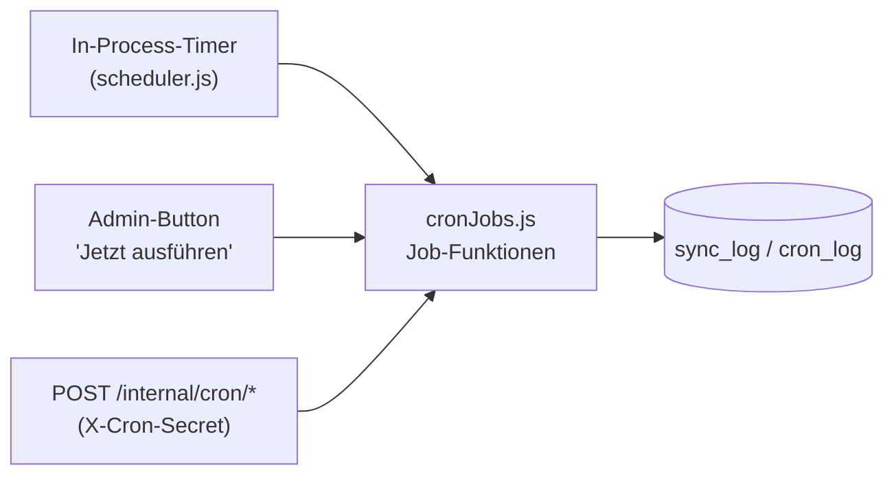
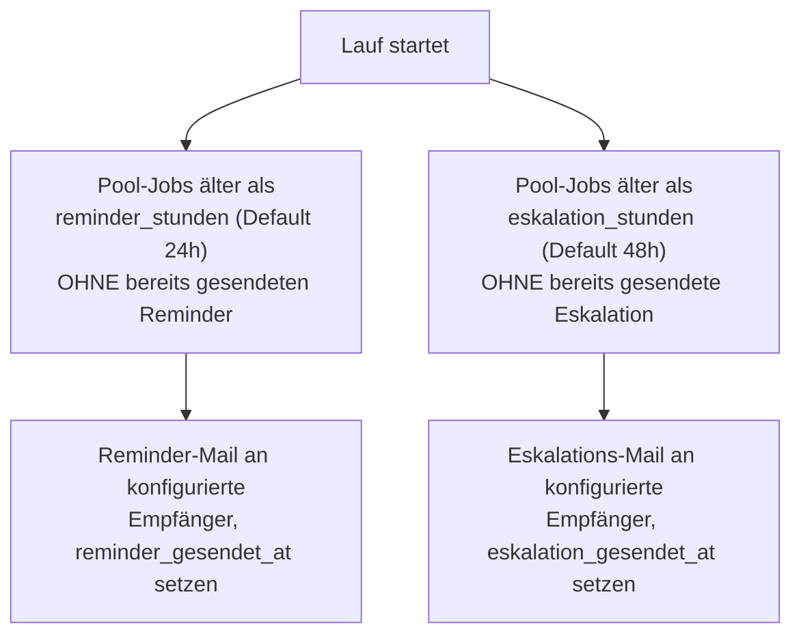
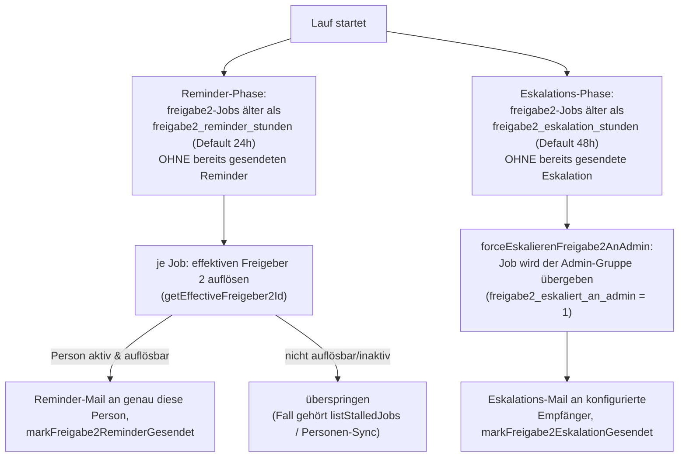

# Geplante Jobs und Benachrichtigungen

## Wie das Scheduling funktioniert

Kein externer Task-Scheduler nötig: Solange der Node-Prozess läuft
(Infomaniaks Node.js-Hosting hält ihn dauerhaft am Leben), plant sich die
App fünf Hintergrund-Jobs selbst ein (`src/services/scheduler.js`,
gestartet in `src/index.js`). Jeder Zeitplan wird bei **jedem** Tick neu
aus `admin_config` gelesen (nicht einmalig beim Start) — eine unter
**Admin → Geplante Jobs** gespeicherte Änderung wirkt ab dem nächsten
Lauf, ganz ohne Neustart.

Tägliche Jobs berechnen ihre Verzögerung dynamisch relativ zur
Europe/Zürich-Zeitzone (fest codiert, unabhängig von der Server-Zeitzone,
die z. B. auf Infomaniak in UTC läuft) statt eines festen 24h-Intervalls —
das verhindert eine schleichende Verschiebung über
Sommer-/Winterzeit-Wechsel hinweg.

Dieselben Job-Funktionen (`src/services/cronJobs.js`) sind zusätzlich über
`POST /internal/cron/*` (Header `X-Cron-Secret`) erreichbar — nützlich für
die Go-Live-Checkliste oder falls doch ein externer Scheduler eingerichtet
wird — und über einen manuellen "Jetzt ausführen"-Button pro Job unter
**Admin → Geplante Jobs**. Alle drei Auslösewege rufen exakt dieselbe
Logik auf und schreiben in dasselbe Protokoll.

## Die acht Jobs

| Job | Standard-Zeitplan | Zweck |
|---|---|---|
| `sync-personen` | täglich 02:00 (Europe/Zürich) | ChurchTools-Personen-/Gruppen-Sync — siehe [personen-sync.md](personen-sync.md) |
| `pool-erinnerungen` | alle 60 Minuten | Reminder- und Eskalations-Mails für unbeanspruchte Pool-Rechnungen |
| `freigabe2-erinnerungen` | alle 60 Minuten | Reminder an den effektiven Freigeber 2 und Übergabe an die Admin-Gruppe für seit langem unbeantwortete `freigabe2`-Jobs |
| `pdf-bereinigung` | täglich 02:30 | archiviert abgeholte Jobs, räumt verwaiste `.tmp`-Stempeldateien und alte `mail_log`-Einträge auf |
| `zeitstempel-nachholen` | alle 5 Minuten | wiederholt fehlgeschlagene RFC3161-Stempelversuche |
| `split-gruppen-nachholen` | alle 15 Minuten | holt eine noch nicht zusammengeführte Splitgruppe nach (unvollständig oder am TSA gescheitert) |
| `datenbank-sicherung` | täglich 03:00 | DB + `JOBS_DIR` + `BRANDING_DIR` als ZIP nach `BACKUP_DIR` sichern, alte Backups über die konfigurierte Aufbewahrung hinaus löschen |
| `mail-digest` | täglich 07:00 (Europe/Zürich) | fasst alle wegen aktivem Batching nur protokollierten (`mail_log.status = 'geplant'`) Mails pro Empfänger zu einer täglichen Zusammenfassung zusammen |

### `pool-erinnerungen`

Beide Schwellen und die jeweiligen Empfängerlisten (E-Mail-Adressen oder
`gruppe:buchhaltung` / `gruppe:admin`) sind unter **Admin →
Eskalationszeiten** konfigurierbar. `reminder_gesendet_at` bzw.
`eskalation_gesendet_at` werden bei jedem Beanspruchen/Freilegen des Jobs
zurückgesetzt (siehe [rechnungs-workflow.md](rechnungs-workflow.md)) —
ein neuer Pool-Zyklus bekommt so wieder seinen eigenen Reminder statt vom
vorherigen Zyklus übersprungen zu werden.

### `freigabe2-erinnerungen`

Anders als bei `pool-erinnerungen` gehen die beiden Phasen hier an
unterschiedliche Ziele:

- **Reminder** geht nicht an eine konfigurierte Gruppe, sondern an die
  tatsächlich zuständige Person selbst — den effektiven Freigeber 2 des
  Kontos (`getEffectiveFreigeber2Id`: `stellvertreter2_id`, falls der Job
  bereits einmal eskaliert wurde, sonst `freigeber2_id`). Ist diese Person
  inaktiv oder in ChurchTools nicht mehr auflösbar, wird der Job in diesem
  Lauf einfach übersprungen statt an irgendjemand anderen geschickt — kein
  Marker wird gesetzt, sodass der nächste Lauf es erneut versucht. Genau
  dieser Fall (deaktivierte/nicht auflösbare Person) bleibt weiterhin
  Aufgabe von `listStalledJobs` bzw. des Personen-Syncs (siehe
  [personen-sync.md](personen-sync.md)) — die beiden Mechanismen ergänzen
  sich: `freigabe2-erinnerungen` kümmert sich um eine **aktive, aber
  untätige** Person, `listStalledJobs` um eine **nicht mehr
  handlungsfähige**.
- **Eskalation** verschickt nicht nur eine Mail, sondern führt eine echte
  Übergabe durch: `forceEskalierenFreigabe2AnAdmin` (`src/db/jobsRepo.js`)
  setzt `freigabe2_eskaliert_an_admin = 1` auf dem Job — dasselbe Feld, das
  auch eine manuelle SYNC-8-Interessenkonflikt-Eskalation bei Freigabe 2
  setzt (siehe [rechnungs-workflow.md](rechnungs-workflow.md#3-freigabe-2-status-freigabe2))
  — danach kann jede `superadmin`-Person den Job freigeben, nicht mehr nur
  der ursprüngliche Freigeber 2. Erst wenn die Übergabe erfolgreich war
  (Rückgabewert `true`; `false` bedeutet, der Job wurde zwischen Abfrage
  und Update bereits anderweitig abgeschlossen oder eskaliert), geht die
  Eskalations-Mail an die konfigurierte Empfängerliste.

Jobs, die beim Deployment dieses Features bereits in `freigabe2` hängen,
werden per Backfill mit `freigabe2_seit` = Deployment-Zeitpunkt versehen
(nicht ihr ursprünglicher Eintrittszeitpunkt) — ihre Reminder-/
Eskalations-Uhr beginnt also erst am Deployment-Tag neu zu laufen, statt für
bereits lange hängende Jobs sofort auszulösen.

Beide Schwellen (`freigabe2_reminder_stunden`, Default 24h;
`freigabe2_eskalation_stunden`, Default 48h) sowie die
Eskalations-Empfängerliste (`freigabe2_eskalation_empfaenger`,
E-Mail-Adressen oder `gruppe:buchhaltung`/`gruppe:admin`, Default
`gruppe:admin`) sind unter **Admin → Eskalationszeiten** konfigurierbar.
Der Lauf-Intervall selbst (Default 60 Minuten, Config-Key
`cron_freigabe2_erinnerungen_intervall_minuten`) liegt dagegen — wie bei
allen anderen Jobs dieser Liste — unter **Admin → Geplante Jobs**.

### `pdf-bereinigung`

Drei unabhängige Aufräum-Schritte in einem Lauf, jeder mit eigenem
Fehler-Fangnetz (ein fehlgeschlagener Schritt stoppt die anderen nicht):

1. Für jeden Job im Status `abgeholt`: PDF/Thumbnail-Datei (sollten durch
   `abholung-bestaetigen` bereits gelöscht sein) endgültig entfernen,
   danach Status → `archiviert`.
2. Verwaiste `.tmp`-Dateien in `JOBS_DIR` löschen, die älter als eine
   Stunde sind (Reste eines abgebrochenen Stempel-Schreibvorgangs).
3. `mail_log`-Einträge löschen, die älter als die konfigurierte
   Aufbewahrungsfrist (`mail_log_aufbewahrung_tage`) sind.

### `zeitstempel-nachholen`

Holt für jeden `abgeschlossen`-Job ohne gesetzten Zeitstempel die
RFC3161-Stempelung nach (nur solange die PDF-Datei noch lokal existiert —
nach der n8n-Abholung ist das nicht mehr möglich). Läuft mit
Überlappungsschutz (`hasRecentRunningCronLauf`): ein manueller
"Jetzt ausführen"-Klick während eines laufenden geplanten Durchlaufs
startet keinen zweiten, parallelen Lauf. Details:
[zeitstempel-und-pruefbescheinigung.md](zeitstempel-und-pruefbescheinigung.md).

### `split-gruppen-nachholen`

Sucht Elternjobs im Status `aufgesplittet` ohne `gruppe_pdf_pfad` und
versucht für jeden erneut, die vollständig freigegebene Splitgruppe zu
einem kombinierten, gestempelten und RFC3161-zeitgestempelten Dokument
zusammenzuführen. Unvollständige oder durch eine abgelehnte Zeile
blockierte Gruppen werden dabei einfach übersprungen. Der Merge blockiert
bewusst auf einer konfigurierten, aber nicht erreichbaren TSA — das
zusammengeführte Dokument ist die Archivkopie und soll ohne seinen
Zeitstempel gar nicht erst entstehen; genau dafür existiert dieser
Nachhol-Lauf. Überlappungsschutz und "Jetzt ausführen" wie bei
`zeitstempel-nachholen`; der Verlauf unter **Admin → Geplante Jobs**
zeigt an, ob und woran ein Lauf scheitert.

### `datenbank-sicherung`

Sichert DB + `JOBS_DIR` + `BRANDING_DIR` als ein ZIP-Archiv nach
`BACKUP_DIR`, löscht danach alte Backups über die konfigurierte
Aufbewahrung (Default: die letzten 14) hinaus. Läuft mit demselben
Überlappungsschutz wie `zeitstempel-nachholen`. Anders als die anderen
fünf Jobs lebt die Konfiguration (Zeitplan, Aufbewahrung) **nicht** unter
**Admin → Geplante Jobs**, sondern auf einer eigenen, superadmin-only
Seite **Admin → Datenbank-Backup** — das Archiv enthält Geheimnisse im
Klartext (u. a. das RFC3161-TSA-Passwort), siehe
[admin-bereich.md](admin-bereich.md#datenbank-backup-adminbackup).

### `mail-digest`

Nur relevant, wenn **Admin → Mail-Einstellungen** den Batching-Schalter
aktiviert hat — dann protokolliert `sendNotification` (siehe unten) statt
sofort zu versenden nur eine Zeile mit `status = 'geplant'`. Dieser Job
gruppiert alle wartenden Zeilen nach Empfänger und verschickt pro
Empfänger eine gesammelte Digest-Mail; erfolgreiche/gescheiterte Zeilen
werden anschliessend auf `versendet`/`fehlgeschlagen` gesetzt (gleiche
Semantik wie ein Einzelversand). `sync-fehler` und `iban-warnung` werden
nie eingereiht, sondern ignorieren den Batching-Schalter und laufen immer
sofort — siehe unten. Läuft mit demselben Überlappungsschutz wie
`zeitstempel-nachholen`. Zeitplan, Vorlagen-Bearbeitung und manuelles
"Jetzt ausführen" leben — wie bei `datenbank-sicherung` — nicht unter
**Admin → Geplante Jobs**, sondern auf der eigenen Seite **Admin →
Mail-Einstellungen**.

### `sync-personen`

Siehe [personen-sync.md](personen-sync.md).

## Benachrichtigungen (E-Mail)

Jeder Mailversand läuft über `sendNotification` (`src/services/notify.js`)
und wird protokolliert (`mail_log`, `versendet`/`fehlgeschlagen`, oder bei
aktivem Batching zunächst `geplant` — niemals stumm verworfen).
`resolveEmpfaenger` löst die Tokens `gruppe:buchhaltung`/`gruppe:admin` zur
Versandzeit gegen die **aktuelle** Gruppenmitgliedschaft auf (keine feste
Liste, die veraltet). Betreff und Text jedes Typs kommen aus einer unter
**Admin → Mail-Einstellungen** editierbaren Vorlage mit `%variable%`-
Platzhaltern (`src/services/mailTemplates.js`), nicht mehr aus fest
codierten Strings.

| Typ | Auslöser |
|---|---|
| `zuweisung` | automatische Zuweisung beim Eingang, Übergabe an Freigeber 2, Interessenskonflikt-Übergabe, Hinweis-Konto |
| `reminder` | Pool-Rechnung länger als `reminder_stunden` unbeansprucht |
| `eskalation` | Pool-Rechnung länger als `eskalation_stunden` unbeansprucht |
| `freigabe2-reminder` | `freigabe2`-Job länger als `freigabe2_reminder_stunden` unbeantwortet — geht an den effektiven Freigeber 2 |
| `freigabe2-eskalation` | `freigabe2`-Job länger als `freigabe2_eskalation_stunden` unbeantwortet — geht erst nach erfolgter Übergabe an die Admin-Gruppe raus |
| `ablehnung` | Rechnung bei Kontierung oder Freigabe 2 abgelehnt |
| `sync-fehler` | ChurchTools-Sync fehlgeschlagen oder abgebrochen — **immer sofort**, unabhängig vom Batching-Schalter |
| `iban-warnung` | QR-Code-IBAN weicht von der hinterlegten Lieferanten-IBAN ab — **immer sofort**, unabhängig vom Batching-Schalter |
| `rechnungsnummer-warnung` | Rechnungsnummer bei Kontierung bereits für denselben Debitor erfasst |

**Batching:** Ist unter **Admin → Mail-Einstellungen** aktiviert, werden
alle Typen ausser `sync-fehler`/`iban-warnung` nicht sofort verschickt,
sondern als `status = 'geplant'` protokolliert und vom `mail-digest`-Job
(siehe oben) einmal täglich pro Empfänger zu einer Sammel-Mail
zusammengefasst.

Wird eine `geplant`e Zeile so als Teil einer Digest-Mail verschickt, wird
ihr `mail_log`-Eintrag trotzdem auf `versendet` gesetzt, obwohl der darin
gespeicherte, individuell gerenderte `text` nie eigenständig als E-Mail
zugestellt wurde — nur die Digest-Sammel-Mail wurde tatsächlich
verschickt. **Admin → Mail-Protokoll** zeigt also, was verschickt worden
*wäre*, nicht wortwörtlich, was verschickt wurde.

Der Mailer ist optional: fehlt eine vollständige SMTP-Konfiguration, fällt
das Portal automatisch auf einen No-Op-Mailer zurück, der jeden
Versandversuch als Fehlschlag protokolliert, statt den ganzen Prozess
abstürzen zu lassen (`createMailerOrFallback`).
