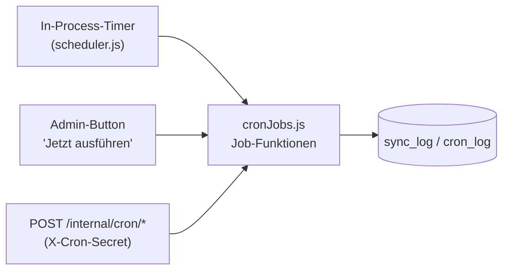
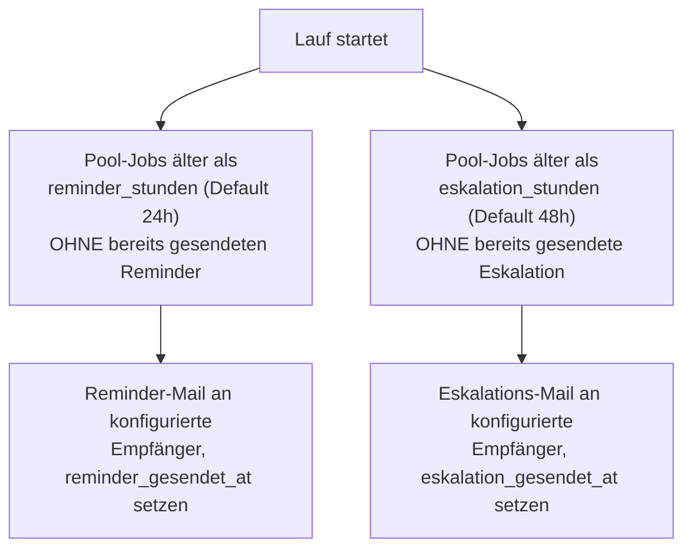

# Geplante Jobs und Benachrichtigungen

## Wie das Scheduling funktioniert

Kein externer Task-Scheduler nötig: Solange der Node-Prozess läuft
(Infomaniaks Node.js-Hosting hält ihn dauerhaft am Leben), plant sich die
App fünf Hintergrund-Jobs selbst ein (`src/services/scheduler.js`,
gestartet in `src/index.js`). Jeder Zeitplan wird bei **jedem** Tick neu
aus `admin_config` gelesen (nicht einmalig beim Start) — eine unter
**Admin → Geplante Jobs** gespeicherte Änderung wirkt ab dem nächsten
Lauf, ganz ohne Neustart.

Tägliche Jobs berechnen ihre Verzögerung dynamisch relativ zur
Europe/Zürich-Zeitzone (fest codiert, unabhängig von der Server-Zeitzone,
die z. B. auf Infomaniak in UTC läuft) statt eines festen 24h-Intervalls —
das verhindert eine schleichende Verschiebung über
Sommer-/Winterzeit-Wechsel hinweg.

Dieselben Job-Funktionen (`src/services/cronJobs.js`) sind zusätzlich über
`POST /internal/cron/*` (Header `X-Cron-Secret`) erreichbar — nützlich für
die Go-Live-Checkliste oder falls doch ein externer Scheduler eingerichtet
wird — und über einen manuellen "Jetzt ausführen"-Button pro Job unter
**Admin → Geplante Jobs**. Alle drei Auslösewege rufen exakt dieselbe
Logik auf und schreiben in dasselbe Protokoll.

## Die sechs Jobs

| Job | Standard-Zeitplan | Zweck |
|---|---|---|
| `sync-personen` | täglich 02:00 (Europe/Zürich) | ChurchTools-Personen-/Gruppen-Sync — siehe [personen-sync.md](personen-sync.md) |
| `pool-erinnerungen` | alle 60 Minuten | Reminder- und Eskalations-Mails für unbeanspruchte Pool-Rechnungen |
| `pdf-bereinigung` | täglich 02:30 | archiviert abgeholte Jobs, räumt verwaiste `.tmp`-Stempeldateien und alte `mail_log`-Einträge auf |
| `zeitstempel-nachholen` | alle 5 Minuten | wiederholt fehlgeschlagene RFC3161-Stempelversuche |
| `split-gruppen-nachholen` | alle 15 Minuten | holt eine noch nicht zusammengeführte Splitgruppe nach (unvollständig oder am TSA gescheitert) |
| `datenbank-sicherung` | täglich 03:00 | DB + `JOBS_DIR` + `BRANDING_DIR` als ZIP nach `BACKUP_DIR` sichern, alte Backups über die konfigurierte Aufbewahrung hinaus löschen |

### `pool-erinnerungen`

Beide Schwellen und die jeweiligen Empfängerlisten (E-Mail-Adressen oder
`gruppe:buchhaltung` / `gruppe:admin`) sind unter **Admin →
Eskalationszeiten** konfigurierbar. `reminder_gesendet_at` bzw.
`eskalation_gesendet_at` werden bei jedem Beanspruchen/Freilegen des Jobs
zurückgesetzt (siehe [rechnungs-workflow.md](rechnungs-workflow.md)) —
ein neuer Pool-Zyklus bekommt so wieder seinen eigenen Reminder statt vom
vorherigen Zyklus übersprungen zu werden.

### `pdf-bereinigung`

Drei unabhängige Aufräum-Schritte in einem Lauf, jeder mit eigenem
Fehler-Fangnetz (ein fehlgeschlagener Schritt stoppt die anderen nicht):

1. Für jeden Job im Status `abgeholt`: PDF/Thumbnail-Datei (sollten durch
   `abholung-bestaetigen` bereits gelöscht sein) endgültig entfernen,
   danach Status → `archiviert`.
2. Verwaiste `.tmp`-Dateien in `JOBS_DIR` löschen, die älter als eine
   Stunde sind (Reste eines abgebrochenen Stempel-Schreibvorgangs).
3. `mail_log`-Einträge löschen, die älter als die konfigurierte
   Aufbewahrungsfrist (`mail_log_aufbewahrung_tage`) sind.

### `zeitstempel-nachholen`

Holt für jeden `abgeschlossen`-Job ohne gesetzten Zeitstempel die
RFC3161-Stempelung nach (nur solange die PDF-Datei noch lokal existiert —
nach der n8n-Abholung ist das nicht mehr möglich). Läuft mit
Überlappungsschutz (`hasRecentRunningCronLauf`): ein manueller
"Jetzt ausführen"-Klick während eines laufenden geplanten Durchlaufs
startet keinen zweiten, parallelen Lauf. Details:
[zeitstempel-und-pruefbescheinigung.md](zeitstempel-und-pruefbescheinigung.md).

### `split-gruppen-nachholen`

Sucht Elternjobs im Status `aufgesplittet` ohne `gruppe_pdf_pfad` und
versucht für jeden erneut, die vollständig freigegebene Splitgruppe zu
einem kombinierten, gestempelten und RFC3161-zeitgestempelten Dokument
zusammenzuführen. Unvollständige oder durch eine abgelehnte Zeile
blockierte Gruppen werden dabei einfach übersprungen. Der Merge blockiert
bewusst auf einer konfigurierten, aber nicht erreichbaren TSA — das
zusammengeführte Dokument ist die Archivkopie und soll ohne seinen
Zeitstempel gar nicht erst entstehen; genau dafür existiert dieser
Nachhol-Lauf. Überlappungsschutz und "Jetzt ausführen" wie bei
`zeitstempel-nachholen`; der Verlauf unter **Admin → Geplante Jobs**
zeigt an, ob und woran ein Lauf scheitert.

### `datenbank-sicherung`

Sichert DB + `JOBS_DIR` + `BRANDING_DIR` als ein ZIP-Archiv nach
`BACKUP_DIR`, löscht danach alte Backups über die konfigurierte
Aufbewahrung (Default: die letzten 14) hinaus. Läuft mit demselben
Überlappungsschutz wie `zeitstempel-nachholen`. Anders als die anderen
fünf Jobs lebt die Konfiguration (Zeitplan, Aufbewahrung) **nicht** unter
**Admin → Geplante Jobs**, sondern auf einer eigenen, superadmin-only
Seite **Admin → Datenbank-Backup** — das Archiv enthält Geheimnisse im
Klartext (u. a. das RFC3161-TSA-Passwort), siehe
[admin-bereich.md](admin-bereich.md#datenbank-backup-adminbackup).

### `sync-personen`

Siehe [personen-sync.md](personen-sync.md).

## Benachrichtigungen (E-Mail)

Jeder Mailversand läuft über `sendNotification` (`src/services/notify.js`)
und wird protokolliert (`mail_log`, versendet oder fehlgeschlagen —
niemals stumm verworfen). `resolveEmpfaenger` löst die Tokens
`gruppe:buchhaltung`/`gruppe:admin` zur Versandzeit gegen die
**aktuelle** Gruppenmitgliedschaft auf (keine feste Liste, die
veraltet).

| Typ | Auslöser |
|---|---|
| `zuweisung` | automatische Zuweisung beim Eingang, Übergabe an Freigeber 2, Interessenskonflikt-Übergabe, Hinweis-Konto |
| `reminder` | Pool-Rechnung länger als `reminder_stunden` unbeansprucht |
| `eskalation` | Pool-Rechnung länger als `eskalation_stunden` unbeansprucht |
| `ablehnung` | Rechnung bei Kontierung oder Freigabe 2 abgelehnt |
| `sync-fehler` | ChurchTools-Sync fehlgeschlagen oder abgebrochen |
| `iban-warnung` | QR-Code-IBAN weicht von der hinterlegten Lieferanten-IBAN ab |

Der Mailer ist optional: fehlt eine vollständige SMTP-Konfiguration, fällt
das Portal automatisch auf einen No-Op-Mailer zurück, der jeden
Versandversuch als Fehlschlag protokolliert, statt den ganzen Prozess
abstürzen zu lassen (`createMailerOrFallback`).
