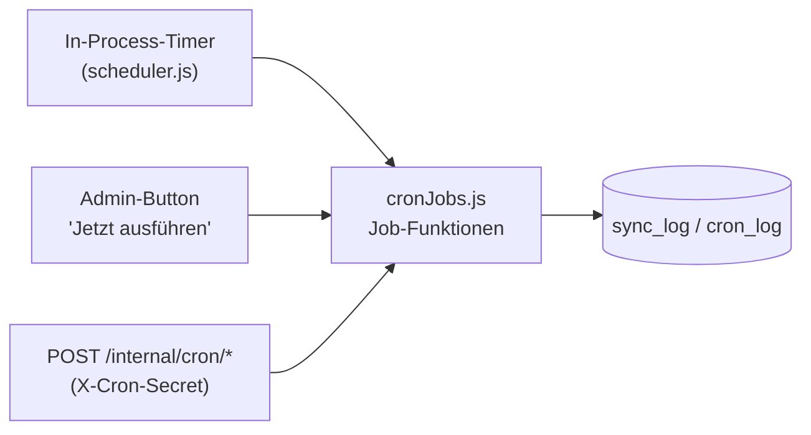
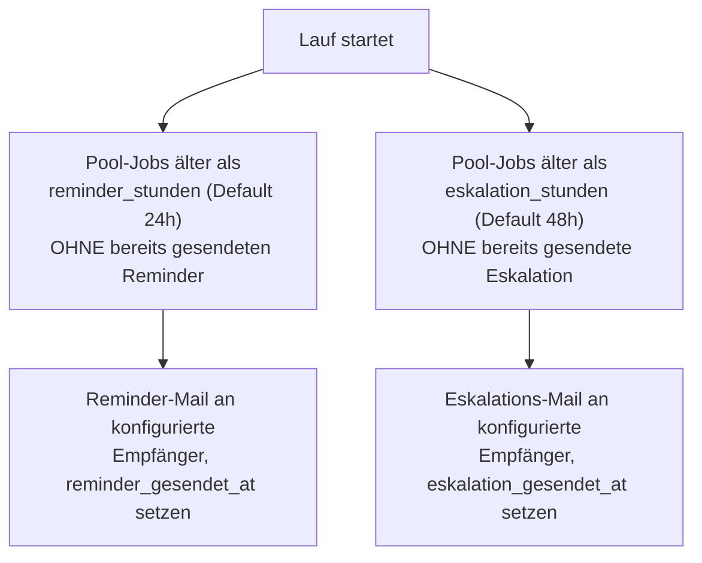
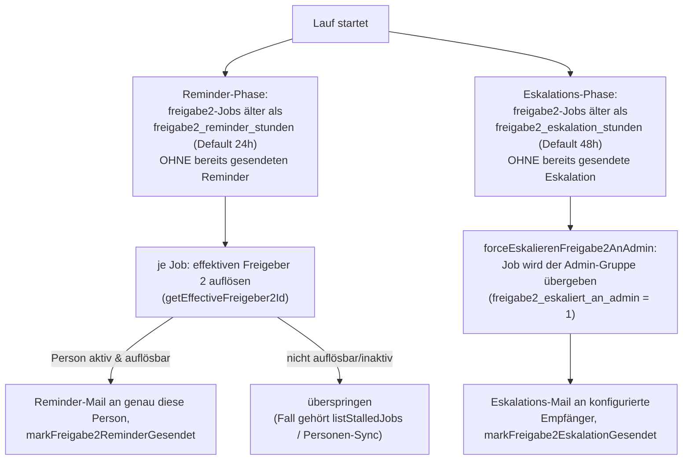

# Geplante Jobs und Benachrichtigungen

## Wie das Scheduling funktioniert

Kein externer Task-Scheduler nötig: Solange der Node-Prozess läuft
(Infomaniaks Node.js-Hosting hält ihn dauerhaft am Leben), plant sich die
App **elf** Hintergrund-Jobs selbst ein (`src/services/scheduler.js`,
gestartet in `src/index.js`). Jeder Zeitplan wird bei **jedem** Tick neu
aus `admin_config` gelesen (nicht einmalig beim Start) — eine gespeicherte
Änderung wirkt ab dem nächsten Lauf, ganz ohne Neustart.

Tägliche Jobs berechnen ihre Verzögerung dynamisch relativ zur
Europe/Zürich-Zeitzone (fest codiert, unabhängig von der Server-Zeitzone,
die z. B. auf Infomaniak in UTC läuft) statt eines festen 24h-Intervalls —
das verhindert eine schleichende Verschiebung über
Sommer-/Winterzeit-Wechsel hinweg.

Dieselben Job-Funktionen (`src/services/cronJobs.js`) sind zusätzlich über
`POST /internal/cron/*` (Header `X-Cron-Secret`) erreichbar — nützlich für
die Go-Live-Checkliste oder falls doch ein externer Scheduler eingerichtet
wird — und über einen manuellen "Jetzt ausführen"-Button pro Job unter
**Admin → Geplante Jobs**. Alle drei Auslösewege rufen exakt dieselbe
Logik auf und schreiben in dasselbe Protokoll.

```mermaid
flowchart LR
    Timer["In-Process-Timer<br/>(scheduler.js)"] --> Fn["cronJobs.js<br/>Job-Funktionen"]
    Manual["Admin-Button<br/>'Jetzt ausführen'"] --> Fn
    Cron["POST /internal/cron/*<br/>(X-Cron-Secret)"] --> Fn
    Fn --> Log[("sync_log / cron_log")]
```

### Neustart, verpasste Termine und verwaiste Sperren

- **Verpasste Termine werden nicht nachgeholt.** Nach einem Prozessstart
  plant `scheduleDaily` einen täglichen Job nur für den **nächsten
  zukünftigen** Termin ein. War der Prozess z. B. um 03:00 gestoppt, entfällt
  die Sicherung dieses Tages; ebenso ein verpasster `sync-personen`-,
  `pdf-bereinigung`-, `mail-digest`- oder `kk-beleg-erinnerungen`-Lauf.
  Intervall-Jobs starten nach dem Neustart erst nach Ablauf ihres ersten
  Intervalls. Nach jedem ungeplanten Ausfall deshalb unter **Admin →
  Geplante Jobs**, **Admin → Datenbank-Backup** und **Admin →
  Mail-Einstellungen** prüfen, ob der letzte Lauf fehlt, und ihn bei Bedarf
  über „Jetzt ausführen“ (bzw. `POST /internal/cron/*`) nachholen. Für die
  Sicherung empfiehlt sich zusätzlich eine externe Überwachung, die das Alter
  der neuesten `.fpbak`-Datei (bzw. des letzten n8n-Abrufs) prüft.
- **Eingereihte Mails gehen nicht verloren.** Einzelmails und Digest-Zeilen
  stehen dauerhaft in `mail_log` und werden nach dem Neustart vom Job
  `mail-zustellung` aufgegriffen (siehe unten).
- **Laufmarker in `cron_log`/`sync_log`.** Jobs mit Überlappungsschutz
  schreiben einen Eintrag `laufend`. Bricht der Prozess mitten im Lauf ab,
  bleibt dieser Eintrag stehen, gilt aber nach 10 Minuten als veraltet — der
  nächste Lauf startet danach normal. Der verwaiste Eintrag behält den Status
  `laufend` und ist im Verlauf als abgebrochener Lauf erkennbar.
- **Prozesssperre des Datenspeichers.** Der Server hält beim Start die
  exklusive Sperre `<DB_PATH>.process-lock`. Nach SIGTERM/SIGINT wird sie
  freigegeben; nach SIGKILL oder Stromausfall bleibt sie absichtlich bestehen
  und der Server startet **nicht** („Datenspeicher ist gesperrt“), bis sie
  nach Prüfung manuell entfernt wurde. Vorgehen und Nachweispflicht:
  [offline-restore.md](offline-restore.md#abbruch-und-sperren). Solange der
  Server deshalb nicht läuft, laufen auch keine Jobs — siehe erster Punkt.

## Die elf Jobs

| Job | Standard-Zeitplan | Einstellbar unter | `POST /internal/cron/…` | Protokoll | Zweck |
|---|---|---|---|---|---|
| `sync-personen` | täglich 02:00 (Europe/Zürich) | Geplante Jobs | ja | `sync_log` | ChurchTools-Personen-/Gruppen-Sync — siehe [personen-sync.md](personen-sync.md) |
| `pool-erinnerungen` | alle 60 Minuten | Geplante Jobs | ja | `cron_log` | Reminder- und Eskalations-Mails für unbeanspruchte Pool-Rechnungen |
| `freigabe2-erinnerungen` | alle 60 Minuten | Geplante Jobs | ja | `cron_log` | Reminder an den effektiven Freigeber 2 und Übergabe an die Admin-Gruppe für seit langem unbeantwortete `freigabe2`-Jobs |
| `pdf-bereinigung` | täglich 02:30 | Geplante Jobs | ja | `cron_log` | archiviert abgeholte Jobs, räumt verwaiste `.tmp`-Stempeldateien, abgeschlossene `mail_log`-Einträge und Dateien verworfener Kreditkartenbelege über der Aufbewahrungsfrist auf |
| `zeitstempel-nachholen` | alle 5 Minuten | Geplante Jobs | ja | `cron_log` | wiederholt fehlgeschlagene RFC3161-Stempelversuche |
| `split-gruppen-nachholen` | alle 15 Minuten | Geplante Jobs | ja | `cron_log` | holt eine noch nicht zusammengeführte Splitgruppe nach (unvollständig oder am TSA gescheitert) |
| `kk-beleg-erinnerungen` | täglich 08:00 (Europe/Zürich) | Geplante Jobs | ja | `cron_log` | Erinnerungs-Mails für seit langem offene Kreditkartenbelege/-entwürfe und noch nicht abgeglichene Kreditkartenabrechnungen |
| `mail-zustellung` | alle 5 Minuten | Geplante Jobs | ja | `cron_log` (nur Läufe mit fälligen Mails) | wiederholt eingereihte, noch nicht zugestellte Mails und gescheiterte Digests mit wachsendem Abstand |
| `datenbank-sicherung` | täglich 03:00 (Europe/Zürich) | Datenbank-Backup | nein | `cron_log` | verschlüsselte `.fpbak`-Sicherung von DB + `JOBS_DIR` + `BRANDING_DIR` nach `BACKUP_DIR`, Retention nur für `.fpbak` |
| `mail-digest` | täglich 07:00 (Europe/Zürich) | Mail-Einstellungen | nein | `cron_log` | fasst wegen aktivem Batching eingereihte (`mail_log.status = 'geplant'`) Mails pro Empfänger zu einer täglichen Zusammenfassung zusammen |
| `sicherheitsalarme` | alle 30 Minuten | nur `admin_config` (`cron_sicherheitsalarme_intervall_minuten`) | nein | Audit-Log (`hintergrundlauf`), `mail_log` | meldet ungeklärte Backup-Löschabsichten |

Alle Läufe außer leeren `mail-zustellung`-Läufen (ohne fällige Mails)
erscheinen zusätzlich als `hintergrundlauf` im Audit-Log.

### `pool-erinnerungen`

```mermaid
flowchart TD
    A["Lauf startet"] --> B["Pool-Jobs älter als<br/>reminder_stunden (Default 24h)<br/>OHNE bereits gesendeten Reminder"]
    B --> C["Reminder-Mail an konfigurierte<br/>Empfänger, reminder_gesendet_at setzen"]
    A --> D["Pool-Jobs älter als<br/>eskalation_stunden (Default 48h)<br/>OHNE bereits gesendete Eskalation"]
    D --> E["Eskalations-Mail an konfigurierte<br/>Empfänger, eskalation_gesendet_at setzen"]
```

Beide Schwellen und die jeweiligen Empfängerlisten (E-Mail-Adressen oder
`gruppe:buchhaltung` / `gruppe:admin`) sind unter **Admin →
Eskalationszeiten** konfigurierbar. Auswahl der fälligen Jobs, Einreihen der
Mails (`mail_log.status = 'eingereiht'`) und Setzen des Markers geschehen in
**einer** Datenbanktransaktion; parallele Auslöser (Timer und manueller
Aufruf) können dieselbe Erinnerung deshalb nicht doppelt planen. Die
Zustellung folgt danach — ein SMTP-Fehler lässt die Mail eingereiht, der Lauf
endet mit Status `fehler` und nennt die Zustellbilanz, `mail-zustellung`
wiederholt sie. Ohne auflösbare Empfänger wird kein Marker gesetzt. `reminder_gesendet_at` bzw.
`eskalation_gesendet_at` werden bei jedem Beanspruchen/Freilegen des Jobs
zurückgesetzt (siehe [rechnungs-workflow.md](rechnungs-workflow.md)) —
ein neuer Pool-Zyklus bekommt so wieder seinen eigenen Reminder statt vom
vorherigen Zyklus übersprungen zu werden.

### `freigabe2-erinnerungen`

```mermaid
flowchart TD
    A["Lauf startet"] --> B["Reminder-Phase:<br/>freigabe2-Jobs älter als<br/>freigabe2_reminder_stunden (Default 24h)<br/>OHNE bereits gesendeten Reminder"]
    B --> C["je Job: effektiven Freigeber 2 auflösen<br/>(getEffectiveFreigeber2Id)"]
    C -- "Person aktiv & auflösbar" --> D["Reminder-Mail an genau diese Person,<br/>markFreigabe2ReminderGesendet"]
    C -- "nicht auflösbar/inaktiv" --> E["überspringen<br/>(Fall gehört listStalledJobs / Personen-Sync)"]
    A --> F["Eskalations-Phase:<br/>freigabe2-Jobs älter als<br/>freigabe2_eskalation_stunden (Default 48h)<br/>OHNE bereits gesendete Eskalation"]
    F --> G["forceEskalierenFreigabe2AnAdmin:<br/>Job wird der Admin-Gruppe übergeben<br/>(freigabe2_eskaliert_an_admin = 1)"]
    G --> H["Eskalations-Mail an konfigurierte<br/>Empfänger, markFreigabe2EskalationGesendet"]
```

Anders als bei `pool-erinnerungen` gehen die beiden Phasen hier an
unterschiedliche Ziele:

- **Reminder** geht nicht an eine konfigurierte Gruppe, sondern an die
  tatsächlich zuständige Person selbst — den effektiven Freigeber 2 des
  Kontos (`getEffectiveFreigeber2Id`: `stellvertreter2_id`, falls der Job
  bereits einmal eskaliert wurde, sonst `freigeber2_id`). Ist diese Person
  inaktiv oder in ChurchTools nicht mehr auflösbar, wird der Job in diesem
  Lauf einfach übersprungen statt an irgendjemand anderen geschickt — kein
  Marker wird gesetzt, sodass der nächste Lauf es erneut versucht. Genau
  dieser Fall (deaktivierte/nicht auflösbare Person) bleibt weiterhin
  Aufgabe von `listStalledJobs` bzw. des Personen-Syncs (siehe
  [personen-sync.md](personen-sync.md)) — die beiden Mechanismen ergänzen
  sich: `freigabe2-erinnerungen` kümmert sich um eine **aktive, aber
  untätige** Person, `listStalledJobs` um eine **nicht mehr
  handlungsfähige**.
- **Eskalation** verschickt nicht nur eine Mail, sondern führt eine echte
  Übergabe durch: `forceEskalierenFreigabe2AnAdmin` (`src/db/jobsRepo.js`)
  setzt `freigabe2_eskaliert_an_admin = 1` auf dem Job — dasselbe Feld, das
  auch eine manuelle SYNC-8-Interessenkonflikt-Eskalation bei Freigabe 2
  setzt (siehe [rechnungs-workflow.md](rechnungs-workflow.md#3-freigabe-2-status-freigabe2))
  — danach kann jede `superadmin`-Person den Job freigeben, nicht mehr nur
  der ursprüngliche Freigeber 2. Erst wenn die Übergabe erfolgreich war
  (Rückgabewert `true`; `false` bedeutet, der Job wurde zwischen Abfrage
  und Update bereits anderweitig abgeschlossen oder eskaliert), wird die
  Eskalations-Mail an die konfigurierte Empfängerliste eingereiht — in
  derselben Transaktion wie die Übergabe, sodass es keine Übergabe ohne
  eingereihte Mail gibt.
- **Links:** Reminder und Eskalation verlinken die konkrete Freigabeseite
  `/freigabe2/<Job-ID>`. Eine Übersicht `/freigabe2` ohne ID existiert
  nicht. Der Test `test/integration/mailLinks.test.js` prüft den Link aus
  der tatsächlich versendeten Mail gegen die Anwendung und stellt zusätzlich
  sicher, dass jeder im Quellcode erzeugte Mail-Link auf eine registrierte
  GET-Route zeigt.

Jobs, die beim Deployment dieses Features bereits in `freigabe2` hängen,
werden per Backfill mit `freigabe2_seit` = Deployment-Zeitpunkt versehen
(nicht ihr ursprünglicher Eintrittszeitpunkt) — ihre Reminder-/
Eskalations-Uhr beginnt also erst am Deployment-Tag neu zu laufen, statt für
bereits lange hängende Jobs sofort auszulösen.

Beide Schwellen (`freigabe2_reminder_stunden`, Default 24h;
`freigabe2_eskalation_stunden`, Default 48h) sowie die
Eskalations-Empfängerliste (`freigabe2_eskalation_empfaenger`,
E-Mail-Adressen oder `gruppe:buchhaltung`/`gruppe:admin`, Default
`gruppe:admin`) sind unter **Admin → Eskalationszeiten** konfigurierbar.
Der Lauf-Intervall selbst (Default 60 Minuten, Config-Key
`cron_freigabe2_erinnerungen_intervall_minuten`) liegt dagegen — wie bei
allen anderen Jobs dieser Liste — unter **Admin → Geplante Jobs**.

### `pdf-bereinigung`

Vier unabhängige Aufräum-Schritte in einem Lauf, jeder mit eigenem
Fehler-Fangnetz (ein fehlgeschlagener Schritt stoppt die anderen nicht):

1. Fuer Jobs im Status `abgeholt` mit Archivquittung und mindestens sieben Tagen
   seit Bestaetigung: Hash erneut pruefen, PDF/Thumbnail entfernen, danach Status
   `archiviert`. Ohne Quittung oder bei Hashabweichung bleiben die Dateien erhalten.
   Gruppen-PDFs unterliegen derselben Quittungs- und Wartepflicht.
2. Verwaiste `.tmp`-Dateien in `JOBS_DIR` löschen, die älter als eine
   Stunde sind (Reste eines abgebrochenen Stempel-Schreibvorgangs).
3. Abgeschlossene `mail_log`-Einträge (`versendet`/`fehlgeschlagen`)
   löschen, die älter als die konfigurierte Aufbewahrungsfrist
   (`mail_log_aufbewahrung_tage`) sind. Noch zuzustellende Zeilen
   (`eingereiht`/`geplant`) werden nie durch die Frist entfernt.
4. Von jedem **verworfenen** Kreditkartenbeleg, dessen Verwerfen-Zeitpunkt
   die konfigurierte Frist (`kk_beleg_verworfen_loeschen_tage`, Default 90
   Tage) überschreitet, `pdf_pfad`/`thumbnail_pfad` löschen und
   `datei_geloescht_am` setzen — die Beleg-Zeile selbst und ein
   `zugeordnet`er Beleg bleiben davon unangetastet. Details:
   [kreditkarten-belege.md](kreditkarten-belege.md#6f-fristlöschung-verworfener-belege).

Seit 2026-09-29 verschiebt dieser Lauf ausserdem verwaiste finale Dokumente
(`final-<uuid>.pdf` ohne DB-Referenz, aelter als `verwaiste_dateien_mindestalter_stunden`)
in die Datei-Quarantaene statt sie zu loeschen, und archivierte Dateien werden mit
Absichts-/Ergebnisprotokoll entfernt. Details: [Code-Haertung](audit-paket-haertung-2026-09-29.md).

### `sicherheitsalarme`

Nur im In-Prozess-Scheduler (kein Cron-Endpunkt, kein `cron_log`-Eintrag), Intervall
`cron_sicherheitsalarme_intervall_minuten` (Standard 30). Meldet ungeklaerte
Backup-Loeschabsichten per Mail an `sicherheitsalarm_empfaenger` (Standard `gruppe:admin`),
dedupliziert je Absicht, mit Wiederholung bei Versandfehlern und Erinnerung nach
`sicherheitsalarm_wiederholung_stunden`. Ein Alarm klaert nie die Absicht selbst.
Laeufe erscheinen als `hintergrundlauf` im Audit-Log.

### `zeitstempel-nachholen`

Holt für jeden `abgeschlossen`-Job ohne gesetzten Zeitstempel die
RFC3161-Stempelung nach (nur solange die PDF-Datei noch lokal existiert —
nach der lokalen Bereinigung ist das nicht mehr möglich). Ein ausgestelltes
Exportmanifest sperrt die automatische Aenderung dieser Dokumentversion. Läuft mit
Überlappungsschutz (`hasRecentRunningCronLauf`): ein manueller
"Jetzt ausführen"-Klick während eines laufenden geplanten Durchlaufs
startet keinen zweiten, parallelen Lauf. Details:
[zeitstempel-und-pruefbescheinigung.md](zeitstempel-und-pruefbescheinigung.md).

### `split-gruppen-nachholen`

Sucht Elternjobs im Status `aufgesplittet` ohne `gruppe_pdf_pfad` und
versucht für jeden erneut, die vollständig freigegebene Splitgruppe zu
einem kombinierten, gestempelten und RFC3161-zeitgestempelten Dokument
zusammenzuführen. Unvollständige oder durch eine abgelehnte Zeile
blockierte Gruppen werden dabei einfach übersprungen. Der Merge blockiert
bewusst auf einer konfigurierten, aber nicht erreichbaren TSA — das
zusammengeführte Dokument ist die Archivkopie und soll ohne seinen
Zeitstempel gar nicht erst entstehen; genau dafür existiert dieser
Nachhol-Lauf. Überlappungsschutz und "Jetzt ausführen" wie bei
`zeitstempel-nachholen`; der Verlauf unter **Admin → Geplante Jobs**
zeigt an, ob und woran ein Lauf scheitert.

### `datenbank-sicherung`

Erstellt täglich (Default 03:00, Europe/Zürich) eine **authentifiziert
verschlüsselte** Sicherung (`.fpbak`, AES-256-GCM) von DB + `JOBS_DIR` +
`BRANDING_DIR` in `BACKUP_DIR`. Voraussetzung ist ein separat
bereitgestellter Schlüsselbund in `BACKUP_KEYRING_FILE`; fehlt er oder ist
er ungültig, **scheitert** der Lauf (Status `fehler` im Verlauf) — es gibt
keinen Klartext-Fallback, der Server selbst startet trotzdem. Fehlgeschlagene
oder fehlende Sicherungen müssen deshalb aktiv überwacht werden.

- **Retention:** Nach einer erfolgreichen Sicherung werden die ältesten
  `.fpbak`-Dateien über `backup_aufbewahrung_anzahl` (Default 14) hinaus
  mit Audit-Protokoll gelöscht. Alte Klartext-ZIPs zählen nicht mit und
  werden nie automatisch entfernt.
- **Schlüsselaufbewahrung:** Der Schlüsselbund gehört nicht in Git,
  `JOBS_DIR`, `BRANDING_DIR`, `BACKUP_DIR`, Logs oder n8n; eine separat
  gesicherte Offline-Kopie samt Schlüssel-ID ist Pflicht. Ohne Schlüssel ist
  keine Sicherung wiederherstellbar.
- **Wiederherstellung** ausschließlich offline über
  `npm run backup:verify` / `backup:restore` / `backup:rollback` bei
  gestopptem Server — die Webanwendung lehnt Wiederherstellungen ab (`423`).

Verbindliche Anleitungen: [backup-verschluesselung.md](backup-verschluesselung.md)
(Format, Schlüssel, Rotation, n8n-Abholung) und
[offline-restore.md](offline-restore.md) (Ablauf, Sperren, Rückwechsel).
Zeitplan und Aufbewahrung leben nicht unter **Admin → Geplante Jobs**,
sondern auf der superadmin-only Seite **Admin → Datenbank-Backup**
(siehe [admin-bereich.md](admin-bereich.md#datenbank-backup-adminbackup)).
Überlappungsschutz wie bei `zeitstempel-nachholen`. Ein verpasster
Termin wird nicht nachgeholt (siehe oben).

### `mail-digest`

Nur relevant, wenn **Admin → Mail-Einstellungen** den Batching-Schalter
aktiviert hat — dann reiht `sendNotification` (siehe unten) eine Zeile mit
`status = 'geplant'` ein, statt sofort zu versenden. Dieser Job gruppiert
alle wartenden Zeilen nach Empfänger, beansprucht sie mit einer befristeten
Sperre und verschickt pro Empfänger eine gesammelte Digest-Mail. Bei Erfolg
werden die Zeilen `versendet`; scheitert der Versand, bleiben sie `geplant`,
erhalten einen Versuchszähler und einen nächsten Versuchszeitpunkt und werden
von `mail-zustellung` erneut als Digest verschickt — erst nach
ausgeschöpften Versuchen werden sie `fehlgeschlagen`. Ein Lauf mit
Zustellfehlern endet mit Status `fehler`. Ist die Digest-Vorlage selbst nicht
renderbar, werden alle wartenden Zeilen sofort `fehlgeschlagen` (manuell
wiederholbar). `sync-fehler`, `iban-warnung` und `kk-beleg-eingegangen`
ignorieren den Batching-Schalter und werden immer sofort zugestellt.
Überlappungsschutz wie bei `zeitstempel-nachholen`. Zeitplan,
Vorlagen-Bearbeitung und manuelles "Jetzt ausführen" leben — wie bei
`datenbank-sicherung` — nicht unter **Admin → Geplante Jobs**, sondern auf
der eigenen Seite **Admin → Mail-Einstellungen**.

### `mail-zustellung`

Wiederholungslauf der persistenten Zustellung
(`src/services/mailZustellung.js`). Greift fällige Zeilen auf:

- `eingereiht` mit `naechster_versuch_am` in der Vergangenheit — nach einem
  SMTP-Fehler oder nach einem Prozessneustart;
- `geplant` mit mindestens einem gescheiterten Digest-Versuch.

Die erste Digest-Zustellung bleibt dem täglichen `mail-digest`-Termin
vorbehalten. Ohne fällige Zeilen läuft nichts und es entsteht weder ein
`cron_log`- noch ein Audit-Eintrag. Intervall
`cron_mail_zustellung_intervall_minuten` (Default 5), Höchstzahl der
Versuche je Mail `mail_zustellung_max_versuche` (Default 8, nur über
`admin_config`). Abstand zwischen zwei Versuchen derselben Mail: 5, 10, 20,
40 … Minuten, höchstens 6 Stunden — mit dem Default also rund 10½ Stunden
bis zur endgültigen Aufgabe.

### `kk-beleg-erinnerungen`

Läuft nur, wenn sowohl das Kreditkartenmodul (`modul_kreditkarten_aktiv`)
als auch der eigene Schalter `kk_beleg_erinnerungen_aktiv` (Default an)
aktiv sind. Zwei unabhängige Arbeitslisten mit derselben Schwelle
`kk_beleg_erinnerung_tage` (Default 45 Tage):

- **Offene Belege/Entwürfe**: seit langem offene Kreditkartenbelege
  (Kaufdatum bzw., bei per Mail eingegangenen Entwürfen ohne Kaufdatum,
  Hochladezeitpunkt über der Schwelle) — **eine Mail pro Empfänger**
  bündelt alle seine Belege (hochgeladen von ihm, für ihn gekauft, oder
  auf einer Karte, für die er verantwortlich ist).
- **Markierte, noch nicht abgeglichene Abrechnungen**: ein als
  Kreditkartenabrechnung markierter Job, dessen Markierung
  (`kk_markiert_am`) über der Schwelle liegt und der weiterhin auf den
  Abgleich wartet — geht an die zugewiesene Person, inkl.
  Ferienmodus-Vertretung.

Wie bei `pool-erinnerungen` wird eine Erinnerung erst nach mindestens
einem weiteren Intervall wiederholt, kein zweiter Sonder-Zeitplan wie bei
`datenbank-sicherung`/`mail-digest`: Zeitplan (Default täglich 08:00,
Europe/Zürich) und Schwelle leben unter **Admin → Geplante Jobs**.
Details: [kreditkarten-belege.md](kreditkarten-belege.md#6a-erinnerungen).

### `sync-personen`

Siehe [personen-sync.md](personen-sync.md).

## Benachrichtigungen (E-Mail)

Jeder Mailversand läuft über `sendNotification` bzw. `sendRenderedMail`
(`src/services/notify.js`) und die persistente Zustellung
(`src/services/mailZustellung.js`). Eine Mail wird **vor** dem SMTP-Aufruf
dauerhaft in `mail_log` gespeichert und durchläuft diese Status:

| Status | Bedeutung |
|---|---|
| `eingereiht` | gespeichert, Zustellung läuft oder wird automatisch wiederholt (`versuche`, `naechster_versuch_am`, `fehler_details` zeigen den Stand) |
| `geplant` | gespeichert, wartet auf den täglichen Digest (Batching); nach einem gescheiterten Digest ebenfalls mit Versuchszähler |
| `versendet` | vom SMTP-Server angenommen (`versendet_am`) |
| `fehlgeschlagen` | endgültig: Wiederholungen ausgeschöpft oder nicht zustellbar (z. B. Vorlage nicht renderbar) — nur noch manuell wiederholbar |

- **Pro Empfänger eine Zeile:** Teilerfolge sind möglich; nur gescheiterte
  Empfänger werden wiederholt, bereits erreichte nie erneut.
- **Parallele Auslöser:** Jede Zeile wird vor dem Versand mit einer
  befristeten Sperre (`sperre_token`/`sperre_bis`, 10 Minuten) beansprucht;
  das Ergebnis wird nur unter demselben Token gespeichert. Timer, manueller
  Cron-Aufruf, Admin-Klick und Request-Versand versenden dieselbe Zeile
  daher nicht doppelt.
- **Neustart:** Nicht zugestellte Zeilen bleiben erhalten; die Sperre eines
  abgestürzten Prozesses läuft ab und `mail-zustellung` versucht erneut.
- **Restrisiko (mindestens einmal, nicht genau einmal):** Stürzt der
  Prozess ab, nachdem der SMTP-Server die Nachricht angenommen hat, aber
  bevor `versendet` gespeichert wurde, wird dieselbe Nachricht nach Ablauf
  der Sperre erneut verschickt. SMTP bietet keine Idempotenz, mit der sich
  das ausschließen ließe; der Empfänger erhält dann ein Duplikat.
- **Sichtbarkeit:** Erinnerungs-, Digest- und Zustell-Läufe mit
  Zustellfehlern enden im Verlauf mit Status `fehler` und nennen die Bilanz
  (versendet / zur Wiederholung eingereiht / endgültig fehlgeschlagen /
  für Digest geplant). `POST /internal/cron/*` antwortet dann mit `500`.
  **Admin → Mail-Protokoll** zeigt Status, Versuche und nächsten Versuch.
- **Manueller Weg:** „Erneut versenden“ legt für eine `fehlgeschlagen`e
  (oder `versendet`e) Zeile eine neue Zeile an und stellt sie sofort zu;
  die alte bleibt als Nachweis. Für eine noch `eingereiht`e Zeile mit
  gescheitertem Versuch versucht „Jetzt erneut versuchen“ **dieselbe** Zeile
  sofort — ohne Duplikat.
- **Erinnerungsmarker** (`reminder_gesendet_at`, `freigabe2_*_gesendet_at`,
  `kk_erinnert_am`, `letzte_erinnerung_am`) bedeuten „Erinnerung dauerhaft
  eingereiht“, nicht „zugestellt“. Den Zustellstand zeigt `mail_log`.

`resolveEmpfaenger` löst die Tokens `gruppe:buchhaltung`/`gruppe:admin` zur
Versandzeit gegen die **aktuelle** Gruppenmitgliedschaft auf (keine feste
Liste, die veraltet). Betreff und Text jedes Typs kommen aus einer unter
**Admin → Mail-Einstellungen** editierbaren Vorlage mit `%variable%`-
Platzhaltern (`src/services/mailTemplates.js`), nicht mehr aus fest
codierten Strings.

| Typ | Auslöser |
|---|---|
| `zuweisung` | automatische Zuweisung beim Eingang, Übergabe an Freigeber 2, Interessenskonflikt-Übergabe, Hinweis-Konto |
| `reminder` | Pool-Rechnung länger als `reminder_stunden` unbeansprucht |
| `eskalation` | Pool-Rechnung länger als `eskalation_stunden` unbeansprucht |
| `freigabe2-reminder` | `freigabe2`-Job länger als `freigabe2_reminder_stunden` unbeantwortet — geht an den effektiven Freigeber 2 |
| `freigabe2-eskalation` | `freigabe2`-Job länger als `freigabe2_eskalation_stunden` unbeantwortet — geht erst nach erfolgter Übergabe an die Admin-Gruppe raus |
| `ablehnung` | Rechnung bei Kontierung oder Freigabe 2 abgelehnt |
| `sync-fehler` | ChurchTools-Sync fehlgeschlagen oder abgebrochen — **immer sofort**, unabhängig vom Batching-Schalter |
| `iban-warnung` | QR-Code-IBAN weicht von der hinterlegten Lieferanten-IBAN ab — **immer sofort**, unabhängig vom Batching-Schalter |
| `rechnungsnummer-warnung` | Rechnungsnummer bei Kontierung bereits für denselben Kreditor erfasst |
| `kk-abrechnung-zugewiesen` | Kreditkartenabrechnung (manuell oder automatisch erkannt) einer Karte zugeordnet — geht an die verantwortliche Person |
| `kk-beleg-erinnerung` | seit langem offener Kreditkartenbeleg/-entwurf bzw. noch nicht abgeglichene Kreditkartenabrechnung (Job `kk-beleg-erinnerungen`, siehe oben) |
| `kk-beleg-eingegangen` | per Mail eingereichter Kreditkartenbeleg als Entwurf angelegt — **immer sofort**, unabhängig vom Batching-Schalter (Link zum Vervollständigen soll nicht bis zum nächsten Digest warten) |

**Batching:** Ist unter **Admin → Mail-Einstellungen** aktiviert, werden
alle Typen ausser `sync-fehler`/`iban-warnung`/`kk-beleg-eingegangen`
nicht sofort verschickt, sondern als `status = 'geplant'` eingereiht
und vom `mail-digest`-Job (siehe oben) einmal täglich pro Empfänger zu
einer Sammel-Mail zusammengefasst — `kk-abrechnung-zugewiesen` und
`kk-beleg-erinnerung` folgen also dem globalen Schalter wie jeder andere
reguläre Typ, nur `kk-beleg-eingegangen` ist wie `sync-fehler`/
`iban-warnung` von der Bündelung ausgenommen.

Wird eine `geplant`e Zeile so als Teil einer Digest-Mail verschickt, wird
ihr `mail_log`-Eintrag trotzdem auf `versendet` gesetzt, obwohl der darin
gespeicherte, individuell gerenderte `text` nie eigenständig als E-Mail
zugestellt wurde — nur die Digest-Sammel-Mail wurde tatsächlich
verschickt. **Admin → Mail-Protokoll** zeigt also, was verschickt worden
*wäre*, nicht wortwörtlich, was verschickt wurde.

Der Mailer ist optional: fehlt eine vollständige SMTP-Konfiguration, fällt
das Portal automatisch auf einen Mailer zurück, dessen Versandversuche
scheitern, statt den ganzen Prozess abstürzen zu lassen
(`createMailerOrFallback`). Die Mails bleiben dann eingereiht und werden bis
zur Höchstzahl der Versuche wiederholt; die betroffenen Läufe stehen im
Verlauf auf `fehler`.
