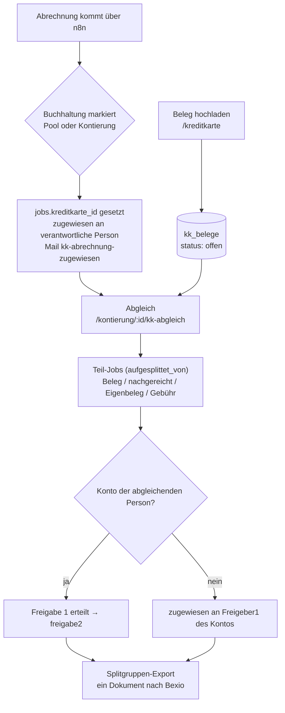

# Kreditkarten-Belege

Dritte Domäne neben Lieferantenrechnungen und Spesen: Belege zu
Kreditkartenkäufen lassen sich **vorab**, unabhängig von der monatlichen
Abrechnung, ins Portal hochladen — ohne dass das schon eine Freigabe oder
einen Export auslöst. Trifft später die Abrechnung ein (heute über n8n,
manuell oder automatisch einer Karte zugeordnet), gleicht die für die
Karte verantwortliche Person sie gegen die offenen Belege ab. Aus dem Abgleich entstehen pro Position
Teil-Jobs, die die normale Freigabe (Freigeber 1/2) durchlaufen und am
Ende als **eine** Splitgruppe gebündelt nach Bexio exportiert werden
(gleicher Export-Mechanismus wie beim Aufsplitten).

Vorab-Belege selbst sind **keine** `jobs`-Zeilen — sie leben in eigenen
Tabellen und tauchen erst durch den Abgleich als Teil-Job in der
Freigabe-Maschinerie auf.

Design-Spec (Quelle der ursprünglichen Entscheidungen; Details zur
tatsächlichen Umsetzung stehen hier und im Code):
[2026-09-27-kreditkarten-belege-design.md](superpowers/specs/2026-09-27-kreditkarten-belege-design.md).
Etappe 1 deckte die Abschnitte 1–5, 7 und 8 der Spec ab (Kern: Verwaltung,
Erfassung, Markierung, Abgleich, Rechte, Mail-Vorlage). Etappe 2 fügt die
Erweiterungen aus Abschnitt 6 hinzu: Erinnerungen für seit langem offene
Belege/Abrechnungen (6a), automatische Kartenerkennung beim n8n-Eingang
(6b), Zuordnungs-Vorschläge und Abrechnungstotal-Vorbelegung auf der
Abgleich-Seite (6c), Mail-Eingang als Entwurf (6d–6e) und Fristlöschung
verworfener Belegdateien (6f) — siehe unten.

## Datenmodell

### `kreditkarten`

| Spalte | Bedeutung |
|---|---|
| `bezeichnung` | Freitext, z. B. „Visa Bereich Jugend“ |
| `karte_endziffern` | optional, genau 4 Ziffern (CHECK) — nie die volle Kartennummer |
| `karteninhaber_name` | Freitext, reine Anzeige, keine Rechte |
| `verantwortlich_id` | Person, die die Karte abgleicht und alle offenen Belege der Karte sieht/verwaltet |
| `erfassung_offen` | 1 = alle dürfen Belege erfassen (Modus A), 0 = nur `kreditkarte_erfasser` + verantwortliche Person (Modus B) |
| `absender_muster` | optional, z. B. `viseca.ch` oder `abrechnung@bank.ch` — Basis der automatischen Kartenerkennung, siehe [6b](#6b-automatische-kartenerkennung) |
| `aktiv` | Deaktivieren/Reaktivieren wie bei Konten, kein Löschen |

### `kreditkarte_erfasser`

`kreditkarte_id` + `person_id`, zusammengesetzter Primärschlüssel. Wird
nur ausgewertet, wenn `erfassung_offen = 0`. Ein Wechsel von Modus A zu B
lässt bestehende offene Belege unangetastet — die Einschränkung gilt nur
für neue Uploads.

### `kk_belege`

| Spalte | Bedeutung |
|---|---|
| `kreditkarte_id` | Karte; bei per Mail eingegangenen Entwürfen (Status `entwurf`) oft noch NULL, siehe [6d](#6d-mail-eingang) |
| `hochgeladen_von` / `gekauft_von` | wer den Beleg erfasst hat / für wen der Kauf war (Default: dieselbe Person) |
| `quelle` | `web` (Upload auf `/kreditkarte`) / `mail` (Mail-Eingang, siehe [6d](#6d-mail-eingang)) / `abgleich` (beim Abgleich direkt nachgereicht) |
| `pdf_pfad` / `thumbnail_pfad` | Bilder werden serverseitig in eine PDF-Seite umgewandelt, Thumbnail best effort |
| `betrag` | negativ erlaubt (Rückerstattung); NULL nur bei `entwurf` |
| `waehrung` | reine Info, Default `CHF` — beim Abgleich zählt immer der CHF-Betrag der Zeile |
| `kaufdatum` | nicht in der Zukunft |
| `konto_id` | optionaler Vorschlag für den Abgleich |
| `status` | `entwurf` / `offen` / `zugeordnet` / `verworfen` |
| `zugeordnet_job_id` | der beim Abgleich entstandene Teil-Job |
| `verworfen_grund`, `verworfen_von`, `verworfen_am` | Pflichtfelder beim Verwerfen |

`zugeordnet` und `verworfen` sind Endzustände. Zugeordnete Belege bleiben
dauerhaft erhalten (sie sind Teil des gestempelten Buchungsdokuments) —
die Fristlöschung (`datei_geloescht_am`) betrifft ausschliesslich
`verworfen`e Belege, siehe [6f](#6f-fristlöschung-verworfener-belege).
`letzte_erinnerung_am` ist die Basis der Erinnerung für seit langem
offene Belege, siehe [6a](#6a-erinnerungen).

### `kk_beleg_ereignisse`

Eigenes Audit-Log für Belege, solange sie noch keine `jobs`-Zeile haben
und deshalb nicht über `freigaben` protokollierbar sind: `kk_beleg_erfasst`,
`kk_beleg_geaendert`, `kk_beleg_verworfen`, `kk_beleg_zugeordnet`,
`kk_beleg_ergaenzt` (ein per Mail eingegangener Entwurf wird vervollständigt,
siehe [6d](#6d-mail-eingang)) und `kk_beleg_datei_geloescht` (Fristlöschung,
siehe [6f](#6f-fristlöschung-verworfener-belege)). `person_id = NULL`
bedeutet System — bei `kk_beleg_erfasst` per Mail-Eingang und bei jedem
`kk_beleg_datei_geloescht` ist das immer der Fall. Erscheint zusammen mit
`freigaben` im globalen Audit-Log, siehe unten.

### Neue `jobs`-Spalten

| Spalte | Bedeutung |
|---|---|
| `kreditkarte_id` | gesetzt auf dem Abrechnungs-Job (Elternjob), sobald er einer Karte zugeordnet ist |
| `kk_eigenbeleg_grund` | auf einem Teil-Job ohne Beleg: Begründung bei Eigenbeleg, fester Text „Gebühr/Zins“ bei Gebühren |
| `kk_markiert_am` | Zeitpunkt der Markierung — Basis der Abrechnungs-Erinnerung, siehe [6a](#6a-erinnerungen) |
| `kk_erinnert_am` | Zeitpunkt der letzten Abrechnungs-Erinnerung, siehe [6a](#6a-erinnerungen) |
| `kk_text_betraege` | JSON-Cache der PDF-Text-Analyse der Abrechnung (`{ betraege, daten, total }`), siehe [6c](#6c-zuordnungs-vorschläge-und-abrechnungstotal) |

Neue `freigaben.rolle`-Werte: `kk_abrechnung_markiert`, `kk_markierung_aufgehoben`,
`kk_abgleich`. Neue `mail_log.typ`-Werte: `kk-abrechnung-zugewiesen`
(Etappe 1), `kk-beleg-erinnerung` und `kk-beleg-eingegangen` (Etappe 2,
siehe [6a](#6a-erinnerungen) bzw. [6d](#6d-mail-eingang)).
Neues additives Recht `kreditkarten_verwalten` in `person_berechtigungen`.
Details zu allen Tabellen: [datenmodell.md](datenmodell.md).

## Rechte

| Aktion | Berechtigt |
|---|---|
| Karten verwalten, Erfasser pflegen | `superadmin`, Einzelrecht `kreditkarten_verwalten` |
| Beleg hochladen (Web) | Modus A: alle angemeldeten Personen · Modus B: `kreditkarte_erfasser` + verantwortliche Person der Karte |
| Beleg per Mail einreichen | jede aktive Person mit bekannter E-Mail-Adresse — das Erfass-Recht selbst wird erst beim Vervollständigen des Entwurfs geprüft, siehe [6d](#6d-mail-eingang) |
| Beleg bearbeiten/verwerfen | `hochgeladen_von`, `gekauft_von`, verantwortliche Person der Karte — nur solange `offen`/`entwurf` |
| Entwurf (Mail-Eingang) vervollständigen | ausschliesslich `hochgeladen_von`/`gekauft_von` (die identifizierte Person selbst) — die Karte ist bei einem Entwurf meist noch nicht gesetzt, siehe [6d](#6d-mail-eingang) |
| Abrechnung markieren | wer den Job heute beanspruchen bzw. kontieren dürfte (gleiche Autorisierung wie Pool-Beanspruchen/Kontierung) |
| Markierung aufheben, Abgleich | `zugewiesen_an` des Abrechnungs-Jobs (inkl. Ferienmodus-Vertretung, Admin-Eskalations-Sonderfall) |
| Freigabe der Teil-Jobs | unverändert Freigeber 1/2 des jeweiligen Kontos (Vier-Augen-Prinzip) |
| Modul, Karten aktivieren/deaktivieren | **nur** `superadmin` bzw. `kreditkarten_verwalten` (Modul-Schalter selbst: nur `superadmin`, siehe unten) |

Alle neuen POST-Routen laufen durch den bestehenden CSRF-Schutz (bei
multipart-Routen nach multer, wie beim Aufsplitten) —
`test/integration/csrfSweep.test.js` deckt sie ab.

## Ablauf

### 1. Belege erfassen (`/kreditkarte`, `src/routes/kreditkarte.js`)

Sichtbar, sobald das Modul aktiv ist **und** die Person mindestens eine
aktive Karte erfassen darf, für eine Karte verantwortlich ist, oder
eigene Belege hat (`zeigeKreditkartenBereich`, `src/services/kkRechte.js`).

Vier Bereiche auf der Seite: eigene offene Belege (hochgeladen oder
gekauft von mir), offene Belege meiner Karten (nur für verantwortliche
Personen), sowie eine einklappbare Liste zugeordneter/verworfener Belege.
Bearbeiten/Verwerfen darf `hochgeladen_von`, `gekauft_von` oder die
verantwortliche Person der Karte (`darfBelegBearbeiten`) — nur solange der
Beleg `offen` oder `entwurf` ist. Beleg-Prüfung wie überall im Portal:
PDF/PNG/JPEG, max. 20 MB, Magic-Byte-Check, Bild → eigene PDF-Seite,
Thumbnail best effort.

**Erfass-Recht** (`darfAufKarteErfassen`): Modus A (`erfassung_offen = 1`)
erlaubt jeder angemeldeten Person das Erfassen; Modus B beschränkt es auf
`kreditkarte_erfasser` plus die verantwortliche Person — serverseitig
geprüft (403), nicht nur im Formular ausgeblendet.

**Deaktivierte Karte**: eine verantwortliche Person behält den Zugriff auf
die Seite und ihre bereits erfassten/offenen Belege auch dann, wenn ihre
Karte inzwischen deaktiviert wurde — nur neue Uploads auf eine deaktivierte
Karte werden abgelehnt (`pruefeFelder` verlangt `karte.aktiv`). Einen
bestehenden Beleg, dessen Karte inzwischen deaktiviert wurde, kann man
weiterhin bearbeiten, solange er auf dieser Karte bleibt — das gilt nicht
für einen Entwurf (siehe [6d](#6d-mail-eingang)).

**Inaktive „Kauf getätigt von“-Person**: ist die bisherige Käuferin/der
bisherige Käufer eines Belegs inzwischen inaktiv, steht sie/er im
Bearbeiten-Formular weiterhin (vorausgewählt, mit „(inaktiv)“) zur Wahl und
`pruefeFelder` akzeptiert genau diese Person — der Beleg behält beim
Speichern seinen Käufer. Neue Uploads und ein Wechsel auf eine *andere*
Person verlangen weiterhin eine aktive Person.

**Beschreibung**: muss dem `POSITION_PATTERN` des Aufsplittens entsprechen
(keine Emojis o. ä., `400` beim Upload und beim Bearbeiten), weil sie
beim Abgleich als Position auf die Stempelseite übernommen wird.

### 2. Verwaltung (`/admin/kreditkarten`)

Liste, Neu, Bearbeiten, Deaktivieren/Reaktivieren — gleiches Muster wie
Konten. Geschützt durch das neue additive Recht `kreditkarten_verwalten`
(`superadmin` hat es implizit über sein Rollen-Bundle). Das
Bearbeiten-Formular zeigt bei deaktivierter Checkbox „Alle Personen dürfen
Belege erfassen“ eine Personen-Mehrfachauswahl für `kreditkarte_erfasser`.

### 3. Abrechnung markieren und übergeben

Auf der Pool-Seite (`unzugewiesen`, `POST /pool/:id/als-kk-abrechnung`)
und der Kontierungsseite (`zugewiesen`, `POST /kontierung/:id/als-kk-abrechnung`)
lässt sich ein Job als „Kreditkartenabrechnung → Karte [Auswahl]“
markieren — nur bei aktivem Modul, nur aktive Karten wählbar, berechtigt
ist, wer den Job heute beanspruchen bzw. kontieren dürfte. Gemeinsamer
Service `markiereAlsKkAbrechnung` (`src/services/kkMarkierung.js`):

1. `jobs.kreditkarte_id` und `kk_markiert_am` setzen, Status `zugewiesen`,
   `zugewiesen_an` = verantwortliche Person der Karte. Eine bestehende
   Freigabe-1-Eskalation (`freigabe1_eskaliert_von`, `…_eskalationsgrund`,
   `…_eskaliert_an_admin`) wird dabei zurückgesetzt — sonst bekäme die
   verantwortliche Person auf ihrem eigenen Abgleich ein `403`.
2. `freigaben`-Eintrag `kk_abrechnung_markiert`.
3. Mail `kk-abrechnung-zugewiesen` an die verantwortliche Person — entfällt,
   wenn die markierende Person selbst verantwortlich ist; diese wird
   stattdessen direkt auf die Abgleich-Seite weitergeleitet.

Ein Job, der bereits einer Karte zugeordnet ist, kann nicht ein zweites
Mal markiert werden (`markiereJobAlsKkAbrechnung` prüft
`kreditkarte_id IS NULL` in der WHERE-Klausel) — ein Wettlauf zweier
Markierungsversuche liefert dem zweiten ein `409`. Ebenso ausgeschlossen
sind Teil-Jobs einer Splitgruppe (`aufgesplittet_von IS NULL` in derselben
WHERE-Klausel, `409`): ein markiertes Kind würde den Export seiner Gruppe
dauerhaft blockieren. Das Markier-Formular wird für solche Jobs gar nicht
erst angeboten (Kontierungsseite und Pool-Auswahl).

`GET /kontierung/:id` eines markierten Jobs leitet automatisch auf die
Abgleich-Seite um; die normale Einzelkontierung und das reguläre
Aufsplitten sind für solche Jobs serverseitig gesperrt (`sperreKkAbrechnung`
in `src/routes/kontierung.js`), nicht nur im UI ausgeblendet — ebenso
„Zurück in den Pool“ und „An Gruppe zurück“ (`409`); der Rückweg für einen
markierten Job ist „Markierung aufheben“.

### Markierung aufheben

„Keine Abrechnung dieser Karte“ (`POST /kontierung/:id/kk-markierung-aufheben`):
nur durch die aktuell zugewiesene Person, mit Pflicht-Bemerkung. Löscht
`kreditkarte_id`/`kk_markiert_am` und schickt den Job über den bestehenden
Rückweg „an Gruppe zurück“ in den Pool zurück, mit `freigaben`-Eintrag
`kk_markierung_aufgehoben`. Beide Schritte (Markierung aufheben +
Rücksendung) laufen in einer Transaktion; ist der Job inzwischen nicht
mehr `zugewiesen` mit gesetzter `kreditkarte_id` (z. B. weil er parallel
bereits abgeglichen wurde), passiert **keine** der beiden Änderungen und
es wird **kein** `freigaben`-Eintrag geschrieben — die Anfrage bekommt
`409`, nicht einen halb protokollierten Vorgang.

### 4. Abgleich (`/kontierung/:id/kk-abgleich`, `src/routes/kkAbgleich.js`)

Autorisiert wie die Kontierung: Job muss `kreditkarte_id` gesetzt haben,
`status = 'zugewiesen'`, `zugewiesen_an` = aktuelle Person — inklusive
derselben Ferienmodus-Vertretung und Admin-Eskalations-Sonderfälle wie
`ladeKontierbarenJob`.

Die Seite listet die offenen Belege der Karte (nicht `entwurf`) zum
Anhaken; jede angehakte Zeile wird zu einer Position mit Konto, Betrag und
optionaler Position auf der Abrechnung. Jede Zeile ist genau eine von drei
Arten:

- **Beleg** — aus der Liste der offenen Belege.
- **Beleg nachreichen** — Datei-Upload direkt in der Zeile; daraus
  entsteht ein neuer `kk_belege`-Eintrag mit `quelle = 'abgleich'`,
  direkt `zugeordnet`.
- **Ohne Beleg**, Unterart **Eigenbeleg** (Begründung Pflicht,
  `kk_eigenbeleg_grund`) oder **Gebühr/Zins** (fester Text, keine
  Begründung).

Live-Summe/Differenz-Anzeige, Speichern nur bei Differenz ≤ 0.005
(zusätzlich serverseitig geprüft), mindestens eine Zeile Pflicht.

**Vorzeichen-Konvention bei Rückerstattungen**: ein negativ eingegebener
Zeilenbetrag wird — wie überall im Portal — **nicht** mit Vorzeichen in
den Teil-Job übernommen. Der Teil-Job bekommt einen **positiven**
`betrag` mit `typ = 'gutschrift'`; nur die Bedeutung, nicht das Vorzeichen,
trägt die Rückerstattung (gleiche Konvention wie bei der normalen
Kontierung, siehe [rechnungs-workflow.md](rechnungs-workflow.md#2-kontierung-status-zugewiesen)).
Die **Summenprüfung** gegen das Abrechnungstotal rechnet dagegen mit dem
**signierten** Wert jeder Zeile (eine Rückerstattung senkt die Summe), und
sowohl der zugehörige `kk_belege`-Eintrag als auch die Kopfdaten des
Elternjobs behalten ebenfalls das Vorzeichen.

Beim Export bleibt das Vorzeichen erhalten: `GET /api/n8n/jobs/abholbereit`
liefert pro Gruppen-Position (und pro Einzeljob) zusätzlich `typ` und
`betrag_signiert` (negativ bei `gutschrift`), sodass die Summe der
`betrag_signiert` einer Gruppe deren `betrag` ergibt. Auf der
Splitgruppen-Stempelseite steht eine solche Position als
„Betrag: 11.50 (Gutschrift)“. Siehe
[n8n-schnittstelle.md](n8n-schnittstelle.md).

**Position aus der Beschreibung** (Spec §5.2): hat eine Zeile keine
Position, übernimmt der Teil-Job die Beschreibung des Belegs bzw. der
Zeile als `rechnungsposition` (auf 80 Zeichen gekürzt) — nur wenn sie
stempelbar ist (`POSITION_PATTERN`). Bei Beleg-Zeilen wird die
Beschreibung selbst nicht mehr geprüft, da sie dort schreibgeschützt vom
Beleg kommt (ein Altbeleg mit Sonderzeichen bleibt so abgleichbar, dann
eben ohne übernommene Position).

Speichern läuft in `src/services/aufsplitten.js` (`erzeugeTeilJobs`) — die
ursprüngliche Aufsplitten-Logik wurde in diesen gemeinsamen Service
ausgelagert, den sowohl `POST /kontierung/:id/aufsplitten` als auch der
Abgleich nutzen. Alles in einer DB-Transaktion; PDF-Dateien werden vorher
in temporäre Pfade geschrieben und bei einem Rollback wieder entfernt.

### Abweichung vom Aufsplitten: fremde Konten

Beim normalen Aufsplitten landet eine Zeile mit einem fremden Konto als
`unzugewiesen`-Teil-Job mit Hinweis-Konto zurück im Pool. Beim
Kreditkarten-Abgleich ist das Konto bereits bekannt (die abgleichende
Person hat es explizit gewählt) — eine Pool-Triage wäre hier überflüssig.
Deshalb erzeugt `erzeugeTeilJobs` mit `fremdKontoModus: 'freigeber1'`
(statt `'pool'` beim Aufsplitten) für eine solche Zeile direkt einen Job
mit Status `zugewiesen`, `zugewiesen_an` = Freigeber 1 des Kontos, inkl.
vorausgefüllter Kontierung (Konto, Betrag, Beschreibung) und
Zuweisungs-Mail an ihn. Die strikte Freigeber1-Prüfung (falls aktiv)
greift dort anschliessend wie bei jeder normalen Kontierung.

### Parallelität und 409

Zwei Stellen sind explizit gegen einen parallelen Zugriff (zweiter Tab,
zweite Person) abgesichert:

- **Derselbe Beleg in zwei gleichzeitigen Abgleichen**: `ordneKkBelegZu`
  aktualisiert nur einen Beleg mit `status = 'offen'`. Wird beim Absenden
  festgestellt, dass ein angehakter Beleg inzwischen nicht mehr `offen`
  ist, seine Datei fehlt, oder die Zuordnung während der Transaktion auf
  0 betroffene Zeilen trifft, wird die **gesamte Transaktion** abgebrochen
  (`ROLLBACK`, bereits angelegte Teil-Job-Dateien werden wieder gelöscht)
  und `409` mit dem Hinweis „Beleg wurde inzwischen anderweitig verwendet
  oder verworfen, bitte Seite neu laden“ zurückgegeben — keine
  Teil-Jobs, keine verwaisten Dateien.
- **Markierung/Abgleich desselben Jobs**: sowohl `markiereJobAlsKkAbrechnung`
  als auch `markJobAufgesplittet` (beim Speichern des Abgleichs) prüfen den
  erwarteten Ausgangsstatus in ihrer `UPDATE ... WHERE`-Klausel; trifft das
  nicht genau eine Zeile, liefert die Route `409`.

Weitere serverseitig abgelehnte Eingaben: eine Zeile mit Betrag `0.00`
(`Number(betragSigniert) === 0`), eine nachgereichte Datei, die sich nicht
öffnen/parsen lässt (`400`, nicht erst ein 500 bei der späteren
PDF-Arbeit).

### Stempelseite-Hinweise

`kkHinweisFuerJob` (`src/services/kkStempel.js`) liefert für einen
Kreditkarten-Teil-Job eine Zeile, die auf der Kontierungs- und der
Freigabe-2-Seite als Hinweis-Banner erscheint (gelb bei „ohne Beleg“,
blau/info bei vorhandenem Beleg) und identisch auf der Einzel- **und** der
Splitgruppen-Stempelseite gedruckt wird (`pdfStamp.js`):

- `kk_eigenbeleg_grund = 'Gebühr/Zins'` → „Gebühr/Zins (ohne Beleg)“
- `kk_eigenbeleg_grund` sonst gesetzt → „Ohne Beleg: {Begründung}“
- sonst, falls ein zugeordneter Beleg existiert → „Kreditkartenbeleg:
  gekauft von X, erfasst von Y“

### Modul-Schalter (`/admin/module`)

`modul_kreditkarten_aktiv` (Default **aus**, `'0'`), gleiches Muster wie
`modul_spesen_aktiv`: deaktiviert blockiert neue Uploads
(`GET /kreditkarte` und `POST /kreditkarte/belege` liefern 403) und neue
Markierungen (`POST .../als-kk-abrechnung` liefert 403); bereits markierte
Abrechnungen lassen sich weiter abgleichen, bestehende Teil-Jobs laufen
unverändert durch Freigabe 1/2 und Export. Details:
[admin-bereich.md](admin-bereich.md#module-adminmodule).

### Globales Audit-Log

`kk_beleg_ereignisse` erscheint gemeinsam mit `freigaben` und
`job_loeschungen` in der einen durchsuchbaren Zeitleiste unter
**Admin → Audit-Log** (`src/services/globalAuditLog.js`, dritte Quelle in
der `UNION ALL`-Abfrage) — filterbar wie die übrigen Ereignisse. Ein
Eintrag ohne `person_id` (automatische Kartenerkennung, Fristlöschung —
siehe unten) wird dort als Person „System“ angezeigt.

## Etappe 2: Erweiterungen (Spec-Abschnitt 6)

### 6a. Erinnerungen

Neuer Cron-Job `kk-beleg-erinnerungen` (`runKkBelegErinnerungenJob`,
`src/services/cronJobs.js`), Standard-Zeitplan täglich 08:00
(Europe/Zürich, Config-Keys `cron_kk_beleg_erinnerungen_stunde`/`_minute`),
zusätzlich über `POST /internal/cron/kk-beleg-erinnerungen` und den
"Jetzt ausführen"-Button unter **Admin → Geplante Jobs** auslösbar. Läuft
nur, wenn sowohl das Kreditkartenmodul (`modul_kreditkarten_aktiv`) als
auch der eigene Schalter `kk_beleg_erinnerungen_aktiv` (Default an)
aktiviert sind. Details zum Zeitplan und zu den Mail-Vorlagen:
[geplante-jobs-und-benachrichtigungen.md](geplante-jobs-und-benachrichtigungen.md).

Zwei unabhängige Arbeitslisten, beide mit derselben Schwelle
`kk_beleg_erinnerung_tage` (Default 45 Tage):

- **Offene Belege/Entwürfe** (`listKkBelegeFuerErinnerung`): ein Beleg
  gilt als seit langem offen, wenn sein Kaufdatum (Status `offen`) bzw.
  sein Hochladezeitpunkt (Status `entwurf`, noch kein Kaufdatum bekannt —
  Mail-Eingang) die Schwelle unterschreitet. **Eine Mail pro Empfänger**
  bündelt alle seine Belege (hochgeladen von ihm, für ihn gekauft, oder
  auf einer Karte, für die er verantwortlich ist) statt einer Mail pro
  Beleg.
- **Markierte, noch nicht abgeglichene Abrechnungen**
  (`listKkAbrechnungenFuerErinnerung`): ein Job mit gesetzter
  `kreditkarte_id`, Status weiterhin `zugewiesen` (der Abgleich hat ihn
  noch nicht abgeschlossen), dessen `kk_markiert_am` die Schwelle
  überschreitet — geht an die zugewiesene Person (`kk_erinnert_am` als
  Wiederholungs-Sperre, inkl. Ferienmodus-Vertretung).

Wie bei der Pool-Erinnerung wird eine Erinnerung erst nach mindestens
einem weiteren Intervall wiederholt (`letzte_erinnerung_am` bzw.
`kk_erinnert_am`), damit nicht jeder tägliche Lauf denselben Beleg erneut
anmahnt. Beide Zweige nutzen dieselbe Mail-Vorlage `kk-beleg-erinnerung`.

### 6b. Automatische Kartenerkennung

Beim n8n-Eingang einer neuen Abrechnung (`POST /api/n8n/jobs`) prüft
`erkenneKarte` (`src/services/kkErkennung.js`), ob **genau eine** aktive
Karte per Absender-Muster (`kreditkarten.absender_muster`, „exakt“ oder
„Domain“, gleiche Logik wie bei den Zuweisungsregeln) oder per im
PDF-Text gefundenen Kartenendziffern zutrifft. Bei keinem oder mehr als
einem Treffer passiert nichts (`null`) — die Erkennung erzwingt nie eine
fachliche Entscheidung, der Job landet wie gewohnt im Pool oder wird über
eine Zuweisungsregel verteilt.

Trifft genau eine Karte zu, ruft der Eingang denselben Service auf wie
die manuelle Markierung (`markiereAlsKkAbrechnung`, `markiertVon: null` =
System) — inklusive Mail an die verantwortliche Person und Eintrag
`kk_abrechnung_markiert` (Kommentar „automatisch erkannt“, plus
Erkennungsgrund „Absender“/„Endziffern“/„Absender + Endziffern“).

**Vorrang vor Zuweisungsregeln:** die Kartenerkennung läuft *nach* einer
eventuell bereits gegriffenen Zuweisungsregel und überschreibt deren
Ergebnis — `markiereJobAlsKkAbrechnung` akzeptiert sowohl `unzugewiesen`
als auch `zugewiesen` als Ausgangsstatus. Eine Abrechnungs-Mail landet
also nie beim durch die Zuweisungsregel bestimmten Freigeber 1, sondern
immer bei der verantwortlichen Person der erkannten Karte.

**Nie auf Teil-Jobs.** `markiereJobAlsKkAbrechnung`s `WHERE`-Klausel
verlangt weiterhin `aufgesplittet_von IS NULL` — ein neu eingegangener
Job ist zwar nie ein Splitkind, aber derselbe gemeinsame Service wird
auch hier verwendet, sodass diese Schranke automatisch mitgilt.

Der beim Eingang bereits extrahierte PDF-Text wird zugleich analysiert
und in `jobs.kk_text_betraege` gecacht (`setKkTextAnalyse`) — der
Abgleich muss die Abrechnung dann nicht noch einmal selbst lesen, siehe
6c.

### 6c. Zuordnungs-Vorschläge und Abrechnungstotal

`src/services/kkTextAnalyse.js` liest aus dem PDF-Text der Abrechnung
Beträge, Daten und ein Total heraus — reine Heuristiken, die nie eine
fachliche Entscheidung erzwingen, sondern nur vorbelegen bzw. vorauswählen.
Der analysierte Text wird dafür auf **200 000 Zeichen** gekappt, jede
Textzeile zusätzlich auf ihre **ersten 500 Zeichen** gekürzt (lange
Zifferngruppen-Folgen liessen die Betrags-Regex sonst quadratisch
zurücksetzen), und die Endziffern-Regex ist bewusst mit begrenzten
Wiederholungen formuliert — zusammen verhindert das, dass ein absichtlich
präpariertes PDF die Analyse zum Hängen bringt (ReDoS).

- **Beträge/Daten** (`findeBetraege`/`findeDaten`): pro Textzeile, mit
  Schutz gegen Fehltreffer in Datums- oder Kartennummer-Kontexten.
- **Kartenendziffern** (`findeEndziffern`): Basis von 6b. Erkannt werden
  nur maskierte Kartennummern aus **Vierergruppen** von `*`/`X`/`x`/`•`
  (eine bis vier Gruppen, optional durch Leerzeichen oder `-` getrennt),
  gefolgt von vier Ziffern — z. B. `**** 4242` oder
  `XXXX-XXXX-XXXX-1234`, nicht aber `XX1234` oder `Ref **2026`.
- Tausendertrenner in Beträgen: `'`, `’` (typografischer Apostroph) oder
  Leerzeichen.
- **Abrechnungstotal** (`schlageTotalVor`): erste Zeile mit
  „Total“/„Saldo“/„zu bezahlen“/„Rechnungsbetrag“ — **steht auf dieser
  Zeile ein `CHF`-Token, wird bevorzugt der Betrag direkt danach genommen**
  (schliesst eine vorangehende Fremdwährungsspalte aus); sonst der letzte
  Betrag der Zeile.
- **Beleg-Vorschläge** (`berechneVorschlaege`): ein offener Beleg wird
  vorgeschlagen, wenn sein Betrag (Absolutwert) irgendwo in der
  Abrechnung vorkommt; bei zusätzlich passendem Datum (±3 Tage, gleiche
  Textzeile) wird er bevorzugt einer Betrags-Fundstelle auf genau dieser
  Zeile zugeordnet. Jede Fundstelle deckt höchstens einen Beleg ab.

Auf der Abgleich-Seite (`/kontierung/:id/kk-abgleich`) erscheint ein
Vorschlag als Info-Badge „Vorschlag: Betrag + Datum“ bzw. „Vorschlag:
Betrag gefunden“, und eine vorgeschlagene Zeile ist beim Laden der Seite
bereits angehakt (nur wenn noch keine Formularfehler vorliegen). Das
`gesamtbetrag`-Feld wird mit `job.betrag` (falls vorhanden) oder sonst
`job.qr_betrag` oder sonst dem erkannten Total vorbelegt — alles nur eine
Vorbelegung, änderbar und nicht Teil der serverseitigen Prüfung.

Die Analyse wird **einmal pro Abrechnung** berechnet und in
`jobs.kk_text_betraege` gecacht (JSON `{ betraege, daten, total }`) —
sowohl beim automatischen Eingang (6b) als auch beim ersten Aufruf der
Abgleich-Seite, falls sie noch nicht vorliegt. Scheitert die Extraktion,
wird eine leere Analyse (`LEERE_ANALYSE`) gecacht, damit nicht jeder
Seitenaufruf einen neuen, aussichtslosen Versuch startet.

### 6d. Mail-Eingang

Neue Route `POST /api/n8n/kk-belege` (`src/routes/n8n/kkBelege.js`,
API-Key-authentifiziert wie die übrigen n8n-Routen) — n8n überwacht ein
Beleg-Postfach, spaltet Mail-Anhänge auf und ruft diese Route je Anhang
einmal mit `absender` und dem PDF/Bild als `pdf`-Feld auf. Die fachliche
Logik steckt in `nimmKkBelegEntgegen`
(`src/services/kkBelegEingang.js`), damit sie später auch von einem
nativen Mail-Modul wiederverwendet werden kann.

Ablauf:

1. Modul muss aktiv sein, sonst `409`.
2. Der Absender muss auf eine **aktive** Person passen
   (`findActivePersonByEmail`), sonst `422` — kein Beleg für einen
   unbekannten Absender.
3. Die Datei muss ein gültiges PDF/PNG/JPEG sein (Magic-Byte-Check),
   sonst `400`.
4. Bei einem PDF: Swiss-QR-Bill-Scan für den Betrag (bevorzugt), sonst
   das Total aus `analysiereText` (gleiche Text- und Zeilenkappung wie
   in 6c); Kaufdatum aus dem ersten
   nicht in der Zukunft liegenden gefundenen Datum. Beides best effort —
   ein Scheitern wird nur geloggt, nicht dem Absender gemeldet.
5. **Immer ein Entwurf** (`status = 'entwurf'`, `quelle = 'mail'`,
   `hochgeladen_von = gekauft_von` = identifizierte Person): die Karte
   wird nur automatisch gesetzt, wenn die Person **genau eine**
   erfassbare Karte hat (`listErfassbareKarten`) — sonst bleibt
   `kreditkarte_id` NULL und auch Beschreibung/Konto sind noch leer.
6. Audit-Eintrag `kk_beleg_erfasst` (`person_id` = die identifizierte
   Person, Kommentar „per Mail eingegangen“) und eine **immer sofortige**
   Mail `kk-beleg-eingegangen` mit einem Link direkt auf
   `/kreditkarte/belege/:id/bearbeiten` — dieser Typ ignoriert den
   globalen Batching-Schalter, damit die Person den Ergänzen-Link nicht
   erst auf den nächsten Digest-Lauf warten muss.

**Nur die Person selbst kann den Entwurf vervollständigen**:
`darfBelegBearbeiten` lässt `hochgeladen_von`/`gekauft_von` sowie die
verantwortliche Person einer bereits gesetzten Karte zu — bei einem
frischen Mail-Entwurf ist aber in aller Regel keine Karte gesetzt, sodass
faktisch nur die identifizierte Person selbst den Entwurf öffnen und
bearbeiten kann. Beim Abspeichern der fehlenden Angaben (Karte, Betrag,
Kaufdatum, Beschreibung, ggf. Konto) über `POST /kreditkarte/belege/:id`
wird das Erfass-Recht (`darfAufKarteErfassen`) für die gewählte Karte
**immer** geprüft — auch wenn es die beim Eingang vorbelegte Karte ist,
und eine deaktivierte Karte ist nicht wählbar. Danach wechselt der Beleg von `entwurf` zu `offen`
(`aktiviereKkBelegEntwurf`), inkl. Audit-Eintrag `kk_beleg_ergaenzt`
(greift die Aktivierung nicht, wird nur `kk_beleg_geaendert` geloggt) —
ab hier läuft er wie jeder andere Beleg weiter (erfasst am
Abgleich sichtbar, editierbar/verwerfbar bis er zugeordnet wird).

### 6e. Erinnerung für Entwürfe

Ein per Mail eingegangener, noch nicht vervollständigter Entwurf zählt in
6a's erster Arbeitsliste mit (Schwelle: Hochladezeitpunkt statt
Kaufdatum, da bei `entwurf` noch kein Kaufdatum feststeht) — dieselbe
Mail-Vorlage `kk-beleg-erinnerung` erinnert die Person also auch an einen
liegengebliebenen Entwurf, nicht nur an offene Belege.

### 6f. Fristlöschung verworfener Belege

Neuer Teilschritt des bestehenden `pdf-bereinigung`-Cron-Jobs (kein
eigener Job): für jeden `verworfen`en Beleg, dessen `verworfen_am` die
konfigurierte Frist `kk_beleg_verworfen_loeschen_tage` (Default 90 Tage,
einstellbar unter **Admin → Geplante Jobs**) überschreitet, werden
`pdf_pfad`/`thumbnail_pfad` gelöscht und `datei_geloescht_am` gesetzt
(`markKkBelegDateiGeloescht`), plus Audit-Eintrag
`kk_beleg_datei_geloescht` (`person_id = NULL` = System).

**Nur die Dateien verschwinden, nie die Zeile** — sie bleibt als
Nachweis erhalten (wer/wann/warum verworfen). **Zugeordnete Belege
(`zugeordnet`) werden von dieser Löschung nie erfasst** — sie sind Teil
eines bereits gestempelten Buchungsdokuments und müssen dauerhaft
erhalten bleiben; die Arbeitsliste (`listVerworfeneKkBelegeZurLoeschung`)
selektiert von vornherein nur `status = 'verworfen'`. Wie bei den beiden
anderen Schritten von `pdf-bereinigung` stoppt ein einzelner
Lösch-Fehler (z. B. Datei bereits weg oder Berechtigungsproblem) nicht
die übrigen Belege im selben Lauf.

## Bekannte Grenzen

- **Kein Rechnungsnummer-Duplikat-Check pro Zeile.** Der Abgleich führt —
  wie das bestehende Aufsplitten — nur den **IBAN-Abgleich auf
  Elternjob-Ebene** aus (`pruefeIbanNachAufsplitten`, gegen `job.qr_iban`/
  `job.debitor_id` der Abrechnung selbst). Ein Duplikat-Check auf
  Debitor + Rechnungsnummer je Teil-Zeile — wie ihn die Spec-Formulierung
  in Abschnitt 5 nahelegt — existiert weder beim Aufsplitten noch beim
  Kreditkarten-Abgleich; diese Doku beschreibt bewusst den tatsächlichen
  Code-Stand.
- **Kein Gutschriften-Typ-Übertrag von aussen** — anders als beim
  bekannten Aufsplitten-Verhalten entsteht `typ = 'gutschrift'` beim
  Abgleich direkt aus dem Vorzeichen der eingegebenen Zeile, nicht aus
  einem vererbten Eltern-`typ` (der Abrechnungs-Job selbst hat ohnehin nie
  einen `typ`).
