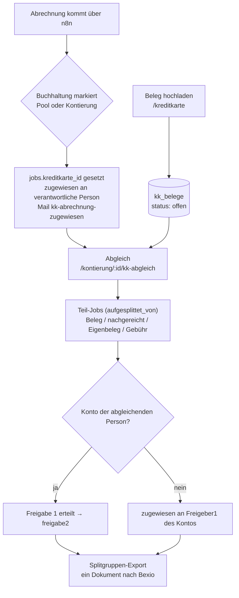

# Kreditkarten-Belege

Dritte Domäne neben Lieferantenrechnungen und Spesen: Belege zu
Kreditkartenkäufen lassen sich **vorab**, unabhängig von der monatlichen
Abrechnung, ins Portal hochladen — ohne dass das schon eine Freigabe oder
einen Export auslöst. Trifft später die Abrechnung ein (heute über n8n,
manuell markiert), gleicht die für die Karte verantwortliche Person sie
gegen die offenen Belege ab. Aus dem Abgleich entstehen pro Position
Teil-Jobs, die die normale Freigabe (Freigeber 1/2) durchlaufen und am
Ende als **eine** Splitgruppe gebündelt nach Bexio exportiert werden
(gleicher Export-Mechanismus wie beim Aufsplitten).

Vorab-Belege selbst sind **keine** `jobs`-Zeilen — sie leben in eigenen
Tabellen und tauchen erst durch den Abgleich als Teil-Job in der
Freigabe-Maschinerie auf.

Design-Spec (Quelle der ursprünglichen Entscheidungen; Details zur
tatsächlichen Umsetzung stehen hier und im Code):
[2026-09-27-kreditkarten-belege-design.md](superpowers/specs/2026-09-27-kreditkarten-belege-design.md).
Diese Etappe 1 deckt die Abschnitte 1–5, 7 und 8 der Spec ab (Kern:
Verwaltung, Erfassung, Markierung, Abgleich, Rechte, Mail-Vorlage) — die
Erweiterungen aus Abschnitt 6 (Erinnerungen, automatische Kartenerkennung,
Zuordnungs-Vorschläge, Mail-Eingang, Fristlöschung) sind **nicht**
Bestandteil dieser Etappe.

## Datenmodell

### `kreditkarten`

| Spalte | Bedeutung |
|---|---|
| `bezeichnung` | Freitext, z. B. „Visa Bereich Jugend“ |
| `karte_endziffern` | optional, genau 4 Ziffern (CHECK) — nie die volle Kartennummer |
| `karteninhaber_name` | Freitext, reine Anzeige, keine Rechte |
| `verantwortlich_id` | Person, die die Karte abgleicht und alle offenen Belege der Karte sieht/verwaltet |
| `erfassung_offen` | 1 = alle dürfen Belege erfassen (Modus A), 0 = nur `kreditkarte_erfasser` + verantwortliche Person (Modus B) |
| `absender_muster` | reserviert für die automatische Kartenerkennung (Etappe 2), in dieser Etappe ungenutzt |
| `aktiv` | Deaktivieren/Reaktivieren wie bei Konten, kein Löschen |

### `kreditkarte_erfasser`

`kreditkarte_id` + `person_id`, zusammengesetzter Primärschlüssel. Wird
nur ausgewertet, wenn `erfassung_offen = 0`. Ein Wechsel von Modus A zu B
lässt bestehende offene Belege unangetastet — die Einschränkung gilt nur
für neue Uploads.

### `kk_belege`

| Spalte | Bedeutung |
|---|---|
| `kreditkarte_id` | Karte; in dieser Etappe immer gesetzt (der Status `entwurf` mit NULL-Karte ist für den Mail-Eingang in Etappe 2 reserviert) |
| `hochgeladen_von` / `gekauft_von` | wer den Beleg erfasst hat / für wen der Kauf war (Default: dieselbe Person) |
| `quelle` | `web` (Upload auf `/kreditkarte`) / `mail` (Etappe 2) / `abgleich` (beim Abgleich direkt nachgereicht) |
| `pdf_pfad` / `thumbnail_pfad` | Bilder werden serverseitig in eine PDF-Seite umgewandelt, Thumbnail best effort |
| `betrag` | negativ erlaubt (Rückerstattung); NULL nur bei `entwurf` |
| `waehrung` | reine Info, Default `CHF` — beim Abgleich zählt immer der CHF-Betrag der Zeile |
| `kaufdatum` | nicht in der Zukunft |
| `konto_id` | optionaler Vorschlag für den Abgleich |
| `status` | `entwurf` / `offen` / `zugeordnet` / `verworfen` |
| `zugeordnet_job_id` | der beim Abgleich entstandene Teil-Job |
| `verworfen_grund`, `verworfen_von`, `verworfen_am` | Pflichtfelder beim Verwerfen |

`zugeordnet` und `verworfen` sind Endzustände. Zugeordnete Belege bleiben
dauerhaft erhalten (sie sind Teil des gestempelten Buchungsdokuments); die
Fristlöschung verworfener Belege (`datei_geloescht_am`, `letzte_erinnerung_am`)
ist als Spalte bereits angelegt, ihre Cron-Logik folgt erst in Etappe 2.

### `kk_beleg_ereignisse`

Eigenes Audit-Log für Belege, solange sie noch keine `jobs`-Zeile haben
und deshalb nicht über `freigaben` protokollierbar sind: `kk_beleg_erfasst`,
`kk_beleg_geaendert`, `kk_beleg_verworfen`, `kk_beleg_zugeordnet` (plus
`kk_beleg_ergaenzt`/`kk_beleg_datei_geloescht`, reserviert für Etappe 2).
`person_id = NULL` bedeutet System. Erscheint zusammen mit `freigaben` im
globalen Audit-Log, siehe unten.

### Neue `jobs`-Spalten

| Spalte | Bedeutung |
|---|---|
| `kreditkarte_id` | gesetzt auf dem Abrechnungs-Job (Elternjob), sobald er einer Karte zugeordnet ist |
| `kk_eigenbeleg_grund` | auf einem Teil-Job ohne Beleg: Begründung bei Eigenbeleg, fester Text „Gebühr/Zins“ bei Gebühren |
| `kk_markiert_am` | Zeitpunkt der Markierung (Basis für die Abgleich-Erinnerung, Etappe 2) |
| `kk_erinnert_am` | reserviert für die Abgleich-Erinnerung (Etappe 2), in dieser Etappe immer NULL |
| `kk_text_betraege` | reserviert für die PDF-Text-Vorschläge (Etappe 2), in dieser Etappe ungenutzt |

Neue `freigaben.rolle`-Werte: `kk_abrechnung_markiert`, `kk_markierung_aufgehoben`,
`kk_abgleich`. Neuer `mail_log.typ`-Wert (in dieser Etappe tatsächlich
versendet): `kk-abrechnung-zugewiesen`; das CHECK-Constraint reserviert
zusätzlich `kk-beleg-erinnerung` und `kk-beleg-eingegangen` für Etappe 2.
Neues additives Recht `kreditkarten_verwalten` in `person_berechtigungen`.
Details zu allen Tabellen: [datenmodell.md](datenmodell.md).

## Rechte

| Aktion | Berechtigt |
|---|---|
| Karten verwalten, Erfasser pflegen | `superadmin`, Einzelrecht `kreditkarten_verwalten` |
| Beleg hochladen | Modus A: alle angemeldeten Personen · Modus B: `kreditkarte_erfasser` + verantwortliche Person der Karte |
| Beleg bearbeiten/verwerfen | `hochgeladen_von`, `gekauft_von`, verantwortliche Person der Karte — nur solange `offen`/`entwurf` |
| Abrechnung markieren | wer den Job heute beanspruchen bzw. kontieren dürfte (gleiche Autorisierung wie Pool-Beanspruchen/Kontierung) |
| Markierung aufheben, Abgleich | `zugewiesen_an` des Abrechnungs-Jobs (inkl. Ferienmodus-Vertretung, Admin-Eskalations-Sonderfall) |
| Freigabe der Teil-Jobs | unverändert Freigeber 1/2 des jeweiligen Kontos (Vier-Augen-Prinzip) |
| Modul, Karten aktivieren/deaktivieren | **nur** `superadmin` bzw. `kreditkarten_verwalten` (Modul-Schalter selbst: nur `superadmin`, siehe unten) |

Alle neuen POST-Routen laufen durch den bestehenden CSRF-Schutz (bei
multipart-Routen nach multer, wie beim Aufsplitten) —
`test/integration/csrfSweep.test.js` deckt sie ab.

## Ablauf

### 1. Belege erfassen (`/kreditkarte`, `src/routes/kreditkarte.js`)

Sichtbar, sobald das Modul aktiv ist **und** die Person mindestens eine
aktive Karte erfassen darf, für eine Karte verantwortlich ist, oder
eigene Belege hat (`zeigeKreditkartenBereich`, `src/services/kkRechte.js`).

Vier Bereiche auf der Seite: eigene offene Belege (hochgeladen oder
gekauft von mir), offene Belege meiner Karten (nur für verantwortliche
Personen), sowie eine einklappbare Liste zugeordneter/verworfener Belege.
Bearbeiten/Verwerfen darf `hochgeladen_von`, `gekauft_von` oder die
verantwortliche Person der Karte (`darfBelegBearbeiten`) — nur solange der
Beleg `offen` oder `entwurf` ist. Beleg-Prüfung wie überall im Portal:
PDF/PNG/JPEG, max. 20 MB, Magic-Byte-Check, Bild → eigene PDF-Seite,
Thumbnail best effort.

**Erfass-Recht** (`darfAufKarteErfassen`): Modus A (`erfassung_offen = 1`)
erlaubt jeder angemeldeten Person das Erfassen; Modus B beschränkt es auf
`kreditkarte_erfasser` plus die verantwortliche Person — serverseitig
geprüft (403), nicht nur im Formular ausgeblendet.

**Deaktivierte Karte**: eine verantwortliche Person behält den Zugriff auf
die Seite und ihre bereits erfassten/offenen Belege auch dann, wenn ihre
Karte inzwischen deaktiviert wurde — nur neue Uploads auf eine deaktivierte
Karte werden abgelehnt (`pruefeFelder` verlangt `karte.aktiv`).

### 2. Verwaltung (`/admin/kreditkarten`)

Liste, Neu, Bearbeiten, Deaktivieren/Reaktivieren — gleiches Muster wie
Konten. Geschützt durch das neue additive Recht `kreditkarten_verwalten`
(`superadmin` hat es implizit über sein Rollen-Bundle). Das
Bearbeiten-Formular zeigt bei deaktivierter Checkbox „Alle Personen dürfen
Belege erfassen“ eine Personen-Mehrfachauswahl für `kreditkarte_erfasser`.

### 3. Abrechnung markieren und übergeben

Auf der Pool-Seite (`unzugewiesen`, `POST /pool/:id/als-kk-abrechnung`)
und der Kontierungsseite (`zugewiesen`, `POST /kontierung/:id/als-kk-abrechnung`)
lässt sich ein Job als „Kreditkartenabrechnung → Karte [Auswahl]“
markieren — nur bei aktivem Modul, nur aktive Karten wählbar, berechtigt
ist, wer den Job heute beanspruchen bzw. kontieren dürfte. Gemeinsamer
Service `markiereAlsKkAbrechnung` (`src/services/kkMarkierung.js`):

1. `jobs.kreditkarte_id` und `kk_markiert_am` setzen, Status `zugewiesen`,
   `zugewiesen_an` = verantwortliche Person der Karte.
2. `freigaben`-Eintrag `kk_abrechnung_markiert`.
3. Mail `kk-abrechnung-zugewiesen` an die verantwortliche Person — entfällt,
   wenn die markierende Person selbst verantwortlich ist; diese wird
   stattdessen direkt auf die Abgleich-Seite weitergeleitet.

Ein Job, der bereits einer Karte zugeordnet ist, kann nicht ein zweites
Mal markiert werden (`markiereJobAlsKkAbrechnung` prüft
`kreditkarte_id IS NULL` in der WHERE-Klausel) — ein Wettlauf zweier
Markierungsversuche liefert dem zweiten ein `409`.

`GET /kontierung/:id` eines markierten Jobs leitet automatisch auf die
Abgleich-Seite um; die normale Einzelkontierung und das reguläre
Aufsplitten sind für solche Jobs serverseitig gesperrt (`sperreKkAbrechnung`
in `src/routes/kontierung.js`), nicht nur im UI ausgeblendet.

### Markierung aufheben

„Keine Abrechnung dieser Karte“ (`POST /kontierung/:id/kk-markierung-aufheben`):
nur durch die aktuell zugewiesene Person, mit Pflicht-Bemerkung. Löscht
`kreditkarte_id`/`kk_markiert_am` und schickt den Job über den bestehenden
Rückweg „an Gruppe zurück“ in den Pool zurück, mit `freigaben`-Eintrag
`kk_markierung_aufgehoben`. Beide Schritte (Markierung aufheben +
Rücksendung) laufen in einer Transaktion; ist der Job inzwischen nicht
mehr `zugewiesen` mit gesetzter `kreditkarte_id` (z. B. weil er parallel
bereits abgeglichen wurde), passiert **keine** der beiden Änderungen und
es wird **kein** `freigaben`-Eintrag geschrieben — die Anfrage bekommt
`409`, nicht einen halb protokollierten Vorgang.

### 4. Abgleich (`/kontierung/:id/kk-abgleich`, `src/routes/kkAbgleich.js`)

Autorisiert wie die Kontierung: Job muss `kreditkarte_id` gesetzt haben,
`status = 'zugewiesen'`, `zugewiesen_an` = aktuelle Person — inklusive
derselben Ferienmodus-Vertretung und Admin-Eskalations-Sonderfälle wie
`ladeKontierbarenJob`.

Die Seite listet die offenen Belege der Karte (nicht `entwurf`) zum
Anhaken; jede angehakte Zeile wird zu einer Position mit Konto, Betrag und
optionaler Position auf der Abrechnung. Jede Zeile ist genau eine von drei
Arten:

- **Beleg** — aus der Liste der offenen Belege.
- **Beleg nachreichen** — Datei-Upload direkt in der Zeile; daraus
  entsteht ein neuer `kk_belege`-Eintrag mit `quelle = 'abgleich'`,
  direkt `zugeordnet`.
- **Ohne Beleg**, Unterart **Eigenbeleg** (Begründung Pflicht,
  `kk_eigenbeleg_grund`) oder **Gebühr/Zins** (fester Text, keine
  Begründung).

Live-Summe/Differenz-Anzeige, Speichern nur bei Differenz ≤ 0.005
(zusätzlich serverseitig geprüft), mindestens eine Zeile Pflicht.

**Vorzeichen-Konvention bei Rückerstattungen**: ein negativ eingegebener
Zeilenbetrag wird — wie überall im Portal — **nicht** mit Vorzeichen in
den Teil-Job übernommen. Der Teil-Job bekommt einen **positiven**
`betrag` mit `typ = 'gutschrift'`; nur die Bedeutung, nicht das Vorzeichen,
trägt die Rückerstattung (gleiche Konvention wie bei der normalen
Kontierung, siehe [rechnungs-workflow.md](rechnungs-workflow.md#2-kontierung-status-zugewiesen)).
Die **Summenprüfung** gegen das Abrechnungstotal rechnet dagegen mit dem
**signierten** Wert jeder Zeile (eine Rückerstattung senkt die Summe), und
sowohl der zugehörige `kk_belege`-Eintrag als auch die Kopfdaten des
Elternjobs behalten ebenfalls das Vorzeichen.

Speichern läuft in `src/services/aufsplitten.js` (`erzeugeTeilJobs`) — die
ursprüngliche Aufsplitten-Logik wurde in diesen gemeinsamen Service
ausgelagert, den sowohl `POST /kontierung/:id/aufsplitten` als auch der
Abgleich nutzen. Alles in einer DB-Transaktion; PDF-Dateien werden vorher
in temporäre Pfade geschrieben und bei einem Rollback wieder entfernt.

### Abweichung vom Aufsplitten: fremde Konten

Beim normalen Aufsplitten landet eine Zeile mit einem fremden Konto als
`unzugewiesen`-Teil-Job mit Hinweis-Konto zurück im Pool. Beim
Kreditkarten-Abgleich ist das Konto bereits bekannt (die abgleichende
Person hat es explizit gewählt) — eine Pool-Triage wäre hier überflüssig.
Deshalb erzeugt `erzeugeTeilJobs` mit `fremdKontoModus: 'freigeber1'`
(statt `'pool'` beim Aufsplitten) für eine solche Zeile direkt einen Job
mit Status `zugewiesen`, `zugewiesen_an` = Freigeber 1 des Kontos, inkl.
vorausgefüllter Kontierung (Konto, Betrag, Beschreibung) und
Zuweisungs-Mail an ihn. Die strikte Freigeber1-Prüfung (falls aktiv)
greift dort anschliessend wie bei jeder normalen Kontierung.

### Parallelität und 409

Zwei Stellen sind explizit gegen einen parallelen Zugriff (zweiter Tab,
zweite Person) abgesichert:

- **Derselbe Beleg in zwei gleichzeitigen Abgleichen**: `ordneKkBelegZu`
  aktualisiert nur einen Beleg mit `status = 'offen'`. Wird beim Absenden
  festgestellt, dass ein angehakter Beleg inzwischen nicht mehr `offen`
  ist, seine Datei fehlt, oder die Zuordnung während der Transaktion auf
  0 betroffene Zeilen trifft, wird die **gesamte Transaktion** abgebrochen
  (`ROLLBACK`, bereits angelegte Teil-Job-Dateien werden wieder gelöscht)
  und `409` mit dem Hinweis „Beleg wurde inzwischen anderweitig verwendet
  oder verworfen, bitte Seite neu laden“ zurückgegeben — keine
  Teil-Jobs, keine verwaisten Dateien.
- **Markierung/Abgleich desselben Jobs**: sowohl `markiereJobAlsKkAbrechnung`
  als auch `markJobAufgesplittet` (beim Speichern des Abgleichs) prüfen den
  erwarteten Ausgangsstatus in ihrer `UPDATE ... WHERE`-Klausel; trifft das
  nicht genau eine Zeile, liefert die Route `409`.

Weitere serverseitig abgelehnte Eingaben: eine Zeile mit Betrag `0.00`
(`Number(betragSigniert) === 0`), eine nachgereichte Datei, die sich nicht
öffnen/parsen lässt (`400`, nicht erst ein 500 bei der späteren
PDF-Arbeit).

### Stempelseite-Hinweise

`kkHinweisFuerJob` (`src/services/kkStempel.js`) liefert für einen
Kreditkarten-Teil-Job eine Zeile, die auf der Kontierungs- und der
Freigabe-2-Seite als Hinweis-Banner erscheint (gelb bei „ohne Beleg“,
blau/info bei vorhandenem Beleg) und identisch auf der Einzel- **und** der
Splitgruppen-Stempelseite gedruckt wird (`pdfStamp.js`):

- `kk_eigenbeleg_grund = 'Gebühr/Zins'` → „Gebühr/Zins (ohne Beleg)“
- `kk_eigenbeleg_grund` sonst gesetzt → „Ohne Beleg: {Begründung}“
- sonst, falls ein zugeordneter Beleg existiert → „Kreditkartenbeleg:
  gekauft von X, erfasst von Y“

### Modul-Schalter (`/admin/module`)

`modul_kreditkarten_aktiv` (Default **aus**, `'0'`), gleiches Muster wie
`modul_spesen_aktiv`: deaktiviert blockiert neue Uploads
(`GET /kreditkarte` und `POST /kreditkarte/belege` liefern 403) und neue
Markierungen (`POST .../als-kk-abrechnung` liefert 403); bereits markierte
Abrechnungen lassen sich weiter abgleichen, bestehende Teil-Jobs laufen
unverändert durch Freigabe 1/2 und Export. Details:
[admin-bereich.md](admin-bereich.md#module-adminmodule).

### Globales Audit-Log

`kk_beleg_ereignisse` erscheint gemeinsam mit `freigaben` und
`job_loeschungen` in der einen durchsuchbaren Zeitleiste unter
**Admin → Audit-Log** (`src/services/globalAuditLog.js`, dritte Quelle in
der `UNION ALL`-Abfrage) — filterbar wie die übrigen Ereignisse. Ein
Eintrag ohne `person_id` (aktuell nur bei künftiger automatischer
Markierung, Etappe 2) wird dort als Person „System“ angezeigt.

## Bekannte Grenzen dieser Etappe

- **Kein Rechnungsnummer-Duplikat-Check pro Zeile.** Der Abgleich führt —
  wie das bestehende Aufsplitten — nur den **IBAN-Abgleich auf
  Elternjob-Ebene** aus (`pruefeIbanNachAufsplitten`, gegen `job.qr_iban`/
  `job.debitor_id` der Abrechnung selbst). Ein Duplikat-Check auf
  Debitor + Rechnungsnummer je Teil-Zeile — wie ihn die Spec-Formulierung
  in Abschnitt 5 nahelegt — existiert weder beim Aufsplitten noch beim
  Kreditkarten-Abgleich; diese Doku beschreibt bewusst den tatsächlichen
  Code-Stand.
- **Keine Erinnerungen, keine automatische Kartenerkennung, keine
  Zuordnungs-Vorschläge, kein Mail-Eingang, keine Fristlöschung** — alles
  Bestandteil von Etappe 2 (Spec-Abschnitt 6). Die dafür nötigen Spalten
  (`kk_erinnert_am`, `kk_text_betraege`, `letzte_erinnerung_am`,
  `datei_geloescht_am`, Status `entwurf`) sind bereits angelegt, damit
  Etappe 2 keine weitere Migration braucht.
- **Kein Gutschriften-Typ-Übertrag von aussen** — anders als beim
  bekannten Aufsplitten-Verhalten entsteht `typ = 'gutschrift'` beim
  Abgleich direkt aus dem Vorzeichen der eingegebenen Zeile, nicht aus
  einem vererbten Eltern-`typ` (der Abrechnungs-Job selbst hat ohnehin nie
  einen `typ`).
