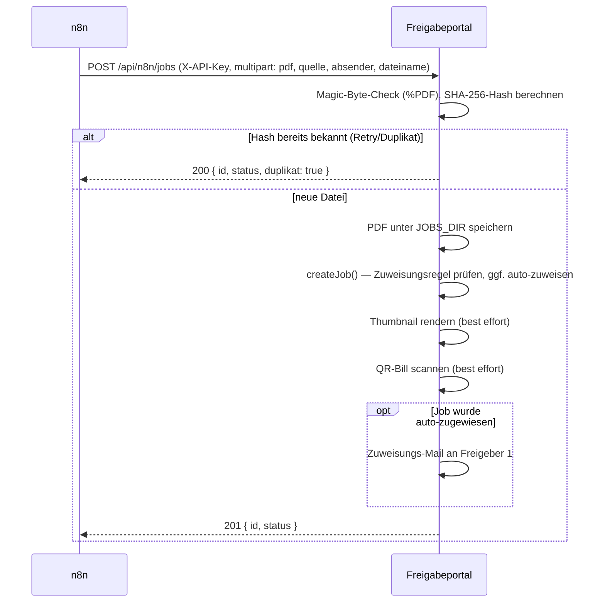
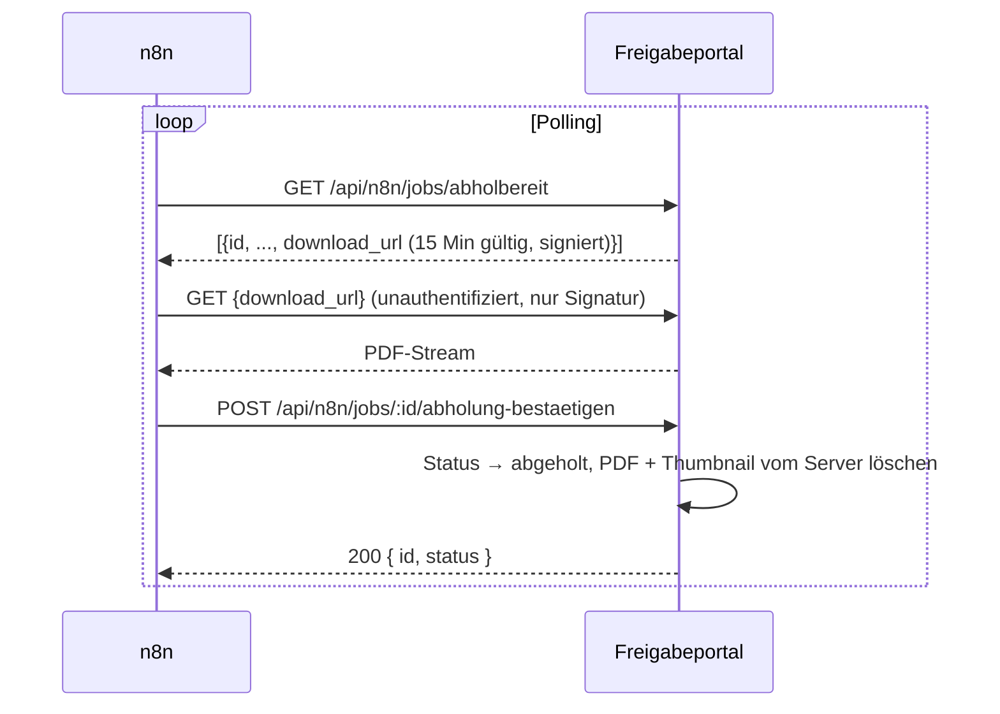

# n8n-Schnittstelle

Das Portal selbst empfängt keine E-Mails und spricht kein IMAP — ein
externer n8n-Workflow übernimmt Mail-Eingang und Ablage und kommuniziert
mit dem Portal ausschliesslich über eine kleine REST-API unter
`/api/n8n/jobs` (`src/routes/n8n/jobs.js`), abgesichert per
`X-API-Key`-Header (`requireApiKey`, zeitkonstanter Vergleich gegen
`N8N_API_KEY`).

> Nativer Mail-Empfang/-Versand direkt im Portal (ohne n8n) ist als
> Design-Spec vorbereitet, aber noch nicht implementiert — n8n bleibt bis
> dahin der einzige Weg, wie Rechnungen ins Portal gelangen.

## Rechnungseingang

**Vertrag** (`POST /api/n8n/jobs`, `multipart/form-data`):

| Feld | Pflicht | Beschreibung |
|---|---|---|
| `pdf` | ja | die Rechnung, max. 20 MB, muss mit `%PDF` beginnen |
| `quelle` | ja | `"scanner"` oder `"lieferant"` |
| `dateiname` | ja | Anzeigename |
| `absender` | nein | `From:`-Header der eingehenden Mail (roh, mit oder ohne Display-Name) — Basis für die automatische Zuweisungsregel |
| `eingang_am` | nein | ISO-Datum; Default: jetzt |

Antworten: `201` mit `{id, status}` bei neuer Rechnung, `200` mit
`{id, status, duplikat: true}` bei bytegleichem Wiederholungs-Upload
(SHA-256-Hash-Vergleich — macht die Schnittstelle idempotent gegenüber
n8n-Retries oder mehrfach ausgelösten IMAP-Triggern), `400` bei
Validierungsfehlern.

## Abholung fertiger Rechnungen

- `GET /api/n8n/jobs/abholbereit` liefert alle Jobs mit Status
  `abgeschlossen`, deren letzter Abholversuch (`fetched_by_n8n_at`) länger
  als 15 Minuten her ist oder noch nie stattfand — jeder Abruf markiert
  sie sofort neu als "gerade abgeholt", sodass ein paralleler zweiter
  Poll-Zyklus dieselben Jobs nicht doppelt liefert.
- **Ist ein RFC3161-Zeitstempeldienst konfiguriert** (`zeitstempel_tsa_url`
  gesetzt), bleibt ein Job so lange **unsichtbar** für diese Route, bis
  sein Zeitstempel tatsächlich gesetzt ist (`zeitstempel_gesetzt_am IS NOT
  NULL`) — siehe
  [zeitstempel-und-pruefbescheinigung.md](zeitstempel-und-pruefbescheinigung.md).
  Dieselbe Bedingung gilt für `abholung-bestaetigen`.
- Der `download_url` ist eine HMAC-signierte, 15 Minuten gültige URL auf
  `GET /downloads/:jobId` — **keine** Session nötig, siehe
  [architektur.md](architektur.md#sicherheitsmechanismen-auszug).
- `abholung-bestaetigen` ist die einzige Stelle, an der die
  Rechnungs-PDF/Thumbnail-Datei physisch vom Portal-Server gelöscht wird
  — ab hier liegt die Datei nur noch bei n8n bzw. im Zielsystem der
  Kirchgemeinde.
