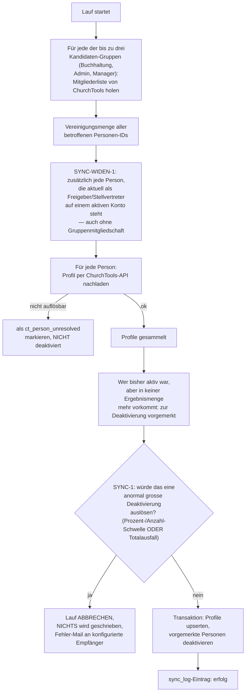

# ChurchTools-Personen-Sync

Das Portal hält einen lokalen Cache aller relevanten ChurchTools-Personen
(`personen`-Tabelle) — nötig, weil Foreign Keys (z. B. `konten.freigeber1_id`)
auf stabile lokale Datensätze zeigen müssen und nicht bei jeder Anfrage
live gegen ChurchTools aufgelöst werden können. Aktualisiert wird dieser
Cache bei jedem Login (nur die einloggende Person) und vollständig durch
den nächtlichen `sync-personen`-Job
(`src/services/sync.js`, `runPersonenSync`).

## Ablauf

## Sicherheitsmechanismen

- **SYNC-WIDEN-1**: Freigeber/Stellvertreter, die selbst in keiner der
  drei Gruppen sind (seit AUTH-WIDEN-1 beim Login erlaubt, siehe
  [auth-und-rechte.md](auth-und-rechte.md)), würden ohne diese Ausnahme
  vom allernächsten Sync-Lauf wieder deaktiviert — ihre tatsächliche
  Gruppenzugehörigkeit bleibt davon unberührt, nur die Deaktivierung
  entfällt.
- **SYNC-1 — Schutz vor Massen-Deaktivierung**: Ein ChurchTools-seitiger
  Ausfall oder eine Fehlkonfiguration (z. B. eine leere/fast leere
  Gruppen-Mitgliederliste als Antwort) sähe wie ein massenhafter
  Gruppenaustritt aus. Der Lauf bricht deshalb **komplett ab, ohne
  irgendetwas zu schreiben**, wenn eine der drei Bedingungen zutrifft:
  - der Anteil der zu deaktivierenden Personen übersteigt die
    konfigurierte Prozent-Schwelle (Default 50 %) — nur relevant, wenn die
    aktive Population mindestens so gross ist wie die Anzahl-Schwelle;
  - die absolute Anzahl übersteigt die konfigurierte Anzahl-Schwelle
    (Default 10);
  - **Totalausfall**: alle aktuell aktiven Personen (ab einer Population
    von 2) würden auf einen Schlag deaktiviert — greift unabhängig von
    den beiden anderen Schwellen, die bei einer kleinen Kirchgemeinde
    (üblicherweise unterhalb der Anzahl-Schwelle) sonst nie auslösen
    würden.
  - Eine einzelne Person, die als einzige aktive Person austritt, ist
    davon ausgenommen — das ist ein normaler Vorgang, kein Fehlersignal.
  - Ein abgebrochener Lauf löst eine `sync-fehler`-Mail an die unter
    **Admin → Personen-Sync** konfigurierten Empfänger aus.
- **Nicht auflösbare Personen** (z. B. nach einem ChurchTools-seitigen
  Personen-Merge) werden als `ct_person_unresolved` markiert, nicht
  gelöscht oder deaktiviert — ihre historischen Freigaben/Rechnungen
  bleiben nachvollziehbar zuordenbar.
- Die Konfiguration (Prozent-/Anzahl-Schwelle, Fehler-Empfänger) ist unter
  **Admin → Personen-Sync** (Recht `sync_einsehen`) einstellbar.

## Stalled Jobs

Ein Job "hängt" (`listStalledJobs`, `src/db/jobsRepo.js`), wenn die für
den aktuellen Schritt zuständige Person inzwischen deaktiviert oder
`ct_person_unresolved` ist:

| Job-Status | zuständige Person |
|---|---|
| `zugewiesen` / `abgelehnt` | `zugewiesen_an` |
| `freigabe2` (nicht admin-eskaliert) | effektiver Freigeber 2 des Kontos |

Ein `freigabe2`-Job, der bereits an die Admin-Gruppe eskaliert wurde, gilt
**nicht** als hängend — ein gleichzeitiger Ausfall der gesamten
`superadmin`-Gruppe ist bewusst nicht abgedeckt.

**Admin → Personen-Sync** listet jeden hängenden Job mit Name/Grund und
bietet einen Force-Freigeben-Button:

- für `zugewiesen`/`abgelehnt`: vollständiger Reset auf `unzugewiesen`
  (unbedenklich — es wurde bei diesen Stufen noch keine Freigabe erteilt);
- für `freigabe2`: **kein** Reset in den Pool (das würde die bereits
  erteilte, protokollierte Freigabe 1 verwerfen) — stattdessen dieselbe
  Admin-Eskalation, die auch ein regulärer SYNC-8-Interessenskonflikt
  auslöst (siehe [rechnungs-workflow.md](rechnungs-workflow.md)).
