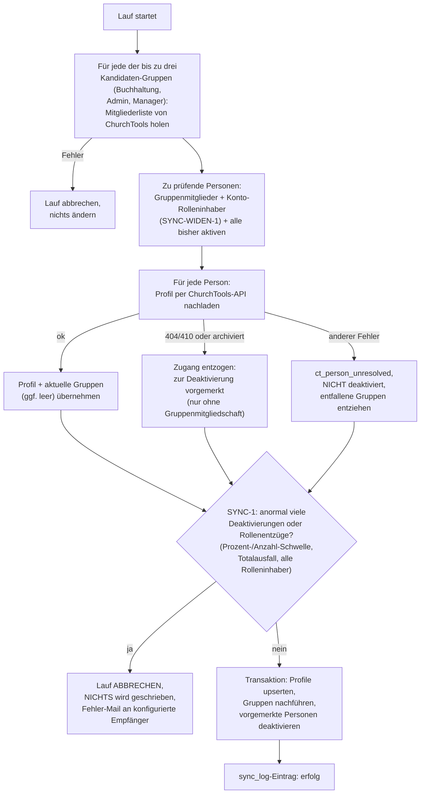

# ChurchTools-Personen-Sync

Das Portal hält einen lokalen Cache aller Portal-relevanten ChurchTools-Personen
(`personen`-Tabelle) — nötig, weil Foreign Keys (z. B. `konten.freigeber1_id`)
auf stabile lokale Datensätze zeigen müssen und nicht bei jeder Anfrage
live gegen ChurchTools aufgelöst werden können. Aktualisiert wird dieser
Cache bei jedem Login (nur die einloggende Person) und vollständig durch
den nächtlichen `sync-personen`-Job
(`src/services/sync.js`, `runPersonenSync`).

## Zugangsmodell

Anmelden darf jede Person, die sich über ChurchTools-OAuth anmelden kann
(AUTH-WIDEN-1, siehe [auth-und-rechte.md](auth-und-rechte.md)). Die drei
Verwaltungsgruppen (Buchhaltung, Admin, Manager) vergeben nur **Rollen**,
nicht den Portalzugang. Reine Spesen-Nutzer, Kartenverantwortliche und
Erfasser, Ferienvertretungen, Konto-Freigeber/-Stellvertreter und Personen
mit ausschließlich Einzelrechten brauchen deshalb keine Gruppenmitgliedschaft.

Der Sync unterscheidet für jede bisher aktive Person drei Fälle:

| Fall | Erkennung | Folge |
|---|---|---|
| **Fehlende Gruppenzugehörigkeit** | Person fehlt in den erfolgreich geladenen Gruppenlisten, ChurchTools liefert ihr Profil aber weiterhin | bleibt **aktiv**; gespeicherte `gruppen` werden geleert bzw. gekürzt — Rollenrechte (Pool, Admin) entfallen sofort |
| **Tatsächlich entzogener Zugang** | Profilabruf liefert HTTP 404/410 (in ChurchTools gelöscht, z. B. auch nach einem Personen-Merge) oder das Profil trägt ausdrücklich `isArchived: true` | **deaktiviert**, mit `deaktiviert_am` und `deaktivierungsgrund` (`churchtools_geloescht` / `churchtools_archiviert`) |
| **Vorübergehender Ausfall** | Netzwerkfehler, 5xx, 401/403, 429 u. Ä. beim Profilabruf | **nicht** deaktiviert, als `ct_person_unresolved` markiert; eine aus den Gruppenlisten feststehend entfallene Rolle wird trotzdem entzogen |

Scheitert bereits der Abruf einer Gruppenliste, bricht der ganze Lauf ohne
jede Änderung ab (`sync_log` = `fehler`, `sync-fehler`-Mail). Ein
Gruppenmitglied wird nie deaktiviert, auch wenn sein Profilabruf 404 meldet
(widersprüchliche Antwort → wie Ausfall behandelt). Historische Freigaben
und Rechnungen deaktivierter Personen bleiben unverändert zuordenbar; ein
erneuter Login reaktiviert eine Person und löscht Deaktivierungsdatum und
-grund.

**Grenze:** Eine in ChurchTools nur *gesperrte*, aber weiterhin abrufbare
Person erkennt der Sync nicht als gesperrt — die REST-API liefert dafür kein
verlässliches Merkmal. Sie kann sich über OAuth nicht mehr neu anmelden,
bleibt im Portal aber aktiv (z. B. als Mail-Empfängerin oder
Konto-Rolleninhaberin), bis sie in ChurchTools gelöscht oder archiviert wird
oder ihre Rollen/Konten im Portal angepasst werden. Das `isArchived`-Feld
wird ausgewertet, wenn ChurchTools es liefert; gegen die produktive Instanz
ist es nicht verifiziert.

## Ablauf

```mermaid
flowchart TD
    A["Lauf startet"] --> B["Für jede der bis zu drei<br/>Kandidaten-Gruppen (Buchhaltung,<br/>Admin, Manager):<br/>Mitgliederliste von ChurchTools holen"]
    B -->|Fehler| X["Lauf abbrechen,<br/>nichts ändern"]
    B --> C["Zu prüfende Personen:<br/>Gruppenmitglieder + Konto-Rolleninhaber<br/>(SYNC-WIDEN-1) + alle bisher aktiven"]
    C --> E["Für jede Person:<br/>Profil per ChurchTools-API nachladen"]
    E -->|ok| G["Profil + aktuelle Gruppen<br/>(ggf. leer) übernehmen"]
    E -->|404/410 oder archiviert| H["Zugang entzogen:<br/>zur Deaktivierung vorgemerkt<br/>(nur ohne Gruppenmitgliedschaft)"]
    E -->|anderer Fehler| F["ct_person_unresolved,<br/>NICHT deaktiviert,<br/>entfallene Gruppen entziehen"]
    G --> I{"SYNC-1: anormal viele<br/>Deaktivierungen oder Rollenentzüge?<br/>(Prozent-/Anzahl-Schwelle,<br/>Totalausfall, alle Rolleninhaber)"}
    H --> I
    F --> I
    I -- ja --> J["Lauf ABBRECHEN,<br/>NICHTS wird geschrieben,<br/>Fehler-Mail an konfigurierte Empfänger"]
    I -- nein --> K["Transaktion: Profile upserten,<br/>Gruppen nachführen,<br/>vorgemerkte Personen deaktivieren"]
    K --> L["sync_log-Eintrag: erfolg"]
```

## Sicherheitsmechanismen

- **SYNC-WIDEN-1**: Freigeber/Stellvertreter aktiver Konten werden auch
  ohne Gruppenmitgliedschaft und ohne bisherigen Login angelegt bzw.
  aktualisiert.
- **SYNC-1 — Schutz vor Massenänderungen**: Ein ChurchTools-seitiger
  Ausfall oder eine Fehlkonfiguration (z. B. eine leere/fast leere
  Gruppen-Mitgliederliste als Antwort) sähe wie ein massenhafter
  Gruppenaustritt aus. Gezählt werden Deaktivierungen **und** Rollenentzüge
  (Verlust mindestens einer gespeicherten Gruppe). Der Lauf bricht
  **komplett ab, ohne irgendetwas zu schreiben**, wenn eine der Bedingungen
  zutrifft:
  - der Anteil der Betroffenen übersteigt die konfigurierte
    Prozent-Schwelle (Default 50 %) — nur relevant, wenn die aktive
    Population mindestens so gross ist wie die Anzahl-Schwelle;
  - die absolute Anzahl übersteigt die konfigurierte Anzahl-Schwelle
    (Default 10);
  - **Totalausfall**: alle aktuell aktiven Personen (ab einer Population
    von 2) wären betroffen;
  - **Rollen-Totalausfall**: alle bisherigen Inhaber einer Gruppenrolle
    (ab 2 Personen) verlören sämtliche Rollen — schützt davor, dass eine
    leere Gruppenantwort still allen Administratoren die Rechte nimmt,
    auch wenn viele normale Nutzer die Prozent-Schwelle verwässern.
  - Eine einzelne Person, die als einzige aktive Person austritt, ist
    davon ausgenommen — das ist ein normaler Vorgang, kein Fehlersignal.
  - Ein abgebrochener Lauf löst eine `sync-fehler`-Mail an die unter
    **Admin → Personen-Sync** konfigurierten Empfänger aus.
- **Nicht auflösbare Personen** werden als `ct_person_unresolved` markiert,
  nicht gelöscht oder deaktiviert — ihre historischen Freigaben/Rechnungen
  bleiben nachvollziehbar zuordenbar.
- Die Konfiguration (Prozent-/Anzahl-Schwelle, Fehler-Empfänger) ist unter
  **Admin → Personen-Sync** (Recht `sync_einsehen`) einstellbar.
- Der Sync ruft je aktiver Person das ChurchTools-Profil ab; die Laufzeit
  wächst damit linear mit der Zahl der Portalnutzer.

## Stalled Jobs

Ein Job "hängt" (`listStalledJobs`, `src/db/jobsRepo.js`), wenn die für
den aktuellen Schritt zuständige Person inzwischen deaktiviert oder
`ct_person_unresolved` ist:

| Job-Status | zuständige Person |
|---|---|
| `zugewiesen` / `abgelehnt` | `zugewiesen_an` |
| `freigabe2` (nicht admin-eskaliert) | effektiver Freigeber 2 des Kontos |

Ein `freigabe2`-Job, der bereits an die Admin-Gruppe eskaliert wurde, gilt
**nicht** als hängend — ein gleichzeitiger Ausfall der gesamten
`superadmin`-Gruppe ist bewusst nicht abgedeckt.

**Admin → Personen-Sync** listet jeden hängenden Job mit Name/Grund und
bietet einen Force-Freigeben-Button:

- für `zugewiesen`/`abgelehnt`: vollständiger Reset auf `unzugewiesen`
  (unbedenklich — es wurde bei diesen Stufen noch keine Freigabe erteilt);
- für `freigabe2`: **kein** Reset in den Pool (das würde die bereits
  erteilte, protokollierte Freigabe 1 verwerfen) — stattdessen dieselbe
  Admin-Eskalation, die auch ein regulärer SYNC-8-Interessenskonflikt
  auslöst (siehe [rechnungs-workflow.md](rechnungs-workflow.md)).
