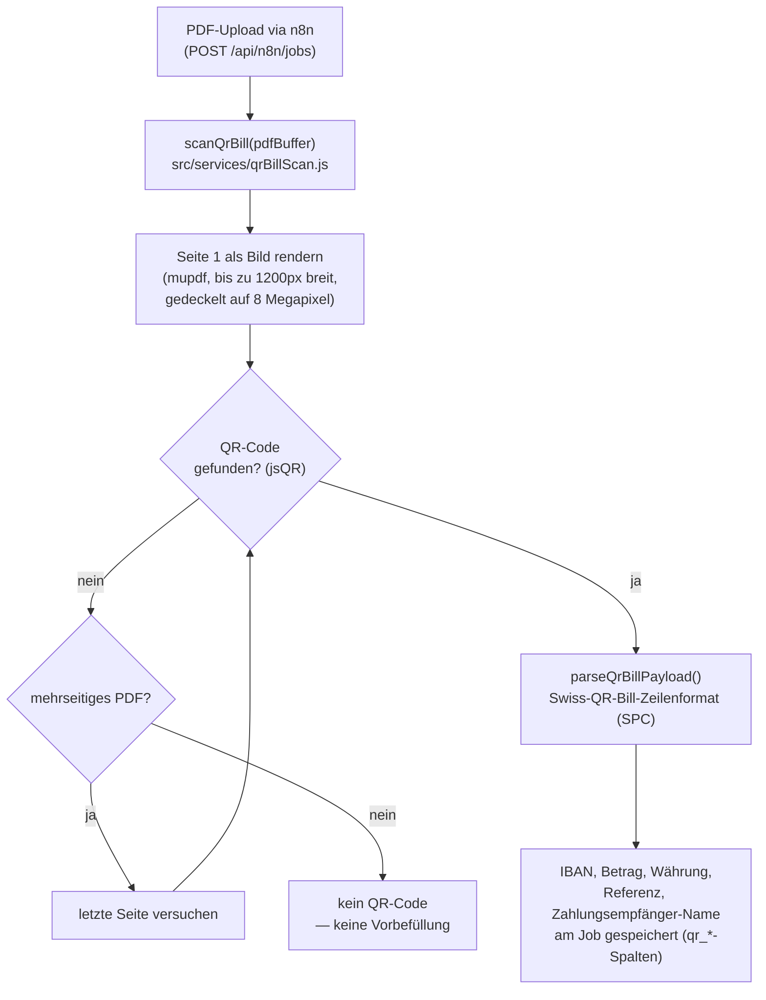
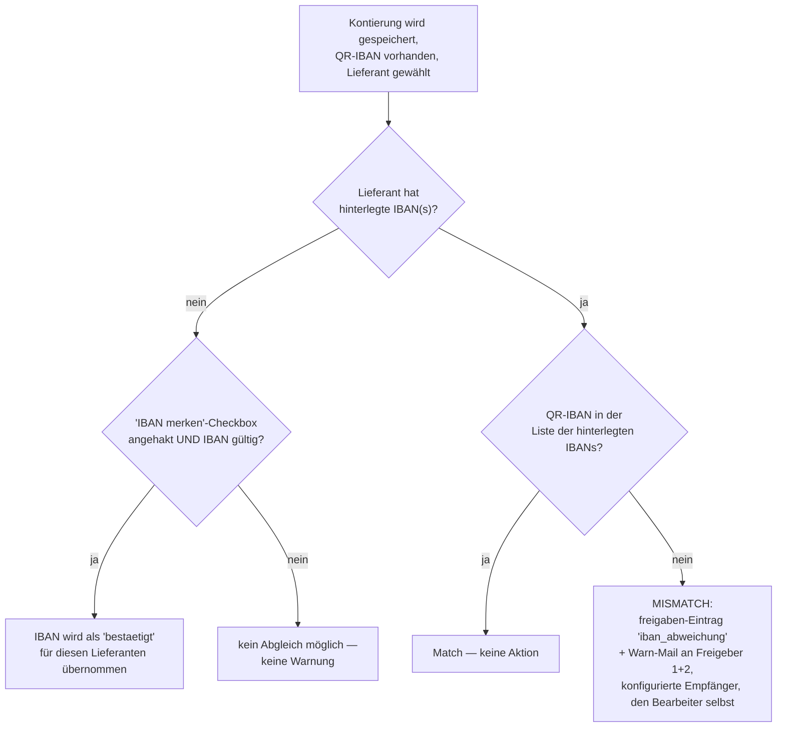

# Swiss-QR-Bill-Erkennung und IBAN-Abgleich

Zwei zusammenhängende, aber unabhängige Mechanismen: automatisches
Auslesen der Zahlungsdaten aus einem Swiss-QR-Bill-Code (Komfort) und ein
Abgleich der darin enthaltenen Zahlungsempfänger-IBAN gegen die für den
gewählten Lieferanten hinterlegten IBANs (Betrugserkennung — z. B. gegen
gefälschte Rechnungen mit manipulierter Kontoverbindung).

## Erkennung beim Rechnungseingang

Der Parser erwartet exakt das SIX/SPC-Zeilenformat (Header `"SPC"`,
mindestens 31 Zeilen); IBAN wird normalisiert (Leerzeichen entfernt,
Grossbuchstaben) — reale QR-Bill-Generatoren fügen teils
Gruppierungs-Leerzeichen ein, die sonst zu falschen
IBAN-Mismatch-Meldungen führen würden.

## Vorbefüllung und Abgleich bei der Kontierung

Auf der Kontierungs-Seite werden die gescannten QR-Daten als
Formular-Vorschlag angezeigt (Betrag, ggf. vorgeschlagener Lieferant
anhand der IBAN). Erst beim tatsächlichen **Speichern** der Kontierung
(mit einem gewählten Lieferanten) läuft der eigentliche
Sicherheits-Abgleich:

Die Warn-Mail blockiert die Kontierung **nicht** — sie ist ein Hinweis,
kein Stopp: die Person kann die Rechnung trotzdem freigeben, aber
Freigeber 1, Freigeber 2 und ggf. weitere konfigurierte Empfänger
(**Admin → Eskalationszeiten**, Feld "IBAN-Abweichungs-Empfänger") werden
zusätzlich informiert und können gezielt nachfragen.

## Bekannte Lücke: Aufsplitten umgeht den Abgleich

Der oben beschriebene IBAN-Abgleich läuft **ausschliesslich** im normalen
Kontierungs-Formular (`POST /kontierung/:id`). Die Aufsplitten-Route
(`POST /kontierung/:id/aufsplitten`, siehe
[rechnungs-workflow.md](rechnungs-workflow.md#5-aufsplitten-status-zugewiesen--aufgesplittet))
ruft `pruefeIbanAbgleich` nicht auf — eine über Aufsplitten kontierte
Teilrechnung wird aktuell nie gegen die hinterlegte Lieferanten-IBAN
geprüft, selbst wenn der ursprüngliche Job einen QR-Code mit abweichender
IBAN enthielt. Dies ist eine bekannte, noch offene Lücke im
Betrugserkennungs-Konzept.

## Verwaltung der hinterlegten IBANs

**Admin → Debitoren** (Recht `debitoren_verwalten`) verwaltet pro
Lieferant beliebig viele IBANs (`debitor_ibans`, eindeutig über die
gesamte Tabelle — eine IBAN kann nur einem Lieferanten zugeordnet sein).
Validierung einer Schweizer IBAN: `^CH\d{2}[0-9A-Z]{17}$`
(`src/services/ibanUtils.js`) — dieselbe Prüfung wird an allen drei
Stellen verwendet (QR-Parser, Admin-Formular, "IBAN merken"), damit keine
der drei aus der Reihe fällt und dadurch falsche Warnungen erzeugt.
