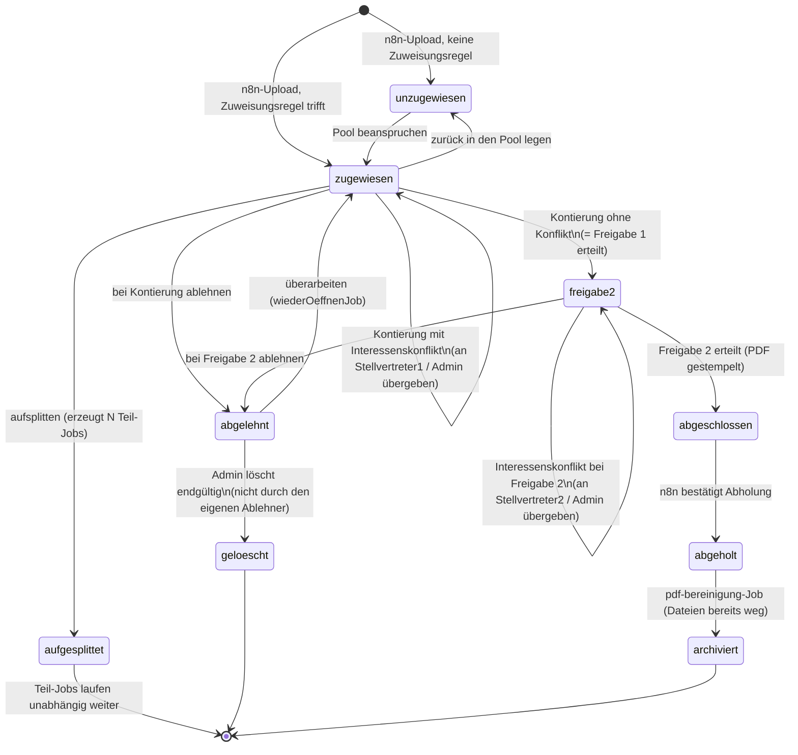
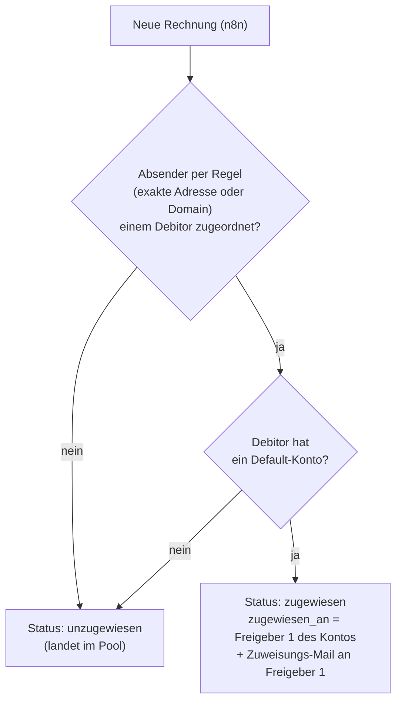
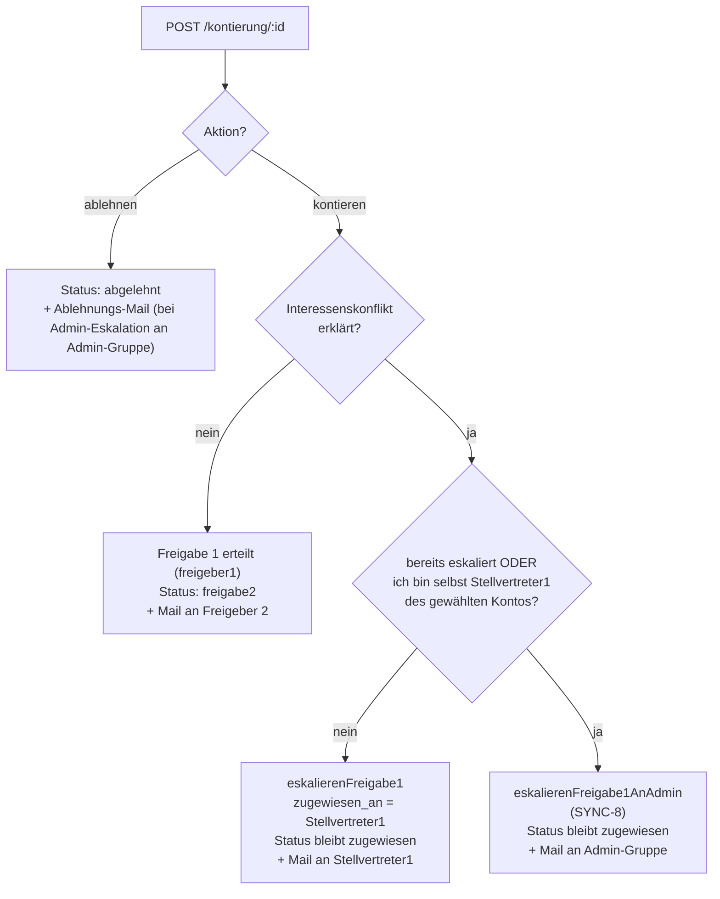
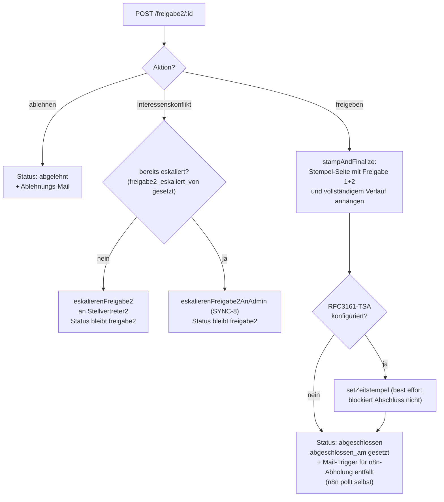

# Rechnungs-Workflow

Der zentrale fachliche Prozess des Portals: eine Rechnung durchläuft
Zuweisung, Kontierung, eine zweistufige, unabhängige Freigabe
(Vier-Augen-Prinzip) und wird danach von n8n abgeholt und archiviert.
Jede Rechnung ist eine Zeile in der `jobs`-Tabelle
(siehe [datenmodell.md](datenmodell.md)); ihr Zustand steckt fast
vollständig in der Spalte `status`.

## Status-Modell

| Status | Bedeutung |
|---|---|
| `unzugewiesen` | im Pool, noch niemandem zugewiesen |
| `zugewiesen` | einer Person zur Kontierung zugewiesen |
| `freigabe2` | Kontierung + Freigabe 1 erledigt, wartet auf die zweite, unabhängige Freigabe |
| `abgeschlossen` | beide Freigaben erteilt, PDF final gestempelt (und ggf. zeitgestempelt) |
| `abgeholt` | von n8n abgerufen, lokale PDF-Datei bereits gelöscht |
| `archiviert` | vom nächtlichen Bereinigungs-Job als endgültig archiviert markiert |
| `abgelehnt` | bei Kontierung oder Freigabe 2 zurückgewiesen, wartet auf Überarbeitung |
| `aufgesplittet` | in mehrere unabhängige Teil-Jobs aufgeteilt; bleibt als historische Referenz stehen |
| `geloescht` | endgültig durch einen Admin gelöscht (Soft-Delete, siehe unten) |

> Das Datenbankschema erlaubt per `CHECK`-Constraint zusätzlich die Werte
> `kontiert` und `freigabe1` — diese werden im aktuellen Code nirgends mehr
> gesetzt: Kontierung und Freigabe 1 werden in einem einzigen
> Formular-Submit erledigt und springen direkt von `zugewiesen` zu
> `freigabe2`. Die beiden Werte sind ein Überbleibsel eines früheren
> Entwurfs und aus Kompatibilitätsgründen weiterhin im Constraint erlaubt.

## Status-Diagramm

## 1. Rechnungseingang und automatische Zuweisung

n8n lädt jede eingehende Rechnung per `POST /api/n8n/jobs`
hoch (Details: [n8n-schnittstelle.md](n8n-schnittstelle.md)). Beim Anlegen
prüft `createJob` (`src/db/jobsRepo.js`), ob der Absender zu einer
hinterlegten Zuweisungsregel passt:

Zusätzlich wird beim Eingang automatisch nach einem Swiss-QR-Bill
gesucht (siehe [qr-bill-und-betrugserkennung.md](qr-bill-und-betrugserkennung.md))
und ein Thumbnail gerendert.

## 2. Kontierung (Status `zugewiesen`)

Nur die zugewiesene Person (bzw. bei SYNC-8-Eskalation an die
Admin-Gruppe: jede Person mit Rolle `superadmin`) darf
`GET/POST /kontierung/:id` aufrufen. Beim Absenden entscheidet das
Formular über drei mögliche Ausgänge:

Zusätzlich, unabhängig vom Ausgang: ein optional mit hochgeladener
**Beleg** (PDF/PNG/JPEG, z. B. bei Kreditkartenabrechnungen) wird per
`mergeBelegInPdf` (`src/services/belegAnhaengen.js`) als zusätzliche
Seite(n) in die bestehende Rechnungs-PDF eingefügt — als PDF durch
Seiten-Kopie, als Bild durch eine neue, bildgrosse Seite. Beim Kontieren
mit hinterlegtem Debitor läuft ausserdem der IBAN-Abgleich gegen den
gescannten QR-Code (siehe
[qr-bill-und-betrugserkennung.md](qr-bill-und-betrugserkennung.md)).

**Zurück in den Pool** (`POST /kontierung/:id/zurueck-in-pool`): setzt den
Job auf `unzugewiesen` zurück und löscht alle Konto-/Eskalations-Felder —
ein vollständiger Neustart. Optional kann ein "Hinweis-Konto" mitgegeben
werden, das den vermuteten richtigen Freigeber 1 per Mail informiert, ohne
den Job selbst zuzuweisen.

## 3. Freigabe 2 (Status `freigabe2`)

Autorisiert ist der **effektive Freigeber 2** des Kontos —
`stellvertreter2_id`, wenn der Job bereits einmal eskaliert wurde, sonst
`freigeber2_id` — bzw. bei SYNC-8-Eskalation jede `superadmin`-Person. Ein
harter Zusatz-Check verhindert, dass dieselbe Person, die Freigabe 1
erteilt hat, auch Freigabe 2 erteilen kann (Vier-Augen-Prinzip, siehe
[auth-und-rechte.md](auth-und-rechte.md)).

Details zur PDF-Stempelung und zum Zeitstempel:
[zeitstempel-und-pruefbescheinigung.md](zeitstempel-und-pruefbescheinigung.md).

## 4. Ablehnung, Überarbeitung, Löschung

- **Ablehnen** ist sowohl bei der Kontierung (`zugewiesen`) als auch bei
  Freigabe 2 (`freigabe2`) möglich — eine Rechnung muss nicht erst beide
  Stufen durchlaufen, um als ungültig/doppelt erkannt zu werden.
- **Überarbeiten** (`POST /abgelehnt/:id/ueberarbeiten`): nur die Person,
  der die Rechnung zum Zeitpunkt der Ablehnung zugewiesen war (bzw. bei
  Admin-Eskalation: `superadmin`), kann sie zurück auf `zugewiesen`
  setzen und erneut kontieren.
- **Endgültige Löschung** (`POST /admin/abgelehnt/:id/loeschen`,
  Recht `abgelehnt_verwalten`): nur für Rechnungen im Status `abgelehnt`,
  mit Pflicht-Begründung und Bestätigungs-Checkbox. **Selbstschutz**: wer
  die Rechnung selbst abgelehnt hat, darf sie nicht auch selbst löschen —
  das verhindert, dass eine einzelne Person eine Rechnung komplett aus dem
  System entfernen kann. Technisch ein **Soft-Delete**: die Zeile bleibt
  mit Status `geloescht` erhalten (PDF/Thumbnail ebenfalls), zusätzlich
  wird ein unveränderlicher Protokoll-Eintrag in `job_loeschungen`
  geschrieben (siehe [datenmodell.md](datenmodell.md)).

## 5. Aufsplitten (Status `zugewiesen` → `aufgesplittet`)

Für Sammelrechnungen/Kreditkartenabrechnungen, die auf mehrere Konten
verteilt werden müssen (`GET/POST /kontierung/:id/aufsplitten`):

1. Die Person gibt den Gesamtbetrag und mindestens zwei Teile
   (Konto + Betrag, optional eigener Beleg pro Teil) ein; die Summe der
   Teile muss dem Gesamtbetrag entsprechen (Toleranz 0.005).
2. Der Ursprungs-Job wird auf `aufgesplittet` gesetzt und bleibt als
   historische Referenz stehen — er selbst gilt nie als freigegeben oder
   abgelehnt.
3. Für **jeden Teil** entsteht ein komplett unabhängiger neuer Job (eigene
   PDF-Kopie, eigener Freigabe-Verlauf):
   - Konto gehört der aufsplittenden Person selbst → sofort Freigabe 1
     erteilt, direkt Status `freigabe2` (analog zum Normalfall ohne
     Konflikt).
   - Konto gehört ihr, aber mit erklärtem Interessenskonflikt → wie beim
     Normalfall an Stellvertreter1 bzw. Admin eskaliert.
   - Konto gehört ihr **nicht** → landet als `unzugewiesen`-Teil-Job mit
     Hinweis-Konto zurück im Pool (Freigeber 1 des Ziel-Kontos bekommt
     eine Hinweis-Mail).

> **Bekannte Lücke**: Der IBAN-Abgleich gegen den beim Eingang gescannten
> QR-Code (siehe [qr-bill-und-betrugserkennung.md](qr-bill-und-betrugserkennung.md))
> läuft nur im normalen Kontierungs-Formular, **nicht** beim Aufsplitten —
> eine über Aufsplitten kontierte Teilrechnung durchläuft diese
> Betrugsprüfung aktuell nicht.

## 6. Abholung und Archivierung

Nach `abgeschlossen` übernimmt n8n: `GET /api/n8n/jobs/abholbereit` liefert
die Liste, `POST /api/n8n/jobs/:id/abholung-bestaetigen` setzt den Job auf
`abgeholt` und löscht PDF/Thumbnail vom Portal-Server (die Ablage
übernimmt ab hier n8n). Der nächtliche `pdf-bereinigung`-Job setzt jeden
`abgeholt`-Job, dessen Dateien tatsächlich weg sind, endgültig auf
`archiviert` (siehe
[geplante-jobs-und-benachrichtigungen.md](geplante-jobs-und-benachrichtigungen.md)).

## "Stalled Jobs" — blockierte Rechnungen

Ein Job "hängt", wenn die für den nächsten Schritt zuständige Person
deaktiviert wurde oder in ChurchTools nicht mehr auflösbar ist (erkannt
vom nächtlichen Personen-Sync). **Admin → Personen-Sync** listet solche
Jobs mit einer Force-Freigeben-Funktion — siehe
[personen-sync.md](personen-sync.md#stalled-jobs).
