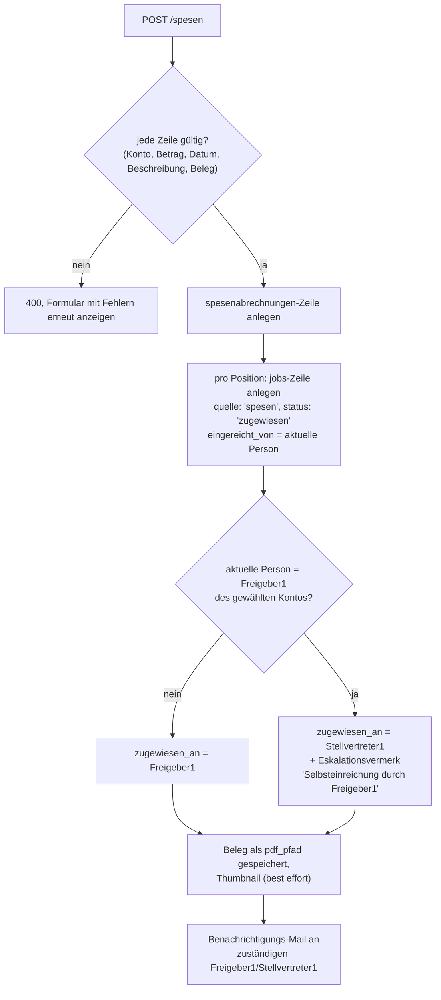

# Spesen-Einreichung

Eine zweite, eigenständige Domäne neben Lieferantenrechnungen: eine Person
erfasst selbst eine Auslage samt Beleg, wählt direkt ein Konto und die
Position durchläuft danach dieselbe Vier-Augen-Freigabekette
(Freigeber 1/2 des gewählten Kontos) wie eine Rechnung. Technisch ist jede
Spesen-Position ein ganz normaler `jobs`-Datensatz
(`quelle = 'spesen'`) — die bestehende Freigabe-Maschinerie
(Status-Automat, Eskalationslogik, Benachrichtigungen, Audit-Log,
Download-Signierung, n8n-Abholung) wird unverändert wiederverwendet. Neu
ist nur, was am Anfang passiert (Einreichung statt Kontierung durch
Dritte) und die eigene Freigabe-1-Review-Seite.

Ursprüngliche Design-Spec:
[2026-08-17-spesen-einreichung-design.md](superpowers/specs/2026-08-17-spesen-einreichung-design.md)
(als Quelle der Wahrheit inzwischen durch diese Seite und den Code
abgelöst).

## Unterschied zur Kontierung

| | Rechnung (Kontierung) | Spesen-Einreichung |
|---|---|---|
| Wer erfasst die Daten | eine Drittperson (Buchhaltung) | die Person selbst, die die Auslage hatte |
| Konto-Auswahl | eingeschränkt auf Konten mit eigener Freigeber-Rolle | **jedes aktive Konto** — jede Person kann auf jedes Konto einreichen |
| Freigabe 1 bei Einreichung | automatisch miterteilt (ausser Interessenskonflikt) | **nie** automatisch — immer eigene Prüfung durch eine andere Person |
| Selbst-Freigabe | durch Konto-Rollen strukturell ausgeschlossen | einreichende Person darf sich **nie** selbst freigeben, siehe unten |

## Datenmodell

Kein Parallelsystem: `quelle`-CHECK auf `jobs` ist um `'spesen'` erweitert
(neben `'scanner'`/`'lieferant'`), plus fünf nur bei Spesen befüllte
Spalten (`eingereicht_von`, `auslage_datum`, `beschreibung`,
`spesenabrechnung_id`, `rechnungsdatum`) und eine schlanke Gruppierungs-
Tabelle `spesenabrechnungen` für die Sammelabrechnung. Details:
[datenmodell.md](datenmodell.md#jobs) und
[datenmodell.md](datenmodell.md#spesenabrechnungen).

## 1. Einreichung (`/spesen/neu`, `src/routes/spesen.js`)

Formular mit mindestens einer, dynamisch hinzufügbaren Positionszeile
(gleiches Zeilen-Klonen/Entfernen-Muster wie die bestehende
Aufsplitten-Seite). Pro Zeile: Konto (jedes aktive, keine
Rollen-Einschränkung), Betrag, Auslage-Datum (nicht in der Zukunft),
Verwendungszweck, Beleg (PDF/PNG/JPEG, Pflicht, max. 20 MB, Magic-Byte-
geprüft — ein Bild-Upload wird wie beim
[Beleg-Anhängen bei Kontierung](rechnungs-workflow.md#2-kontierung-status-zugewiesen)
serverseitig in eine echte PDF-Seite umgewandelt).

Jede Position ist unabhängig — bei mehreren Positionen mit
unterschiedlichen Konten geht jede an ihren eigenen Freigeber 1. Eine
Sammelabrechnung ist immer rein Spesen (keine gemischten Einreichungen mit
Rechnungspositionen).

## 2. Freigabe 1 (`/spesen-freigabe1`, `src/routes/spesenFreigabe1.js`, review-only)

Da bei der Einreichung bereits alle Daten erfasst wurden, gibt es für die
prüfende Person nichts mehr einzutragen — strukturell näher an der
Freigabe-2-Seite (reine Anzeige + Freigeben/Ablehnen + Konfliktflag) als
an der Kontierungs-Seite. Autorisierung: Job muss `status = 'zugewiesen'`
und `quelle = 'spesen'` sein, `zugewiesen_an` muss der aktuellen Person
entsprechen (gleicher Admin-Eskalations-Sonderfall wie bei Rechnungen).

Zwei unterschiedliche Konfliktquellen, nicht zu verwechseln:

- **Einreicher = Freigeber1 des Kontos** — bereits bei der Einreichung
  automatisch aufgelöst (siehe oben); die prüfende Person muss hier nichts
  mehr tun.
- **Jeder andere persönliche Konflikt** der prüfenden Person (z. B.
  verwandtschaftlich/finanziell mit der einreichenden Person) — dafür
  bleibt der Konflikt-Radio-Button mit identischer Eskalationslogik wie
  bei der Kontierung (`eskalierenFreigabe1` → Stellvertreter1,
  `eskalierenFreigabe1AnAdmin` bei SYNC-8-Fall).

`freigeben` (kein Konflikt) ruft dieselben Repo-Funktionen wie die
Kontierung im Nicht-Konflikt-Fall (`createFreigabe` mit
`rolle: 'freigeber1'`, `abschliessenFreigabe1`) — Status wechselt zu
`freigabe2`, `zugewiesen_an` auf den effektiven Freigeber 2
(`getEffectiveFreigeber2Id`). `ablehnen` ruft dieselbe `ablehnenJob`-
Funktion wie bei der Kontierung.

## 3. Freigabe 2 — bestehende Seite wiederverwendet

`/freigabe2` (`src/routes/freigabe2.js`/`views/freigabe2.ejs`) läuft für
Spesen-Positionen unverändert — Autorisierung hängt nur an
`konto_id`/`status = 'freigabe2'`. Einzige Änderung: die angezeigten
Detail-Felder schalten per `job.quelle === 'spesen'` um
(Verwendungszweck/Auslage-Datum/Eingereicht-von statt
Lieferant/Rechnungsnummer/Zahlungsziel). Rechnungen und Spesen erscheinen
dadurch gemeinsam in "Meine Freigaben" auf `/pool`.

## Navigation

- **Menü** (`_header.ejs`): "Spesen einreichen" → `/spesen/neu`, sichtbar
  für jede eingeloggte Person (kein Rollen-/Rechte-Filter, gleiches Niveau
  wie `/kontierung`).
- **`/pool`-Dashboard**: Sektion "Meine offenen Spesen-Freigaben"
  (Positionen mit `status = 'zugewiesen'`, `quelle = 'spesen'`,
  `zugewiesen_an` = aktuelle Person, `linkPrefix: '/spesen-freigabe1'`).
  Die bestehenden Sektionen "Pool", "Meine offenen Kontierungen" und
  "Meine abgelehnten Jobs" schliessen `quelle = 'spesen'` explizit aus —
  sie sind für den Kontierungs-Workflow gebaut, den es bei Spesen nicht
  gibt. "Meine Freigaben" (Freigabe 2) bleibt bewusst typübergreifend.
- **`/meine-spesen`** (eigene Seite, `src/routes/meineSpesen.js`): alle
  eigenen Spesen-Positionen über alle Stati hinweg, reine
  Statusübersicht ohne Aktionslink (ursprünglich eine Sektion auf
  `/pool`, am 2026-08-31 auf eine eigene Seite verschoben, analog zu
  `/meine-abgeschlossenen`).

## n8n-Abholung und Überweisungsdaten

Spesen-Positionen erscheinen im selben `/api/n8n/jobs/abholbereit`-Payload
wie Rechnungen, mit zusätzlichen Feldern (`eingereicht_von`,
`auslage_datum`, `beschreibung`, `rechnungsdatum`, `iban`,
`kontoinhaber`) — siehe
[n8n-schnittstelle.md](n8n-schnittstelle.md#abholung-fertiger-rechnungen).

**IBAN/Kontoinhaber werden nicht im Portal gespeichert.** Für jede
`quelle = 'spesen'`-Position wird bei jedem Abholung-Abruf **live**
`fetchPersonById` gegen ChurchTools aufgerufen und das
IBAN-/Kontoinhaber-Custom-Feld (`CT_CUSTOM_FIELD_IBAN`/
`CT_CUSTOM_FIELD_KONTOINHABER`, `.env`-Variablen, kein Admin-UI dafür) aus
der Antwort gelesen — konsistent mit dem Grundsatz, sensible Finanzdaten
nicht länger als nötig im Portal zu halten. Schlägt der Abruf fehl, wird
die Position trotzdem geliefert, aber mit `iban: null`; n8n entscheidet
selbst, wie mit einer fehlenden IBAN umzugehen ist.

## Bewusst nicht gebaut (YAGNI)

- **Kein Spesen-Pool.** Das Konto wird direkt bei der Einreichung
  gewählt, es gibt keine unzugewiesene Phase.
- **Kein Wiederaufnahme-Workflow für abgelehnte Spesen.** Anders als bei
  Rechnungen (`/abgelehnt/:id/ueberarbeiten`) gibt es für Spesen keine
  Bearbeitungsseite — eine abgelehnte Position bleibt in "Meine Spesen"
  sichtbar (mit Ablehnungsgrund); für eine Korrektur reicht die Person
  neu ein.
- **Keine gemischten Sammelabrechnungen** aus Rechnungs- und
  Spesen-Positionen.
- **Kein IBAN-Caching** im Portal — immer Live-Abruf bei Abholung.
- **Kein Admin-UI** für den ChurchTools-Custom-Feld-Namen (`.env`-
  Variablen statt `admin_config`, installationsspezifische technische
  Konstante).
