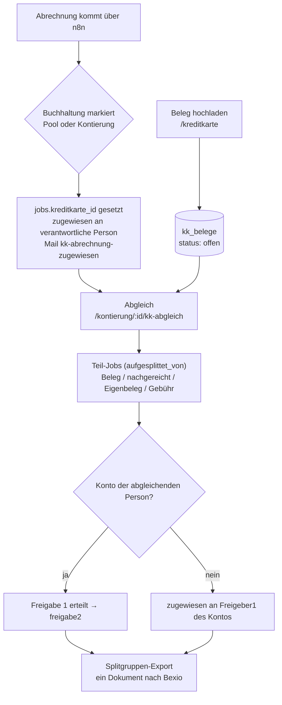

# Kreditkarten-Belege — Etappe 1 (Kern) Implementation Plan

> **For agentic workers:** REQUIRED SUB-SKILL: Use superpowers:subagent-driven-development (recommended) or superpowers:executing-plans to implement this plan task-by-task. Steps use checkbox (`- [ ]`) syntax for tracking.

**Goal:** Credit-card receipts can be uploaded ahead of time, a monthly statement can be marked as "Karte X" and handed to the card's responsible person, who reconciles it against the open receipts — producing split child jobs that run through the normal Freigabe 1/2 and the existing Splitgruppen export.

**Architecture:** New tables `kreditkarten`, `kreditkarte_erfasser`, `kk_belege`, `kk_beleg_ereignisse`; pre-uploaded receipts are *not* jobs. The Abgleich is an extended Aufsplitten: the existing Aufsplitten logic is first extracted from `src/routes/kontierung.js` into `src/services/aufsplitten.js` (behavior-preserving refactor, guarded by the existing tests), then reused by a new `src/routes/kkAbgleich.js`. Children carry `aufgesplittet_von = parent`, so `pruefeUndFinalisiereSplitGruppe` exports them unchanged as one document.

**Tech Stack:** Node.js ≥ 22.13 (ESM), Express 4, `node:sqlite` (synchronous), EJS + Bootstrap 5, multer (memory storage), pdf-lib, mupdf, `node:test` + supertest.

**Spec:** `docs/superpowers/specs/2026-09-27-kreditkarten-belege-design.md` (sections 1–5, 7, 8, 10, 11). Etappe 2 (section 6) has its own plan: `docs/superpowers/plans/2026-09-27-kreditkarten-belege-etappe2-erweiterungen.md`.

## Global Constraints

- Person IDs are `TEXT` (`personen.churchtools_person_id`) everywhere — never `INTEGER`.
- No new `jobs.status` value. Pre-uploaded receipts live only in `kk_belege`.
- Only the last 4 card digits are stored (`karte_endziffern`, CHECK exactly 4 digits or NULL).
- SQLite CHECK constraints can't be widened with `ALTER TABLE` — use the rebuild-in-a-transaction pattern (Task 1). New `jobs` columns go into both `schema.sql` and `JOBS_TABLE_MIGRATIONS`.
- Beleg upload rules identical to the rest of the app: PDF/PNG/JPEG, max 20 MB, magic-byte check via `detectBelegMimetype` (claimed `file.mimetype` must match), images converted to a PDF page via `buildBelegPdf`, thumbnail best effort via `renderFirstPageThumbnail`.
- Module switch `modul_kreditkarten_aktiv`, default `'0'`. Off ⇒ no new uploads, no new markings; existing markings can still be reconciled, open receipts can still be edited/discarded/viewed.
- New additive permission `kreditkarten_verwalten` (superadmin/manager get it implicitly via `personHasPermission`).
- Sum tolerance `0.005`. Amounts in the Abgleich may be negative (refund ⇒ child `typ = 'gutschrift'`); receipt amounts may be negative too.
- Stamp-page text must be WinAnsi-safe — validate user text that ends up on the stamp page with `POSITION_PATTERN` (exported from `src/services/aufsplitten.js` in Task 6).
- multipart POST routes: multer runs **before** `csrfProtection` (same as `kontierung.js`); every new POST route gets a `csrfSweep.test.js` entry (Task 11).
- German identifiers/UI strings, English code comments only where the surrounding file uses them — match the file you're in.
- Run the whole suite with `npm test`; a single file with `node --test test/path/file.test.js`.

## Koordination mit dem Audit-Behebungsplan (parallel in Arbeit)

As of 2026-09-27 the working tree contains uncommitted work from `docs/audit-behebungsplan-2026-09-27.md` (`src/db/securitySchema.js`, `src/services/auditContext.js`, changes to `src/db/index.js` and `src/middleware/permissions.js`). **Do not start Task 1 until that work is either committed or explicitly parked** — both touch the same migration chain. Once it has landed, adapt as follows:

- `person_berechtigungen`: `migrateSecuritySchema` rebuilds this table from its own hard-coded `RIGHTS` array and runs **after** `migrateKreditkartenChecks`. Add `'kreditkarten_verwalten'` to that `RIGHTS` array and change its rebuild marker from `'workflow_eingreifen'` to `'kreditkarten_verwalten'` (the newest value), and drop the `person_berechtigungen` entry from `migrateKreditkartenChecks` in Task 1 — otherwise the security migration rebuilds the table without the new value and any stored `kreditkarten_verwalten` row makes startup fail. The `schema.sql` CHECK must list all values (old + `sync_verwalten`, `workflow_eingreifen` + `kreditkarten_verwalten`).
- `permissions.js`: keep the new `sync_verwalten`/`workflow_eingreifen` entries; `kreditkarten_verwalten` is a normal manager-bundled permission (not in the manager exclusion list).
- Audit triggers: `migrateSecuritySchema` creates `audit_<table>_*` triggers whose JSON snapshot freezes the column list at creation time. Add `kreditkarten: 'id'`, `kreditkarte_erfasser: 'kreditkarte_id'` and `kk_belege: 'id'` to its `tables` map. The five new `jobs` columns will only appear in `jobs` audit snapshots once the `audit_jobs_*` triggers are dropped and recreated — coordinate with the owner of the audit work (a `DROP TRIGGER IF EXISTS audit_jobs_UPDATE …` before the loop is enough).
- The `freigaben` rebuild in Task 1 drops the `audit_freigaben_*` triggers with the old table; they are recreated in the same `openDatabase` call because `migrateSecuritySchema` runs afterwards. Add a Task-1 test asserting `SELECT COUNT(*) FROM sqlite_master WHERE type='trigger' AND name LIKE 'audit_freigaben_%'` is 3 after opening a pre-kreditkarten database.

## Review Focus

1. **Two browser tabs reconcile the same statement, or a receipt is discarded while the Abgleich page is open** — the second submit must fail with 409, create no child jobs, leave the parent `zugewiesen`, and delete the files it prepared. Test in Task 9.
2. **Module switched off while a statement is already marked** — the responsible person must still be able to open and submit the Abgleich and view receipt thumbnails. Test in Task 9 (and Task 5 for thumbnails).
3. **A foreign-Konto line lands with a Freigeber 1 who then opens it in the normal Kontierung** — the child must not carry `kreditkarte_id` (otherwise it would be redirected back to the Abgleich) and must show the Konto/Betrag/Beschreibung pre-filled. Test in Task 9.
4. **A single-line Abgleich (statement = exactly one purchase)** — must be accepted (min. 1 line, unlike Aufsplitten's 2) and still export via the Splitgruppen path. Test in Task 9.
5. **Refactor regression** — every existing Aufsplitten behavior (pool children with Hinweis-Konto, Konflikt escalation, 409 race, beleg_seitenzahl, IBAN check) stays byte-for-byte the same. Guarded by the existing `test/integration/kontierung.test.js` and `splitgruppen-e2e.test.js` in Task 6.

---

### Task 1: Datenbank-Schema und Migrationen

**Files:**
- Modify: `src/db/schema.sql`
- Modify: `src/db/index.js`
- Test: `test/unit/db.test.js`

**Interfaces:**
- Produces tables `kreditkarten`, `kreditkarte_erfasser`, `kk_belege`, `kk_beleg_ereignisse`; `jobs` columns `kreditkarte_id`, `kk_eigenbeleg_grund`, `kk_markiert_am`, `kk_erinnert_am`, `kk_text_betraege`.
- CHECK widenings (all done now so Etappe 2 needs no further migration):
  - `freigaben.rolle` += `'kk_abrechnung_markiert'`, `'kk_markierung_aufgehoben'`, `'kk_abgleich'`
  - `person_berechtigungen.berechtigung` += `'kreditkarten_verwalten'`
  - `mail_log.typ` += `'kk-abrechnung-zugewiesen'`, `'kk-beleg-erinnerung'`, `'kk-beleg-eingegangen'`
  - `cron_log.job` += `'kk-beleg-erinnerungen'`

- [ ] **Step 1: Write the failing tests**

Append to `test/unit/db.test.js`:

```js
test('fresh database has the kreditkarten tables and the new jobs columns', () => {
  const db = openDatabase(':memory:');
  const tabellen = new Set(db.prepare("SELECT name FROM sqlite_master WHERE type = 'table'").all().map((r) => r.name));
  for (const name of ['kreditkarten', 'kreditkarte_erfasser', 'kk_belege', 'kk_beleg_ereignisse']) {
    assert.ok(tabellen.has(name), `${name} fehlt`);
  }
  const jobCols = new Set(db.prepare('PRAGMA table_info(jobs)').all().map((c) => c.name));
  for (const col of ['kreditkarte_id', 'kk_eigenbeleg_grund', 'kk_markiert_am', 'kk_erinnert_am', 'kk_text_betraege']) {
    assert.ok(jobCols.has(col), `jobs.${col} fehlt`);
  }
  db.close();
});

test('kreditkarten.karte_endziffern only accepts exactly four digits or NULL', () => {
  const db = openDatabase(':memory:');
  db.prepare("INSERT INTO personen (churchtools_person_id, vorname, nachname, email) VALUES ('1', 'A', 'B', 'a@example.org')").run();
  const insert = db.prepare("INSERT INTO kreditkarten (bezeichnung, karte_endziffern, verantwortlich_id, erstellt_am) VALUES ('Visa', ?, '1', '2026-09-27T00:00:00.000Z')");
  insert.run('1234');
  insert.run(null);
  assert.throws(() => insert.run('123'));
  assert.throws(() => insert.run('12a4'));
  assert.throws(() => insert.run('12345'));
  db.close();
});

test('kk_belege.status only accepts entwurf/offen/zugeordnet/verworfen', () => {
  const db = openDatabase(':memory:');
  db.prepare("INSERT INTO personen (churchtools_person_id, vorname, nachname, email) VALUES ('1', 'A', 'B', 'a@example.org')").run();
  const insert = db.prepare(
    "INSERT INTO kk_belege (hochgeladen_von, gekauft_von, hochgeladen_am, quelle, pdf_pfad, status) VALUES ('1', '1', '2026-09-27T00:00:00.000Z', 'web', '/tmp/x.pdf', ?)"
  );
  for (const status of ['entwurf', 'offen', 'zugeordnet', 'verworfen']) insert.run(status);
  assert.throws(() => insert.run('geloescht'));
  db.close();
});

test('the widened CHECKs accept the new kreditkarten values on a fresh database', () => {
  const db = openDatabase(':memory:');
  db.prepare("INSERT INTO personen (churchtools_person_id, vorname, nachname, email) VALUES ('1', 'A', 'B', 'a@example.org')").run();
  db.prepare("INSERT INTO jobs (eingang_am, quelle, dateiname, pdf_pfad) VALUES ('2026-09-27', 'scanner', 'a.pdf', '/tmp/a.pdf')").run();
  for (const rolle of ['kk_abrechnung_markiert', 'kk_markierung_aufgehoben', 'kk_abgleich']) {
    db.prepare("INSERT INTO freigaben (job_id, person_id, rolle, zeitpunkt, ip) VALUES (1, '1', ?, '2026-09-27', '::1')").run(rolle);
  }
  db.prepare("INSERT INTO person_berechtigungen (person_id, berechtigung) VALUES ('1', 'kreditkarten_verwalten')").run();
  for (const typ of ['kk-abrechnung-zugewiesen', 'kk-beleg-erinnerung', 'kk-beleg-eingegangen']) {
    db.prepare("INSERT INTO mail_log (typ, empfaenger, betreff, text, status, versucht_am) VALUES (?, 'a@example.org', 'b', 't', 'versendet', '2026-09-27')").run(typ);
  }
  db.prepare("INSERT INTO cron_log (job, gestartet_am, status) VALUES ('kk-beleg-erinnerungen', '2026-09-27', 'erfolg')").run();
  db.close();
});

test('openDatabase widens freigaben/person_berechtigungen/mail_log/cron_log on an existing on-disk database and keeps rows and freigaben.vertretung_fuer', () => {
  const dir = mkdtempSync(join(tmpdir(), 'db-kk-migration-test-'));
  const dbPath = join(dir, 'portal.db');
  try {
    // First open builds the current (pre-kreditkarten) schema, then we narrow the four tables
    // back to their pre-kreditkarten CHECKs by hand to simulate an already-deployed database.
    const alt = openDatabase(dbPath);
    alt.prepare("INSERT INTO personen (churchtools_person_id, vorname, nachname, email) VALUES ('1', 'A', 'B', 'a@example.org')").run();
    alt.prepare("INSERT INTO jobs (eingang_am, quelle, dateiname, pdf_pfad) VALUES ('2026-09-27', 'scanner', 'a.pdf', '/tmp/a.pdf')").run();
    alt.exec('PRAGMA foreign_keys = OFF');
    alt.exec('DROP TABLE freigaben');
    alt.exec(`CREATE TABLE freigaben (
      id INTEGER PRIMARY KEY AUTOINCREMENT, job_id INTEGER NOT NULL REFERENCES jobs(id),
      person_id TEXT NOT NULL REFERENCES personen(churchtools_person_id),
      rolle TEXT NOT NULL CHECK (rolle IN ('freigeber1', 'freigeber2', 'ablehnung', 'freigabe1_eskalation', 'freigabe2_eskalation', 'iban_abweichung', 'rechnungsnummer_duplikat', 'pool_zuweisung', 'pool_ruecksendung', 'freigabe1_weiterleitung')),
      zeitpunkt TEXT NOT NULL, ip TEXT NOT NULL, interessenskonflikt INTEGER NOT NULL DEFAULT 0, kommentar TEXT,
      eskaliert_von TEXT REFERENCES personen(churchtools_person_id), vertretung_fuer TEXT REFERENCES personen(churchtools_person_id))`);
    alt.prepare("INSERT INTO freigaben (job_id, person_id, rolle, zeitpunkt, ip, vertretung_fuer) VALUES (1, '1', 'freigeber1', '2026-09-27', '::1', '1')").run();
    alt.exec('DROP TABLE person_berechtigungen');
    alt.exec(`CREATE TABLE person_berechtigungen (
      person_id TEXT NOT NULL REFERENCES personen(churchtools_person_id),
      berechtigung TEXT NOT NULL CHECK (berechtigung IN ('konten_verwalten', 'debitoren_verwalten', 'geplante_jobs_verwalten', 'abgelehnt_verwalten', 'mails_einsehen', 'sync_einsehen', 'audit_log_einsehen', 'pool_zuweisen')),
      PRIMARY KEY (person_id, berechtigung))`);
    alt.prepare("INSERT INTO person_berechtigungen VALUES ('1', 'pool_zuweisen')").run();
    alt.close();

    const db = openDatabase(dbPath);
    const f = db.prepare('SELECT * FROM freigaben').all();
    assert.equal(f.length, 1);
    assert.equal(f[0].vertretung_fuer, '1');
    db.prepare("INSERT INTO freigaben (job_id, person_id, rolle, zeitpunkt, ip) VALUES (1, '1', 'kk_abgleich', '2026-09-27', '::1')").run();
    assert.equal(db.prepare('SELECT COUNT(*) AS n FROM person_berechtigungen').get().n, 1);
    db.prepare("INSERT INTO person_berechtigungen VALUES ('1', 'kreditkarten_verwalten')").run();
    db.close();
  } finally {
    rmSync(dir, { recursive: true, force: true });
  }
});
```

- [ ] **Step 2: Run tests to verify they fail**

Run: `node --test test/unit/db.test.js`
Expected: the five new tests FAIL (`kreditkarten fehlt`, CHECK constraint failures).

- [ ] **Step 3: Extend `schema.sql`**

In `src/db/schema.sql`:

1. In `person_berechtigungen`, extend the CHECK list with `'kreditkarten_verwalten'` and update the comment "Nur die acht vergebbaren Rechte" → "Nur die neun vergebbaren Rechte".
2. In `cron_log`, append `'kk-beleg-erinnerungen'` to the `job IN (...)` list.
3. In `jobs`, after `freigabe2_eskalation_gesendet_at TEXT`, add:

```sql
  freigabe2_eskalation_gesendet_at TEXT,
  kreditkarte_id INTEGER REFERENCES kreditkarten(id),
  kk_eigenbeleg_grund TEXT,
  kk_markiert_am TEXT,
  kk_erinnert_am TEXT,
  kk_text_betraege TEXT
);
```

4. In `freigaben`, append `'kk_abrechnung_markiert', 'kk_markierung_aufgehoben', 'kk_abgleich'` to the `rolle IN (...)` list.
5. In `mail_log`, append `'kk-abrechnung-zugewiesen', 'kk-beleg-erinnerung', 'kk-beleg-eingegangen'` to the `typ IN (...)` list.
6. At the end of the file, add:

```sql
-- Kreditkarten für die Vorab-Erfassung von Belegen (siehe docs/kreditkarten-belege.md).
-- Nur die letzten vier Ziffern werden gespeichert -- nie eine vollständige Kartennummer.
CREATE TABLE IF NOT EXISTS kreditkarten (
  id INTEGER PRIMARY KEY AUTOINCREMENT,
  bezeichnung TEXT NOT NULL,
  karte_endziffern TEXT CHECK (karte_endziffern IS NULL OR (length(karte_endziffern) = 4 AND karte_endziffern NOT GLOB '*[^0-9]*')),
  karteninhaber_name TEXT,
  verantwortlich_id TEXT NOT NULL REFERENCES personen(churchtools_person_id),
  erfassung_offen INTEGER NOT NULL DEFAULT 1,
  absender_muster TEXT,
  aktiv INTEGER NOT NULL DEFAULT 1,
  erstellt_am TEXT NOT NULL
);

-- Nur ausgewertet, wenn kreditkarten.erfassung_offen = 0.
CREATE TABLE IF NOT EXISTS kreditkarte_erfasser (
  kreditkarte_id INTEGER NOT NULL REFERENCES kreditkarten(id),
  person_id TEXT NOT NULL REFERENCES personen(churchtools_person_id),
  PRIMARY KEY (kreditkarte_id, person_id)
);

-- Vorab hochgeladene Belege. Bewusst KEINE jobs-Zeilen: sie tauchen erst nach dem Abgleich als
-- Teil-Job (zugeordnet_job_id) im Freigabe-Workflow auf. betrag/kaufdatum/beschreibung/
-- kreditkarte_id dürfen nur im Status 'entwurf' (Mail-Eingang, Etappe 2) NULL sein -- das prüft
-- die Anwendung, nicht die DB. pdf_pfad ist nur nach der Fristlöschung verworfener Belege NULL.
CREATE TABLE IF NOT EXISTS kk_belege (
  id INTEGER PRIMARY KEY AUTOINCREMENT,
  kreditkarte_id INTEGER REFERENCES kreditkarten(id),
  hochgeladen_von TEXT NOT NULL REFERENCES personen(churchtools_person_id),
  gekauft_von TEXT NOT NULL REFERENCES personen(churchtools_person_id),
  hochgeladen_am TEXT NOT NULL,
  quelle TEXT NOT NULL CHECK (quelle IN ('web', 'mail', 'abgleich')),
  pdf_pfad TEXT,
  thumbnail_pfad TEXT,
  betrag TEXT,
  waehrung TEXT NOT NULL DEFAULT 'CHF',
  kaufdatum TEXT,
  beschreibung TEXT,
  konto_id INTEGER REFERENCES konten(id),
  status TEXT NOT NULL CHECK (status IN ('entwurf', 'offen', 'zugeordnet', 'verworfen')),
  zugeordnet_job_id INTEGER REFERENCES jobs(id),
  zugeordnet_am TEXT,
  verworfen_grund TEXT,
  verworfen_von TEXT REFERENCES personen(churchtools_person_id),
  verworfen_am TEXT,
  letzte_erinnerung_am TEXT,
  datei_geloescht_am TEXT
);

CREATE INDEX IF NOT EXISTS idx_kk_belege_karte_status ON kk_belege(kreditkarte_id, status);

-- Audit-Trail für Belege, die (noch) keine jobs-Zeile haben und deshalb nicht in freigaben
-- protokolliert werden können. person_id NULL = System (Mail-Eingang, Fristlöschung).
CREATE TABLE IF NOT EXISTS kk_beleg_ereignisse (
  id INTEGER PRIMARY KEY AUTOINCREMENT,
  beleg_id INTEGER NOT NULL REFERENCES kk_belege(id),
  person_id TEXT REFERENCES personen(churchtools_person_id),
  aktion TEXT NOT NULL CHECK (aktion IN ('kk_beleg_erfasst', 'kk_beleg_ergaenzt', 'kk_beleg_geaendert', 'kk_beleg_verworfen', 'kk_beleg_zugeordnet', 'kk_beleg_datei_geloescht')),
  zeitpunkt TEXT NOT NULL,
  kommentar TEXT
);
```

- [ ] **Step 4: Add the migrations in `src/db/index.js`**

Append to `JOBS_TABLE_MIGRATIONS`:

```js
  { column: 'kreditkarte_id', ddl: 'ALTER TABLE jobs ADD COLUMN kreditkarte_id INTEGER REFERENCES kreditkarten(id)' },
  { column: 'kk_eigenbeleg_grund', ddl: 'ALTER TABLE jobs ADD COLUMN kk_eigenbeleg_grund TEXT' },
  { column: 'kk_markiert_am', ddl: 'ALTER TABLE jobs ADD COLUMN kk_markiert_am TEXT' },
  { column: 'kk_erinnert_am', ddl: 'ALTER TABLE jobs ADD COLUMN kk_erinnert_am TEXT' },
  { column: 'kk_text_betraege', ddl: 'ALTER TABLE jobs ADD COLUMN kk_text_betraege TEXT' },
```

Above `export function openDatabase`, add one shared helper plus the four widenings:

```js
// Gemeinsamer Helfer für die Kreditkarten-CHECK-Erweiterungen unten -- gleiches Rebuild-Muster wie
// migrateFreigabenTable & Co. oben (rename aside, create fresh, copy, drop, alles in einer
// Transaktion, FK-Enforcement währenddessen aus). `marker` ist der neueste erlaubte Wert: steht er
// schon im CREATE-Statement der Tabelle, ist nichts zu tun.
function erweitereCheckPerRebuild(db, { tabelle, marker, createSql, spalten }) {
  const tableSql = db.prepare("SELECT sql FROM sqlite_master WHERE type = 'table' AND name = ?").get(tabelle);
  if (!tableSql || tableSql.sql.includes(marker)) return;
  const altName = `${tabelle}_pre_${marker.replace(/[^a-z0-9]/gi, '_')}`;
  db.exec('PRAGMA foreign_keys = OFF');
  db.exec('BEGIN');
  try {
    db.exec(`ALTER TABLE ${tabelle} RENAME TO ${altName}`);
    db.exec(createSql);
    const liste = spalten.join(', ');
    db.exec(`INSERT INTO ${tabelle} (${liste}) SELECT ${liste} FROM ${altName}`);
    db.exec(`DROP TABLE ${altName}`);
    db.exec('COMMIT');
  } catch (err) {
    db.exec('ROLLBACK');
    throw err;
  } finally {
    db.exec('PRAGMA foreign_keys = ON');
  }
}

// Muss NACH migrateFreigabenTableVertretung laufen: die neu erstellte Tabelle enthält
// vertretung_fuer bereits, und die Kopie übernimmt die Spalte.
function migrateKreditkartenChecks(db) {
  erweitereCheckPerRebuild(db, {
    tabelle: 'freigaben',
    marker: 'kk_markierung_aufgehoben',
    createSql: `CREATE TABLE freigaben (
      id INTEGER PRIMARY KEY AUTOINCREMENT,
      job_id INTEGER NOT NULL REFERENCES jobs(id),
      person_id TEXT NOT NULL REFERENCES personen(churchtools_person_id),
      rolle TEXT NOT NULL CHECK (rolle IN ('freigeber1', 'freigeber2', 'ablehnung', 'freigabe1_eskalation', 'freigabe2_eskalation', 'iban_abweichung', 'rechnungsnummer_duplikat', 'pool_zuweisung', 'pool_ruecksendung', 'freigabe1_weiterleitung', 'kk_abrechnung_markiert', 'kk_markierung_aufgehoben', 'kk_abgleich')),
      zeitpunkt TEXT NOT NULL,
      ip TEXT NOT NULL,
      interessenskonflikt INTEGER NOT NULL DEFAULT 0,
      kommentar TEXT,
      eskaliert_von TEXT REFERENCES personen(churchtools_person_id),
      vertretung_fuer TEXT REFERENCES personen(churchtools_person_id)
    )`,
    spalten: ['id', 'job_id', 'person_id', 'rolle', 'zeitpunkt', 'ip', 'interessenskonflikt', 'kommentar', 'eskaliert_von', 'vertretung_fuer'],
  });
  erweitereCheckPerRebuild(db, {
    tabelle: 'person_berechtigungen',
    marker: 'kreditkarten_verwalten',
    createSql: `CREATE TABLE person_berechtigungen (
      person_id TEXT NOT NULL REFERENCES personen(churchtools_person_id),
      berechtigung TEXT NOT NULL CHECK (berechtigung IN (
        'konten_verwalten', 'debitoren_verwalten', 'geplante_jobs_verwalten',
        'abgelehnt_verwalten', 'mails_einsehen', 'sync_einsehen', 'audit_log_einsehen', 'pool_zuweisen',
        'kreditkarten_verwalten'
      )),
      PRIMARY KEY (person_id, berechtigung)
    )`,
    spalten: ['person_id', 'berechtigung'],
  });
  erweitereCheckPerRebuild(db, {
    tabelle: 'mail_log',
    marker: 'kk-beleg-eingegangen',
    createSql: `CREATE TABLE mail_log (
      id INTEGER PRIMARY KEY AUTOINCREMENT,
      typ TEXT NOT NULL CHECK (typ IN ('zuweisung', 'reminder', 'eskalation', 'ablehnung', 'sync-fehler', 'iban-warnung', 'rechnungsnummer-warnung', 'freigabe2-reminder', 'freigabe2-eskalation', 'kk-abrechnung-zugewiesen', 'kk-beleg-erinnerung', 'kk-beleg-eingegangen')),
      job_id INTEGER REFERENCES jobs(id),
      empfaenger TEXT NOT NULL,
      betreff TEXT NOT NULL,
      text TEXT NOT NULL,
      status TEXT NOT NULL CHECK (status IN ('versendet', 'fehlgeschlagen', 'geplant')),
      fehler_details TEXT,
      versucht_am TEXT NOT NULL
    )`,
    spalten: ['id', 'typ', 'job_id', 'empfaenger', 'betreff', 'text', 'status', 'fehler_details', 'versucht_am'],
  });
  erweitereCheckPerRebuild(db, {
    tabelle: 'cron_log',
    marker: 'kk-beleg-erinnerungen',
    createSql: `CREATE TABLE cron_log (
      id INTEGER PRIMARY KEY AUTOINCREMENT,
      job TEXT NOT NULL CHECK(job IN ('pool-erinnerungen', 'pdf-bereinigung', 'zeitstempel-nachholen', 'datenbank-sicherung', 'split-gruppen-nachholen', 'mail-digest', 'freigabe2-erinnerungen', 'kk-beleg-erinnerungen')),
      gestartet_am TEXT NOT NULL,
      beendet_am TEXT,
      status TEXT NOT NULL CHECK(status IN ('erfolg', 'fehler', 'laufend')),
      details TEXT
    )`,
    spalten: ['id', 'job', 'gestartet_am', 'beendet_am', 'status', 'details'],
  });
}
```

In `openDatabase`, append after `migrateFreigabenTableVertretung(db);`:

```js
  migrateKreditkartenChecks(db);
```

- [ ] **Step 5: Run tests to verify they pass**

Run: `node --test test/unit/db.test.js`
Expected: all PASS (including every pre-existing migration test).

- [ ] **Step 6: Run the full suite**

Run: `npm test`
Expected: PASS. (Some existing tests assert the exact `person_berechtigungen` CHECK list or count "acht" permissions — if one fails, update its expectation to include `kreditkarten_verwalten`; do not change the migration.)

- [ ] **Step 7: Commit**

```bash
git add src/db/schema.sql src/db/index.js test/unit/db.test.js
git commit -m "feat(kreditkarten): add schema and CHECK migrations for credit card receipts"
```

---

### Task 2: Repositories

**Files:**
- Create: `src/db/kreditkartenRepo.js`
- Create: `src/db/kkBelegeRepo.js`
- Modify: `src/db/jobsRepo.js` (`createSplitJob`, new functions at the end)
- Test: `test/unit/kreditkartenRepo.test.js`, `test/unit/kkBelegeRepo.test.js`, `test/unit/jobsRepo.test.js`

**Interfaces:**
- Produces (`kreditkartenRepo.js`):
  - `createKreditkarte(db, { bezeichnung, karteEndziffern, karteninhaberName, verantwortlichId, erfassungOffen, absenderMuster }) → number`
  - `updateKreditkarte(db, id, { same fields })`
  - `setKreditkarteAktiv(db, id, aktiv: boolean)`
  - `getKreditkarteById(db, id) → row|null`
  - `listKreditkarten(db, { includeInactive = false } = {}) → row[]` (ordered by bezeichnung)
  - `listErfasserIds(db, kreditkarteId) → string[]`
  - `setErfasser(db, kreditkarteId, personIds: string[])`
- Produces (`kkBelegeRepo.js`):
  - `createKkBeleg(db, { kreditkarteId, hochgeladenVon, gekauftVon, quelle, pdfPfad, thumbnailPfad, betrag, waehrung, kaufdatum, beschreibung, kontoId, status }) → number`
  - `getKkBelegById(db, id) → row|null`
  - `updateKkBelegDaten(db, id, { kreditkarteId, betrag, kaufdatum, beschreibung, kontoId, gekauftVon }) → boolean` (only while `offen`/`entwurf`)
  - `ersetzeKkBelegDatei(db, id, { pdfPfad, thumbnailPfad }) → boolean` (only while `offen`/`entwurf`)
  - `verwerfeKkBeleg(db, id, { personId, grund }) → boolean` (only while `offen`/`entwurf`)
  - `ordneKkBelegZu(db, id, { kreditkarteId, jobId }) → boolean` (only while `offen` and on that card)
  - `listOffeneKkBelegeFuerKarte(db, kreditkarteId) → row[]` (by kaufdatum, id)
  - `listKkBelegeFuerPerson(db, personId) → row[]` (hochgeladen_von or gekauft_von, newest first)
  - `listOffeneKkBelegeFuerVerantwortlich(db, personId) → row[]` (joined card `bezeichnung AS karte_bezeichnung`)
  - `getKkBelegByJobId(db, jobId) → row|null`
  - `logKkBelegEreignis(db, { belegId, personId, aktion, kommentar })`
- Produces (`jobsRepo.js`):
  - `createSplitJob(db, parentJob, { …existing…, typ, beschreibung, kkEigenbelegGrund })` — new optional fields
  - `markiereJobAlsKkAbrechnung(db, jobId, { kreditkarteId, verantwortlichId, ausStatus }) → boolean` (`ausStatus` = `'unzugewiesen'` or `'zugewiesen'`)
  - `hebeKkMarkierungAuf(db, jobId) → boolean`
  - `setKkAbrechnungKopfdaten(db, jobId, { debitorId, lieferant, rechnungsnummer, zahlungsziel })`
  - `hatZugewieseneKkAbrechnungFuer(db, kreditkarteId, personId) → boolean`

- [ ] **Step 1: Write the failing tests**

Create `test/unit/kreditkartenRepo.test.js`:

```js
import { test } from 'node:test';
import assert from 'node:assert/strict';
import { openDatabase } from '../../src/db/index.js';
import { upsertPerson } from '../../src/db/personenRepo.js';
import {
  createKreditkarte, updateKreditkarte, setKreditkarteAktiv, getKreditkarteById,
  listKreditkarten, listErfasserIds, setErfasser,
} from '../../src/db/kreditkartenRepo.js';

function setup() {
  const db = openDatabase(':memory:');
  for (const id of ['1', '2', '3']) upsertPerson(db, { id, vorname: `P${id}`, nachname: 'M', email: `p${id}@example.org`, gruppen: [] });
  return db;
}

test('createKreditkarte stores all fields and getKreditkarteById returns them', () => {
  const db = setup();
  const id = createKreditkarte(db, { bezeichnung: 'Visa Jugend', karteEndziffern: '4242', karteninhaberName: 'Anna M', verantwortlichId: '1', erfassungOffen: true, absenderMuster: null });
  const karte = getKreditkarteById(db, id);
  assert.equal(karte.bezeichnung, 'Visa Jugend');
  assert.equal(karte.karte_endziffern, '4242');
  assert.equal(karte.verantwortlich_id, '1');
  assert.equal(karte.erfassung_offen, 1);
  assert.equal(karte.aktiv, 1);
  db.close();
});

test('listKreditkarten hides inactive cards unless includeInactive', () => {
  const db = setup();
  const a = createKreditkarte(db, { bezeichnung: 'A', verantwortlichId: '1', erfassungOffen: true });
  createKreditkarte(db, { bezeichnung: 'B', verantwortlichId: '1', erfassungOffen: true });
  setKreditkarteAktiv(db, a, false);
  assert.deepEqual(listKreditkarten(db).map((k) => k.bezeichnung), ['B']);
  assert.deepEqual(listKreditkarten(db, { includeInactive: true }).map((k) => k.bezeichnung), ['A', 'B']);
  db.close();
});

test('updateKreditkarte changes fields, setErfasser replaces the list', () => {
  const db = setup();
  const id = createKreditkarte(db, { bezeichnung: 'A', verantwortlichId: '1', erfassungOffen: true });
  updateKreditkarte(db, id, { bezeichnung: 'A2', karteEndziffern: null, karteninhaberName: null, verantwortlichId: '2', erfassungOffen: false, absenderMuster: null });
  assert.equal(getKreditkarteById(db, id).verantwortlich_id, '2');
  assert.equal(getKreditkarteById(db, id).erfassung_offen, 0);
  setErfasser(db, id, ['1', '3']);
  assert.deepEqual(listErfasserIds(db, id).sort(), ['1', '3']);
  setErfasser(db, id, ['2']);
  assert.deepEqual(listErfasserIds(db, id), ['2']);
  db.close();
});
```

Create `test/unit/kkBelegeRepo.test.js`:

```js
import { test } from 'node:test';
import assert from 'node:assert/strict';
import { openDatabase } from '../../src/db/index.js';
import { upsertPerson } from '../../src/db/personenRepo.js';
import { createKreditkarte } from '../../src/db/kreditkartenRepo.js';
import {
  createKkBeleg, getKkBelegById, updateKkBelegDaten, verwerfeKkBeleg, ordneKkBelegZu,
  listOffeneKkBelegeFuerKarte, listKkBelegeFuerPerson, listOffeneKkBelegeFuerVerantwortlich,
  getKkBelegByJobId, logKkBelegEreignis, ersetzeKkBelegDatei,
} from '../../src/db/kkBelegeRepo.js';

function setup() {
  const db = openDatabase(':memory:');
  for (const id of ['1', '2', '3']) upsertPerson(db, { id, vorname: `P${id}`, nachname: 'M', email: `p${id}@example.org`, gruppen: [] });
  const karteId = createKreditkarte(db, { bezeichnung: 'Visa', verantwortlichId: '1', erfassungOffen: true });
  db.prepare("INSERT INTO jobs (eingang_am, quelle, dateiname, pdf_pfad) VALUES ('2026-09-27', 'scanner', 'a.pdf', '/tmp/a.pdf')").run();
  return { db, karteId };
}

function neuerBeleg(db, karteId, overrides = {}) {
  return createKkBeleg(db, {
    kreditkarteId: karteId, hochgeladenVon: '2', gekauftVon: '2', quelle: 'web', pdfPfad: '/tmp/b.pdf', thumbnailPfad: null,
    betrag: '12.50', waehrung: 'CHF', kaufdatum: '2026-09-01', beschreibung: 'Zugticket', kontoId: null, status: 'offen', ...overrides,
  });
}

test('createKkBeleg + getKkBelegById roundtrip', () => {
  const { db, karteId } = setup();
  const id = neuerBeleg(db, karteId);
  const b = getKkBelegById(db, id);
  assert.equal(b.status, 'offen');
  assert.equal(b.betrag, '12.50');
  assert.equal(b.gekauft_von, '2');
  assert.ok(b.hochgeladen_am);
  db.close();
});

test('updateKkBelegDaten and ersetzeKkBelegDatei only work while offen or entwurf', () => {
  const { db, karteId } = setup();
  const id = neuerBeleg(db, karteId);
  assert.equal(updateKkBelegDaten(db, id, { kreditkarteId: karteId, betrag: '13.00', kaufdatum: '2026-09-02', beschreibung: 'X', kontoId: null, gekauftVon: '3' }), true);
  assert.equal(getKkBelegById(db, id).gekauft_von, '3');
  assert.equal(ersetzeKkBelegDatei(db, id, { pdfPfad: '/tmp/neu.pdf', thumbnailPfad: null }), true);
  verwerfeKkBeleg(db, id, { personId: '2', grund: 'doppelt' });
  assert.equal(updateKkBelegDaten(db, id, { kreditkarteId: karteId, betrag: '1.00', kaufdatum: '2026-09-02', beschreibung: 'Y', kontoId: null, gekauftVon: '2' }), false);
  assert.equal(ersetzeKkBelegDatei(db, id, { pdfPfad: '/tmp/x.pdf', thumbnailPfad: null }), false);
  db.close();
});

test('verwerfeKkBeleg sets grund/von/am and refuses a second time', () => {
  const { db, karteId } = setup();
  const id = neuerBeleg(db, karteId);
  assert.equal(verwerfeKkBeleg(db, id, { personId: '2', grund: 'privat' }), true);
  const b = getKkBelegById(db, id);
  assert.equal(b.status, 'verworfen');
  assert.equal(b.verworfen_grund, 'privat');
  assert.equal(b.verworfen_von, '2');
  assert.equal(verwerfeKkBeleg(db, id, { personId: '2', grund: 'nochmal' }), false);
  db.close();
});

test('ordneKkBelegZu only succeeds once, and only for an offen Beleg of that card', () => {
  const { db, karteId } = setup();
  const andereKarte = createKreditkarte(db, { bezeichnung: 'Master', verantwortlichId: '1', erfassungOffen: true });
  const id = neuerBeleg(db, karteId);
  assert.equal(ordneKkBelegZu(db, id, { kreditkarteId: andereKarte, jobId: 1 }), false);
  assert.equal(ordneKkBelegZu(db, id, { kreditkarteId: karteId, jobId: 1 }), true);
  assert.equal(ordneKkBelegZu(db, id, { kreditkarteId: karteId, jobId: 1 }), false);
  assert.equal(getKkBelegByJobId(db, 1).id, id);
  db.close();
});

test('list functions filter by status, person and responsible person', () => {
  const { db, karteId } = setup();
  const a = neuerBeleg(db, karteId, { kaufdatum: '2026-09-05' });
  const b = neuerBeleg(db, karteId, { kaufdatum: '2026-09-01', hochgeladenVon: '3', gekauftVon: '2' });
  const c = neuerBeleg(db, karteId);
  verwerfeKkBeleg(db, c, { personId: '2', grund: 'x' });
  assert.deepEqual(listOffeneKkBelegeFuerKarte(db, karteId).map((r) => r.id), [b, a]);
  assert.deepEqual(listKkBelegeFuerPerson(db, '3').map((r) => r.id), [b]);
  assert.equal(listKkBelegeFuerPerson(db, '2').length, 3);
  const fuerVerantwortlich = listOffeneKkBelegeFuerVerantwortlich(db, '1');
  assert.deepEqual(fuerVerantwortlich.map((r) => r.id).sort(), [a, b].sort());
  assert.equal(fuerVerantwortlich[0].karte_bezeichnung, 'Visa');
  db.close();
});

test('logKkBelegEreignis writes an event row, person_id may be NULL for the system', () => {
  const { db, karteId } = setup();
  const id = neuerBeleg(db, karteId);
  logKkBelegEreignis(db, { belegId: id, personId: '2', aktion: 'kk_beleg_erfasst', kommentar: null });
  logKkBelegEreignis(db, { belegId: id, personId: null, aktion: 'kk_beleg_datei_geloescht', kommentar: 'Frist' });
  assert.equal(db.prepare('SELECT COUNT(*) AS n FROM kk_beleg_ereignisse WHERE beleg_id = ?').get(id).n, 2);
  db.close();
});
```

Append to `test/unit/jobsRepo.test.js` (reuse the file's existing imports; add `markiereJobAlsKkAbrechnung, hebeKkMarkierungAuf, setKkAbrechnungKopfdaten, hatZugewieseneKkAbrechnungFuer, createSplitJob` to its `jobsRepo.js` import and `createKreditkarte` from `../../src/db/kreditkartenRepo.js`):

```js
test('markiereJobAlsKkAbrechnung assigns to the responsible person, from pool or from zugewiesen, and clears the Rückläufer marker', () => {
  const db = openDatabase(':memory:');
  for (const id of ['1', '2']) upsertPerson(db, { id, vorname: 'A', nachname: 'B', email: `${id}@example.org`, gruppen: [] });
  const karteId = createKreditkarte(db, { bezeichnung: 'Visa', verantwortlichId: '2', erfassungOffen: true });
  const poolJob = createJob(db, { eingangAm: '2026-09-27T00:00:00.000Z', quelle: 'scanner', absender: null, dateiname: 'a.pdf', pdfPfad: '/tmp/a.pdf' });
  db.prepare("UPDATE jobs SET pool_rueckgesendet_bemerkung = 'x' WHERE id = ?").run(poolJob);
  assert.equal(markiereJobAlsKkAbrechnung(db, poolJob, { kreditkarteId: karteId, verantwortlichId: '2', ausStatus: 'zugewiesen' }), false);
  assert.equal(markiereJobAlsKkAbrechnung(db, poolJob, { kreditkarteId: karteId, verantwortlichId: '2', ausStatus: 'unzugewiesen' }), true);
  const job = getJobById(db, poolJob);
  assert.equal(job.status, 'zugewiesen');
  assert.equal(job.zugewiesen_an, '2');
  assert.equal(job.kreditkarte_id, karteId);
  assert.ok(job.kk_markiert_am);
  assert.equal(job.pool_rueckgesendet_bemerkung, null);
  assert.equal(hatZugewieseneKkAbrechnungFuer(db, karteId, '2'), true);
  assert.equal(hatZugewieseneKkAbrechnungFuer(db, karteId, '1'), false);
  assert.equal(hebeKkMarkierungAuf(db, poolJob), true);
  assert.equal(getJobById(db, poolJob).kreditkarte_id, null);
  db.close();
});

test('createSplitJob stores typ, beschreibung and kk_eigenbeleg_grund; setKkAbrechnungKopfdaten is inherited', () => {
  const db = openDatabase(':memory:');
  upsertPerson(db, { id: '1', vorname: 'A', nachname: 'B', email: '1@example.org', gruppen: [] });
  const id = createJob(db, { eingangAm: '2026-09-27T00:00:00.000Z', quelle: 'scanner', absender: null, dateiname: 'a.pdf', pdfPfad: '/tmp/a.pdf' });
  setKkAbrechnungKopfdaten(db, id, { debitorId: null, lieferant: 'Viseca', rechnungsnummer: 'KK-2026-09', zahlungsziel: '2026-10-20' });
  const parent = getJobById(db, id);
  const kind = createSplitJob(db, parent, { pdfPfad: '/tmp/k.pdf', thumbnailPfad: null, kontoId: null, hinweisKontoId: null, betrag: '-5.00', typ: 'gutschrift', beschreibung: 'Rückerstattung', kkEigenbelegGrund: 'Beleg verloren' });
  const k = getJobById(db, kind);
  assert.equal(k.typ, 'gutschrift');
  assert.equal(k.beschreibung, 'Rückerstattung');
  assert.equal(k.kk_eigenbeleg_grund, 'Beleg verloren');
  assert.equal(k.lieferant, 'Viseca');
  assert.equal(k.rechnungsnummer, 'KK-2026-09');
  assert.equal(k.zahlungsziel, '2026-10-20');
  assert.equal(k.kreditkarte_id, null);
  db.close();
});
```

- [ ] **Step 2: Run tests to verify they fail**

Run: `node --test test/unit/kreditkartenRepo.test.js test/unit/kkBelegeRepo.test.js test/unit/jobsRepo.test.js`
Expected: FAIL (modules / exports not found).

- [ ] **Step 3: Implement `src/db/kreditkartenRepo.js`**

```js
export function createKreditkarte(db, { bezeichnung, karteEndziffern, karteninhaberName, verantwortlichId, erfassungOffen, absenderMuster }) {
  const result = db
    .prepare(
      `INSERT INTO kreditkarten (bezeichnung, karte_endziffern, karteninhaber_name, verantwortlich_id, erfassung_offen, absender_muster, erstellt_am)
       VALUES (?, ?, ?, ?, ?, ?, ?)`
    )
    .run(bezeichnung, karteEndziffern || null, karteninhaberName || null, verantwortlichId, erfassungOffen ? 1 : 0, absenderMuster || null, new Date().toISOString());
  return Number(result.lastInsertRowid);
}

export function updateKreditkarte(db, id, { bezeichnung, karteEndziffern, karteninhaberName, verantwortlichId, erfassungOffen, absenderMuster }) {
  db.prepare(
    `UPDATE kreditkarten SET bezeichnung = ?, karte_endziffern = ?, karteninhaber_name = ?, verantwortlich_id = ?, erfassung_offen = ?, absender_muster = ?
     WHERE id = ?`
  ).run(bezeichnung, karteEndziffern || null, karteninhaberName || null, verantwortlichId, erfassungOffen ? 1 : 0, absenderMuster || null, id);
}

export function setKreditkarteAktiv(db, id, aktiv) {
  db.prepare('UPDATE kreditkarten SET aktiv = ? WHERE id = ?').run(aktiv ? 1 : 0, id);
}

export function getKreditkarteById(db, id) {
  return db.prepare('SELECT * FROM kreditkarten WHERE id = ?').get(id) ?? null;
}

export function listKreditkarten(db, { includeInactive = false } = {}) {
  if (includeInactive) return db.prepare('SELECT * FROM kreditkarten ORDER BY bezeichnung, id').all();
  return db.prepare('SELECT * FROM kreditkarten WHERE aktiv = 1 ORDER BY bezeichnung, id').all();
}

export function listErfasserIds(db, kreditkarteId) {
  return db.prepare('SELECT person_id FROM kreditkarte_erfasser WHERE kreditkarte_id = ? ORDER BY person_id').all(kreditkarteId).map((r) => r.person_id);
}

// Ersetzt die ganze Liste in einem Rutsch -- das Admin-Formular sendet immer die vollständige
// Auswahl, nie ein Delta.
export function setErfasser(db, kreditkarteId, personIds) {
  db.exec('BEGIN');
  try {
    db.prepare('DELETE FROM kreditkarte_erfasser WHERE kreditkarte_id = ?').run(kreditkarteId);
    const insert = db.prepare('INSERT OR IGNORE INTO kreditkarte_erfasser (kreditkarte_id, person_id) VALUES (?, ?)');
    for (const personId of personIds) insert.run(kreditkarteId, personId);
    db.exec('COMMIT');
  } catch (err) {
    db.exec('ROLLBACK');
    throw err;
  }
}
```

- [ ] **Step 4: Implement `src/db/kkBelegeRepo.js`**

```js
const BEARBEITBAR = "status IN ('offen', 'entwurf')";

export function createKkBeleg(db, { kreditkarteId, hochgeladenVon, gekauftVon, quelle, pdfPfad, thumbnailPfad, betrag, waehrung = 'CHF', kaufdatum, beschreibung, kontoId, status }) {
  const result = db
    .prepare(
      `INSERT INTO kk_belege (kreditkarte_id, hochgeladen_von, gekauft_von, hochgeladen_am, quelle, pdf_pfad, thumbnail_pfad,
                              betrag, waehrung, kaufdatum, beschreibung, konto_id, status)
       VALUES (?, ?, ?, ?, ?, ?, ?, ?, ?, ?, ?, ?, ?)`
    )
    .run(
      kreditkarteId ?? null, hochgeladenVon, gekauftVon ?? hochgeladenVon, new Date().toISOString(), quelle, pdfPfad, thumbnailPfad ?? null,
      betrag ?? null, waehrung || 'CHF', kaufdatum ?? null, beschreibung ?? null, kontoId ?? null, status
    );
  return Number(result.lastInsertRowid);
}

export function getKkBelegById(db, id) {
  return db.prepare('SELECT * FROM kk_belege WHERE id = ?').get(id) ?? null;
}

export function updateKkBelegDaten(db, id, { kreditkarteId, betrag, kaufdatum, beschreibung, kontoId, gekauftVon }) {
  const result = db
    .prepare(
      `UPDATE kk_belege SET kreditkarte_id = ?, betrag = ?, kaufdatum = ?, beschreibung = ?, konto_id = ?, gekauft_von = ?
       WHERE id = ? AND ${BEARBEITBAR}`
    )
    .run(kreditkarteId, betrag, kaufdatum, beschreibung, kontoId ?? null, gekauftVon, id);
  return result.changes > 0;
}

export function ersetzeKkBelegDatei(db, id, { pdfPfad, thumbnailPfad }) {
  const result = db.prepare(`UPDATE kk_belege SET pdf_pfad = ?, thumbnail_pfad = ? WHERE id = ? AND ${BEARBEITBAR}`).run(pdfPfad, thumbnailPfad ?? null, id);
  return result.changes > 0;
}

export function verwerfeKkBeleg(db, id, { personId, grund }) {
  const result = db
    .prepare(`UPDATE kk_belege SET status = 'verworfen', verworfen_grund = ?, verworfen_von = ?, verworfen_am = ? WHERE id = ? AND ${BEARBEITBAR}`)
    .run(grund, personId, new Date().toISOString(), id);
  return result.changes > 0;
}

// Die WHERE-Bedingung ist der Schutz gegen parallele Abgleiche: nur ein offener Beleg genau dieser
// Karte lässt sich zuordnen, ein zweiter Versuch (anderer Tab, inzwischen verworfen) trifft 0 Zeilen.
export function ordneKkBelegZu(db, id, { kreditkarteId, jobId }) {
  const result = db
    .prepare("UPDATE kk_belege SET status = 'zugeordnet', zugeordnet_job_id = ?, zugeordnet_am = ? WHERE id = ? AND status = 'offen' AND kreditkarte_id = ?")
    .run(jobId, new Date().toISOString(), id, kreditkarteId);
  return result.changes > 0;
}

export function listOffeneKkBelegeFuerKarte(db, kreditkarteId) {
  return db.prepare("SELECT * FROM kk_belege WHERE kreditkarte_id = ? AND status = 'offen' ORDER BY kaufdatum, id").all(kreditkarteId);
}

export function listKkBelegeFuerPerson(db, personId) {
  return db
    .prepare(
      `SELECT b.*, k.bezeichnung AS karte_bezeichnung FROM kk_belege b LEFT JOIN kreditkarten k ON k.id = b.kreditkarte_id
       WHERE b.hochgeladen_von = ? OR b.gekauft_von = ? ORDER BY b.hochgeladen_am DESC, b.id DESC`
    )
    .all(personId, personId);
}

export function listOffeneKkBelegeFuerVerantwortlich(db, personId) {
  return db
    .prepare(
      `SELECT b.*, k.bezeichnung AS karte_bezeichnung FROM kk_belege b JOIN kreditkarten k ON k.id = b.kreditkarte_id
       WHERE k.verantwortlich_id = ? AND b.status = 'offen' ORDER BY k.bezeichnung, b.kaufdatum, b.id`
    )
    .all(personId);
}

export function getKkBelegByJobId(db, jobId) {
  return db.prepare('SELECT * FROM kk_belege WHERE zugeordnet_job_id = ?').get(jobId) ?? null;
}

export function logKkBelegEreignis(db, { belegId, personId, aktion, kommentar }) {
  db.prepare('INSERT INTO kk_beleg_ereignisse (beleg_id, person_id, aktion, zeitpunkt, kommentar) VALUES (?, ?, ?, ?, ?)').run(
    belegId, personId ?? null, aktion, new Date().toISOString(), kommentar ?? null
  );
}
```

- [ ] **Step 5: Extend `src/db/jobsRepo.js`**

Replace `createSplitJob` with (only the destructuring, column list, placeholder count and run-args change — `typ`, `beschreibung`, `kk_eigenbeleg_grund` added at the end):

```js
export function createSplitJob(db, parentJob, { pdfPfad, thumbnailPfad, kontoId, hinweisKontoId, betrag, zugewiesenAn, position, belegSeitenzahl, typ, beschreibung, kkEigenbelegGrund }) {
  const status = kontoId ? 'zugewiesen' : 'unzugewiesen';
  const result = db
    .prepare(
      `INSERT INTO jobs (
         eingang_am, quelle, absender, dateiname, pdf_pfad, thumbnail_pfad, status,
         konto_id, zugewiesen_an, hinweis_konto_id, betrag, zahlungsziel, rechnungsnummer, lieferant, debitor_id, aufgesplittet_von,
         qr_iban, qr_referenz, qr_betrag, qr_waehrung, qr_creditor_name, qr_erkannt_am,
         rechnungsposition, beleg_seitenzahl, typ, beschreibung, kk_eigenbeleg_grund
       ) VALUES (?, ?, ?, ?, ?, ?, ?, ?, ?, ?, ?, ?, ?, ?, ?, ?, ?, ?, ?, ?, ?, ?, ?, ?, ?, ?, ?)`
    )
    .run(
      parentJob.eingang_am,
      parentJob.quelle,
      parentJob.absender,
      parentJob.dateiname,
      pdfPfad,
      thumbnailPfad ?? null,
      status,
      kontoId ?? null,
      zugewiesenAn ?? null,
      hinweisKontoId ?? null,
      betrag,
      parentJob.zahlungsziel,
      parentJob.rechnungsnummer,
      parentJob.lieferant,
      parentJob.debitor_id,
      parentJob.id,
      parentJob.qr_iban,
      parentJob.qr_referenz,
      parentJob.qr_betrag,
      parentJob.qr_waehrung,
      parentJob.qr_creditor_name,
      parentJob.qr_erkannt_am,
      position || null,
      belegSeitenzahl ?? null,
      typ ?? null,
      beschreibung ?? null,
      kkEigenbelegGrund ?? null
    );
  return Number(result.lastInsertRowid);
}
```

Append at the end of `jobsRepo.js`:

```js
// Markiert eine Abrechnung als "Kreditkartenabrechnung dieser Karte" und übergibt sie der
// verantwortlichen Person. ausStatus ist 'unzugewiesen' (aus dem Pool) oder 'zugewiesen' (aus der
// Kontierung) -- die WHERE-Bedingung schützt gegen einen parallelen Vorgang auf demselben Job.
export function markiereJobAlsKkAbrechnung(db, jobId, { kreditkarteId, verantwortlichId, ausStatus }) {
  const result = db
    .prepare(
      `UPDATE jobs
       SET status = 'zugewiesen', zugewiesen_an = ?, kreditkarte_id = ?, kk_markiert_am = ?, kk_erinnert_am = NULL,
           pool_rueckgesendet_bemerkung = NULL, pool_rueckgesendet_von = NULL, pool_rueckgesendet_am = NULL
       WHERE id = ? AND status = ? AND kreditkarte_id IS NULL AND quelle != 'spesen'`
    )
    .run(verantwortlichId, kreditkarteId, new Date().toISOString(), jobId, ausStatus);
  return result.changes > 0;
}

export function hebeKkMarkierungAuf(db, jobId) {
  const result = db
    .prepare("UPDATE jobs SET kreditkarte_id = NULL, kk_markiert_am = NULL, kk_erinnert_am = NULL WHERE id = ? AND status = 'zugewiesen' AND kreditkarte_id IS NOT NULL")
    .run(jobId);
  return result.changes > 0;
}

// Kopfdaten der Abrechnung (Kartenherausgeber, Abrechnungsnummer, Zahlungsziel) -- werden vor dem
// Anlegen der Teil-Jobs auf den Elternjob geschrieben, damit createSplitJob sie wie beim
// Aufsplitten an jedes Kind vererbt.
export function setKkAbrechnungKopfdaten(db, jobId, { debitorId, lieferant, rechnungsnummer, zahlungsziel }) {
  db.prepare('UPDATE jobs SET debitor_id = ?, lieferant = ?, rechnungsnummer = ?, zahlungsziel = ? WHERE id = ?').run(
    debitorId ?? null, lieferant ?? null, rechnungsnummer ?? null, zahlungsziel ?? null, jobId
  );
}

export function hatZugewieseneKkAbrechnungFuer(db, kreditkarteId, personId) {
  return Boolean(
    db.prepare("SELECT 1 FROM jobs WHERE kreditkarte_id = ? AND status = 'zugewiesen' AND zugewiesen_an = ? LIMIT 1").get(kreditkarteId, personId)
  );
}
```

- [ ] **Step 6: Run tests to verify they pass**

Run: `node --test test/unit/kreditkartenRepo.test.js test/unit/kkBelegeRepo.test.js test/unit/jobsRepo.test.js`
Expected: PASS.

- [ ] **Step 7: Commit**

```bash
git add src/db/kreditkartenRepo.js src/db/kkBelegeRepo.js src/db/jobsRepo.js test/unit/kreditkartenRepo.test.js test/unit/kkBelegeRepo.test.js test/unit/jobsRepo.test.js
git commit -m "feat(kreditkarten): add repositories for cards, receipts and statement marking"
```

---

### Task 3: Rechte-Service `kkRechte`

**Files:**
- Create: `src/services/kkRechte.js`
- Test: `test/unit/kkRechte.test.js`

**Interfaces:**
- Consumes: `getKreditkarteById`, `listKreditkarten`, `listErfasserIds` (Task 2); `hatZugewieseneKkAbrechnungFuer` (Task 2); `getJobById`; `canViewJobPdf` (`src/services/jobAuthorization.js`); `istAktiveVertretungFuer`; `personHasRole`.
- Produces:
  - `darfAufKarteErfassen(db, karte, personId) → boolean`
  - `listErfassbareKarten(db, personId) → karte[]`
  - `darfBelegBearbeiten(db, beleg, personId) → boolean`
  - `darfBelegSehen(db, config, beleg, person) → boolean`
  - `zeigeKreditkartenBereich(db, personId) → boolean`

- [ ] **Step 1: Write the failing tests**

Create `test/unit/kkRechte.test.js`:

```js
import { test } from 'node:test';
import assert from 'node:assert/strict';
import { openDatabase } from '../../src/db/index.js';
import { upsertPerson, getPersonById } from '../../src/db/personenRepo.js';
import { createKreditkarte, getKreditkarteById, setErfasser, setKreditkarteAktiv } from '../../src/db/kreditkartenRepo.js';
import { createKkBeleg, getKkBelegById, verwerfeKkBeleg } from '../../src/db/kkBelegeRepo.js';
import { createJob, markiereJobAlsKkAbrechnung } from '../../src/db/jobsRepo.js';
import { darfAufKarteErfassen, listErfassbareKarten, darfBelegBearbeiten, darfBelegSehen, zeigeKreditkartenBereich } from '../../src/services/kkRechte.js';

const config = { churchtools: { groupIdBuchhaltung: '10', groupIdAdmin: '20' } };

function setup() {
  const db = openDatabase(':memory:');
  for (const id of ['1', '2', '3', '4']) upsertPerson(db, { id, vorname: `P${id}`, nachname: 'M', email: `p${id}@example.org`, gruppen: id === '4' ? ['20'] : [] });
  const offen = createKreditkarte(db, { bezeichnung: 'Offen', verantwortlichId: '1', erfassungOffen: true });
  const zu = createKreditkarte(db, { bezeichnung: 'Zu', verantwortlichId: '1', erfassungOffen: false });
  setErfasser(db, zu, ['2']);
  return { db, offen, zu };
}

test('Modus A: everyone may upload; Modus B: only the list and the responsible person; inactive cards: nobody', () => {
  const { db, offen, zu } = setup();
  assert.equal(darfAufKarteErfassen(db, getKreditkarteById(db, offen), '3'), true);
  assert.equal(darfAufKarteErfassen(db, getKreditkarteById(db, zu), '2'), true);
  assert.equal(darfAufKarteErfassen(db, getKreditkarteById(db, zu), '1'), true);
  assert.equal(darfAufKarteErfassen(db, getKreditkarteById(db, zu), '3'), false);
  setKreditkarteAktiv(db, offen, false);
  assert.equal(darfAufKarteErfassen(db, getKreditkarteById(db, offen), '3'), false);
  assert.deepEqual(listErfassbareKarten(db, '3').map((k) => k.bezeichnung), []);
  assert.deepEqual(listErfassbareKarten(db, '2').map((k) => k.bezeichnung), ['Zu']);
  db.close();
});

test('darfBelegBearbeiten: uploader, buyer and responsible person, only while offen/entwurf', () => {
  const { db, offen } = setup();
  const id = createKkBeleg(db, { kreditkarteId: offen, hochgeladenVon: '2', gekauftVon: '3', quelle: 'web', pdfPfad: '/tmp/x.pdf', betrag: '1.00', kaufdatum: '2026-09-01', beschreibung: 'x', status: 'offen' });
  for (const [personId, erwartet] of [['1', true], ['2', true], ['3', true], ['4', false]]) {
    assert.equal(darfBelegBearbeiten(db, getKkBelegById(db, id), personId), erwartet, `Person ${personId}`);
  }
  verwerfeKkBeleg(db, id, { personId: '2', grund: 'x' });
  assert.equal(darfBelegBearbeiten(db, getKkBelegById(db, id), '2'), false);
  db.close();
});

test('darfBelegSehen: editors, superadmin, and whoever currently holds a marked statement of that card', () => {
  const { db, offen } = setup();
  upsertPerson(db, { id: '5', vorname: 'Buch', nachname: 'Halter', email: 'p5@example.org', gruppen: [] });
  const id = createKkBeleg(db, { kreditkarteId: offen, hochgeladenVon: '2', gekauftVon: '2', quelle: 'web', pdfPfad: '/tmp/x.pdf', betrag: '1.00', kaufdatum: '2026-09-01', beschreibung: 'x', status: 'offen' });
  const beleg = getKkBelegById(db, id);
  assert.equal(darfBelegSehen(db, config, beleg, getPersonById(db, '2')), true);
  assert.equal(darfBelegSehen(db, config, beleg, getPersonById(db, '4')), true); // superadmin
  assert.equal(darfBelegSehen(db, config, beleg, getPersonById(db, '5')), false);
  const jobId = createJob(db, { eingangAm: '2026-09-27T00:00:00.000Z', quelle: 'scanner', absender: null, dateiname: 'a.pdf', pdfPfad: '/tmp/a.pdf' });
  markiereJobAlsKkAbrechnung(db, jobId, { kreditkarteId: offen, verantwortlichId: '5', ausStatus: 'unzugewiesen' });
  assert.equal(darfBelegSehen(db, config, beleg, getPersonById(db, '5')), true);
  db.close();
});

test('zeigeKreditkartenBereich is true for uploaders, responsible persons and owners of receipts', () => {
  const { db, zu } = setup();
  setKreditkarteAktiv(db, 1, false); // the open card
  assert.equal(zeigeKreditkartenBereich(db, '1'), true); // responsible for "Zu"
  assert.equal(zeigeKreditkartenBereich(db, '2'), true); // on the list of "Zu"
  assert.equal(zeigeKreditkartenBereich(db, '3'), false);
  createKkBeleg(db, { kreditkarteId: zu, hochgeladenVon: '2', gekauftVon: '3', quelle: 'web', pdfPfad: '/tmp/x.pdf', betrag: '1.00', kaufdatum: '2026-09-01', beschreibung: 'x', status: 'offen' });
  assert.equal(zeigeKreditkartenBereich(db, '3'), true);
  db.close();
});
```

- [ ] **Step 2: Run tests to verify they fail**

Run: `node --test test/unit/kkRechte.test.js`
Expected: FAIL (module not found).

- [ ] **Step 3: Implement `src/services/kkRechte.js`**

```js
import { getKreditkarteById, listKreditkarten, listErfasserIds } from '../db/kreditkartenRepo.js';
import { getJobById } from '../db/jobsRepo.js';
import { personHasRole } from '../middleware/roles.js';
import { canViewJobPdf } from './jobAuthorization.js';
import { istAktiveVertretungFuer } from './vertretung.js';

// Zentrale Rechte-Regeln für Kreditkarten-Belege (Spec Abschnitt 7) -- Routen fragen nur hier
// nach, statt die Regeln je Seite nachzubauen.

export function darfAufKarteErfassen(db, karte, personId) {
  if (!karte || !karte.aktiv) return false;
  if (karte.erfassung_offen) return true;
  if (karte.verantwortlich_id === personId) return true;
  return listErfasserIds(db, karte.id).includes(personId);
}

export function listErfassbareKarten(db, personId) {
  return listKreditkarten(db).filter((karte) => darfAufKarteErfassen(db, karte, personId));
}

export function darfBelegBearbeiten(db, beleg, personId) {
  if (!beleg || !['offen', 'entwurf'].includes(beleg.status)) return false;
  if (beleg.hochgeladen_von === personId || beleg.gekauft_von === personId) return true;
  const karte = beleg.kreditkarte_id ? getKreditkarteById(db, beleg.kreditkarte_id) : null;
  return Boolean(karte && karte.verantwortlich_id === personId);
}

export function darfBelegSehen(db, config, beleg, person) {
  if (!beleg || !person) return false;
  const personId = person.churchtools_person_id;
  if (personHasRole(person, config, 'superadmin')) return true;
  if (beleg.hochgeladen_von === personId || beleg.gekauft_von === personId) return true;
  const karte = beleg.kreditkarte_id ? getKreditkarteById(db, beleg.kreditkarte_id) : null;
  if (karte && karte.verantwortlich_id === personId) return true;
  // Wer gerade eine markierte Abrechnung dieser Karte abgleicht (auch als Ferienmodus-Vertretung),
  // muss die angebotenen offenen Belege ansehen können.
  if (beleg.status === 'offen' && karte) {
    const rows = db.prepare("SELECT zugewiesen_an FROM jobs WHERE kreditkarte_id = ? AND status = 'zugewiesen'").all(karte.id);
    if (rows.some((r) => r.zugewiesen_an === personId || istAktiveVertretungFuer(db, personId, r.zugewiesen_an))) return true;
  }
  // Nach der Zuordnung ist der Beleg Teil eines normalen Jobs -- wer den sehen darf, darf auch das Original sehen.
  if (beleg.zugeordnet_job_id) {
    const job = getJobById(db, beleg.zugeordnet_job_id);
    if (job && canViewJobPdf(db, config, person, job)) return true;
  }
  return false;
}

export function zeigeKreditkartenBereich(db, personId) {
  if (listErfassbareKarten(db, personId).length > 0) return true;
  if (db.prepare('SELECT 1 FROM kreditkarten WHERE aktiv = 1 AND verantwortlich_id = ? LIMIT 1').get(personId)) return true;
  return Boolean(db.prepare('SELECT 1 FROM kk_belege WHERE hochgeladen_von = ? OR gekauft_von = ? LIMIT 1').get(personId, personId));
}
```

- [ ] **Step 4: Run tests to verify they pass**

Run: `node --test test/unit/kkRechte.test.js`
Expected: PASS.

- [ ] **Step 5: Commit**

```bash
git add src/services/kkRechte.js test/unit/kkRechte.test.js
git commit -m "feat(kreditkarten): centralize upload/edit/view rules for receipts"
```

---

### Task 4: Admin — Recht, Modul-Schalter, Kartenverwaltung, Navigation

**Files:**
- Modify: `src/middleware/permissions.js`
- Modify: `src/db/adminConfigRepo.js` (DEFAULTS)
- Modify: `src/routes/admin/module.js`, `views/admin/module-form.ejs`
- Create: `src/routes/admin/kreditkarten.js`, `views/admin/kreditkarten-liste.ejs`, `views/admin/kreditkarten-form.ejs`
- Modify: `src/app.js`, `src/middleware/nav.js`, `views/admin/dashboard.ejs`, `views/_header.ejs`
- Test: `test/integration/admin/kreditkarten.test.js`, `test/unit/permissions.test.js`, `test/unit/nav.test.js`

**Interfaces:**
- Consumes: Task 2 repos, `zeigeKreditkartenBereich` (Task 3), `listActivePersons` (`personenRepo.js`).
- Produces: `createKreditkartenAdminRouter({ db, csrfProtection })`; `res.locals.adminNav.kreditkarten`; `res.locals.kreditkartenModulAktiv`; `res.locals.zeigeKreditkarteNav`; config key `modul_kreditkarten_aktiv`.

- [ ] **Step 1: Write the failing tests**

Create `test/integration/admin/kreditkarten.test.js`:

```js
import { test } from 'node:test';
import assert from 'node:assert/strict';
import express from 'express';
import request from 'supertest';
import { openDatabase } from '../../../src/db/index.js';
import { upsertPerson } from '../../../src/db/personenRepo.js';
import { seedDefaults } from '../../../src/db/adminConfigRepo.js';
import { getKreditkarteById, listErfasserIds, createKreditkarte } from '../../../src/db/kreditkartenRepo.js';
import { loadCurrentPerson } from '../../../src/middleware/roles.js';
import { loadNavFlags } from '../../../src/middleware/nav.js';
import { requirePermission } from '../../../src/middleware/permissions.js';
import { createKreditkartenAdminRouter } from '../../../src/routes/admin/kreditkarten.js';
import { setBerechtigungenForPerson } from '../../../src/db/personBerechtigungenRepo.js';

const config = { churchtools: { groupIdBuchhaltung: '10', groupIdAdmin: '20' } };

function buildApp(db) {
  const app = express();
  app.set('view engine', 'ejs');
  app.set('views', new URL('../../../views', import.meta.url).pathname);
  app.use((req, res, next) => { res.locals.branding = { primaryColor: '#000', secondaryColor: '#fff', hasLogo: false, themeAttr: null }; next(); });
  app.use(express.urlencoded({ extended: false }));
  app.use((req, res, next) => { req.session = { personId: req.headers['x-test-person-id'] }; next(); });
  app.use(loadCurrentPerson(db));
  app.use(loadNavFlags(db, config));
  app.use('/admin/kreditkarten', requirePermission(db, config, 'kreditkarten_verwalten'), createKreditkartenAdminRouter({ db }));
  return app;
}

function setup() {
  const db = openDatabase(':memory:');
  seedDefaults(db);
  upsertPerson(db, { id: '1', vorname: 'Ad', nachname: 'Min', email: 'a@example.org', gruppen: ['20'] });
  upsertPerson(db, { id: '2', vorname: 'Ver', nachname: 'Antwortlich', email: 'v@example.org', gruppen: [] });
  upsertPerson(db, { id: '3', vorname: 'Er', nachname: 'Fasser', email: 'e@example.org', gruppen: [] });
  return db;
}

test('GET /admin/kreditkarten is 403 without kreditkarten_verwalten, 200 with it', async () => {
  const db = setup();
  const app = buildApp(db);
  assert.equal((await request(app).get('/admin/kreditkarten').set('x-test-person-id', '3')).status, 403);
  setBerechtigungenForPerson(db, '3', ['kreditkarten_verwalten']);
  assert.equal((await request(app).get('/admin/kreditkarten').set('x-test-person-id', '3')).status, 200);
  db.close();
});

test('POST /admin/kreditkarten creates a card in Modus B with an Erfasser list', async () => {
  const db = setup();
  const res = await request(buildApp(db))
    .post('/admin/kreditkarten')
    .set('x-test-person-id', '1')
    .type('form')
    .send({ bezeichnung: 'Visa Jugend', karteEndziffern: '4242', karteninhaberName: 'Anna', verantwortlichId: '2', erfasserIds: ['3'] });
  assert.equal(res.status, 302);
  const karte = getKreditkarteById(db, 1);
  assert.equal(karte.erfassung_offen, 0);
  assert.equal(karte.verantwortlich_id, '2');
  assert.deepEqual(listErfasserIds(db, 1), ['3']);
  db.close();
});

test('POST /admin/kreditkarten rejects bad Endziffern and a missing Bezeichnung with 400', async () => {
  const db = setup();
  const res = await request(buildApp(db))
    .post('/admin/kreditkarten')
    .set('x-test-person-id', '1')
    .type('form')
    .send({ bezeichnung: '', karteEndziffern: '4242 1111', verantwortlichId: '2', erfassungOffen: '1' });
  assert.equal(res.status, 400);
  assert.match(res.text, /Bezeichnung/);
  assert.match(res.text, /vier Ziffern/);
  assert.equal(getKreditkarteById(db, 1), null);
  db.close();
});

test('deaktivieren/aktivieren toggles the card', async () => {
  const db = setup();
  const id = createKreditkarte(db, { bezeichnung: 'A', verantwortlichId: '2', erfassungOffen: true });
  const app = buildApp(db);
  await request(app).post(`/admin/kreditkarten/${id}/deaktivieren`).set('x-test-person-id', '1');
  assert.equal(getKreditkarteById(db, id).aktiv, 0);
  await request(app).post(`/admin/kreditkarten/${id}/aktivieren`).set('x-test-person-id', '1');
  assert.equal(getKreditkarteById(db, id).aktiv, 1);
  db.close();
});
```

Add to `test/unit/permissions.test.js`:

```js
test('kreditkarten_verwalten is grantable and labelled', () => {
  assert.ok(GRANTABLE_BERECHTIGUNGEN.includes('kreditkarten_verwalten'));
  assert.equal(BERECHTIGUNG_LABELS.kreditkarten_verwalten, 'Kreditkarten verwalten');
});
```

(add `GRANTABLE_BERECHTIGUNGEN, BERECHTIGUNG_LABELS` to the file's import from `permissions.js` if not already imported.)

- [ ] **Step 2: Run tests to verify they fail**

Run: `node --test test/integration/admin/kreditkarten.test.js test/unit/permissions.test.js`
Expected: FAIL.

- [ ] **Step 3: Permission, default, module switch**

`src/middleware/permissions.js` — append `'kreditkarten_verwalten'` to `GRANTABLE_BERECHTIGUNGEN` and `kreditkarten_verwalten: 'Kreditkarten verwalten',` to `BERECHTIGUNG_LABELS`.

`src/db/adminConfigRepo.js` — in `DEFAULTS`, after `modul_spesen_aktiv: '1',` add:

```js
  modul_kreditkarten_aktiv: '0',
```

`src/routes/admin/module.js` — in GET add `kreditkartenAktiv: getConfigValue(db, 'modul_kreditkarten_aktiv') === '1',`; in POST add `setConfigValue(db, 'modul_kreditkarten_aktiv', req.body.kreditkartenAktiv ? '1' : '0');`.

`views/admin/module-form.ejs` — after the Spesenmodul `form-check` block add:

```ejs
      <div class="form-check mb-3">
        <input type="checkbox" class="form-check-input" id="kreditkartenAktiv" name="kreditkartenAktiv" value="1"<% if (kreditkartenAktiv) { %> checked<% } %>>
        <label class="form-check-label" for="kreditkartenAktiv">Kreditkarten-Belege aktiv</label>
        <div class="form-text">Wenn aktiv, können Belege zu Kreditkartenkäufen vorab hochgeladen und Abrechnungen einer Karte zugeordnet und abgeglichen werden. Wenn deaktiviert, sind keine neuen Uploads und keine neuen Markierungen möglich — bereits markierte Abrechnungen können weiterhin abgeglichen werden.</div>
      </div>
```

- [ ] **Step 4: Admin router `src/routes/admin/kreditkarten.js`**

```js
import { Router } from 'express';
import {
  createKreditkarte, updateKreditkarte, setKreditkarteAktiv, getKreditkarteById, listKreditkarten, listErfasserIds, setErfasser,
} from '../../db/kreditkartenRepo.js';
import { listActivePersons, getPersonById } from '../../db/personenRepo.js';

const ENDZIFFERN_PATTERN = /^\d{4}$/;

function formWerte(body) {
  return {
    bezeichnung: (body.bezeichnung || '').trim(),
    karteEndziffern: (body.karteEndziffern || '').trim(),
    karteninhaberName: (body.karteninhaberName || '').trim(),
    verantwortlichId: body.verantwortlichId || '',
    // Keine Checkbox-Übermittlung = Modus B (nur Liste) -- gleiche Konvention wie die anderen Schalter.
    erfassungOffen: Boolean(body.erfassungOffen),
    erfasserIds: [].concat(body.erfasserIds || []),
    absenderMuster: (body.absenderMuster || '').trim(),
  };
}

export function createKreditkartenAdminRouter({ db, csrfProtection = (req, res, next) => next() }) {
  const router = Router();

  function validiere(werte) {
    const errors = [];
    if (!werte.bezeichnung) errors.push('Bitte eine Bezeichnung angeben.');
    if (werte.karteEndziffern && !ENDZIFFERN_PATTERN.test(werte.karteEndziffern)) errors.push('Endziffern müssen genau vier Ziffern sein (nie die ganze Kartennummer).');
    const verantwortlich = werte.verantwortlichId ? getPersonById(db, werte.verantwortlichId) : null;
    if (!verantwortlich || !verantwortlich.aktiv) errors.push('Bitte eine aktive verantwortliche Person wählen.');
    const aktiveIds = new Set(listActivePersons(db).map((p) => p.churchtools_person_id));
    if (werte.erfasserIds.some((id) => !aktiveIds.has(id))) errors.push('Die Erfasser-Liste enthält eine unbekannte Person.');
    return errors;
  }

  function renderForm(res, status, { karte, werte, errors }) {
    res.status(status).render('admin/kreditkarten-form', { karte, werte, errors, personen: listActivePersons(db) });
  }

  router.get('/', (req, res) => {
    const karten = listKreditkarten(db, { includeInactive: true }).map((k) => ({ ...k, verantwortlich: getPersonById(db, k.verantwortlich_id) }));
    res.render('admin/kreditkarten-liste', { karten });
  });

  router.get('/neu', (req, res) => {
    renderForm(res, 200, { karte: null, werte: formWerte({ erfassungOffen: '1' }), errors: [] });
  });

  router.post('/', csrfProtection, (req, res) => {
    const werte = formWerte(req.body);
    const errors = validiere(werte);
    if (errors.length > 0) return renderForm(res, 400, { karte: null, werte, errors });
    const id = createKreditkarte(db, werte);
    setErfasser(db, id, werte.erfassungOffen ? [] : werte.erfasserIds);
    res.redirect('/admin/kreditkarten');
  });

  router.get('/:id/bearbeiten', (req, res) => {
    const karte = getKreditkarteById(db, Number(req.params.id));
    if (!karte) return res.status(404).render('error', { message: 'Kreditkarte nicht gefunden.' });
    renderForm(res, 200, {
      karte,
      werte: {
        bezeichnung: karte.bezeichnung,
        karteEndziffern: karte.karte_endziffern || '',
        karteninhaberName: karte.karteninhaber_name || '',
        verantwortlichId: karte.verantwortlich_id,
        erfassungOffen: Boolean(karte.erfassung_offen),
        erfasserIds: listErfasserIds(db, karte.id),
        absenderMuster: karte.absender_muster || '',
      },
      errors: [],
    });
  });

  router.post('/:id', csrfProtection, (req, res) => {
    const karte = getKreditkarteById(db, Number(req.params.id));
    if (!karte) return res.status(404).render('error', { message: 'Kreditkarte nicht gefunden.' });
    const werte = formWerte(req.body);
    const errors = validiere(werte);
    if (errors.length > 0) return renderForm(res, 400, { karte, werte, errors });
    updateKreditkarte(db, karte.id, werte);
    setErfasser(db, karte.id, werte.erfassungOffen ? [] : werte.erfasserIds);
    res.redirect('/admin/kreditkarten');
  });

  router.post('/:id/deaktivieren', csrfProtection, (req, res) => {
    setKreditkarteAktiv(db, Number(req.params.id), false);
    res.redirect('/admin/kreditkarten');
  });

  router.post('/:id/aktivieren', csrfProtection, (req, res) => {
    setKreditkarteAktiv(db, Number(req.params.id), true);
    res.redirect('/admin/kreditkarten');
  });

  return router;
}
```

Note: the Etappe-1 form does not render the `absenderMuster` field yet; `formWerte` reads an absent field as `''`, and `updateKreditkarte` would then clear it. That's fine in Etappe 1 (nothing sets it). Etappe 2 Task 4 adds the field to the form.

- [ ] **Step 5: Views**

`views/admin/kreditkarten-liste.ejs`:

```ejs
<!DOCTYPE html>
<html lang="de"<% if (branding.themeAttr) { %> data-theme="<%= branding.themeAttr %>" data-bs-theme="<%= branding.bsThemeAttr %>"<% } %>>
<head>
  <meta charset="utf-8">
  <meta name="viewport" content="width=device-width, initial-scale=1">
  <link rel="stylesheet" href="/vendor/bootstrap/bootstrap.min.css">
  <title>Kreditkarten — <%= branding.seitenTitel %></title>
</head>
<body>
  <%- include('../_header') %>
  <main class="container py-4">
    <%- include('./_nav') %>
    <div class="d-flex justify-content-between align-items-center mb-3">
      <h1 class="h3 mb-0">Kreditkarten</h1>
      <a href="/admin/kreditkarten/neu" class="btn btn-primary btn-sm">Neue Karte</a>
    </div>
    <% if (karten.length === 0) { %>
      <p class="text-muted">Noch keine Kreditkarten erfasst.</p>
    <% } else { %>
      <table class="table table-sm align-middle">
        <thead><tr><th>Bezeichnung</th><th>Endziffern</th><th>Verantwortlich</th><th>Erfassung</th><th>Status</th><th></th></tr></thead>
        <tbody>
          <% karten.forEach((k) => { %>
            <tr class="<%= k.aktiv ? '' : 'text-muted' %>">
              <td><%= k.bezeichnung %><% if (k.karteninhaber_name) { %><div class="small text-muted">Inhaber: <%= k.karteninhaber_name %></div><% } %></td>
              <td><%= k.karte_endziffern ? '•••• ' + k.karte_endziffern : '—' %></td>
              <td><%= k.verantwortlich ? `${k.verantwortlich.vorname} ${k.verantwortlich.nachname}` : 'Unbekannt' %></td>
              <td><%= k.erfassung_offen ? 'Alle Personen' : 'Nur Liste' %></td>
              <td><%= k.aktiv ? 'Aktiv' : 'Deaktiviert' %></td>
              <td class="text-end">
                <a href="/admin/kreditkarten/<%= k.id %>/bearbeiten" class="btn btn-outline-secondary btn-sm">Bearbeiten</a>
                <form method="post" action="/admin/kreditkarten/<%= k.id %>/<%= k.aktiv ? 'deaktivieren' : 'aktivieren' %>" class="d-inline">
                  <input type="hidden" name="_csrf" value="<%= locals.csrfToken || '' %>">
                  <button type="submit" class="btn btn-outline-<%= k.aktiv ? 'danger' : 'success' %> btn-sm"><%= k.aktiv ? 'Deaktivieren' : 'Reaktivieren' %></button>
                </form>
              </td>
            </tr>
          <% }) %>
        </tbody>
      </table>
    <% } %>
  </main>
  <%- include('../_footer') %>
</body>
</html>
```

`views/admin/kreditkarten-form.ejs`:

```ejs
<!DOCTYPE html>
<html lang="de"<% if (branding.themeAttr) { %> data-theme="<%= branding.themeAttr %>" data-bs-theme="<%= branding.bsThemeAttr %>"<% } %>>
<head>
  <meta charset="utf-8">
  <meta name="viewport" content="width=device-width, initial-scale=1">
  <link rel="stylesheet" href="/vendor/bootstrap/bootstrap.min.css">
  <title><%= karte ? 'Kreditkarte bearbeiten' : 'Neue Kreditkarte' %> — <%= branding.seitenTitel %></title>
</head>
<body>
  <%- include('../_header') %>
  <main class="container py-4" style="max-width: 720px">
    <%- include('./_nav') %>
    <h1 class="h3"><%= karte ? 'Kreditkarte bearbeiten' : 'Neue Kreditkarte' %></h1>
    <% if (errors.length > 0) { %>
      <div class="alert alert-danger"><ul class="mb-0"><% errors.forEach((e) => { %><li><%= e %></li><% }) %></ul></div>
    <% } %>
    <form method="post" action="<%= karte ? `/admin/kreditkarten/${karte.id}` : '/admin/kreditkarten' %>">
      <input type="hidden" name="_csrf" value="<%= locals.csrfToken || '' %>">
      <div class="mb-3">
        <label class="form-label" for="bezeichnung">Bezeichnung</label>
        <input class="form-control" id="bezeichnung" name="bezeichnung" value="<%= werte.bezeichnung %>" required>
      </div>
      <div class="row g-3 mb-3">
        <div class="col-md-4">
          <label class="form-label" for="karteEndziffern">Letzte 4 Ziffern <span class="text-muted">(optional)</span></label>
          <input class="form-control" id="karteEndziffern" name="karteEndziffern" value="<%= werte.karteEndziffern %>" inputmode="numeric" maxlength="4" pattern="\d{4}">
        </div>
        <div class="col-md-8">
          <label class="form-label" for="karteninhaberName">Ausgestellt auf <span class="text-muted">(optional, nur Anzeige)</span></label>
          <input class="form-control" id="karteninhaberName" name="karteninhaberName" value="<%= werte.karteninhaberName %>">
        </div>
      </div>
      <div class="mb-3">
        <label class="form-label" for="verantwortlichId">Verantwortliche Person (gleicht die Abrechnungen ab)</label>
        <select class="form-select" id="verantwortlichId" name="verantwortlichId" required>
          <option value="">— Person wählen —</option>
          <% personen.forEach((p) => { %>
            <option value="<%= p.churchtools_person_id %>" <%= p.churchtools_person_id === werte.verantwortlichId ? 'selected' : '' %>><%= p.vorname %> <%= p.nachname %></option>
          <% }) %>
        </select>
      </div>
      <div class="form-check mb-2">
        <input type="checkbox" class="form-check-input" id="erfassungOffen" name="erfassungOffen" value="1"<% if (werte.erfassungOffen) { %> checked<% } %>>
        <label class="form-check-label" for="erfassungOffen">Alle Personen dürfen Belege auf diese Karte erfassen</label>
      </div>
      <div class="mb-3" id="erfasser-block">
        <label class="form-label" for="erfasserIds">Wer darf Belege erfassen <span class="text-muted">(die verantwortliche Person immer)</span></label>
        <select class="form-select" id="erfasserIds" name="erfasserIds" multiple size="8">
          <% personen.forEach((p) => { %>
            <option value="<%= p.churchtools_person_id %>" <%= werte.erfasserIds.includes(p.churchtools_person_id) ? 'selected' : '' %>><%= p.vorname %> <%= p.nachname %></option>
          <% }) %>
        </select>
      </div>
      <button type="submit" class="btn btn-primary">Speichern</button>
      <a href="/admin/kreditkarten" class="btn btn-outline-secondary">Abbrechen</a>
    </form>
  </main>
  <script>
    (function () {
      var checkbox = document.getElementById('erfassungOffen');
      var block = document.getElementById('erfasser-block');
      function update() { block.style.display = checkbox.checked ? 'none' : ''; }
      checkbox.addEventListener('change', update);
      update();
    })();
  </script>
  <%- include('../_footer') %>
</body>
</html>
```

(Both views follow `views/admin/konten-liste.ejs`: `include('../_header')` plus `include('./_nav')`. If `views/admin/_nav.ejs` has a hard-coded link list, add a "Kreditkarten" entry gated on `adminNav.kreditkarten`, like the Konten entry.)

- [ ] **Step 6: Wiring — app, nav, dashboard, header**

`src/app.js`: import `createKreditkartenAdminRouter` from `./routes/admin/kreditkarten.js`; after the `/admin/debitoren` line add:

```js
  app.use('/admin/kreditkarten', requirePermission(db, config, 'kreditkarten_verwalten'), createKreditkartenAdminRouter({ db, csrfProtection }));
```

`src/middleware/nav.js`: import `getConfigValue` from `../db/adminConfigRepo.js` and `zeigeKreditkartenBereich` from `../services/kkRechte.js`; add `kreditkarten: hasPermission('kreditkarten_verwalten'),` to `adminNav`, and before `next()`:

```js
    res.locals.kreditkartenModulAktiv = getConfigValue(db, 'modul_kreditkarten_aktiv') === '1';
    res.locals.zeigeKreditkarteNav = Boolean(person) && res.locals.kreditkartenModulAktiv && zeigeKreditkartenBereich(db, person.churchtools_person_id);
```

`views/admin/dashboard.ejs`: copy the Konten tile block (the `<% if (adminNav.konten) { %> … <% } %>` card around line 21–30) and adapt: condition `adminNav.kreditkarten`, href `/admin/kreditkarten`, title "Kreditkarten", text "Karten, verantwortliche Personen und wer Belege erfassen darf."

`views/_header.ejs`: after the "Meine Spesen" `<li>` add:

```ejs
          <% if (typeof zeigeKreditkarteNav !== 'undefined' && zeigeKreditkarteNav) { %>
            <li><a class="dropdown-item<%= navAktuellerPfad === '/kreditkarte' ? ' active' : '' %>" href="/kreditkarte">Kreditkartenbelege</a></li>
          <% } %>
```

Add to `test/unit/nav.test.js` a test that `res.locals.adminNav.kreditkarten` is `true` for a superadmin and that `zeigeKreditkarteNav` is `false` while `modul_kreditkarten_aktiv` is `'0'` — follow the pattern of the existing tests in that file (they call `loadNavFlags(db, config)` with a fake `req`/`res`).

- [ ] **Step 7: Run tests**

Run: `node --test test/integration/admin/kreditkarten.test.js test/unit/permissions.test.js test/unit/nav.test.js`
Expected: PASS. Then `npm test` — PASS (the admin authz sweep in `test/integration/admin/authz-sweep.test.js` may enumerate admin routes; if it fails for the new router, add `/admin/kreditkarten` the same way `/admin/konten` is listed there).

- [ ] **Step 8: Commit**

```bash
git add src/middleware/permissions.js src/db/adminConfigRepo.js src/routes/admin/module.js views/admin/module-form.ejs src/routes/admin/kreditkarten.js views/admin/kreditkarten-liste.ejs views/admin/kreditkarten-form.ejs src/app.js src/middleware/nav.js views/admin/dashboard.ejs views/_header.ejs test/
git commit -m "feat(kreditkarten): admin card management, permission and module switch"
```

---

### Task 5: Belege erfassen — Seite „Kreditkartenbelege“

**Files:**
- Create: `src/services/kkBelegDatei.js`
- Create: `src/routes/kreditkarte.js`
- Create: `views/kreditkarte.ejs`, `views/kreditkarte-beleg-bearbeiten.ejs`
- Modify: `src/app.js`
- Test: `test/integration/kreditkarte.test.js`

**Interfaces:**
- Consumes: Task 2 repos, Task 3 `darfAufKarteErfassen`, `listErfassbareKarten`, `darfBelegBearbeiten`, `darfBelegSehen`; `detectBelegMimetype`, `buildBelegPdf`; `renderFirstPageThumbnail`.
- Produces:
  - `speichereKkBelegDatei(config, buffer, mimetype) → Promise<{ pdfPfad, thumbnailPfad }>`
  - `loescheDateienStill(...pfade)` (best-effort unlink, ignores missing)
  - `KK_BETRAG_PATTERN = /^-?\d+([.,]\d{1,2})?$/`, `normalisiereBetrag(str) → '12.50'`
  - `createKreditkarteRouter({ db, config, csrfProtection })` mounted at `/kreditkarte`
  - Routes: `GET /`, `POST /belege`, `GET /belege/:id/bearbeiten`, `POST /belege/:id`, `POST /belege/:id/verwerfen`, `GET /belege/:id/datei`, `GET /belege/:id/thumbnail`

- [ ] **Step 1: Write the failing tests**

Create `test/integration/kreditkarte.test.js`:

```js
import { test } from 'node:test';
import assert from 'node:assert/strict';
import express from 'express';
import request from 'supertest';
import { mkdtempSync, rmSync, existsSync } from 'node:fs';
import { tmpdir } from 'node:os';
import { join } from 'node:path';
import { openDatabase } from '../../src/db/index.js';
import { upsertPerson } from '../../src/db/personenRepo.js';
import { seedDefaults, setConfigValue } from '../../src/db/adminConfigRepo.js';
import { createKreditkarte, setErfasser } from '../../src/db/kreditkartenRepo.js';
import { getKkBelegById, listKkBelegeFuerPerson } from '../../src/db/kkBelegeRepo.js';
import { loadCurrentPerson, requireLogin } from '../../src/middleware/roles.js';
import { loadNavFlags } from '../../src/middleware/nav.js';
import { createKreditkarteRouter } from '../../src/routes/kreditkarte.js';
import { buildPdfFixture } from '../helpers/pdfFixture.js';
import { PNG_1X1 } from '../helpers/imageFixture.js';

function setup() {
  const dir = mkdtempSync(join(tmpdir(), 'kk-test-'));
  const config = { churchtools: { groupIdBuchhaltung: '10', groupIdAdmin: '20' }, downloadSigningSecret: 's', jobsDir: dir, publicBaseUrl: 'https://portal.example.org' };
  const db = openDatabase(':memory:');
  seedDefaults(db);
  setConfigValue(db, 'modul_kreditkarten_aktiv', '1');
  for (const id of ['1', '2', '3']) upsertPerson(db, { id, vorname: `P${id}`, nachname: 'M', email: `p${id}@example.org`, gruppen: [] });
  const offen = createKreditkarte(db, { bezeichnung: 'Visa Offen', verantwortlichId: '1', erfassungOffen: true });
  const zu = createKreditkarte(db, { bezeichnung: 'Visa Zu', verantwortlichId: '1', erfassungOffen: false });
  setErfasser(db, zu, ['2']);
  const app = express();
  app.set('view engine', 'ejs');
  app.set('views', new URL('../../views', import.meta.url).pathname);
  app.use((req, res, next) => { res.locals.branding = { primaryColor: '#000', secondaryColor: '#fff', hasLogo: false, themeAttr: null }; next(); });
  app.use(express.urlencoded({ extended: false }));
  app.use((req, res, next) => { req.session = { personId: req.headers['x-test-person-id'] }; next(); });
  app.use(loadCurrentPerson(db));
  app.use(loadNavFlags(db, config));
  app.use('/kreditkarte', requireLogin(), createKreditkarteRouter({ db, config }));
  return { db, app, dir, offen, zu, cleanup: () => { db.close(); rmSync(dir, { recursive: true, force: true }); } };
}

async function upload(app, personId, felder, datei = { buffer: null, name: 'beleg.pdf', type: 'application/pdf' }) {
  const buffer = datei.buffer ?? (await buildPdfFixture(['Beleg']));
  let req = request(app).post('/kreditkarte/belege').set('x-test-person-id', personId);
  for (const [k, v] of Object.entries(felder)) req = req.field(k, v);
  return req.attach('beleg', buffer, { filename: datei.name, contentType: datei.type });
}

test('GET /kreditkarte lists only cards the person may upload to', async () => {
  const t = setup();
  const res = await request(t.app).get('/kreditkarte').set('x-test-person-id', '3');
  assert.equal(res.status, 200);
  assert.match(res.text, /Visa Offen/);
  assert.doesNotMatch(res.text, /Visa Zu/);
  t.cleanup();
});

test('POST /kreditkarte/belege stores an offen receipt with file and thumbnail, image converted to PDF', async () => {
  const t = setup();
  const res = await upload(t.app, '3', { kreditkarteId: String(t.offen), betrag: '12,50', kaufdatum: '2026-09-01', beschreibung: 'Zugticket' }, { buffer: PNG_1X1, name: 'foto.png', type: 'image/png' });
  assert.equal(res.status, 302);
  const [beleg] = listKkBelegeFuerPerson(t.db, '3');
  assert.equal(beleg.status, 'offen');
  assert.equal(beleg.betrag, '12.50');
  assert.equal(beleg.quelle, 'web');
  assert.ok(beleg.pdf_pfad.endsWith('.pdf'));
  assert.ok(existsSync(beleg.pdf_pfad));
  assert.equal(t.db.prepare("SELECT COUNT(*) AS n FROM kk_beleg_ereignisse WHERE aktion = 'kk_beleg_erfasst'").get().n, 1);
  t.cleanup();
});

test('POST /kreditkarte/belege accepts a negative amount (refund)', async () => {
  const t = setup();
  const res = await upload(t.app, '3', { kreditkarteId: String(t.offen), betrag: '-20.00', kaufdatum: '2026-09-01', beschreibung: 'Rückerstattung' });
  assert.equal(res.status, 302);
  assert.equal(listKkBelegeFuerPerson(t.db, '3')[0].betrag, '-20.00');
  t.cleanup();
});

test('POST /kreditkarte/belege: 403 on a Modus-B card the person is not listed for', async () => {
  const t = setup();
  const res = await upload(t.app, '3', { kreditkarteId: String(t.zu), betrag: '1.00', kaufdatum: '2026-09-01', beschreibung: 'x' });
  assert.equal(res.status, 403);
  assert.equal(listKkBelegeFuerPerson(t.db, '3').length, 0);
  t.cleanup();
});

test('POST /kreditkarte/belege: 400 for a future date, a missing description, and a disguised file', async () => {
  const t = setup();
  const zukunft = new Date(Date.now() + 3 * 86400000).toISOString().slice(0, 10);
  const r1 = await upload(t.app, '3', { kreditkarteId: String(t.offen), betrag: '1.00', kaufdatum: zukunft, beschreibung: 'x' });
  assert.equal(r1.status, 400);
  const r2 = await upload(t.app, '3', { kreditkarteId: String(t.offen), betrag: '1.00', kaufdatum: '2026-09-01', beschreibung: '' });
  assert.equal(r2.status, 400);
  const r3 = await upload(t.app, '3', { kreditkarteId: String(t.offen), betrag: '1.00', kaufdatum: '2026-09-01', beschreibung: 'x' }, { buffer: Buffer.from('not a pdf at all'), name: 'x.pdf', type: 'application/pdf' });
  assert.equal(r3.status, 400);
  assert.equal(listKkBelegeFuerPerson(t.db, '3').length, 0);
  t.cleanup();
});

test('module off: GET / and POST /belege are 403, but viewing an existing receipt still works', async () => {
  const t = setup();
  await upload(t.app, '3', { kreditkarteId: String(t.offen), betrag: '1.00', kaufdatum: '2026-09-01', beschreibung: 'x' });
  const [beleg] = listKkBelegeFuerPerson(t.db, '3');
  setConfigValue(t.db, 'modul_kreditkarten_aktiv', '0');
  assert.equal((await request(t.app).get('/kreditkarte').set('x-test-person-id', '3')).status, 403);
  assert.equal((await upload(t.app, '3', { kreditkarteId: String(t.offen), betrag: '1.00', kaufdatum: '2026-09-01', beschreibung: 'x' })).status, 403);
  const datei = await request(t.app).get(`/kreditkarte/belege/${beleg.id}/datei`).set('x-test-person-id', '3');
  assert.equal(datei.status, 200);
  assert.equal(datei.headers['content-type'], 'application/pdf');
  t.cleanup();
});

test('bearbeiten and verwerfen: allowed for uploader and responsible person, 403 for others, locked afterwards', async () => {
  const t = setup();
  await upload(t.app, '3', { kreditkarteId: String(t.offen), betrag: '1.00', kaufdatum: '2026-09-01', beschreibung: 'alt' });
  const [beleg] = listKkBelegeFuerPerson(t.db, '3');
  const fremd = await request(t.app).post(`/kreditkarte/belege/${beleg.id}`).set('x-test-person-id', '2')
    .field('kreditkarteId', String(t.offen)).field('betrag', '2.00').field('kaufdatum', '2026-09-01').field('beschreibung', 'neu');
  assert.equal(fremd.status, 403);
  const ok = await request(t.app).post(`/kreditkarte/belege/${beleg.id}`).set('x-test-person-id', '1')
    .field('kreditkarteId', String(t.offen)).field('betrag', '2.00').field('kaufdatum', '2026-09-01').field('beschreibung', 'neu');
  assert.equal(ok.status, 302);
  assert.equal(getKkBelegById(t.db, beleg.id).beschreibung, 'neu');
  const ohneGrund = await request(t.app).post(`/kreditkarte/belege/${beleg.id}/verwerfen`).set('x-test-person-id', '3').type('form').send({ grund: '' });
  assert.equal(ohneGrund.status, 400);
  const verworfen = await request(t.app).post(`/kreditkarte/belege/${beleg.id}/verwerfen`).set('x-test-person-id', '3').type('form').send({ grund: 'doppelt' });
  assert.equal(verworfen.status, 302);
  assert.equal(getKkBelegById(t.db, beleg.id).status, 'verworfen');
  const danach = await request(t.app).get(`/kreditkarte/belege/${beleg.id}/bearbeiten`).set('x-test-person-id', '3');
  assert.equal(danach.status, 403);
  t.cleanup();
});

test('GET /kreditkarte shows the responsible person all open receipts of their cards', async () => {
  const t = setup();
  await upload(t.app, '3', { kreditkarteId: String(t.offen), betrag: '9.90', kaufdatum: '2026-09-01', beschreibung: 'Druckerpapier' });
  const res = await request(t.app).get('/kreditkarte').set('x-test-person-id', '1');
  assert.match(res.text, /Offene Belege meiner Karten/);
  assert.match(res.text, /Druckerpapier/);
  t.cleanup();
});
```

- [ ] **Step 2: Run tests to verify they fail**

Run: `node --test test/integration/kreditkarte.test.js`
Expected: FAIL (module not found).

- [ ] **Step 3: Implement `src/services/kkBelegDatei.js`**

```js
import { mkdirSync, writeFileSync, existsSync, unlinkSync } from 'node:fs';
import { join } from 'node:path';
import { buildBelegPdf } from './belegAnhaengen.js';
import { renderFirstPageThumbnail } from './thumbnail.js';

// Betrag darf beim Kreditkarten-Beleg negativ sein (Rückerstattung) -- im Gegensatz zum
// BETRAG_PATTERN der Kontierung.
export const KK_BETRAG_PATTERN = /^-?\d+([.,]\d{1,2})?$/;
export const KK_DATUM_PATTERN = /^\d{4}-\d{2}-\d{2}$/;

export function normalisiereBetrag(betrag) {
  return Number(String(betrag).replace(',', '.')).toFixed(2);
}

// Speichert einen hochgeladenen Beleg immer als PDF (Bilder werden wie bei Spesen in eine
// A4-Seite umgewandelt) plus Thumbnail (best effort) in jobsDir.
export async function speichereKkBelegDatei(config, buffer, mimetype) {
  mkdirSync(config.jobsDir, { recursive: true });
  const pdfBuffer = await buildBelegPdf(buffer, mimetype);
  const pdfPfad = join(config.jobsDir, `kkbeleg-${Date.now()}-${Math.random().toString(36).slice(2)}.pdf`);
  writeFileSync(pdfPfad, pdfBuffer);
  let thumbnailPfad = null;
  try {
    thumbnailPfad = pdfPfad.replace(/\.pdf$/, '.png');
    writeFileSync(thumbnailPfad, renderFirstPageThumbnail(pdfBuffer));
  } catch (err) {
    console.error(`Thumbnail-Rendering für Kreditkarten-Beleg fehlgeschlagen (${pdfPfad}):`, err.message);
    thumbnailPfad = null;
  }
  return { pdfPfad, thumbnailPfad };
}

export function loescheDateienStill(...pfade) {
  for (const pfad of pfade) {
    if (!pfad) continue;
    try {
      if (existsSync(pfad)) unlinkSync(pfad);
    } catch (err) {
      console.error(`Löschen von ${pfad} fehlgeschlagen:`, err.message);
    }
  }
}
```

- [ ] **Step 4: Implement `src/routes/kreditkarte.js`**

```js
import { Router } from 'express';
import multer from 'multer';
import { createReadStream, existsSync, statSync } from 'node:fs';
import { getConfigValue } from '../db/adminConfigRepo.js';
import { getKreditkarteById } from '../db/kreditkartenRepo.js';
import { listKonten, getKontoById } from '../db/kontenRepo.js';
import {
  createKkBeleg, getKkBelegById, updateKkBelegDaten, ersetzeKkBelegDatei, verwerfeKkBeleg,
  listKkBelegeFuerPerson, listOffeneKkBelegeFuerVerantwortlich, logKkBelegEreignis,
} from '../db/kkBelegeRepo.js';
import { detectBelegMimetype } from '../services/belegAnhaengen.js';
import { darfAufKarteErfassen, listErfassbareKarten, darfBelegBearbeiten, darfBelegSehen } from '../services/kkRechte.js';
import { speichereKkBelegDatei, loescheDateienStill, KK_BETRAG_PATTERN, KK_DATUM_PATTERN, normalisiereBetrag } from '../services/kkBelegDatei.js';

const MAX_BELEG_SIZE = 20 * 1024 * 1024;
const uploadBeleg = multer({ storage: multer.memoryStorage(), limits: { fileSize: MAX_BELEG_SIZE, files: 1 } });

function heute() {
  return new Date().toISOString().slice(0, 10);
}

export function createKreditkarteRouter({ db, config, csrfProtection = (req, res, next) => next() }) {
  const router = Router();
  const modulAktiv = () => getConfigValue(db, 'modul_kreditkarten_aktiv') === '1';
  const personId = (req) => req.currentPerson.churchtools_person_id;

  // Prüft die fachlichen Felder eines Belegs (Upload, Bearbeiten, später Ergänzen). Liefert die
  // normalisierten Werte oder Fehlermeldungen; `karteErlaubt` prüft das Erfass-Recht.
  function pruefeFelder(req, body) {
    const errors = [];
    const karte = body.kreditkarteId ? getKreditkarteById(db, Number(body.kreditkarteId)) : null;
    if (!karte || !karte.aktiv) errors.push('Bitte eine gültige Karte wählen.');
    const betrag = (body.betrag || '').trim();
    if (!KK_BETRAG_PATTERN.test(betrag)) errors.push('Bitte einen gültigen Betrag angeben (z.B. 12.50, bei Rückerstattung -12.50).');
    const kaufdatum = (body.kaufdatum || '').trim();
    if (!KK_DATUM_PATTERN.test(kaufdatum) || Number.isNaN(new Date(kaufdatum).getTime()) || kaufdatum > heute()) {
      errors.push('Bitte ein gültiges Kaufdatum angeben, das nicht in der Zukunft liegt.');
    }
    const beschreibung = (body.beschreibung || '').trim();
    if (!beschreibung) errors.push('Bitte eine Beschreibung angeben.');
    const konto = body.kontoId ? getKontoById(db, Number(body.kontoId)) : null;
    if (body.kontoId && (!konto || !konto.aktiv)) errors.push('Das gewählte Konto ist nicht gültig.');
    return {
      errors,
      karte,
      werte: { kreditkarteId: karte?.id ?? null, betrag: errors.length ? betrag : normalisiereBetrag(betrag), kaufdatum, beschreibung, kontoId: konto?.id ?? null },
    };
  }

  function pruefeDatei(file, pflicht) {
    if (!file) return pflicht ? { error: 'Bitte einen Beleg hochladen.' } : { mimetype: null };
    const mimetype = detectBelegMimetype(file.buffer);
    if (!mimetype || mimetype !== file.mimetype) return { error: 'Beleg muss eine PDF-, PNG- oder JPEG-Datei sein.' };
    return { mimetype };
  }

  function renderSeite(req, res, status, { values = {}, errors = [] } = {}) {
    const id = personId(req);
    const meine = listKkBelegeFuerPerson(db, id);
    res.status(status).render('kreditkarte', {
      karten: listErfassbareKarten(db, id),
      alleKonten: listKonten(db),
      offen: meine.filter((b) => b.status === 'offen'),
      entwuerfe: meine.filter((b) => b.status === 'entwurf'),
      erledigt: meine.filter((b) => b.status === 'zugeordnet' || b.status === 'verworfen'),
      verantwortlichOffen: listOffeneKkBelegeFuerVerantwortlich(db, id),
      values: { kreditkarteId: '', betrag: '', kaufdatum: '', beschreibung: '', kontoId: '', ...values },
      errors,
      gespeichert: req.query.gespeichert === '1',
    });
  }

  router.get('/', (req, res) => {
    if (!modulAktiv()) return res.status(403).render('error', { message: 'Die Kreditkarten-Belege sind derzeit deaktiviert.' });
    renderSeite(req, res, 200);
  });

  router.post('/belege', (req, res, next) => {
    uploadBeleg.single('beleg')(req, res, (uploadErr) => {
      csrfProtection(req, res, async (csrfErr) => {
        if (csrfErr) return next(csrfErr);
        try {
          if (!modulAktiv()) return res.status(403).render('error', { message: 'Die Kreditkarten-Belege sind derzeit deaktiviert.' });
          const { errors, karte, werte } = pruefeFelder(req, req.body);
          if (karte && !darfAufKarteErfassen(db, karte, personId(req))) {
            return res.status(403).render('error', { message: 'Du darfst auf diese Karte keine Belege erfassen.' });
          }
          if (uploadErr) errors.push(uploadErr.code === 'LIMIT_FILE_SIZE' ? 'Der Beleg darf höchstens 20 MB gross sein.' : 'Fehler beim Datei-Upload.');
          const datei = uploadErr ? {} : pruefeDatei(req.file, true);
          if (datei.error) errors.push(datei.error);
          if (errors.length > 0) return renderSeite(req, res, 400, { values: req.body, errors });

          const { pdfPfad, thumbnailPfad } = await speichereKkBelegDatei(config, req.file.buffer, datei.mimetype);
          const id = createKkBeleg(db, {
            ...werte, hochgeladenVon: personId(req), gekauftVon: personId(req), quelle: 'web', pdfPfad, thumbnailPfad, status: 'offen',
          });
          logKkBelegEreignis(db, { belegId: id, personId: personId(req), aktion: 'kk_beleg_erfasst', kommentar: `${werte.betrag} ${werte.beschreibung}` });
          res.redirect('/kreditkarte?gespeichert=1');
        } catch (err) {
          next(err);
        }
      });
    });
  });

  function ladeBearbeitbarenBeleg(req, res) {
    const beleg = getKkBelegById(db, Number(req.params.id));
    if (!beleg || !darfBelegBearbeiten(db, beleg, personId(req))) {
      res.status(403).render('error', { message: 'Dieser Beleg kann von dir nicht (mehr) bearbeitet werden.' });
      return null;
    }
    return beleg;
  }

  function renderBearbeiten(req, res, status, beleg, values, errors) {
    // Beim Bearbeiten stehen alle Karten zur Wahl, auf die die Person erfassen darf -- plus die
    // aktuelle Karte des Belegs, damit die verantwortliche Person einen Beleg bearbeiten kann,
    // ohne selbst auf der Erfasser-Liste zu stehen.
    const karten = listErfassbareKarten(db, personId(req));
    const aktuelle = beleg.kreditkarte_id ? getKreditkarteById(db, beleg.kreditkarte_id) : null;
    if (aktuelle && !karten.some((k) => k.id === aktuelle.id)) karten.push(aktuelle);
    res.status(status).render('kreditkarte-beleg-bearbeiten', { beleg, karten, alleKonten: listKonten(db), values, errors });
  }

  router.get('/belege/:id/bearbeiten', (req, res) => {
    const beleg = ladeBearbeitbarenBeleg(req, res);
    if (!beleg) return;
    renderBearbeiten(req, res, 200, beleg, {
      kreditkarteId: String(beleg.kreditkarte_id ?? ''), betrag: beleg.betrag ?? '', kaufdatum: beleg.kaufdatum ?? '',
      beschreibung: beleg.beschreibung ?? '', kontoId: beleg.konto_id ? String(beleg.konto_id) : '',
    }, []);
  });

  router.post('/belege/:id', (req, res, next) => {
    uploadBeleg.single('beleg')(req, res, (uploadErr) => {
      csrfProtection(req, res, async (csrfErr) => {
        if (csrfErr) return next(csrfErr);
        try {
          const beleg = ladeBearbeitbarenBeleg(req, res);
          if (!beleg) return;
          const { errors, karte, werte } = pruefeFelder(req, req.body);
          const karteErlaubt = karte && (karte.id === beleg.kreditkarte_id || darfAufKarteErfassen(db, karte, personId(req)));
          if (karte && !karteErlaubt) errors.push('Auf diese Karte darfst du keine Belege erfassen.');
          if (uploadErr) errors.push(uploadErr.code === 'LIMIT_FILE_SIZE' ? 'Der Beleg darf höchstens 20 MB gross sein.' : 'Fehler beim Datei-Upload.');
          const datei = uploadErr ? {} : pruefeDatei(req.file, false);
          if (datei.error) errors.push(datei.error);
          if (errors.length > 0) return renderBearbeiten(req, res, 400, beleg, req.body, errors);

          const aktualisiert = updateKkBelegDaten(db, beleg.id, { ...werte, gekauftVon: beleg.gekauft_von });
          if (!aktualisiert) return res.status(409).render('error', { message: 'Der Beleg wurde inzwischen zugeordnet oder verworfen.' });
          if (req.file) {
            const neu = await speichereKkBelegDatei(config, req.file.buffer, datei.mimetype);
            if (ersetzeKkBelegDatei(db, beleg.id, neu)) {
              loescheDateienStill(beleg.pdf_pfad, beleg.thumbnail_pfad);
            } else {
              loescheDateienStill(neu.pdfPfad, neu.thumbnailPfad);
            }
          }
          logKkBelegEreignis(db, { belegId: beleg.id, personId: personId(req), aktion: 'kk_beleg_geaendert', kommentar: req.file ? 'inkl. neuer Datei' : null });
          res.redirect('/kreditkarte?gespeichert=1');
        } catch (err) {
          next(err);
        }
      });
    });
  });

  router.post('/belege/:id/verwerfen', csrfProtection, (req, res) => {
    const beleg = ladeBearbeitbarenBeleg(req, res);
    if (!beleg) return;
    const grund = (req.body.grund || '').trim();
    if (!grund) return res.status(400).render('error', { message: 'Bitte einen Grund für das Verwerfen angeben.' });
    if (!verwerfeKkBeleg(db, beleg.id, { personId: personId(req), grund })) {
      return res.status(409).render('error', { message: 'Der Beleg wurde inzwischen zugeordnet oder verworfen.' });
    }
    logKkBelegEreignis(db, { belegId: beleg.id, personId: personId(req), aktion: 'kk_beleg_verworfen', kommentar: grund });
    res.redirect('/kreditkarte');
  });

  function streamDatei(req, res, feld, contentType) {
    const beleg = getKkBelegById(db, Number(req.params.id));
    if (!beleg || !darfBelegSehen(db, config, beleg, req.currentPerson)) return res.status(404).json({ error: 'Nicht gefunden.' });
    const pfad = beleg[feld];
    if (!pfad || !existsSync(pfad)) return res.status(404).json({ error: 'Datei nicht vorhanden.' });
    res.type(contentType);
    if (contentType === 'application/pdf') {
      res.setHeader('Content-Disposition', `inline; filename="kreditkartenbeleg-${beleg.id}.pdf"`);
      res.setHeader('Content-Length', statSync(pfad).size);
    }
    createReadStream(pfad).on('error', () => res.destroy()).pipe(res);
  }

  router.get('/belege/:id/datei', (req, res) => streamDatei(req, res, 'pdf_pfad', 'application/pdf'));
  router.get('/belege/:id/thumbnail', (req, res) => streamDatei(req, res, 'thumbnail_pfad', 'image/png'));

  return router;
}
```

- [ ] **Step 5: Views**

`views/kreditkarte.ejs` (Bootstrap layout like `meine-spesen.ejs`):

```ejs
<!DOCTYPE html>
<html lang="de"<% if (branding.themeAttr) { %> data-theme="<%= branding.themeAttr %>" data-bs-theme="<%= branding.bsThemeAttr %>"<% } %>>
<head>
  <meta charset="utf-8">
  <meta name="viewport" content="width=device-width, initial-scale=1">
  <link rel="stylesheet" href="/vendor/bootstrap/bootstrap.min.css">
  <title>Kreditkartenbelege — <%= branding.seitenTitel %></title>
</head>
<body>
  <%- include('_header') %>
  <main class="container py-4">
    <h1 class="h3">Kreditkartenbelege</h1>
    <p class="text-muted">Lade Belege zu Kreditkartenkäufen hier hoch, sobald du sie hast. Sie werden erst verbucht, wenn die Monatsabrechnung der Karte eintrifft und abgeglichen wird.</p>
    <% if (gespeichert) { %><div class="alert alert-success">Gespeichert.</div><% } %>
    <% if (errors.length > 0) { %>
      <div class="alert alert-danger"><ul class="mb-0"><% errors.forEach((e) => { %><li><%= e %></li><% }) %></ul></div>
    <% } %>

    <% if (karten.length > 0) { %>
      <div class="card mb-4"><div class="card-body">
        <h2 class="h5">Beleg erfassen</h2>
        <form method="post" action="/kreditkarte/belege" enctype="multipart/form-data">
          <input type="hidden" name="_csrf" value="<%= locals.csrfToken || '' %>">
          <div class="row g-3">
            <div class="col-md-6">
              <label class="form-label" for="kreditkarteId">Karte</label>
              <select class="form-select" id="kreditkarteId" name="kreditkarteId" required>
                <% if (karten.length > 1) { %><option value="">— Karte wählen —</option><% } %>
                <% karten.forEach((k) => { %>
                  <option value="<%= k.id %>" <%= String(k.id) === String(values.kreditkarteId) ? 'selected' : '' %>><%= k.bezeichnung %><%= k.karte_endziffern ? ` (•••• ${k.karte_endziffern})` : '' %></option>
                <% }) %>
              </select>
            </div>
            <div class="col-md-6">
              <label class="form-label" for="beleg">Beleg (PDF, PNG oder JPEG)</label>
              <input type="file" class="form-control" id="beleg" name="beleg" accept="application/pdf,image/png,image/jpeg" required>
            </div>
            <div class="col-md-3">
              <label class="form-label" for="betrag">Betrag CHF</label>
              <input class="form-control" id="betrag" name="betrag" inputmode="decimal" value="<%= values.betrag %>" placeholder="12.50" required>
              <div class="form-text">Rückerstattung negativ, z.B. -12.50</div>
            </div>
            <div class="col-md-3">
              <label class="form-label" for="kaufdatum">Kaufdatum</label>
              <input type="date" class="form-control" id="kaufdatum" name="kaufdatum" value="<%= values.kaufdatum %>" required>
            </div>
            <div class="col-md-6">
              <label class="form-label" for="kontoId">Konto <span class="text-muted">(optional, Vorschlag)</span></label>
              <select class="form-select" id="kontoId" name="kontoId">
                <option value="">— später beim Abgleich —</option>
                <% alleKonten.forEach((k) => { %>
                  <option value="<%= k.id %>" <%= String(k.id) === String(values.kontoId) ? 'selected' : '' %>><%= k.kontonummer %> — <%= k.bezeichnung %></option>
                <% }) %>
              </select>
            </div>
            <div class="col-12">
              <label class="form-label" for="beschreibung">Beschreibung</label>
              <input class="form-control" id="beschreibung" name="beschreibung" value="<%= values.beschreibung %>" placeholder="z.B. Zugticket Bern–Zürich Jugendlager" required>
            </div>
          </div>
          <button type="submit" class="btn btn-primary mt-3">Beleg speichern</button>
        </form>
      </div></div>
    <% } %>

    <%- include('_kk_beleg_tabelle', { titel: 'Zu ergänzen', belege: entwuerfe, aktionen: true }) %>
    <%- include('_kk_beleg_tabelle', { titel: 'Meine offenen Belege', belege: offen, aktionen: true }) %>
    <% if (verantwortlichOffen.length > 0) { %>
      <%- include('_kk_beleg_tabelle', { titel: 'Offene Belege meiner Karten', belege: verantwortlichOffen, aktionen: true }) %>
    <% } %>
    <% if (erledigt.length > 0) { %>
      <details class="mt-4">
        <summary class="h6">Zugeordnet / verworfen (<%= erledigt.length %>)</summary>
        <%- include('_kk_beleg_tabelle', { titel: null, belege: erledigt, aktionen: false }) %>
      </details>
    <% } %>
  </main>
  <%- include('_footer') %>
</body>
</html>
```

Create partial `views/_kk_beleg_tabelle.ejs`:

```ejs
<% if (belege.length > 0) { %>
  <% if (titel) { %><h2 class="h5 mt-4"><%= titel %></h2><% } %>
  <table class="table table-sm align-middle">
    <thead><tr><th></th><th>Kaufdatum</th><th>Karte</th><th class="text-end">Betrag</th><th>Beschreibung</th><th>Status</th><th></th></tr></thead>
    <tbody>
      <% belege.forEach((b) => { %>
        <tr>
          <td><% if (b.thumbnail_pfad) { %><a href="/kreditkarte/belege/<%= b.id %>/datei" target="_blank" rel="noopener">/thumbnail" alt="Beleg" style="max-height:48px"></a><% } else if (b.pdf_pfad) { %><a href="/kreditkarte/belege/<%= b.id %>/datei" target="_blank" rel="noopener">PDF</a><% } %></td>
          <td><%= b.kaufdatum || '—' %></td>
          <td><%= b.karte_bezeichnung || '—' %></td>
          <td class="text-end"><%= b.betrag || '—' %></td>
          <td><%= b.beschreibung || '—' %></td>
          <td>
            <% if (b.status === 'zugeordnet') { %>Zugeordnet (Job #<%= b.zugeordnet_job_id %>)
            <% } else if (b.status === 'verworfen') { %>Verworfen: <%= b.verworfen_grund %><% if (b.datei_geloescht_am) { %> <span class="text-muted">(Datei gelöscht am <%= b.datei_geloescht_am.slice(0, 10) %>)</span><% } %>
            <% } else if (b.status === 'entwurf') { %>Zu ergänzen
            <% } else { %>Offen<% } %>
          </td>
          <td class="text-end">
            <% if (aktionen && (b.status === 'offen' || b.status === 'entwurf')) { %>
              <a href="/kreditkarte/belege/<%= b.id %>/bearbeiten" class="btn btn-outline-secondary btn-sm"><%= b.status === 'entwurf' ? 'Ergänzen' : 'Bearbeiten' %></a>
            <% } %>
          </td>
        </tr>
      <% }) %>
    </tbody>
  </table>
<% } %>
```

`views/kreditkarte-beleg-bearbeiten.ejs`: same `<head>`/header/footer skeleton as `kreditkarte.ejs`; body:

```ejs
  <main class="container py-4" style="max-width: 760px">
    <h1 class="h3">Beleg <%= beleg.status === 'entwurf' ? 'ergänzen' : 'bearbeiten' %></h1>
    <% if (errors.length > 0) { %>
      <div class="alert alert-danger"><ul class="mb-0"><% errors.forEach((e) => { %><li><%= e %></li><% }) %></ul></div>
    <% } %>
    <% if (beleg.pdf_pfad) { %><p><a href="/kreditkarte/belege/<%= beleg.id %>/datei" target="_blank" rel="noopener">Aktuellen Beleg ansehen</a></p><% } %>
    <form method="post" action="/kreditkarte/belege/<%= beleg.id %>" enctype="multipart/form-data">
      <input type="hidden" name="_csrf" value="<%= locals.csrfToken || '' %>">
      <div class="row g-3">
        <div class="col-md-6">
          <label class="form-label" for="kreditkarteId">Karte</label>
          <select class="form-select" id="kreditkarteId" name="kreditkarteId" required>
            <option value="">— Karte wählen —</option>
            <% karten.forEach((k) => { %><option value="<%= k.id %>" <%= String(k.id) === String(values.kreditkarteId) ? 'selected' : '' %>><%= k.bezeichnung %></option><% }) %>
          </select>
        </div>
        <div class="col-md-6">
          <label class="form-label" for="beleg">Datei ersetzen <span class="text-muted">(optional)</span></label>
          <input type="file" class="form-control" id="beleg" name="beleg" accept="application/pdf,image/png,image/jpeg">
        </div>
        <div class="col-md-3">
          <label class="form-label" for="betrag">Betrag CHF</label>
          <input class="form-control" id="betrag" name="betrag" inputmode="decimal" value="<%= values.betrag %>" required>
        </div>
        <div class="col-md-3">
          <label class="form-label" for="kaufdatum">Kaufdatum</label>
          <input type="date" class="form-control" id="kaufdatum" name="kaufdatum" value="<%= values.kaufdatum %>" required>
        </div>
        <div class="col-md-6">
          <label class="form-label" for="kontoId">Konto <span class="text-muted">(optional)</span></label>
          <select class="form-select" id="kontoId" name="kontoId">
            <option value="">— später beim Abgleich —</option>
            <% alleKonten.forEach((k) => { %><option value="<%= k.id %>" <%= String(k.id) === String(values.kontoId) ? 'selected' : '' %>><%= k.kontonummer %> — <%= k.bezeichnung %></option><% }) %>
          </select>
        </div>
        <div class="col-12">
          <label class="form-label" for="beschreibung">Beschreibung</label>
          <input class="form-control" id="beschreibung" name="beschreibung" value="<%= values.beschreibung %>" required>
        </div>
      </div>
      <button type="submit" class="btn btn-primary mt-3">Speichern</button>
      <a href="/kreditkarte" class="btn btn-outline-secondary mt-3">Abbrechen</a>
    </form>

    <hr class="my-4">
    <form method="post" action="/kreditkarte/belege/<%= beleg.id %>/verwerfen" class="row g-2 align-items-end">
      <input type="hidden" name="_csrf" value="<%= locals.csrfToken || '' %>">
      <div class="col-md-9">
        <label class="form-label" for="grund">Beleg verwerfen — Grund</label>
        <input class="form-control" id="grund" name="grund" placeholder="z.B. doppelt hochgeladen, privat bezahlt" required>
      </div>
      <div class="col-md-3"><button type="submit" class="btn btn-outline-danger w-100">Verwerfen</button></div>
    </form>
  </main>
```

- [ ] **Step 6: Mount in `src/app.js`**

Import `createKreditkarteRouter` and after the `/meine-spesen` line add:

```js
  app.use('/kreditkarte', sessionLimiter, requireLogin(), createKreditkarteRouter({ db, config, csrfProtection }));
```

- [ ] **Step 7: Run tests**

Run: `node --test test/integration/kreditkarte.test.js`
Expected: PASS. Then `npm test` — PASS.

- [ ] **Step 8: Commit**

```bash
git add src/services/kkBelegDatei.js src/routes/kreditkarte.js views/kreditkarte.ejs views/_kk_beleg_tabelle.ejs views/kreditkarte-beleg-bearbeiten.ejs src/app.js test/integration/kreditkarte.test.js
git commit -m "feat(kreditkarten): receipt upload, edit, discard and file viewing page"
```

---

### Task 6: Refactor — Aufsplitten-Logik in einen Service auslagern

Behavior-preserving. No existing test may change.

**Files:**
- Create: `src/services/kontierungZugriff.js`
- Create: `src/services/aufsplitten.js`
- Modify: `src/routes/kontierung.js`
- Test: `test/unit/aufsplitten.test.js` (new), existing `test/integration/kontierung.test.js`, `test/integration/splitgruppen-e2e.test.js`

**Interfaces:**
- Produces (`kontierungZugriff.js`):
  - `ladeKontierbarenJob(db, config, req, res) → job|null` (moved verbatim from `loadAuthorizedJob`, renders the same 403s)
  - `ladeKontenFuerJob(db, req, job) → konto[]` (moved verbatim)
- Produces (`aufsplitten.js`):
  - `POSITION_PATTERN` (moved from `kontierung.js`)
  - `neuerDateipfad(jobsDir, quelldatei) → string` (moved)
  - `mergeBelegFuerJob(pdfPfad, { buffer }, mimetype)` (moved; takes any object with `.buffer`)
  - `pruefeIbanAbgleich(db, debitorId, qrIban)` (moved)
  - `bereiteTeilDateienVor(config, job, teile) → Promise<teil[]>` — each input `teil` may carry `beleg: { buffer, mimetype } | null`; output adds `pdfPfad`, `thumbnailPfad`, `belegSeitenzahl`
  - `erzeugeTeilJobs(db, { job, teile, konten, person, ip, begruendung, fremdKontoModus, istVertretung }) → { selbstFreigegeben, eskaliert, eskaliertAnAdmin, fremdeKonten, anFreigeber1 }` — **must be called inside the caller's `BEGIN`/`COMMIT`**, after `markJobAufgesplittet` succeeded. `fremdKontoModus`: `'pool'` (Aufsplitten, today's behavior) or `'freigeber1'` (KK-Abgleich). Each `teil`: `{ konto, betrag, interessenskonflikt, position, pdfPfad, thumbnailPfad, belegSeitenzahl, typ?, beschreibung?, kkEigenbelegGrund? }`. Each result list entry: `{ id, konto }`.
  - `benachrichtigeNachAufsplitten(db, mailer, config, { job, ergebnis, person }) → Promise<void>` — sends exactly today's mails; for `anFreigeber1` entries sends `zuweisung` via `sendNotificationMitVertretung` to the Konto's Freigeber1 with link `/kontierung/<kindId>`.
  - `pruefeIbanNachAufsplitten(db, mailer, config, { job, teile, konten, person, ip }) → Promise<void>` — today's parent-level IBAN check, verbatim.

- [ ] **Step 1: Write a failing unit test for the new `'freigeber1'` mode**

Create `test/unit/aufsplitten.test.js`:

```js
import { test } from 'node:test';
import assert from 'node:assert/strict';
import { openDatabase } from '../../src/db/index.js';
import { upsertPerson, getPersonById } from '../../src/db/personenRepo.js';
import { createKonto, getKontoById, listKontenForPerson } from '../../src/db/kontenRepo.js';
import { createJob, claimJob, getJobById, markJobAufgesplittet } from '../../src/db/jobsRepo.js';
import { listFreigabenByJob } from '../../src/db/freigabenRepo.js';
import { erzeugeTeilJobs } from '../../src/services/aufsplitten.js';

function setup() {
  const db = openDatabase(':memory:');
  for (const id of ['1', '2', '3', '4', '5', '6']) upsertPerson(db, { id, vorname: `P${id}`, nachname: 'M', email: `p${id}@example.org`, gruppen: [] });
  const eigen = createKonto(db, { kontonummer: '1000', bezeichnung: 'Eigen', freigeber1Id: '1', stellvertreter1Id: '2', freigeber2Id: '3', stellvertreter2Id: '4' });
  const fremd = createKonto(db, { kontonummer: '2000', bezeichnung: 'Fremd', freigeber1Id: '5', stellvertreter1Id: '2', freigeber2Id: '6', stellvertreter2Id: '4' });
  const jobId = createJob(db, { eingangAm: '2026-09-27T00:00:00.000Z', quelle: 'scanner', absender: null, dateiname: 'kk.pdf', pdfPfad: '/tmp/kk.pdf' });
  claimJob(db, jobId, '1');
  return { db, eigen, fremd, jobId };
}

test("erzeugeTeilJobs 'freigeber1' mode assigns foreign-Konto lines to that Konto's Freigeber1 instead of the pool", () => {
  const { db, eigen, fremd, jobId } = setup();
  const job = getJobById(db, jobId);
  db.exec('BEGIN');
  markJobAufgesplittet(db, jobId);
  const ergebnis = erzeugeTeilJobs(db, {
    job,
    teile: [
      { konto: getKontoById(db, eigen), betrag: '10.00', interessenskonflikt: false, position: null, pdfPfad: '/tmp/a.pdf', thumbnailPfad: null, belegSeitenzahl: 1, beschreibung: 'Papier' },
      { konto: getKontoById(db, fremd), betrag: '-5.00', interessenskonflikt: false, position: null, pdfPfad: '/tmp/b.pdf', thumbnailPfad: null, belegSeitenzahl: null, typ: 'gutschrift', beschreibung: 'Rückerstattung', kkEigenbelegGrund: 'Beleg verloren' },
    ],
    konten: listKontenForPerson(db, '1'),
    person: getPersonById(db, '1'),
    ip: '::1',
    begruendung: '',
    fremdKontoModus: 'freigeber1',
    istVertretung: false,
  });
  db.exec('COMMIT');
  assert.equal(ergebnis.selbstFreigegeben.length, 1);
  assert.equal(ergebnis.anFreigeber1.length, 1);
  assert.equal(ergebnis.fremdeKonten.length, 0);
  const eigenKind = getJobById(db, ergebnis.selbstFreigegeben[0].id);
  assert.equal(eigenKind.status, 'freigabe2');
  assert.equal(eigenKind.beschreibung, 'Papier');
  const fremdKind = getJobById(db, ergebnis.anFreigeber1[0].id);
  assert.equal(fremdKind.status, 'zugewiesen');
  assert.equal(fremdKind.zugewiesen_an, '5');
  assert.equal(fremdKind.konto_id, fremd);
  assert.equal(fremdKind.typ, 'gutschrift');
  assert.equal(fremdKind.kk_eigenbeleg_grund, 'Beleg verloren');
  assert.equal(fremdKind.aufgesplittet_von, jobId);
  assert.equal(listFreigabenByJob(db, fremdKind.id).length, 0);
  db.close();
});

test("erzeugeTeilJobs 'pool' mode keeps today's behavior: foreign-Konto lines go unzugewiesen with a Hinweis-Konto", () => {
  const { db, fremd, jobId } = setup();
  const job = getJobById(db, jobId);
  db.exec('BEGIN');
  markJobAufgesplittet(db, jobId);
  const ergebnis = erzeugeTeilJobs(db, {
    job,
    teile: [{ konto: getKontoById(db, fremd), betrag: '10.00', interessenskonflikt: false, position: null, pdfPfad: '/tmp/a.pdf', thumbnailPfad: null, belegSeitenzahl: null }],
    konten: listKontenForPerson(db, '1'),
    person: getPersonById(db, '1'),
    ip: '::1',
    begruendung: '',
    fremdKontoModus: 'pool',
    istVertretung: false,
  });
  db.exec('COMMIT');
  const kind = getJobById(db, ergebnis.fremdeKonten[0].id);
  assert.equal(kind.status, 'unzugewiesen');
  assert.equal(kind.hinweis_konto_id, fremd);
  db.close();
});
```

- [ ] **Step 2: Run to verify it fails**

Run: `node --test test/unit/aufsplitten.test.js`
Expected: FAIL (module not found).

- [ ] **Step 3: Create `src/services/kontierungZugriff.js`**

Move `loadAuthorizedJob` and `ladeKontenFuerJob` out of `createKontierungRouter` verbatim (including their comments), parametrized:

```js
import { getJobById } from '../db/jobsRepo.js';
import { listKontenForPerson, getKontoById } from '../db/kontenRepo.js';
import { istAktiveVertretungFuer } from './vertretung.js';

function isSuperadmin(config, person) {
  return Boolean(person && person.gruppen.includes(String(config.churchtools.groupIdAdmin)));
}

// (moved verbatim from kontierung.js loadAuthorizedJob — keep its comments)
export function ladeKontierbarenJob(db, config, req, res) {
  const job = getJobById(db, Number(req.params.id));
  if (!job || job.status !== 'zugewiesen') {
    res.status(403).render('error', { message: 'Dieser Job ist dir aktuell nicht zur Kontierung zugewiesen.' });
    return null;
  }
  if (job.quelle === 'spesen') {
    res.status(403).render('error', { message: 'Diese Spesen-Position kann nicht über die Kontierung bearbeitet werden.' });
    return null;
  }
  const authorized = job.freigabe1_eskaliert_an_admin
    ? isSuperadmin(config, req.currentPerson)
    : job.zugewiesen_an === req.currentPerson.churchtools_person_id ||
      istAktiveVertretungFuer(db, req.currentPerson.churchtools_person_id, job.zugewiesen_an);
  if (!authorized) {
    res.status(403).render('error', { message: 'Dieser Job ist dir aktuell nicht zur Kontierung zugewiesen.' });
    return null;
  }
  return job;
}

// (moved verbatim from kontierung.js ladeKontenFuerJob — keep its comment)
export function ladeKontenFuerJob(db, req, job) {
  const konten = listKontenForPerson(db, req.currentPerson.churchtools_person_id);
  if (job.konto_id && !konten.some((k) => k.id === job.konto_id)) {
    const bestehendes = getKontoById(db, job.konto_id);
    if (bestehendes) konten.push(bestehendes);
  }
  return konten;
}
```

In `kontierung.js`, replace the two inner functions with thin wrappers so the rest of the file is unchanged:

```js
  const loadAuthorizedJob = (req, res) => ladeKontierbarenJob(db, config, req, res);
  const ladeKontenFuerJob = (req, job) => ladeKontenFuerJobService(db, req, job);
```

(import `ladeKontenFuerJob as ladeKontenFuerJobService`; remove the now-unused `isSuperadmin` from the router **only if** nothing else in the file uses it — `grep -n isSuperadmin src/routes/kontierung.js`.)

- [ ] **Step 4: Create `src/services/aufsplitten.js`**

Move `POSITION_PATTERN` (with its full comment), `neuerDateipfad`, `mergeBelegFuerJob` (change its second parameter to accept `{ buffer }` — the call sites already pass multer files which have `.buffer`), and `pruefeIbanAbgleich` from `kontierung.js` into this file and export them. Then add:

```js
import { mkdirSync, copyFileSync, readFileSync, writeFileSync } from 'node:fs';
import { join } from 'node:path';
import { mergeBelegInPdf, countBelegSeiten } from './belegAnhaengen.js';
import {
  getJobById, createSplitJob, abschliessenFreigabe1, eskalierenFreigabe1, eskalierenFreigabe1AnAdmin, getEffectiveFreigeber2Id,
} from '../db/jobsRepo.js';
import { createFreigabe } from '../db/freigabenRepo.js';
import { getPersonById } from '../db/personenRepo.js';
import { getDebitorById } from '../db/debitorenRepo.js';
import { listDebitorIbansByDebitor } from '../db/debitorIbanRepo.js';
import { getConfigValue } from '../db/adminConfigRepo.js';
import { sendNotification, sendNotificationMitVertretung, resolveEmpfaenger } from './notify.js';

// … POSITION_PATTERN, neuerDateipfad, mergeBelegFuerJob, pruefeIbanAbgleich (moved) …

// File I/O vor der DB-Transaktion (siehe Kommentar in kontierung.js zum "PDF work before BEGIN"-Muster).
export async function bereiteTeilDateienVor(config, job, teile) {
  const vorbereitet = [];
  for (const teil of teile) {
    const pdfPfad = neuerDateipfad(config.jobsDir, job.pdf_pfad);
    const thumbnailPfad = job.thumbnail_pfad ? neuerDateipfad(config.jobsDir, job.thumbnail_pfad) : null;
    let belegSeitenzahl = null;
    if (teil.beleg) {
      // (keep the existing comment about why the page count is recorded here)
      belegSeitenzahl = await countBelegSeiten(teil.beleg.buffer, teil.beleg.mimetype);
      await mergeBelegFuerJob(pdfPfad, teil.beleg, teil.beleg.mimetype);
    }
    vorbereitet.push({ ...teil, pdfPfad, thumbnailPfad, belegSeitenzahl });
  }
  return vorbereitet;
}

export function erzeugeTeilJobs(db, { job, teile, konten, person, ip, begruendung, fremdKontoModus = 'pool', istVertretung = false }) {
  const personId = person.churchtools_person_id;
  const ergebnis = { selbstFreigegeben: [], eskaliert: [], eskaliertAnAdmin: [], fremdeKonten: [], anFreigeber1: [] };
  for (const teil of teile) {
    const { pdfPfad, thumbnailPfad } = teil;
    const extra = { typ: teil.typ, beschreibung: teil.beschreibung, kkEigenbelegGrund: teil.kkEigenbelegGrund };
    const istEigenesKonto = konten.some((k) => k.id === teil.konto.id);

    if (!istEigenesKonto) {
      if (fremdKontoModus === 'freigeber1') {
        const kindId = createSplitJob(db, job, {
          pdfPfad, thumbnailPfad, kontoId: teil.konto.id, betrag: teil.betrag, zugewiesenAn: teil.konto.freigeber1_id,
          position: teil.position, belegSeitenzahl: teil.belegSeitenzahl, ...extra,
        });
        ergebnis.anFreigeber1.push({ id: kindId, konto: teil.konto });
      } else {
        const kindId = createSplitJob(db, job, {
          pdfPfad, thumbnailPfad, hinweisKontoId: teil.konto.id, betrag: teil.betrag,
          position: teil.position, belegSeitenzahl: teil.belegSeitenzahl, ...extra,
        });
        ergebnis.fremdeKonten.push({ id: kindId, konto: teil.konto });
      }
      continue;
    }

    const kindId = createSplitJob(db, job, {
      pdfPfad, thumbnailPfad, kontoId: teil.konto.id, betrag: teil.betrag, zugewiesenAn: personId,
      position: teil.position, belegSeitenzahl: teil.belegSeitenzahl, ...extra,
    });

    if (teil.interessenskonflikt) {
      // … body of today's `if (teil.interessenskonflikt)` branch, verbatim, with
      //     req.currentPerson.churchtools_person_id → personId, req.ip → ip,
      //     eskaliertAnAdmin.push → ergebnis.eskaliertAnAdmin.push, eskaliert.push → ergebnis.eskaliert.push
    } else {
      createFreigabe(db, {
        jobId: kindId, personId, rolle: 'freigeber1', zeitpunkt: new Date().toISOString(), ip,
        interessenskonflikt: false, kommentar: null, eskaliertVon: null,
        vertretungFuer: istVertretung ? job.zugewiesen_an : null,
      });
      abschliessenFreigabe1(db, kindId);
      ergebnis.selbstFreigegeben.push({ id: kindId, konto: teil.konto });
    }
  }
  return ergebnis;
}

export async function benachrichtigeNachAufsplitten(db, mailer, config, { job, ergebnis, person }) {
  // … today's four notification loops (selbstFreigegeben, eskaliert, eskaliertAnAdmin, fremdeKonten), verbatim,
  //     reading from ergebnis.* and with req.currentPerson → person …
  for (const { id: kindId, konto } of ergebnis.anFreigeber1) {
    const freigeber1 = getPersonById(db, konto.freigeber1_id);
    if (freigeber1) {
      await sendNotificationMitVertretung(db, mailer, {
        person: freigeber1,
        typ: 'zuweisung',
        jobId: kindId,
        variablen: {
          jobDateiname: job.dateiname,
          grund: `Eine Position einer Kreditkartenabrechnung wurde von ${person.vorname} ${person.nachname} deinem Konto ${konto.kontonummer} — ${konto.bezeichnung} zugeordnet und wartet auf deine Kontierung (Freigabe 1).`,
          link: `${config.publicBaseUrl}/kontierung/${kindId}`,
        },
      });
    }
  }
}

export async function pruefeIbanNachAufsplitten(db, mailer, config, { job, teile, konten, person, ip }) {
  // … today's `if (job.qr_iban && job.debitor_id) { … }` block, verbatim, with
  //     aufgeloesteTeile → teile, req.currentPerson → person, req.ip → ip …
}
```

The `…` comments above mark code that is **moved unchanged** from `kontierung.js` lines 826–848 (Konflikt branch), 871–937 (mail loops) and 944–983 (IBAN block) — copy it exactly, only renaming the identifiers listed.

- [ ] **Step 5: Rewrite the Aufsplitten POST handler to use the service**

In `src/routes/kontierung.js` `router.post('/:id/aufsplitten', …)`, keep everything up to and including the `job.betrag = …` line unchanged, except that each `aufgeloesteTeile.push({...})` also carries `beleg: teilBelegByIndex.get(originalIndex) ? { buffer: file.buffer, mimetype } : null` — concretely:

```js
        const belegEintrag = teilBelegByIndex.get(originalIndex);
        aufgeloesteTeile.push({
          konto, betrag: teil.betrag.replace(',', '.'), interessenskonflikt: teil.interessenskonflikt, position: teil.position, originalIndex,
          beleg: belegEintrag ? { buffer: belegEintrag.file.buffer, mimetype: belegEintrag.mimetype } : null,
        });
```

Then replace everything from `const vorbereiteteTeile = [];` to the final `res.redirect('/pool');` with:

```js
      const vorbereiteteTeile = await bereiteTeilDateienVor(config, job, aufgeloesteTeile);

      let ergebnis;
      db.exec('BEGIN');
      try {
        setJobBetrag(db, job.id, job.betrag);
        const markiert = markJobAufgesplittet(db, job.id);
        if (!markiert) {
          db.exec('ROLLBACK');
          return res.status(409).render('error', { message: 'Diese Rechnung wurde inzwischen bereits von einem anderen Vorgang bearbeitet.' });
        }
        ergebnis = erzeugeTeilJobs(db, {
          job,
          teile: vorbereiteteTeile,
          konten,
          person: req.currentPerson,
          ip: req.ip,
          begruendung,
          fremdKontoModus: 'pool',
          istVertretung: !job.freigabe1_eskaliert_an_admin && istAktiveVertretungFuer(db, req.currentPerson.churchtools_person_id, job.zugewiesen_an),
        });
        db.exec('COMMIT');
      } catch (err) {
        db.exec('ROLLBACK');
        throw err;
      }

      await benachrichtigeNachAufsplitten(db, mailer, config, { job, ergebnis, person: req.currentPerson });
      await pruefeIbanNachAufsplitten(db, mailer, config, { job, teile: aufgeloesteTeile, konten, person: req.currentPerson, ip: req.ip });

      res.redirect('/pool');
```

Also replace the local `POSITION_PATTERN`, `neuerDateipfad`, `mergeBelegFuerJob`, `pruefeIbanAbgleich` in `kontierung.js` with imports from `../services/aufsplitten.js`; remove imports that become unused (`copyFileSync`, `mkdirSync`, `join`, `createSplitJob`, `eskalierenFreigabe1AnAdmin` only if no longer referenced — check with grep).

- [ ] **Step 6: Run the regression suite**

Run: `node --test test/unit/aufsplitten.test.js test/integration/kontierung.test.js test/integration/splitgruppen-e2e.test.js test/integration/freigabeWorkflowEndToEnd.test.js`
Expected: PASS, with **no** edits to the three existing test files.

Then: `npm test` — PASS.

- [ ] **Step 7: Commit**

```bash
git add src/services/kontierungZugriff.js src/services/aufsplitten.js src/routes/kontierung.js test/unit/aufsplitten.test.js
git commit -m "refactor(kontierung): extract Aufsplitten logic into a reusable service"
```

---

### Task 7: Abrechnung markieren, übergeben, Markierung aufheben

**Files:**
- Create: `src/services/kkMarkierung.js`
- Modify: `src/services/mailTemplates.js`, `src/db/adminConfigRepo.js`, `src/routes/admin/mailEinstellungen.js`, `views/admin/mail-einstellungen-form.ejs`
- Modify: `src/services/auditLog.js` (`EREIGNIS_LABEL`)
- Modify: `src/routes/kontierung.js`, `views/kontierung.ejs`
- Modify: `src/routes/poolPage.js`, `views/pool.ejs`
- Test: `test/integration/kkMarkierung.test.js`

**Interfaces:**
- Consumes: `markiereJobAlsKkAbrechnung`, `hebeKkMarkierungAuf` (Task 2); `listOffeneKkBelegeFuerKarte`; `ladeKontierbarenJob` (Task 6); `sendJobBackToGroup`, `claimJob`.
- Produces:
  - `markiereAlsKkAbrechnung(db, config, mailer, { job, karte, markiertVon, ip, ausStatus, kommentarZusatz }) → Promise<boolean>` — `markiertVon` is a person row or `null` (= System, Etappe 2). Writes the `kk_abrechnung_markiert` freigabe (person = `markiertVon` or, for the system, the card's responsible person; ip `'system'`), sends `kk-abrechnung-zugewiesen` unless `markiertVon` is the responsible person.
  - Routes: `POST /kontierung/:id/als-kk-abrechnung` (`kreditkarteId`), `POST /kontierung/:id/kk-markierung-aufheben` (`bemerkung`), `POST /pool/:id/als-kk-abrechnung` (`kreditkarteId`).
  - Guard: `GET /kontierung/:id` on a marked job → 302 to `/kontierung/:id/kk-abgleich`; `POST /kontierung/:id`, `GET|POST /kontierung/:id/aufsplitten` on a marked job → 409.
  - Mail template type `kk-abrechnung-zugewiesen`, variables `%empfaengerName% %karte% %anzahlBelege% %jobDateiname% %link% %portalName%`.

- [ ] **Step 1: Write the failing tests**

Create `test/integration/kkMarkierung.test.js`:

```js
import { test } from 'node:test';
import assert from 'node:assert/strict';
import express from 'express';
import request from 'supertest';
import { openDatabase } from '../../src/db/index.js';
import { upsertPerson } from '../../src/db/personenRepo.js';
import { seedDefaults, setConfigValue } from '../../src/db/adminConfigRepo.js';
import { createKreditkarte } from '../../src/db/kreditkartenRepo.js';
import { createKkBeleg } from '../../src/db/kkBelegeRepo.js';
import { createJob, claimJob, getJobById } from '../../src/db/jobsRepo.js';
import { listFreigabenByJob } from '../../src/db/freigabenRepo.js';
import { loadCurrentPerson, requireLogin } from '../../src/middleware/roles.js';
import { loadNavFlags } from '../../src/middleware/nav.js';
import { createKontierungRouter } from '../../src/routes/kontierung.js';
import { createPoolPageRouter } from '../../src/routes/poolPage.js';

const config = { churchtools: { groupIdBuchhaltung: '10', groupIdAdmin: '20' }, downloadSigningSecret: 's', jobsDir: '/tmp', publicBaseUrl: 'https://portal.example.org' };

function setup() {
  const db = openDatabase(':memory:');
  seedDefaults(db);
  setConfigValue(db, 'modul_kreditkarten_aktiv', '1');
  upsertPerson(db, { id: '1', vorname: 'Buch', nachname: 'Haltung', email: 'b@example.org', gruppen: ['10'] });
  upsertPerson(db, { id: '2', vorname: 'Ver', nachname: 'Antwortlich', email: 'v@example.org', gruppen: [] });
  const karteId = createKreditkarte(db, { bezeichnung: 'Visa Jugend', verantwortlichId: '2', erfassungOffen: true });
  createKkBeleg(db, { kreditkarteId: karteId, hochgeladenVon: '2', gekauftVon: '2', quelle: 'web', pdfPfad: '/tmp/x.pdf', betrag: '1.00', kaufdatum: '2026-09-01', beschreibung: 'x', status: 'offen' });
  const jobId = createJob(db, { eingangAm: '2026-09-27T00:00:00.000Z', quelle: 'scanner', absender: null, dateiname: 'abrechnung.pdf', pdfPfad: '/tmp/a.pdf' });
  const sent = [];
  const mailer = { async sendMail(m) { sent.push(m); } };
  const app = express();
  app.set('view engine', 'ejs');
  app.set('views', new URL('../../views', import.meta.url).pathname);
  app.use((req, res, next) => { res.locals.branding = { primaryColor: '#000', secondaryColor: '#fff', hasLogo: false, themeAttr: null }; next(); });
  app.use(express.urlencoded({ extended: false }));
  app.use((req, res, next) => { req.session = { personId: req.headers['x-test-person-id'] }; next(); });
  app.use(loadCurrentPerson(db));
  app.use(loadNavFlags(db, config));
  app.use('/kontierung', requireLogin(), createKontierungRouter({ db, config, mailer }));
  app.use('/pool', requireLogin(), createPoolPageRouter({ db, config, mailer }));
  return { db, app, karteId, jobId, sent };
}

test('POST /pool/:id/als-kk-abrechnung marks a pool job, assigns it to the responsible person, logs and mails', async () => {
  const t = setup();
  const res = await request(t.app).post(`/pool/${t.jobId}/als-kk-abrechnung`).set('x-test-person-id', '1').type('form').send({ kreditkarteId: String(t.karteId) });
  assert.equal(res.status, 302);
  const job = getJobById(t.db, t.jobId);
  assert.equal(job.status, 'zugewiesen');
  assert.equal(job.zugewiesen_an, '2');
  assert.equal(job.kreditkarte_id, t.karteId);
  const f = listFreigabenByJob(t.db, t.jobId);
  assert.equal(f.at(-1).rolle, 'kk_abrechnung_markiert');
  assert.equal(t.sent.length, 1);
  assert.equal(t.sent[0].to, 'v@example.org');
  assert.match(t.sent[0].text, /Visa Jugend/);
  assert.match(t.sent[0].text, /1 offene/);
});

test('POST /pool/:id/als-kk-abrechnung is 403 for a non-Buchhaltung person and 403 when the module is off', async () => {
  const t = setup();
  assert.equal((await request(t.app).post(`/pool/${t.jobId}/als-kk-abrechnung`).set('x-test-person-id', '2').type('form').send({ kreditkarteId: String(t.karteId) })).status, 403);
  setConfigValue(t.db, 'modul_kreditkarten_aktiv', '0');
  assert.equal((await request(t.app).post(`/pool/${t.jobId}/als-kk-abrechnung`).set('x-test-person-id', '1').type('form').send({ kreditkarteId: String(t.karteId) })).status, 403);
  assert.equal(getJobById(t.db, t.jobId).kreditkarte_id, null);
});

test('POST /kontierung/:id/als-kk-abrechnung from the Kontierung; self-marking by the responsible person sends no mail and redirects to the Abgleich', async () => {
  const t = setup();
  claimJob(t.db, t.jobId, '2');
  const res = await request(t.app).post(`/kontierung/${t.jobId}/als-kk-abrechnung`).set('x-test-person-id', '2').type('form').send({ kreditkarteId: String(t.karteId) });
  assert.equal(res.status, 302);
  assert.equal(res.headers.location, `/kontierung/${t.jobId}/kk-abgleich`);
  assert.equal(t.sent.length, 0);
});

test('a marked job: GET /kontierung/:id redirects to the Abgleich, Kontierung and Aufsplitten are 409', async () => {
  const t = setup();
  claimJob(t.db, t.jobId, '2');
  await request(t.app).post(`/kontierung/${t.jobId}/als-kk-abrechnung`).set('x-test-person-id', '2').type('form').send({ kreditkarteId: String(t.karteId) });
  const get = await request(t.app).get(`/kontierung/${t.jobId}`).set('x-test-person-id', '2');
  assert.equal(get.status, 302);
  assert.equal(get.headers.location, `/kontierung/${t.jobId}/kk-abgleich`);
  assert.equal((await request(t.app).post(`/kontierung/${t.jobId}`).set('x-test-person-id', '2').field('aktion', 'kontieren')).status, 409);
  assert.equal((await request(t.app).get(`/kontierung/${t.jobId}/aufsplitten`).set('x-test-person-id', '2')).status, 409);
});

test('POST /kontierung/:id/kk-markierung-aufheben needs a remark, then sends the job back to the pool unmarked', async () => {
  const t = setup();
  claimJob(t.db, t.jobId, '2');
  await request(t.app).post(`/kontierung/${t.jobId}/als-kk-abrechnung`).set('x-test-person-id', '2').type('form').send({ kreditkarteId: String(t.karteId) });
  assert.equal((await request(t.app).post(`/kontierung/${t.jobId}/kk-markierung-aufheben`).set('x-test-person-id', '2').type('form').send({ bemerkung: '' })).status, 400);
  const res = await request(t.app).post(`/kontierung/${t.jobId}/kk-markierung-aufheben`).set('x-test-person-id', '2').type('form').send({ bemerkung: 'Ist die Mastercard' });
  assert.equal(res.status, 302);
  const job = getJobById(t.db, t.jobId);
  assert.equal(job.status, 'unzugewiesen');
  assert.equal(job.kreditkarte_id, null);
  assert.equal(job.pool_rueckgesendet_bemerkung, 'Ist die Mastercard');
  assert.ok(listFreigabenByJob(t.db, t.jobId).some((f) => f.rolle === 'kk_markierung_aufgehoben'));
});
```

- [ ] **Step 2: Run to verify they fail**

Run: `node --test test/integration/kkMarkierung.test.js`
Expected: FAIL (404s / missing mail type).

- [ ] **Step 3: Mail template type**

`src/services/mailTemplates.js` — add to `TYP_ZU_KEY_INFIX`:

```js
  'kk-abrechnung-zugewiesen': 'kk_abrechnung_zugewiesen',
```

`src/db/adminConfigRepo.js` — add to `DEFAULTS`:

```js
  mail_vorlage_kk_abrechnung_zugewiesen_betreff: 'Freigabeportal: Kreditkartenabrechnung zum Abgleich',
  mail_vorlage_kk_abrechnung_zugewiesen_text: 'Hallo %empfaengerName%,\n\neine Abrechnung der Karte "%karte%" wartet auf deinen Abgleich (%jobDateiname%). Zu dieser Karte sind aktuell %anzahlBelege% offene Belege erfasst.\n\nBitte im Freigabeportal anmelden: %link%\n\nFreundliche Grüsse\n%portalName%',
```

`src/routes/admin/mailEinstellungen.js` — append to `VORLAGEN_FELDER`:

```js
  ['kkAbrechnungZugewiesenBetreff', 'mail_vorlage_kk_abrechnung_zugewiesen_betreff'],
  ['kkAbrechnungZugewiesenText', 'mail_vorlage_kk_abrechnung_zugewiesen_text'],
```

`views/admin/mail-einstellungen-form.ejs` — after the "Freigabe 2 – Eskalation" block add a block with the same markup, label "Kreditkartenabrechnung zum Abgleich", ids/names `kkAbrechnungZugewiesenBetreff` / `kkAbrechnungZugewiesenText`.

Check `test/integration/admin/mailEinstellungen*.test.js` (if present): tests that POST the full template form may need the two new fields added to their payload.

- [ ] **Step 4: Audit labels**

`src/services/auditLog.js` — add to `EREIGNIS_LABEL`:

```js
  kk_abrechnung_markiert: 'Als Kreditkartenabrechnung markiert',
  kk_markierung_aufgehoben: 'Kreditkarten-Markierung aufgehoben',
  kk_abgleich: 'Kreditkartenabrechnung abgeglichen',
```

- [ ] **Step 5: Service `src/services/kkMarkierung.js`**

```js
import { markiereJobAlsKkAbrechnung } from '../db/jobsRepo.js';
import { listOffeneKkBelegeFuerKarte } from '../db/kkBelegeRepo.js';
import { createFreigabe } from '../db/freigabenRepo.js';
import { getPersonById } from '../db/personenRepo.js';
import { sendNotificationMitVertretung } from './notify.js';

// Gemeinsamer Ablauf für manuelle (Pool/Kontierung) und automatische (Etappe 2) Markierung.
// markiertVon = null bedeutet System: freigaben.person_id ist NOT NULL, deshalb wird dann die
// verantwortliche Person der Karte eingetragen und im Kommentar "automatisch" vermerkt.
export async function markiereAlsKkAbrechnung(db, config, mailer, { job, karte, markiertVon, ip, ausStatus, kommentarZusatz = '' }) {
  db.exec('BEGIN');
  try {
    const ok = markiereJobAlsKkAbrechnung(db, job.id, { kreditkarteId: karte.id, verantwortlichId: karte.verantwortlich_id, ausStatus });
    if (!ok) {
      db.exec('ROLLBACK');
      return false;
    }
    createFreigabe(db, {
      jobId: job.id,
      personId: markiertVon ? markiertVon.churchtools_person_id : karte.verantwortlich_id,
      rolle: 'kk_abrechnung_markiert',
      zeitpunkt: new Date().toISOString(),
      ip: ip || 'system',
      interessenskonflikt: false,
      kommentar: `Karte "${karte.bezeichnung}"${markiertVon ? '' : ' (automatisch erkannt)'}${kommentarZusatz}`,
      eskaliertVon: null,
    });
    db.exec('COMMIT');
  } catch (err) {
    db.exec('ROLLBACK');
    throw err;
  }

  if (markiertVon && markiertVon.churchtools_person_id === karte.verantwortlich_id) return true;
  const verantwortlich = getPersonById(db, karte.verantwortlich_id);
  if (verantwortlich) {
    await sendNotificationMitVertretung(db, mailer, {
      person: verantwortlich,
      typ: 'kk-abrechnung-zugewiesen',
      jobId: job.id,
      variablen: {
        karte: karte.bezeichnung,
        anzahlBelege: listOffeneKkBelegeFuerKarte(db, karte.id).length,
        jobDateiname: job.dateiname,
        grund: `Kreditkartenabrechnung "${karte.bezeichnung}" zum Abgleich`,
        link: `${config.publicBaseUrl}/kontierung/${job.id}/kk-abgleich`,
      },
    });
  }
  return true;
}
```

Note: `sendNotificationMitVertretung` prefixes `grund` for the Stellvertreter; the KK template doesn't use `%grund%`, which is harmless.

- [ ] **Step 6: Kontierung routes and guards**

In `src/routes/kontierung.js` add imports (`getConfigValue` already imported; add `getKreditkarteById`, `listKreditkarten` from `../db/kreditkartenRepo.js`, `hebeKkMarkierungAuf`, `sendJobBackToGroup` already imported, `markiereAlsKkAbrechnung` from `../services/kkMarkierung.js`).

Add a guard helper inside the router:

```js
  function sperreKkAbrechnung(job, res) {
    if (!job.kreditkarte_id) return false;
    res.status(409).render('error', { message: 'Diese Abrechnung ist einer Kreditkarte zugeordnet und wird über den Abgleich bearbeitet.' });
    return true;
  }
```

- In `router.get('/:id', …)` right after `if (!job) return;` add: `if (job.kreditkarte_id) return res.redirect(\`/kontierung/${job.id}/kk-abgleich\`);`
- In `router.post('/:id', …)`, `router.get('/:id/aufsplitten', …)`, `router.post('/:id/aufsplitten', …)` right after `if (!job) return;` add: `if (sperreKkAbrechnung(job, res)) return;`
- In `router.get('/:id', …)` render call add `kkKarten: getConfigValue(db, 'modul_kreditkarten_aktiv') === '1' ? listKreditkarten(db) : [],` (and the same key in the `renderFehler` render in the POST handler).

New routes (register **before** `router.post('/:id', …)` is irrelevant here since they have a suffix, but keep them next to `an-gruppe-zurueck`):

```js
  router.post('/:id/als-kk-abrechnung', csrfProtection, async (req, res, next) => {
    try {
      const job = loadAuthorizedJob(req, res);
      if (!job) return;
      if (getConfigValue(db, 'modul_kreditkarten_aktiv') !== '1') {
        return res.status(403).render('error', { message: 'Die Kreditkarten-Belege sind derzeit deaktiviert.' });
      }
      const karte = getKreditkarteById(db, Number(req.body.kreditkarteId));
      if (!karte || !karte.aktiv) return res.status(400).render('error', { message: 'Bitte eine gültige Karte wählen.' });
      const ok = await markiereAlsKkAbrechnung(db, config, mailer, { job, karte, markiertVon: req.currentPerson, ip: req.ip, ausStatus: 'zugewiesen' });
      if (!ok) return res.status(409).render('error', { message: 'Diese Rechnung wurde inzwischen bereits von einem anderen Vorgang bearbeitet.' });
      res.redirect(karte.verantwortlich_id === req.currentPerson.churchtools_person_id ? `/kontierung/${job.id}/kk-abgleich` : '/pool');
    } catch (err) {
      next(err);
    }
  });

  router.post('/:id/kk-markierung-aufheben', csrfProtection, (req, res) => {
    const job = loadAuthorizedJob(req, res);
    if (!job) return;
    if (!job.kreditkarte_id) return res.status(409).render('error', { message: 'Diese Abrechnung ist keiner Kreditkarte zugeordnet.' });
    const bemerkung = (req.body.bemerkung || '').trim();
    if (!bemerkung) return res.status(400).render('error', { message: 'Bitte eine Bemerkung angeben.' });
    db.exec('BEGIN');
    try {
      hebeKkMarkierungAuf(db, job.id);
      sendJobBackToGroup(db, job.id, job.zugewiesen_an, { bemerkung });
      createFreigabe(db, {
        jobId: job.id, personId: req.currentPerson.churchtools_person_id, rolle: 'kk_markierung_aufgehoben',
        zeitpunkt: new Date().toISOString(), ip: req.ip, interessenskonflikt: false, kommentar: bemerkung, eskaliertVon: null,
      });
      db.exec('COMMIT');
    } catch (err) {
      db.exec('ROLLBACK');
      throw err;
    }
    res.redirect('/pool');
  });
```

Verify `sendJobBackToGroup`'s WHERE clause (`src/db/jobsRepo.js:393`) matches `status = 'zugewiesen' AND zugewiesen_an = ?` — it does not look at `kreditkarte_id`, so calling it after `hebeKkMarkierungAuf` in the same transaction is correct.

`views/kontierung.ejs` — below the action buttons `div` (after the "Rechnung aufsplitten" button's closing `</div>`, before `</div></div>` of the card) add:

```ejs
            <% if (typeof kkKarten !== 'undefined' && kkKarten.length > 0) { %>
              <form method="post" action="/kontierung/<%= job.id %>/als-kk-abrechnung" class="d-flex flex-wrap gap-2 align-items-center mt-3">
                <input type="hidden" name="_csrf" value="<%= locals.csrfToken || '' %>">
                <label class="form-label mb-0" for="kk-karte">Kreditkartenabrechnung für</label>
                <select class="form-select form-select-sm w-auto" id="kk-karte" name="kreditkarteId" required>
                  <option value="">— Karte —</option>
                  <% kkKarten.forEach((k) => { %><option value="<%= k.id %>"><%= k.bezeichnung %><%= k.karte_endziffern ? ` (•••• ${k.karte_endziffern})` : '' %></option><% }) %>
                </select>
                <button type="submit" class="btn btn-outline-primary btn-sm">Zum Abgleich übergeben</button>
              </form>
            <% } %>
```

- [ ] **Step 7: Pool route and view**

In `src/routes/poolPage.js` import `getConfigValue`, `getKreditkarteById`, `listKreditkarten`, `markiereAlsKkAbrechnung`. In `router.get('/')` render add:

```js
      kkKarten: zeigtPool && getConfigValue(db, 'modul_kreditkarten_aktiv') === '1' ? listKreditkarten(db) : [],
```

New route:

```js
  router.post('/:id/als-kk-abrechnung', csrfProtection, async (req, res, next) => {
    try {
      const darf = personHasRole(req.currentPerson, config, 'buchhaltung') || personHasRole(req.currentPerson, config, 'superadmin');
      if (!darf || getConfigValue(db, 'modul_kreditkarten_aktiv') !== '1') {
        return res.status(403).render('error', { message: 'Du darfst diese Aktion nicht ausführen.' });
      }
      const job = getJobById(db, Number(req.params.id));
      const karte = getKreditkarteById(db, Number(req.body.kreditkarteId));
      if (!job || job.status !== 'unzugewiesen' || job.quelle === 'spesen') {
        return res.status(409).render('error', { message: 'Der Beleg ist nicht mehr im Pool verfügbar.' });
      }
      if (!karte || !karte.aktiv) return res.status(400).render('error', { message: 'Bitte eine gültige Karte wählen.' });
      const ok = await markiereAlsKkAbrechnung(db, config, mailer, { job, karte, markiertVon: req.currentPerson, ip: req.ip, ausStatus: 'unzugewiesen' });
      if (!ok) return res.status(409).render('error', { message: 'Der Beleg ist nicht mehr im Pool verfügbar.' });
      res.redirect(karte.verantwortlich_id === req.currentPerson.churchtools_person_id ? `/kontierung/${job.id}/kk-abgleich` : '/pool');
    } catch (err) {
      next(err);
    }
  });
```

`views/pool.ejs` — directly after the Pool `_job_table` include (inside the same `if`), add:

```ejs
      <% if (typeof kkKarten !== 'undefined' && kkKarten.length > 0) { %>
        <form method="post" id="kk-markieren-form" class="d-flex flex-wrap gap-2 align-items-center mt-2">
          <input type="hidden" name="_csrf" value="<%= locals.csrfToken || '' %>">
          <span>Kreditkartenabrechnung:</span>
          <select class="form-select form-select-sm w-auto" id="kk-markieren-job" required>
            <option value="">— Beleg aus dem Pool —</option>
            <% poolJobs.forEach((j) => { %><option value="<%= j.id %>">#<%= j.id %> <%= j.dateiname %></option><% }) %>
          </select>
          <select class="form-select form-select-sm w-auto" name="kreditkarteId" required>
            <option value="">— Karte —</option>
            <% kkKarten.forEach((k) => { %><option value="<%= k.id %>"><%= k.bezeichnung %></option><% }) %>
          </select>
          <button type="submit" class="btn btn-outline-primary btn-sm">Zum Abgleich übergeben</button>
        </form>
        <script>
          document.getElementById('kk-markieren-form').addEventListener('submit', function (e) {
            var id = document.getElementById('kk-markieren-job').value;
            if (!id) { e.preventDefault(); return; }
            this.action = '/pool/' + encodeURIComponent(id) + '/als-kk-abrechnung';
          });
        </script>
      <% } %>
```

- [ ] **Step 8: Run tests**

Run: `node --test test/integration/kkMarkierung.test.js test/integration/kontierung.test.js test/integration/poolPage.test.js`
Expected: PASS. Then `npm test` — PASS.

- [ ] **Step 9: Commit**

```bash
git add src/services/kkMarkierung.js src/services/mailTemplates.js src/db/adminConfigRepo.js src/routes/admin/mailEinstellungen.js views/admin/mail-einstellungen-form.ejs src/services/auditLog.js src/routes/kontierung.js views/kontierung.ejs src/routes/poolPage.js views/pool.ejs test/
git commit -m "feat(kreditkarten): mark statements as card statements and hand them to the responsible person"
```

---

### Task 8: Abgleich-Seite (GET)

**Files:**
- Create: `src/routes/kkAbgleich.js`
- Create: `views/kk-abgleich.ejs`
- Modify: `src/app.js`
- Test: `test/integration/kkAbgleich.test.js` (GET part)

**Interfaces:**
- Consumes: `ladeKontierbarenJob`, `ladeKontenFuerJob` (Task 6); `listOffeneKkBelegeFuerKarte`; `getKreditkarteById`; `listDebitoren`; `buildSignedDownloadUrl`; `buildAuditLog`.
- Produces: `createKkAbgleichRouter({ db, config, mailer, csrfProtection })`, mounted at `/kontierung` **before** the Kontierung router; `GET /:id/kk-abgleich`. The form contract used by Task 9:
  - Kopf: `gesamtbetrag`, `debitorId`, `rechnungsnummer`, `zahlungsziel`, `begruendung`
  - per line (parallel arrays): `zeileArt` (`beleg|nachreichen|eigenbeleg|gebuehr`), `zeileBelegId`, `zeileKontoId`, `zeileBetrag`, `zeilePosition`, `zeileBeschreibung`, `zeileGrund`, `zeileKonflikt` (`'true'|'false'`); file per line `zeileDatei_<i>` (renamed by JS at submit time, like `teilBeleg_<i>`)

- [ ] **Step 1: Write the failing test**

Create `test/integration/kkAbgleich.test.js` with a shared setup that Task 9 extends:

```js
import { test } from 'node:test';
import assert from 'node:assert/strict';
import express from 'express';
import request from 'supertest';
import { mkdtempSync, rmSync, writeFileSync, existsSync, readdirSync } from 'node:fs';
import { tmpdir } from 'node:os';
import { join } from 'node:path';
import { openDatabase } from '../../src/db/index.js';
import { upsertPerson } from '../../src/db/personenRepo.js';
import { seedDefaults, setConfigValue } from '../../src/db/adminConfigRepo.js';
import { createKonto } from '../../src/db/kontenRepo.js';
import { createKreditkarte } from '../../src/db/kreditkartenRepo.js';
import { createKkBeleg, getKkBelegById, verwerfeKkBeleg } from '../../src/db/kkBelegeRepo.js';
import { createJob, getJobById, markiereJobAlsKkAbrechnung, listSplitKinder } from '../../src/db/jobsRepo.js';
import { loadCurrentPerson, requireLogin } from '../../src/middleware/roles.js';
import { loadNavFlags } from '../../src/middleware/nav.js';
import { createKkAbgleichRouter } from '../../src/routes/kkAbgleich.js';
import { createKontierungRouter } from '../../src/routes/kontierung.js';
import { buildPdfFixture } from '../helpers/pdfFixture.js';

async function setup() {
  const dir = mkdtempSync(join(tmpdir(), 'kk-abgleich-'));
  const config = { churchtools: { groupIdBuchhaltung: '10', groupIdAdmin: '20' }, downloadSigningSecret: 's', jobsDir: dir, publicBaseUrl: 'https://portal.example.org' };
  const db = openDatabase(':memory:');
  seedDefaults(db);
  setConfigValue(db, 'modul_kreditkarten_aktiv', '1');
  for (const id of ['1', '2', '3', '4', '5', '6', '7']) upsertPerson(db, { id, vorname: `P${id}`, nachname: 'M', email: `p${id}@example.org`, gruppen: [] });
  // Person 1 = verantwortlich + Freigeber1 von "Eigen"; Person 5 = Freigeber1 von "Fremd".
  const eigen = createKonto(db, { kontonummer: '1000', bezeichnung: 'Eigen', freigeber1Id: '1', stellvertreter1Id: '2', freigeber2Id: '3', stellvertreter2Id: '4' });
  const fremd = createKonto(db, { kontonummer: '2000', bezeichnung: 'Fremd', freigeber1Id: '5', stellvertreter1Id: '2', freigeber2Id: '6', stellvertreter2Id: '4' });
  const karteId = createKreditkarte(db, { bezeichnung: 'Visa Jugend', verantwortlichId: '1', erfassungOffen: true });
  const abrechnungPfad = join(dir, 'abrechnung.pdf');
  writeFileSync(abrechnungPfad, await buildPdfFixture(['Abrechnung September']));
  const jobId = createJob(db, { eingangAm: '2026-09-27T00:00:00.000Z', quelle: 'scanner', absender: 'karten@bank.example', dateiname: 'abrechnung.pdf', pdfPfad: abrechnungPfad });
  markiereJobAlsKkAbrechnung(db, jobId, { kreditkarteId: karteId, verantwortlichId: '1', ausStatus: 'unzugewiesen' });
  async function beleg(betrag, beschreibung, kontoId = null) {
    const pfad = join(dir, `beleg-${Math.random().toString(36).slice(2)}.pdf`);
    writeFileSync(pfad, await buildPdfFixture([`Beleg ${beschreibung}`]));
    return createKkBeleg(db, { kreditkarteId: karteId, hochgeladenVon: '7', gekauftVon: '7', quelle: 'web', pdfPfad: pfad, betrag, kaufdatum: '2026-09-03', beschreibung, kontoId, status: 'offen' });
  }
  const sent = [];
  const mailer = { async sendMail(m) { sent.push(m); } };
  const app = express();
  app.set('view engine', 'ejs');
  app.set('views', new URL('../../views', import.meta.url).pathname);
  app.use((req, res, next) => { res.locals.branding = { primaryColor: '#000', secondaryColor: '#fff', hasLogo: false, themeAttr: null }; next(); });
  app.use(express.urlencoded({ extended: false }));
  app.use((req, res, next) => { req.session = { personId: req.headers['x-test-person-id'] }; next(); });
  app.use(loadCurrentPerson(db));
  app.use(loadNavFlags(db, config));
  app.use('/kontierung', requireLogin(), createKkAbgleichRouter({ db, config, mailer }));
  app.use('/kontierung', requireLogin(), createKontierungRouter({ db, config, mailer }));
  return { db, app, dir, config, eigen, fremd, karteId, jobId, beleg, sent, cleanup: () => { db.close(); rmSync(dir, { recursive: true, force: true }); } };
}

test('GET /kontierung/:id/kk-abgleich shows the open receipts of the card to the assigned person only', async () => {
  const t = await setup();
  await t.beleg('12.50', 'Zugticket');
  const ok = await request(t.app).get(`/kontierung/${t.jobId}/kk-abgleich`).set('x-test-person-id', '1');
  assert.equal(ok.status, 200);
  assert.match(ok.text, /Zugticket/);
  assert.match(ok.text, /Visa Jugend/);
  const fremd = await request(t.app).get(`/kontierung/${t.jobId}/kk-abgleich`).set('x-test-person-id', '5');
  assert.equal(fremd.status, 403);
  t.cleanup();
});

test('GET /kontierung/:id/kk-abgleich on an unmarked job is 409', async () => {
  const t = await setup();
  const id = createJob(t.db, { eingangAm: '2026-09-27T00:00:00.000Z', quelle: 'scanner', absender: null, dateiname: 'x.pdf', pdfPfad: join(t.dir, 'abrechnung.pdf') });
  t.db.prepare("UPDATE jobs SET status = 'zugewiesen', zugewiesen_an = '1' WHERE id = ?").run(id);
  assert.equal((await request(t.app).get(`/kontierung/${id}/kk-abgleich`).set('x-test-person-id', '1')).status, 409);
  t.cleanup();
});

test('GET /kontierung/:id/kk-abgleich still works with the module switched off', async () => {
  const t = await setup();
  setConfigValue(t.db, 'modul_kreditkarten_aktiv', '0');
  assert.equal((await request(t.app).get(`/kontierung/${t.jobId}/kk-abgleich`).set('x-test-person-id', '1')).status, 200);
  t.cleanup();
});
```

Export `setup` isn't needed — Task 9 appends its tests to this same file.

- [ ] **Step 2: Run to verify it fails**

Run: `node --test test/integration/kkAbgleich.test.js`
Expected: FAIL.

- [ ] **Step 3: Implement GET in `src/routes/kkAbgleich.js`**

```js
import { Router } from 'express';
import multer from 'multer';
import { getKreditkarteById } from '../db/kreditkartenRepo.js';
import { listOffeneKkBelegeFuerKarte } from '../db/kkBelegeRepo.js';
import { listKonten } from '../db/kontenRepo.js';
import { listDebitoren } from '../db/debitorenRepo.js';
import { getPersonById } from '../db/personenRepo.js';
import { buildSignedDownloadUrl, PDF_PREVIEW_TTL_SECONDS } from '../services/downloadUrl.js';
import { buildAuditLog } from '../services/auditLog.js';
import { ladeKontierbarenJob, ladeKontenFuerJob } from '../services/kontierungZugriff.js';

const MAX_BELEG_SIZE = 20 * 1024 * 1024;
const MAX_ZEILEN = 100;
const upload = multer({ storage: multer.memoryStorage(), limits: { fileSize: MAX_BELEG_SIZE, files: MAX_ZEILEN } });

function personLabel(db, id) {
  const p = id ? getPersonById(db, id) : null;
  return p ? `${p.vorname} ${p.nachname}` : 'Unbekannt';
}

export function createKkAbgleichRouter({ db, config, mailer, csrfProtection = (req, res, next) => next() }) {
  const router = Router();

  function ladeAbrechnung(req, res) {
    const job = ladeKontierbarenJob(db, config, req, res);
    if (!job) return null;
    if (!job.kreditkarte_id) {
      res.status(409).render('error', { message: 'Diese Rechnung ist keiner Kreditkarte zugeordnet.' });
      return null;
    }
    return job;
  }

  function offeneBelege(karteId) {
    return listOffeneKkBelegeFuerKarte(db, karteId).map((b) => ({
      ...b,
      gekauftVonName: personLabel(db, b.gekauft_von),
      hochgeladenVonName: personLabel(db, b.hochgeladen_von),
    }));
  }

  function renderSeite(req, res, status, job, { werte, zeilen, errors }) {
    const karte = getKreditkarteById(db, job.kreditkarte_id);
    res.status(status).render('kk-abgleich', {
      job,
      karte,
      belege: offeneBelege(karte.id),
      alleKonten: listKonten(db),
      eigeneKontoIds: ladeKontenFuerJob(db, req, job).map((k) => k.id),
      debitoren: listDebitoren(db),
      previewUrl: buildSignedDownloadUrl(config, job.id, PDF_PREVIEW_TTL_SECONDS),
      werte,
      zeilen,
      errors,
      auditLog: buildAuditLog(db, job.id),
    });
  }

  router.get('/:id/kk-abgleich', (req, res) => {
    const job = ladeAbrechnung(req, res);
    if (!job) return;
    renderSeite(req, res, 200, job, {
      werte: {
        gesamtbetrag: job.betrag || job.qr_betrag || '',
        debitorId: job.debitor_id ? String(job.debitor_id) : '',
        rechnungsnummer: job.rechnungsnummer || '',
        zahlungsziel: job.zahlungsziel || '',
        begruendung: '',
      },
      zeilen: [],
      errors: [],
    });
  });

  // POST kommt in Task 9.

  return router;
}
```

- [ ] **Step 4: View `views/kk-abgleich.ejs`**

Layout mirrors `kontierung.ejs` (preview left, form right). Full file:

```ejs
<!DOCTYPE html>
<html lang="de"<% if (branding.themeAttr) { %> data-theme="<%= branding.themeAttr %>" data-bs-theme="<%= branding.bsThemeAttr %>"<% } %>>
<head>
  <meta charset="utf-8">
  <meta name="viewport" content="width=device-width, initial-scale=1">
  <link rel="stylesheet" href="/vendor/bootstrap/bootstrap.min.css">
  <title>Kreditkartenabrechnung abgleichen — <%= branding.seitenTitel %></title>
</head>
<body>
  <%- include('_header', { navContainerClass: 'container-fluid px-4' }) %>
  <main class="container-fluid px-4 py-3">
    <div class="row g-4">
      <div class="col-lg-5">
        <iframe id="kontierung-preview-frame" data-preview-url="<%= previewUrl %>" src="<%= previewUrl %>" class="w-100 rounded pdf-preview" style="height:85vh"></iframe>
      </div>
      <div class="col-lg-7">
        <h1 class="h4">Abgleich: <%= karte.bezeichnung %><%= karte.karte_endziffern ? ` (•••• ${karte.karte_endziffern})` : '' %></h1>
        <p class="text-muted mb-2"><%= job.dateiname %> · Vorgang #<%= job.id %></p>
        <% if (errors.length > 0) { %>
          <div class="alert alert-danger"><ul class="mb-0"><% errors.forEach((e) => { %><li><%= e %></li><% }) %></ul>
            <% if (errors.some((e) => e.includes('Datei'))) { %><div class="small mt-2">Hinweis: Nachgereichte Dateien müssen nach einem Fehler neu ausgewählt werden.</div><% } %>
          </div>
        <% } %>

        <form id="kk-abgleich-form" method="post" action="/kontierung/<%= job.id %>/kk-abgleich" enctype="multipart/form-data">
          <input type="hidden" name="_csrf" value="<%= locals.csrfToken || '' %>">
          <div class="row g-2 mb-3">
            <div class="col-md-3">
              <label class="form-label" for="gesamtbetrag">Abrechnungstotal</label>
              <input class="form-control" id="gesamtbetrag" name="gesamtbetrag" inputmode="decimal" value="<%= werte.gesamtbetrag %>" required>
            </div>
            <div class="col-md-3">
              <label class="form-label" for="debitorId">Kartenherausgeber</label>
              <select class="form-select" id="debitorId" name="debitorId">
                <option value="">— optional —</option>
                <% debitoren.forEach((d) => { %><option value="<%= d.id %>" <%= String(d.id) === werte.debitorId ? 'selected' : '' %>><%= d.name %></option><% }) %>
              </select>
            </div>
            <div class="col-md-3">
              <label class="form-label" for="rechnungsnummer">Abrechnungsnr.</label>
              <input class="form-control" id="rechnungsnummer" name="rechnungsnummer" value="<%= werte.rechnungsnummer %>">
            </div>
            <div class="col-md-3">
              <label class="form-label" for="zahlungsziel">Zahlungsziel</label>
              <input type="date" class="form-control" id="zahlungsziel" name="zahlungsziel" value="<%= werte.zahlungsziel %>">
            </div>
          </div>

          <h2 class="h6">Offene Belege dieser Karte</h2>
          <% if (belege.length === 0) { %>
            <p class="text-muted small">Keine offenen Belege erfasst.</p>
          <% } else { %>
            <div class="list-group mb-3" id="beleg-liste">
              <% belege.forEach((b) => { %>
                <label class="list-group-item d-flex gap-3 align-items-center">
                  <input type="checkbox" class="form-check-input beleg-check" value="<%= b.id %>"
                    data-betrag="<%= b.betrag %>" data-konto-id="<%= b.konto_id || '' %>" data-beschreibung="<%= b.beschreibung %>"
                    <%= zeilen.some((z) => z.art === 'beleg' && String(z.belegId) === String(b.id)) ? 'checked' : '' %>>
                  <% if (b.thumbnail_pfad) { %><a href="/kreditkarte/belege/<%= b.id %>/datei" target="_blank" rel="noopener">/thumbnail" alt="" style="max-height:48px"></a><% } %>
                  <span class="flex-grow-1">
                    <strong><%= b.betrag %></strong> · <%= b.kaufdatum %> · <%= b.beschreibung %>
                    <span class="small text-muted d-block">gekauft von <%= b.gekauftVonName %>, erfasst von <%= b.hochgeladenVonName %></span>
                  </span>
                  <span class="vorschlag-badge"></span>
                </label>
              <% }) %>
            </div>
          <% } %>

          <h2 class="h6">Positionen</h2>
          <div id="zeilen"></div>
          <div class="d-flex flex-wrap gap-2 mb-3">
            <button type="button" class="btn btn-outline-secondary btn-sm" data-neue-zeile="nachreichen">+ Beleg nachreichen</button>
            <button type="button" class="btn btn-outline-secondary btn-sm" data-neue-zeile="eigenbeleg">+ Ohne Beleg (Eigenbeleg)</button>
            <button type="button" class="btn btn-outline-secondary btn-sm" data-neue-zeile="gebuehr">+ Gebühr / Zins</button>
          </div>

          <div class="alert alert-secondary d-flex flex-wrap gap-4 py-2" id="summen">
            <span>Summe Positionen: <strong id="summe">0.00</strong></span>
            <span>Total: <strong id="total">0.00</strong></span>
            <span>Differenz: <strong id="differenz">0.00</strong></span>
          </div>

          <div class="mb-3">
            <label class="form-label" for="begruendung">Begründung <span class="text-muted">(Pflicht bei Interessenskonflikt)</span></label>
            <input class="form-control" id="begruendung" name="begruendung" value="<%= werte.begruendung %>">
          </div>
          <button type="submit" class="btn btn-primary" id="speichern-btn">Abgleich speichern</button>
        </form>

        <details class="mt-4">
          <summary>Keine Abrechnung dieser Karte?</summary>
          <form method="post" action="/kontierung/<%= job.id %>/kk-markierung-aufheben" class="mt-2 d-flex gap-2">
            <input type="hidden" name="_csrf" value="<%= locals.csrfToken || '' %>">
            <input class="form-control" name="bemerkung" placeholder="Bemerkung für die Buchhaltung" required>
            <button type="submit" class="btn btn-outline-danger">Zurück an die Buchhaltung</button>
          </form>
        </details>
        <%- include('_audit_log') %>
      </div>
    </div>
  </main>

  <template id="zeile-template">
    <div class="border rounded p-2 mb-2 zeile">
      <input type="hidden" name="zeileArt">
      <input type="hidden" name="zeileBelegId">
      <input type="hidden" name="zeileKonflikt" value="false">
      <div class="d-flex justify-content-between align-items-center mb-1">
        <strong class="zeile-titel small"></strong>
        <button type="button" class="btn-close zeile-entfernen" aria-label="Entfernen"></button>
      </div>
      <div class="row g-2">
        <div class="col-md-5">
          <select class="form-select form-select-sm" name="zeileKontoId" required>
            <option value="">— Konto —</option>
            <% alleKonten.forEach((k) => { %><option value="<%= k.id %>" data-eigen="<%= eigeneKontoIds.includes(k.id) ? '1' : '0' %>"><%= k.kontonummer %> — <%= k.bezeichnung %></option><% }) %>
          </select>
        </div>
        <div class="col-md-2"><input class="form-control form-control-sm zeile-betrag" name="zeileBetrag" inputmode="decimal" placeholder="Betrag" required></div>
        <div class="col-md-2"><input class="form-control form-control-sm" name="zeilePosition" placeholder="Pos."></div>
        <div class="col-md-3">
          <div class="form-check form-check-inline small mt-1 konflikt-wrap">
            <input type="checkbox" class="form-check-input konflikt-check">
            <label class="form-check-label">Konflikt</label>
          </div>
        </div>
        <div class="col-md-6"><input class="form-control form-control-sm" name="zeileBeschreibung" placeholder="Beschreibung"></div>
        <div class="col-md-6 grund-wrap"><input class="form-control form-control-sm" name="zeileGrund" placeholder="Begründung (z.B. Beleg verloren)"></div>
        <div class="col-md-6 datei-wrap"><input type="file" class="form-control form-control-sm zeile-datei" accept="application/pdf,image/png,image/jpeg"></div>
      </div>
    </div>
  </template>

  <script>
  (function () {
    var TITEL = { beleg: 'Beleg', nachreichen: 'Beleg nachreichen', eigenbeleg: 'Ohne Beleg (Eigenbeleg)', gebuehr: 'Gebühr / Zins' };
    var zeilenEl = document.getElementById('zeilen');
    var template = document.getElementById('zeile-template');
    var startZeilen = <%- JSON.stringify(zeilen).replace(/</g, '\\u003c') %>;

    function num(v) { var n = Number(String(v || '').replace(',', '.')); return isFinite(n) ? n : 0; }
    function updateSummen() {
      var summe = 0;
      zeilenEl.querySelectorAll('.zeile-betrag').forEach(function (el) { summe += num(el.value); });
      var total = num(document.getElementById('gesamtbetrag').value);
      document.getElementById('summe').textContent = summe.toFixed(2);
      document.getElementById('total').textContent = total.toFixed(2);
      var diff = total - summe;
      var diffEl = document.getElementById('differenz');
      diffEl.textContent = diff.toFixed(2);
      diffEl.className = Math.abs(diff) <= 0.005 ? 'text-success' : 'text-danger';
    }
    function neueZeile(art, daten) {
      daten = daten || {};
      var node = template.content.firstElementChild.cloneNode(true);
      node.querySelector('[name=zeileArt]').value = art;
      node.querySelector('[name=zeileBelegId]').value = daten.belegId || '';
      node.querySelector('.zeile-titel').textContent = TITEL[art] + (daten.beschreibung && art === 'beleg' ? ': ' + daten.beschreibung : '');
      node.querySelector('[name=zeileKontoId]').value = daten.kontoId || '';
      node.querySelector('[name=zeileBetrag]').value = daten.betrag || '';
      node.querySelector('[name=zeilePosition]').value = daten.position || '';
      node.querySelector('[name=zeileBeschreibung]').value = daten.beschreibung || '';
      node.querySelector('[name=zeileGrund]').value = daten.grund || '';
      node.querySelector('.grund-wrap').style.display = art === 'eigenbeleg' ? '' : 'none';
      node.querySelector('.datei-wrap').style.display = art === 'nachreichen' ? '' : 'none';
      if (art === 'beleg') node.querySelector('[name=zeileBeschreibung]').readOnly = true;
      var konflikt = node.querySelector('.konflikt-check');
      konflikt.checked = Boolean(daten.interessenskonflikt);
      node.querySelector('[name=zeileKonflikt]').value = konflikt.checked ? 'true' : 'false';
      konflikt.addEventListener('change', function () { node.querySelector('[name=zeileKonflikt]').value = konflikt.checked ? 'true' : 'false'; });
      var kontoSelect = node.querySelector('[name=zeileKontoId]');
      function updateKonflikt() {
        var opt = kontoSelect.selectedOptions[0];
        node.querySelector('.konflikt-wrap').style.visibility = opt && opt.dataset.eigen === '1' ? 'visible' : 'hidden';
      }
      kontoSelect.addEventListener('change', updateKonflikt);
      updateKonflikt();
      node.querySelector('.zeile-entfernen').addEventListener('click', function () {
        if (art === 'beleg') {
          var cb = document.querySelector('.beleg-check[value="' + daten.belegId + '"]');
          if (cb) cb.checked = false;
        }
        node.remove();
        updateSummen();
      });
      node.querySelector('.zeile-betrag').addEventListener('input', updateSummen);
      node.dataset.belegId = daten.belegId || '';
      zeilenEl.appendChild(node);
      updateSummen();
    }
    document.querySelectorAll('.beleg-check').forEach(function (cb) {
      cb.addEventListener('change', function () {
        if (cb.checked) {
          neueZeile('beleg', { belegId: cb.value, betrag: cb.dataset.betrag, kontoId: cb.dataset.kontoId, beschreibung: cb.dataset.beschreibung });
        } else {
          var zeile = zeilenEl.querySelector('.zeile[data-beleg-id="' + cb.value + '"]');
          if (zeile) zeile.remove();
          updateSummen();
        }
      });
    });
    document.querySelectorAll('[data-neue-zeile]').forEach(function (btn) {
      btn.addEventListener('click', function () { neueZeile(btn.dataset.neueZeile); });
    });
    document.getElementById('gesamtbetrag').addEventListener('input', updateSummen);
    // Rename each line's file input to zeileDatei_<i> right before submit, matching the line's
    // position -- same trick as kontierung-aufsplitten.ejs (teilBeleg_<i>).
    document.getElementById('kk-abgleich-form').addEventListener('submit', function () {
      zeilenEl.querySelectorAll('.zeile').forEach(function (zeile, i) {
        var input = zeile.querySelector('.zeile-datei');
        input.name = input.files && input.files.length ? 'zeileDatei_' + i : '';
      });
    });
    if (startZeilen.length) {
      startZeilen.forEach(function (z) { neueZeile(z.art, z); });
    } else {
      document.querySelectorAll('.beleg-check:checked').forEach(function (cb) { cb.dispatchEvent(new Event('change')); });
    }
    updateSummen();
    window.kkAbgleich = { neueZeile: neueZeile, updateSummen: updateSummen };
  })();
  </script>
  <%- include('_footer') %>
</body>
</html>
```

The "Vorschau neu laden" button (`#preview-refresh-btn`) is rendered by `_header.ejs` for every `/kontierung*` path, but its click handler lives in `views/kontierung.ejs` (around lines 250–275: it fetches `/downloads/<id>/refresh-url` and resets `#kontierung-preview-frame`). Copy that small script block into `kk-abgleich.ejs` unchanged (and set the iframe `src=""` like kontierung.ejs does, letting that script fill it from `data-preview-url`) so the button works here too.

- [ ] **Step 5: Mount in `src/app.js`**

Import `createKkAbgleichRouter`; directly **before** the `/kontierung` Kontierung line add:

```js
  app.use('/kontierung', sessionLimiter, requireLogin(), createKkAbgleichRouter({ db, config, mailer, csrfProtection }));
```

- [ ] **Step 6: Run tests**

Run: `node --test test/integration/kkAbgleich.test.js`
Expected: PASS.

- [ ] **Step 7: Commit**

```bash
git add src/routes/kkAbgleich.js views/kk-abgleich.ejs src/app.js test/integration/kkAbgleich.test.js
git commit -m "feat(kreditkarten): Abgleich page listing open receipts of the card"
```

---

### Task 9: Abgleich speichern (POST)

**Files:**
- Modify: `src/routes/kkAbgleich.js`
- Test: `test/integration/kkAbgleich.test.js` (append)

**Interfaces:**
- Consumes: `bereiteTeilDateienVor`, `erzeugeTeilJobs`, `benachrichtigeNachAufsplitten`, `pruefeIbanNachAufsplitten`, `POSITION_PATTERN` (Task 6); `ordneKkBelegZu`, `createKkBeleg`, `logKkBelegEreignis`, `getKkBelegById` (Task 2); `speichereKkBelegDatei`, `loescheDateienStill`, `KK_BETRAG_PATTERN`, `normalisiereBetrag` (Task 5); `setKkAbrechnungKopfdaten`, `markJobAufgesplittet`, `setJobBetrag`; `pruefeUndFinalisiereSplitGruppe` is **not** called here (it runs on Freigabe-2 completion as today).
- Produces: `POST /kontierung/:id/kk-abgleich`.

- [ ] **Step 1: Write the failing tests** (append to `test/integration/kkAbgleich.test.js`)

```js
function post(t, personId, { gesamtbetrag, zeilen, kopf = {}, begruendung = '', dateien = {} }) {
  let req = request(t.app).post(`/kontierung/${t.jobId}/kk-abgleich`).set('x-test-person-id', personId).field('gesamtbetrag', gesamtbetrag).field('begruendung', begruendung);
  for (const [k, v] of Object.entries(kopf)) req = req.field(k, v);
  for (const z of zeilen) {
    req = req.field('zeileArt', z.art).field('zeileBelegId', z.belegId ? String(z.belegId) : '').field('zeileKontoId', String(z.kontoId))
      .field('zeileBetrag', z.betrag).field('zeilePosition', z.position || '').field('zeileBeschreibung', z.beschreibung || '')
      .field('zeileGrund', z.grund || '').field('zeileKonflikt', z.konflikt ? 'true' : 'false');
  }
  for (const [feld, { buffer, name, type }] of Object.entries(dateien)) req = req.attach(feld, buffer, { filename: name, contentType: type });
  return req;
}

test('POST kk-abgleich with all three line kinds creates the children, assigns receipts, keeps the rest open', async () => {
  const t = await setup();
  const b1 = await t.beleg('30.00', 'Papier', t.eigen);
  const b2 = await t.beleg('20.00', 'Kursgebühr', t.fremd);
  const uebrig = await t.beleg('99.00', 'Kommt nächsten Monat');
  const nachgereicht = await buildPdfFixture(['Nachgereichter Beleg']);
  const res = await post(t, '1', {
    gesamtbetrag: '47.50',
    kopf: { rechnungsnummer: 'KK-2026-09', zahlungsziel: '2026-10-20' },
    zeilen: [
      { art: 'beleg', belegId: b1, kontoId: t.eigen, betrag: '30.00', beschreibung: 'Papier' },
      { art: 'beleg', belegId: b2, kontoId: t.fremd, betrag: '20.00', beschreibung: 'Kursgebühr' },
      { art: 'nachreichen', kontoId: t.eigen, betrag: '5.00', beschreibung: 'Parkhaus' },
      { art: 'eigenbeleg', kontoId: t.eigen, betrag: '4.00', beschreibung: 'Kaffee', grund: 'Beleg verloren' },
      { art: 'gebuehr', kontoId: t.eigen, betrag: '-11.50', beschreibung: 'Rückvergütung Jahresgebühr' },
    ],
    dateien: { zeileDatei_2: { buffer: nachgereicht, name: 'park.pdf', type: 'application/pdf' } },
  });
  assert.equal(res.status, 302, res.text);
  const parent = getJobById(t.db, t.jobId);
  assert.equal(parent.status, 'aufgesplittet');
  assert.equal(parent.betrag, '47.50');
  const kinder = listSplitKinder(t.db, t.jobId);
  assert.equal(kinder.length, 5);
  assert.ok(kinder.every((k) => k.kreditkarte_id === null));
  assert.ok(kinder.every((k) => k.rechnungsnummer === 'KK-2026-09'));
  const [kPapier, kKurs, kPark, kKaffee, kGebuehr] = kinder;
  assert.equal(kPapier.status, 'freigabe2');
  assert.equal(kPapier.beleg_seitenzahl, 1);
  assert.equal(kKurs.status, 'zugewiesen');
  assert.equal(kKurs.zugewiesen_an, '5');
  assert.equal(kKurs.konto_id, t.fremd);
  assert.equal(kPark.beleg_seitenzahl, 1);
  assert.equal(kKaffee.kk_eigenbeleg_grund, 'Beleg verloren');
  assert.equal(kKaffee.beleg_seitenzahl, null);
  assert.equal(kGebuehr.kk_eigenbeleg_grund, 'Gebühr/Zins');
  assert.equal(kGebuehr.typ, 'gutschrift');
  assert.equal(getKkBelegById(t.db, b1).status, 'zugeordnet');
  assert.equal(getKkBelegById(t.db, b1).zugeordnet_job_id, kPapier.id);
  assert.equal(getKkBelegById(t.db, uebrig).status, 'offen');
  const nachreich = t.db.prepare("SELECT * FROM kk_belege WHERE quelle = 'abgleich'").get();
  assert.equal(nachreich.status, 'zugeordnet');
  assert.equal(nachreich.zugeordnet_job_id, kPark.id);
  assert.ok(t.sent.some((m) => m.to === 'p5@example.org'), 'Freigeber1 des fremden Kontos wird informiert');
  t.cleanup();
});

test('POST kk-abgleich: a single line is enough', async () => {
  const t = await setup();
  const b = await t.beleg('12.00', 'Einzelkauf', t.eigen);
  const res = await post(t, '1', { gesamtbetrag: '12.00', zeilen: [{ art: 'beleg', belegId: b, kontoId: t.eigen, betrag: '12.00' }] });
  assert.equal(res.status, 302);
  assert.equal(listSplitKinder(t.db, t.jobId).length, 1);
  t.cleanup();
});

test('POST kk-abgleich: 400 on sum mismatch, on Eigenbeleg without reason, on no lines — nothing changes', async () => {
  const t = await setup();
  const b = await t.beleg('12.00', 'Einzelkauf', t.eigen);
  const r1 = await post(t, '1', { gesamtbetrag: '13.00', zeilen: [{ art: 'beleg', belegId: b, kontoId: t.eigen, betrag: '12.00' }] });
  assert.equal(r1.status, 400);
  assert.match(r1.text, /Summe/);
  const r2 = await post(t, '1', { gesamtbetrag: '4.00', zeilen: [{ art: 'eigenbeleg', kontoId: t.eigen, betrag: '4.00', grund: '' }] });
  assert.equal(r2.status, 400);
  const r3 = await post(t, '1', { gesamtbetrag: '0.00', zeilen: [] });
  assert.equal(r3.status, 400);
  assert.equal(getJobById(t.db, t.jobId).status, 'zugewiesen');
  assert.equal(getKkBelegById(t.db, b).status, 'offen');
  t.cleanup();
});

test('POST kk-abgleich: a receipt discarded meanwhile makes the whole Abgleich fail with 409, no children, no leftover files', async () => {
  const t = await setup();
  const b = await t.beleg('12.00', 'Einzelkauf', t.eigen);
  const dateienVorher = readdirSync(t.dir).length;
  verwerfeKkBeleg(t.db, b, { personId: '7', grund: 'doppelt' });
  const res = await post(t, '1', { gesamtbetrag: '12.00', zeilen: [{ art: 'beleg', belegId: b, kontoId: t.eigen, betrag: '12.00' }] });
  assert.equal(res.status, 409);
  assert.equal(getJobById(t.db, t.jobId).status, 'zugewiesen');
  assert.equal(listSplitKinder(t.db, t.jobId).length, 0);
  assert.equal(readdirSync(t.dir).length, dateienVorher);
  t.cleanup();
});

test('POST kk-abgleich: a receipt of another card is rejected with 400', async () => {
  const t = await setup();
  const andere = createKreditkarte(t.db, { bezeichnung: 'Andere', verantwortlichId: '1', erfassungOffen: true });
  const fremderBeleg = createKkBeleg(t.db, { kreditkarteId: andere, hochgeladenVon: '7', gekauftVon: '7', quelle: 'web', pdfPfad: join(t.dir, 'abrechnung.pdf'), betrag: '5.00', kaufdatum: '2026-09-01', beschreibung: 'x', status: 'offen' });
  const res = await post(t, '1', { gesamtbetrag: '5.00', zeilen: [{ art: 'beleg', belegId: fremderBeleg, kontoId: t.eigen, betrag: '5.00' }] });
  assert.equal(res.status, 400);
  t.cleanup();
});

test('POST kk-abgleich still works with the module switched off', async () => {
  const t = await setup();
  const b = await t.beleg('12.00', 'Einzelkauf', t.eigen);
  setConfigValue(t.db, 'modul_kreditkarten_aktiv', '0');
  const res = await post(t, '1', { gesamtbetrag: '12.00', zeilen: [{ art: 'beleg', belegId: b, kontoId: t.eigen, betrag: '12.00' }] });
  assert.equal(res.status, 302);
  t.cleanup();
});

test('the foreign-Konto child opens in the normal Kontierung with Konto/Betrag/Beschreibung pre-filled (not redirected)', async () => {
  const t = await setup();
  const b = await t.beleg('20.00', 'Kursgebühr', t.fremd);
  await post(t, '1', { gesamtbetrag: '20.00', zeilen: [{ art: 'beleg', belegId: b, kontoId: t.fremd, betrag: '20.00', beschreibung: 'Kursgebühr' }] });
  const [kind] = listSplitKinder(t.db, t.jobId);
  const res = await request(t.app).get(`/kontierung/${kind.id}`).set('x-test-person-id', '5');
  assert.equal(res.status, 200);
  assert.match(res.text, /20\.00/);
  t.cleanup();
});
```

- [ ] **Step 2: Run to verify they fail**

Run: `node --test test/integration/kkAbgleich.test.js`
Expected: the new tests FAIL (404 on POST).

- [ ] **Step 3: Implement POST in `src/routes/kkAbgleich.js`**

Add imports:

```js
import { readFileSync } from 'node:fs';
import { getKontoById } from '../db/kontenRepo.js';
import { getDebitorById } from '../db/debitorenRepo.js';
import { getKkBelegById, ordneKkBelegZu, createKkBeleg, logKkBelegEreignis } from '../db/kkBelegeRepo.js';
import { markJobAufgesplittet, setJobBetrag, setKkAbrechnungKopfdaten } from '../db/jobsRepo.js';
import { createFreigabe } from '../db/freigabenRepo.js';
import { detectBelegMimetype } from '../services/belegAnhaengen.js';
import { istAktiveVertretungFuer } from '../services/vertretung.js';
import { bereiteTeilDateienVor, erzeugeTeilJobs, benachrichtigeNachAufsplitten, pruefeIbanNachAufsplitten, POSITION_PATTERN } from '../services/aufsplitten.js';
import { speichereKkBelegDatei, loescheDateienStill, KK_BETRAG_PATTERN, normalisiereBetrag } from '../services/kkBelegDatei.js';
```

Replace the `// POST kommt in Task 9.` comment with:

```js
  const ARTEN = new Set(['beleg', 'nachreichen', 'eigenbeleg', 'gebuehr']);
  const DATUM_PATTERN = /^\d{4}-\d{2}-\d{2}$/;

  class AbgleichKonflikt extends Error {}

  router.post('/:id/kk-abgleich', (req, res, next) => {
    upload.any()(req, res, (uploadErr) => {
      csrfProtection(req, res, async (csrfErr) => {
        if (csrfErr) return next(csrfErr);
        const angelegteDateien = [];
        try {
          const job = ladeAbrechnung(req, res);
          if (!job) return;
          const konten = ladeKontenFuerJob(db, req, job);
          const b = req.body;
          const werte = {
            gesamtbetrag: (b.gesamtbetrag || '').trim(),
            debitorId: b.debitorId || '',
            rechnungsnummer: (b.rechnungsnummer || '').trim(),
            zahlungsziel: (b.zahlungsziel || '').trim(),
            begruendung: (b.begruendung || '').trim(),
          };
          const arr = (name) => [].concat(b[name] ?? []);
          const arten = arr('zeileArt');
          const zeilen = arten.map((art, i) => ({
            art,
            belegId: arr('zeileBelegId')[i] || '',
            kontoId: arr('zeileKontoId')[i] || '',
            betrag: (arr('zeileBetrag')[i] || '').trim(),
            position: (arr('zeilePosition')[i] || '').trim(),
            beschreibung: (arr('zeileBeschreibung')[i] || '').trim(),
            grund: (arr('zeileGrund')[i] || '').trim(),
            interessenskonflikt: arr('zeileKonflikt')[i] === 'true',
          }));

          const dateiByIndex = new Map();
          const errors = [];
          if (uploadErr) errors.push(uploadErr.code === 'LIMIT_FILE_SIZE' ? 'Eine Datei darf höchstens 20 MB gross sein.' : 'Fehler beim Datei-Upload.');
          for (const file of req.files || []) {
            const m = /^zeileDatei_(\d+)$/.exec(file.fieldname);
            if (!m) continue;
            const mimetype = detectBelegMimetype(file.buffer);
            if (!mimetype || mimetype !== file.mimetype) {
              errors.push('Jede nachgereichte Datei muss eine PDF-, PNG- oder JPEG-Datei sein.');
              continue;
            }
            dateiByIndex.set(Number(m[1]), { buffer: file.buffer, mimetype });
          }

          if (!KK_BETRAG_PATTERN.test(werte.gesamtbetrag)) errors.push('Bitte ein gültiges Abrechnungstotal angeben.');
          if (werte.zahlungsziel && !DATUM_PATTERN.test(werte.zahlungsziel)) errors.push('Zahlungsziel ist kein gültiges Datum.');
          const debitor = werte.debitorId ? getDebitorById(db, werte.debitorId) : null;
          if (werte.debitorId && !debitor) errors.push('Bitte einen gültigen Kartenherausgeber wählen.');
          if (zeilen.length === 0) errors.push('Mindestens eine Position ist nötig.');

          const teile = [];
          const verwendeteBelege = new Set();
          let belegKonflikt = false;
          zeilen.forEach((z, i) => {
            const nr = `Position ${i + 1}`;
            if (!ARTEN.has(z.art)) return errors.push(`${nr}: unbekannte Art.`);
            const konto = getKontoById(db, Number(z.kontoId));
            if (!konto || !konto.aktiv) return errors.push(`${nr}: Bitte ein gültiges Konto wählen.`);
            if (!KK_BETRAG_PATTERN.test(z.betrag)) return errors.push(`${nr}: Bitte einen gültigen Betrag angeben.`);
            if (z.position && !POSITION_PATTERN.test(z.position)) return errors.push(`${nr}: Position enthält Zeichen, die nicht gestempelt werden können.`);
            if (z.beschreibung && !POSITION_PATTERN.test(z.beschreibung)) return errors.push(`${nr}: Beschreibung enthält Zeichen, die nicht gestempelt werden können.`);
            const teil = {
              konto,
              betrag: normalisiereBetrag(z.betrag),
              interessenskonflikt: z.interessenskonflikt,
              position: z.position || null,
              beschreibung: z.beschreibung || null,
              typ: Number(normalisiereBetrag(z.betrag)) < 0 ? 'gutschrift' : 'rechnung',
              beleg: null,
              kkBelegId: null,
              nachreichen: null,
              kkEigenbelegGrund: null,
            };
            if (z.art === 'beleg') {
              const beleg = getKkBelegById(db, Number(z.belegId));
              if (!beleg || beleg.kreditkarte_id !== job.kreditkarte_id) return errors.push(`${nr}: Der Beleg gehört nicht zu dieser Karte.`);
              // Inzwischen verworfen/zugeordnet (anderer Tab, andere Person): kein Eingabefehler,
              // sondern ein Konflikt -- 409 wie der Transaktions-Check weiter unten.
              if (beleg.status !== 'offen' || !beleg.pdf_pfad) {
                belegKonflikt = true;
                return;
              }
              if (verwendeteBelege.has(beleg.id)) return errors.push(`${nr}: Derselbe Beleg ist mehrfach ausgewählt.`);
              verwendeteBelege.add(beleg.id);
              teil.kkBelegId = beleg.id;
              teil.beschreibung = teil.beschreibung || beleg.beschreibung;
              teil.beleg = { buffer: readFileSync(beleg.pdf_pfad), mimetype: 'application/pdf' };
            } else if (z.art === 'nachreichen') {
              const datei = dateiByIndex.get(i);
              if (!datei) return errors.push(`${nr}: Bitte eine Datei auswählen.`);
              if (!z.beschreibung) return errors.push(`${nr}: Bitte eine Beschreibung angeben.`);
              teil.beleg = datei;
              teil.nachreichen = datei;
            } else if (z.art === 'eigenbeleg') {
              if (!z.grund) return errors.push(`${nr}: Ohne Beleg ist eine Begründung Pflicht.`);
              if (!POSITION_PATTERN.test(z.grund)) return errors.push(`${nr}: Begründung enthält Zeichen, die nicht gestempelt werden können.`);
              teil.kkEigenbelegGrund = z.grund;
            } else {
              teil.kkEigenbelegGrund = 'Gebühr/Zins';
            }
            teile.push(teil);
          });

          if (belegKonflikt) {
            return res.status(409).render('error', { message: 'Ein Beleg wurde inzwischen anderweitig verwendet oder verworfen. Bitte die Seite neu laden.' });
          }

          if (errors.length === 0) {
            const summe = teile.reduce((s, t) => s + Number(t.betrag), 0);
            const total = Number(normalisiereBetrag(werte.gesamtbetrag));
            if (Math.abs(summe - total) > 0.005) errors.push(`Die Summe der Positionen (${summe.toFixed(2)}) muss dem Abrechnungstotal (${total.toFixed(2)}) entsprechen.`);
          }
          const hatKonflikt = teile.some((t) => t.interessenskonflikt && konten.some((k) => k.id === t.konto.id));
          if (hatKonflikt && !werte.begruendung) errors.push('Bei einem Interessenskonflikt ist eine Begründung Pflicht.');

          if (errors.length > 0) {
            return renderSeite(req, res, 400, job, { werte, zeilen, errors });
          }

          // Dateiarbeit vor der Transaktion (siehe aufsplitten.js). Nachgereichte Belege werden
          // zusätzlich als eigene kk_belege-Datei abgelegt, damit sie wie jeder andere Beleg
          // nachvollziehbar bleiben.
          for (const teil of teile) {
            if (teil.nachreichen) {
              teil.nachreichDatei = await speichereKkBelegDatei(config, teil.nachreichen.buffer, teil.nachreichen.mimetype);
              angelegteDateien.push(teil.nachreichDatei.pdfPfad, teil.nachreichDatei.thumbnailPfad);
            }
          }
          const vorbereitet = await bereiteTeilDateienVor(config, job, teile);
          for (const t of vorbereitet) angelegteDateien.push(t.pdfPfad, t.thumbnailPfad);

          const personId = req.currentPerson.churchtools_person_id;
          const total = normalisiereBetrag(werte.gesamtbetrag);
          let ergebnis;
          db.exec('BEGIN');
          try {
            setJobBetrag(db, job.id, total);
            setKkAbrechnungKopfdaten(db, job.id, {
              debitorId: debitor?.id ?? job.debitor_id,
              lieferant: debitor?.name ?? job.lieferant,
              rechnungsnummer: werte.rechnungsnummer || job.rechnungsnummer,
              zahlungsziel: werte.zahlungsziel || job.zahlungsziel,
            });
            if (!markJobAufgesplittet(db, job.id)) throw new AbgleichKonflikt('Diese Abrechnung wurde inzwischen bereits bearbeitet.');
            const parent = { ...job, betrag: total, ...db.prepare('SELECT debitor_id, lieferant, rechnungsnummer, zahlungsziel FROM jobs WHERE id = ?').get(job.id) };
            ergebnis = erzeugeTeilJobs(db, {
              job: parent,
              teile: vorbereitet,
              konten,
              person: req.currentPerson,
              ip: req.ip,
              begruendung: werte.begruendung,
              fremdKontoModus: 'freigeber1',
              istVertretung: !job.freigabe1_eskaliert_an_admin && istAktiveVertretungFuer(db, personId, job.zugewiesen_an),
            });
            // erzeugeTeilJobs legt die Kinder in Eingabereihenfolge an; die IDs aller Ergebnislisten
            // zusammen, aufsteigend sortiert, entsprechen deshalb 1:1 der Reihenfolge von `vorbereitet`.
            const kindIds = [
              ...ergebnis.selbstFreigegeben, ...ergebnis.eskaliert, ...ergebnis.eskaliertAnAdmin, ...ergebnis.fremdeKonten, ...ergebnis.anFreigeber1,
            ].map((e) => e.id).sort((a, c) => a - c);
            vorbereitet.forEach((teil, i) => {
              const kindId = kindIds[i];
              if (teil.kkBelegId) {
                if (!ordneKkBelegZu(db, teil.kkBelegId, { kreditkarteId: job.kreditkarte_id, jobId: kindId })) {
                  throw new AbgleichKonflikt('Ein Beleg wurde inzwischen anderweitig verwendet oder verworfen. Bitte die Seite neu laden.');
                }
                logKkBelegEreignis(db, { belegId: teil.kkBelegId, personId, aktion: 'kk_beleg_zugeordnet', kommentar: `Job #${kindId}` });
              } else if (teil.nachreichDatei) {
                const belegId = createKkBeleg(db, {
                  kreditkarteId: job.kreditkarte_id, hochgeladenVon: personId, gekauftVon: personId, quelle: 'abgleich',
                  pdfPfad: teil.nachreichDatei.pdfPfad, thumbnailPfad: teil.nachreichDatei.thumbnailPfad,
                  betrag: teil.betrag, kaufdatum: null, beschreibung: teil.beschreibung, kontoId: teil.konto.id, status: 'zugeordnet',
                });
                db.prepare('UPDATE kk_belege SET zugeordnet_job_id = ?, zugeordnet_am = ? WHERE id = ?').run(kindId, new Date().toISOString(), belegId);
                logKkBelegEreignis(db, { belegId, personId, aktion: 'kk_beleg_zugeordnet', kommentar: `beim Abgleich nachgereicht, Job #${kindId}` });
              }
            });
            const anzahl = (art) => zeilen.filter((z) => z.art === art).length;
            createFreigabe(db, {
              jobId: job.id, personId, rolle: 'kk_abgleich', zeitpunkt: new Date().toISOString(), ip: req.ip, interessenskonflikt: false,
              kommentar: `${zeilen.length} Positionen: ${anzahl('beleg')} Beleg, ${anzahl('nachreichen')} nachgereicht, ${anzahl('eigenbeleg')} ohne Beleg, ${anzahl('gebuehr')} Gebühr/Zins`,
              eskaliertVon: null,
            });
            db.exec('COMMIT');
          } catch (err) {
            db.exec('ROLLBACK');
            loescheDateienStill(...angelegteDateien);
            if (err instanceof AbgleichKonflikt) return res.status(409).render('error', { message: err.message });
            throw err;
          }

          await benachrichtigeNachAufsplitten(db, mailer, config, { job, ergebnis, person: req.currentPerson });
          await pruefeIbanNachAufsplitten(db, mailer, config, { job, teile: vorbereitet, konten, person: req.currentPerson, ip: req.ip });
          res.redirect('/pool');
        } catch (err) {
          next(err);
        }
      });
    });
  });
```

Note on `kindIds`: `createSplitJob` uses AUTOINCREMENT, so ids increase in insertion order and `erzeugeTeilJobs` iterates `teile` in order — sorting all result ids restores the input order. Add a one-line assertion in the handler if you prefer: `if (kindIds.length !== vorbereitet.length) throw new Error('Teil-Job-Anzahl stimmt nicht');`.

The `kaufdatum: null` for a nachgereichter Beleg is intentional (the date lives on the statement line; the app only enforces non-NULL for `offen`).

- [ ] **Step 4: Run tests**

Run: `node --test test/integration/kkAbgleich.test.js`
Expected: PASS.

- [ ] **Step 5: Splitgruppen export end-to-end**

Append to `test/integration/kkAbgleich.test.js`:

```js
import { pruefeUndFinalisiereSplitGruppe } from '../../src/services/splitGruppenExport.js';
import { abschliessenFreigabe2 } from '../../src/db/jobsRepo.js';
import { createFreigabe } from '../../src/db/freigabenRepo.js';

test('after all children are approved, the Splitgruppe exports one merged document — also for a single line', async () => {
  const t = await setup();
  const b = await t.beleg('12.00', 'Einzelkauf', t.eigen);
  await post(t, '1', { gesamtbetrag: '12.00', zeilen: [{ art: 'beleg', belegId: b, kontoId: t.eigen, betrag: '12.00' }] });
  const [kind] = listSplitKinder(t.db, t.jobId);
  createFreigabe(t.db, { jobId: kind.id, personId: '3', rolle: 'freigeber2', zeitpunkt: new Date().toISOString(), ip: '::1', interessenskonflikt: false, kommentar: null, eskaliertVon: null });
  abschliessenFreigabe2(t.db, kind.id);
  const ergebnis = await pruefeUndFinalisiereSplitGruppe(t.db, t.jobId);
  assert.equal(ergebnis.status, 'exportiert');
  assert.ok(existsSync(ergebnis.pdfPfad));
  t.cleanup();
});
```

(Move the three new imports to the top of the file.) Run again — PASS. If `abschliessenFreigabe2` requires more state (e.g. the child PDF stamped), mirror what `test/integration/splitgruppen-e2e.test.js` does to complete a child and use that instead.

- [ ] **Step 6: Full suite and commit**

Run: `npm test` — PASS.

```bash
git add src/routes/kkAbgleich.js test/integration/kkAbgleich.test.js
git commit -m "feat(kreditkarten): save the Abgleich as split children with receipts, Eigenbelege and fees"
```

---

### Task 10: Anzeige für Freigeber, Stempelseite, globales Audit-Log

**Files:**
- Create: `src/services/kkStempel.js`
- Modify: `src/services/pdfStamp.js`, `src/services/splitGruppenExport.js`, `src/routes/freigabe2.js`, `src/routes/kontierung.js`
- Modify: `views/kontierung.ejs`, `views/freigabe2.ejs`
- Modify: `src/services/globalAuditLog.js`, `src/services/auditLog.js`
- Test: `test/unit/kkStempel.test.js`, `test/unit/pdfStamp.test.js`, `test/unit/globalAuditLog.test.js`

**Interfaces:**
- Consumes: `getKkBelegByJobId` (Task 2).
- Produces:
  - `kkHinweisFuerJob(db, job) → string|null` — `"Ohne Beleg: <grund>"` if `kk_eigenbeleg_grund` (and not `'Gebühr/Zins'`), `"Gebühr/Zins (ohne Beleg)"` for fees, `"Kreditkartenbeleg: gekauft von X, erfasst von Y"` if a receipt is linked, else `null`.
  - `stampAndFinalize` accepts `stampData.kkHinweis`; `stampGruppenDokument` accepts `position.kkHinweis`.
  - Global audit log includes `kk_beleg_ereignisse` with `quelle = 'kk_beleg'`.

- [ ] **Step 1: Write the failing tests**

`test/unit/kkStempel.test.js`:

```js
import { test } from 'node:test';
import assert from 'node:assert/strict';
import { openDatabase } from '../../src/db/index.js';
import { upsertPerson } from '../../src/db/personenRepo.js';
import { createKreditkarte } from '../../src/db/kreditkartenRepo.js';
import { createKkBeleg, ordneKkBelegZu } from '../../src/db/kkBelegeRepo.js';
import { kkHinweisFuerJob } from '../../src/services/kkStempel.js';

test('kkHinweisFuerJob covers Eigenbeleg, fee, linked receipt and plain jobs', () => {
  const db = openDatabase(':memory:');
  upsertPerson(db, { id: '1', vorname: 'Anna', nachname: 'Kauf', email: 'a@example.org', gruppen: [] });
  upsertPerson(db, { id: '2', vorname: 'Ben', nachname: 'Erfass', email: 'b@example.org', gruppen: [] });
  const karte = createKreditkarte(db, { bezeichnung: 'Visa', verantwortlichId: '1', erfassungOffen: true });
  db.prepare("INSERT INTO jobs (eingang_am, quelle, dateiname, pdf_pfad) VALUES ('x', 'scanner', 'a.pdf', '/tmp/a.pdf')").run();
  const beleg = createKkBeleg(db, { kreditkarteId: karte, hochgeladenVon: '2', gekauftVon: '1', quelle: 'web', pdfPfad: '/tmp/b.pdf', betrag: '1.00', kaufdatum: '2026-09-01', beschreibung: 'x', status: 'offen' });
  ordneKkBelegZu(db, beleg, { kreditkarteId: karte, jobId: 1 });
  assert.equal(kkHinweisFuerJob(db, { id: 1, kk_eigenbeleg_grund: null }), 'Kreditkartenbeleg: gekauft von Anna Kauf, erfasst von Ben Erfass');
  assert.equal(kkHinweisFuerJob(db, { id: 99, kk_eigenbeleg_grund: 'Beleg verloren' }), 'Ohne Beleg: Beleg verloren');
  assert.equal(kkHinweisFuerJob(db, { id: 99, kk_eigenbeleg_grund: 'Gebühr/Zins' }), 'Gebühr/Zins (ohne Beleg)');
  assert.equal(kkHinweisFuerJob(db, { id: 99, kk_eigenbeleg_grund: null }), null);
  db.close();
});
```

Append to `test/unit/pdfStamp.test.js` (reuse its existing text-extraction helper and fixture builder — look at how existing tests assert on stamped text):

```js
test('stampAndFinalize prints the kkHinweis line when given', async () => {
  // Build stampData exactly like the file's existing minimal stampAndFinalize test, plus:
  //   kkHinweis: 'Ohne Beleg: Beleg verloren'
  // then assert the extracted text of the last page contains 'Ohne Beleg: Beleg verloren'.
});

test('stampGruppenDokument prints position.kkHinweis under the position title', async () => {
  // Same, using the file's existing stampGruppenDokument test data with positionen[0].kkHinweis = 'Gebühr/Zins (ohne Beleg)'.
});
```

Fill both bodies by copying the nearest existing test in `test/unit/pdfStamp.test.js` and adding the one field + one `assert.match`.

Append to `test/unit/globalAuditLog.test.js`:

```js
test('queryGlobalAuditLog includes kk_beleg_ereignisse with a readable label', () => {
  const db = openDatabase(':memory:');
  upsertPerson(db, { id: '1', vorname: 'A', nachname: 'B', email: 'a@example.org', gruppen: [] });
  const karte = createKreditkarte(db, { bezeichnung: 'Visa', verantwortlichId: '1', erfassungOffen: true });
  const beleg = createKkBeleg(db, { kreditkarteId: karte, hochgeladenVon: '1', gekauftVon: '1', quelle: 'web', pdfPfad: '/tmp/b.pdf', betrag: '1.00', kaufdatum: '2026-09-01', beschreibung: 'Zugticket', status: 'offen' });
  logKkBelegEreignis(db, { belegId: beleg, personId: '1', aktion: 'kk_beleg_erfasst', kommentar: '1.00 Zugticket' });
  const { eintraege } = queryGlobalAuditLog(db, {});
  assert.equal(eintraege.length, 1);
  assert.equal(eintraege[0].ereignis, 'Kreditkartenbeleg erfasst');
  assert.equal(eintraege[0].quelle, 'kk_beleg');
  assert.match(eintraege[0].dateiname, /Zugticket/);
  const { eintraege: gefiltert } = queryGlobalAuditLog(db, { suchbegriff: 'Zugticket' });
  assert.equal(gefiltert.length, 1);
  db.close();
});
```

(add imports `createKreditkarte`, `createKkBeleg`, `logKkBelegEreignis` to that file.)

- [ ] **Step 2: Run to verify they fail**

Run: `node --test test/unit/kkStempel.test.js test/unit/pdfStamp.test.js test/unit/globalAuditLog.test.js`
Expected: FAIL.

- [ ] **Step 3: Implement `src/services/kkStempel.js`**

```js
import { getKkBelegByJobId } from '../db/kkBelegeRepo.js';
import { personName } from './auditLog.js';

// Eine Zeile für Stempelseite und Freigabe-Ansicht, die bei Kreditkarten-Teiljobs sichtbar macht,
// ob ein Beleg vorliegt -- das ist die Information, auf die Freigeber hier achten müssen.
export function kkHinweisFuerJob(db, job) {
  if (job.kk_eigenbeleg_grund === 'Gebühr/Zins') return 'Gebühr/Zins (ohne Beleg)';
  if (job.kk_eigenbeleg_grund) return `Ohne Beleg: ${job.kk_eigenbeleg_grund}`;
  const beleg = getKkBelegByJobId(db, job.id);
  if (!beleg) return null;
  return `Kreditkartenbeleg: gekauft von ${personName(db, beleg.gekauft_von)}, erfasst von ${personName(db, beleg.hochgeladen_von)}`;
}
```

- [ ] **Step 4: Stamp pages**

`src/services/pdfStamp.js` in `stampAndFinalize`, right after the `verwendungszweck` block:

```js
    // Kreditkarten-Teiljobs: macht auf dem Archivdokument sichtbar, ob ein Beleg vorliegt.
    if (stampData.kkHinweis) {
      for (const line of wrapLine(boldFont, stampData.kkHinweis, 12, maxWidth)) {
        stampPage.drawText(line, { x: 60, y, size: 12, font: boldFont, color: rgb(0, 0, 0) });
        y -= 16;
      }
      y -= 10;
    }
```

In `stampGruppenDokument`, after the position title loop (`y -= 10;` following it), before the `FREIGABE_BLOCK_BOTTOM_MARGIN` check:

```js
      if (position.kkHinweis) {
        for (const line of wrapLine(font, position.kkHinweis, 10, maxWidth)) {
          stampPage.drawText(line, { x: 60, y, size: 10, font, color: rgb(0, 0, 0) });
          y -= 14;
        }
        y -= 6;
      }
```

`src/services/splitGruppenExport.js` — import `kkHinweisFuerJob`; in `positionen.push({...})` add `kkHinweis: kkHinweisFuerJob(db, kind),`.

`src/routes/freigabe2.js` — import `kkHinweisFuerJob`; in the `stampData` object add `kkHinweis: kkHinweisFuerJob(db, job),`; in `renderForm`'s `res.render('freigabe2', {...})` add `kkHinweis: kkHinweisFuerJob(db, job),`.

`src/routes/kontierung.js` — import `kkHinweisFuerJob`; add `kkHinweis: kkHinweisFuerJob(db, job),` to both `res.render('kontierung', …)` calls.

- [ ] **Step 5: Views**

In `views/freigabe2.ejs` and `views/kontierung.ejs`, directly under the `<h1>` title line add:

```ejs
            <% if (typeof kkHinweis !== 'undefined' && kkHinweis) { %>
              <div class="alert <%= kkHinweis.startsWith('Kreditkartenbeleg') ? 'alert-info' : 'alert-warning' %> py-2"><%= kkHinweis %></div>
            <% } %>
```

- [ ] **Step 6: Global audit log**

`src/services/globalAuditLog.js` — add a third `UNION ALL` branch to `BASE_QUERY`:

```sql
    UNION ALL
    SELECT
      e.zeitpunkt AS zeitpunkt,
      e.id AS row_id,
      'kk_beleg' AS quelle,
      e.aktion AS ereignis_typ,
      e.person_id AS person_id,
      b.zugeordnet_job_id AS job_id,
      'Kreditkartenbeleg #' || b.id || COALESCE(' — ' || b.beschreibung, '') AS dateiname,
      b.konto_id AS konto_id,
      k.bezeichnung AS konto_bezeichnung,
      e.kommentar AS kommentar,
      b.status AS job_status
    FROM kk_beleg_ereignisse e
    JOIN kk_belege b ON b.id = e.beleg_id
    LEFT JOIN konten k ON k.id = b.konto_id
```

`src/services/auditLog.js` — add to `EREIGNIS_LABEL`:

```js
  kk_beleg_erfasst: 'Kreditkartenbeleg erfasst',
  kk_beleg_ergaenzt: 'Kreditkartenbeleg ergänzt',
  kk_beleg_geaendert: 'Kreditkartenbeleg geändert',
  kk_beleg_verworfen: 'Kreditkartenbeleg verworfen',
  kk_beleg_zugeordnet: 'Kreditkartenbeleg zugeordnet',
  kk_beleg_datei_geloescht: 'Kreditkartenbeleg-Datei gelöscht (Frist)',
```

`personName(db, null)` returns `'Unbekannt'` — acceptable for system events; if you prefer, change `queryGlobalAuditLog`'s mapping to `row.person_id ? personName(db, row.person_id) : 'System'`.

Check `views/admin/audit-log.ejs` for a hard-coded list of `ereignisTyp` filter options — if present, append the six new keys.

- [ ] **Step 7: Run tests and commit**

Run: `node --test test/unit/kkStempel.test.js test/unit/pdfStamp.test.js test/unit/globalAuditLog.test.js test/unit/splitGruppenExport.test.js test/integration/freigabe2.test.js` — PASS; then `npm test` — PASS.

```bash
git add src/services/kkStempel.js src/services/pdfStamp.js src/services/splitGruppenExport.js src/routes/freigabe2.js src/routes/kontierung.js views/kontierung.ejs views/freigabe2.ejs src/services/globalAuditLog.js src/services/auditLog.js views/admin/audit-log.ejs test/
git commit -m "feat(kreditkarten): show receipt status to approvers, on stamp pages and in the audit log"
```

---

### Task 11: CSRF-Sweep und Dokumentation

**Files:**
- Modify: `test/integration/csrfSweep.test.js`
- Create: `docs/kreditkarten-belege.md`
- Modify: `docs/datenmodell.md`, `docs/rechnungs-workflow.md`, `docs/auth-und-rechte.md`, `docs/admin-bereich.md`, `docs/README.md`, `README.md`

- [ ] **Step 1: Extend the CSRF sweep**

Append to `SESSION_POST_ROUTES` in `test/integration/csrfSweep.test.js`:

```js
  '/admin/kreditkarten',
  '/admin/kreditkarten/1',
  '/admin/kreditkarten/1/deaktivieren',
  '/admin/kreditkarten/1/aktivieren',
  '/kreditkarte/belege',
  '/kreditkarte/belege/1',
  '/kreditkarte/belege/1/verwerfen',
  '/kontierung/1/als-kk-abrechnung',
  '/kontierung/1/kk-markierung-aufheben',
  '/kontierung/1/kk-abgleich',
  '/pool/1/als-kk-abrechnung',
```

Run: `node --test test/integration/csrfSweep.test.js`
Expected: PASS. If `/kreditkarte/belege` fails because the route answers 403 "Modul deaktiviert" before CSRF: that's multer-then-CSRF ordering — the route checks the module *after* `csrfProtection`, so the sweep must see the CSRF page. If the sweep's logged-in person has no permission for `/admin/kreditkarten`, grant `kreditkarten_verwalten` the way the file grants the others.

- [ ] **Step 2: Write `docs/kreditkarten-belege.md`**

Structure it like `docs/spesen-einreichung.md`: purpose; link to the spec; tables (`kreditkarten`, `kreditkarte_erfasser`, `kk_belege`, `kk_beleg_ereignisse`, new `jobs` columns); roles/rights table (spec §7); flow as mermaid:



plus sections: Modul-Schalter; Markierung aufheben; Parallelität/409; Stempelseite-Hinweise; Abweichung vom Aufsplitten (fremde Konten → Freigeber1 statt Pool); bekannte Grenzen (kein Rechnungsnummer-Duplikat-Check pro Teil — wie Aufsplitten; Etappe 2 folgt).

- [ ] **Step 3: Update the other docs**

- `docs/datenmodell.md`: four new tables + five `jobs` columns + new `freigaben.rolle`/`mail_log.typ`/`cron_log.job`/permission values.
- `docs/rechnungs-workflow.md`: in section 5 (Aufsplitten) add a note linking to `kreditkarten-belege.md` and that the logic now lives in `src/services/aufsplitten.js`; in the status diagram add `zugewiesen --> zugewiesen: als Kreditkartenabrechnung markiert` and `unzugewiesen --> zugewiesen: als Kreditkartenabrechnung markiert`.
- `docs/auth-und-rechte.md`: the ninth permission `kreditkarten_verwalten` and the receipt rights table.
- `docs/admin-bereich.md`: `/admin/kreditkarten`, module switch, new mail template.
- `docs/README.md` and `README.md`: link the new page.

- [ ] **Step 4: Full suite and commit**

Run: `npm test` — PASS.

```bash
git add test/integration/csrfSweep.test.js docs/ README.md
git commit -m "docs(kreditkarten): document credit card receipts and cover new routes in the CSRF sweep"
```

---

## Self-Review Notes (for the executor)

- Spec §5 mentions "IBAN-Abgleich und Rechnungsnummer-Duplikat-Check wie beim Aufsplitten". The current Aufsplitten code only runs the **IBAN** check (parent level); there is no per-child Rechnungsnummer duplicate check. This plan mirrors the real Aufsplitten behavior (IBAN only). `docs/kreditkarten-belege.md` states this explicitly.
- Automatic marking by "System" writes the `kk_abrechnung_markiert` freigabe with the card's responsible person as `person_id` (FK is NOT NULL) and `ip = 'system'`; the comment says "(automatisch erkannt)". Used only in Etappe 2.
