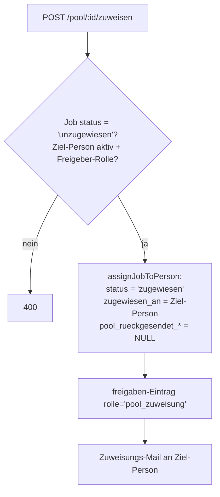
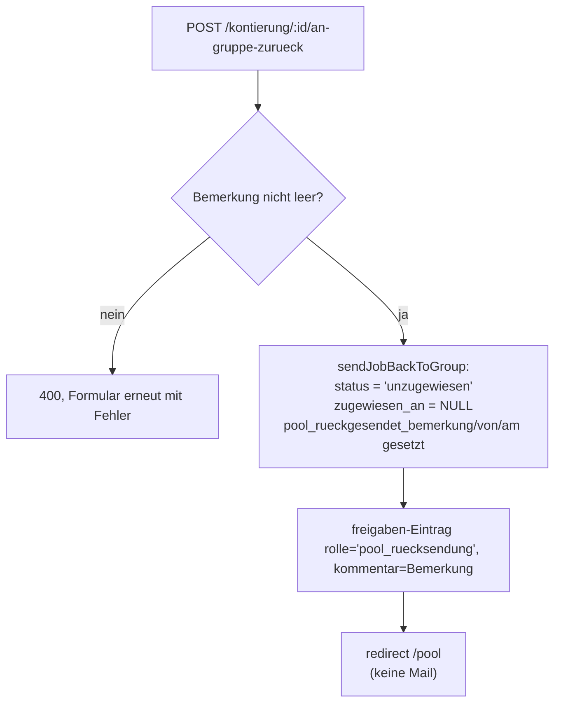
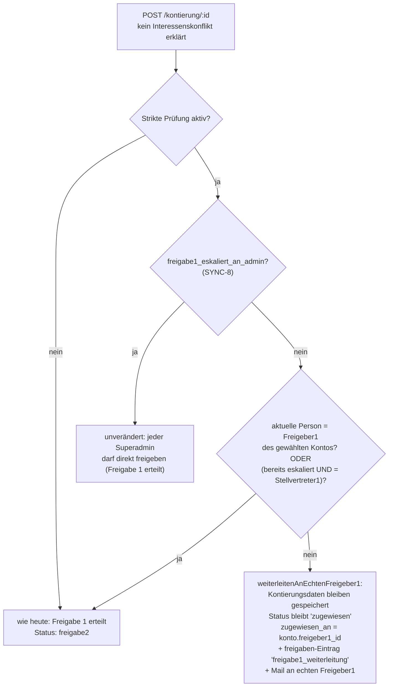

# Pool-Weiterleitung und strikte Freigeber1-Prüfung — Design

Datum: 2026-09-06

Zwei zusammengehörige Features in einer Spec (Feature 2 schliesst eine
Sicherheitslücke, die Feature 1 sonst öffnen würde — siehe
"Ziel-Personen-Auswahl" unten):

1. **Pool-Weiterleitung an Personen** — ein Triage-Team kann Pool-Belege
   gezielt an eine Person zuweisen, ohne selbst zu kontieren.
2. **Konfigurierbare strikte Freigeber1-Prüfung** — Freigabe 1 gilt bei
   der Kontierung künftig (wenn aktiviert) nur noch als erteilt, wenn
   die kontierende Person tatsächlich Freigeber1/Stellvertreter1 des
   gewählten Kontos ist.

---

# Feature 1: Pool-Weiterleitung an Personen

## Ziel

Eine definierte Gruppe von Personen ("Triage-Team") soll einen Beleg im
Pool (Status `unzugewiesen`) direkt an eine bestimmte Zielperson
weiterleiten können, **ohne selbst zu kontieren** — reine Zuweisung, wie
ein Postkorb-Weiterleiten. Die Zielperson findet den Beleg danach wie
gewohnt in "Meine offenen Kontierungen" und kontiert ihn selbst.

Umgekehrt soll die Zielperson einen ihr so zugewiesenen Beleg mit einer
Bemerkung an das Triage-Team zurücksenden können (z. B. "falsche Person",
"fehlende Angaben"), statt ihn kommentarlos in den allgemeinen Pool
zurückzulegen.

## Nicht-Ziele (YAGNI)

- Keine Kontierung/Konto-Auswahl im Rahmen dieser Weiterleitung.
- Keine Mehrfach-Weiterleitung/Kette mit Verlaufsanzeige über mehrere
  Stationen hinweg — nur "wer hat's zuletzt gesendet/zurückgesendet",
  über den bestehenden Job-Audit-Log ohnehin sichtbar.
- Keine automatische Mail beim Zurücksenden an die Gruppe (siehe
  Abschnitt "Benachrichtigungen").
- Keine Änderung an der bestehenden "Zurück in den Pool"-Funktion
  (`releaseJob`) — sie bleibt unverändert als separate Aktion bestehen.

## Berechtigung

Neues additives Einzelrecht `pool_zuweisen`, im bestehenden
`person_berechtigungen`-System (siehe
[auth-und-rechte.md](../../auth-und-rechte.md)):

- `GRANTABLE_BERECHTIGUNGEN`/`BERECHTIGUNG_LABELS` in
  `src/middleware/permissions.js` um `pool_zuweisen: 'Pool-Belege an
  Personen zuweisen'` erweitern.
- `person_berechtigungen.berechtigung`-CHECK-Constraint erweitern —
  **CHECK-Widening erfordert einen Tabellen-Rebuild** (SQLite kann
  CHECK nicht per `ALTER TABLE` erweitern). Folgt exakt dem
  bestehenden Muster `migratePersonBerechtigungenTable` in
  `src/db/index.js` (dort zuletzt bei `audit_log_einsehen`
  vorgeführt): Marker-Wert auf `'pool_zuweisen'` verschieben, Tabelle
  umbenennen, neu anlegen mit erweitertem CHECK, Daten kopieren, alte
  Tabelle droppen, alles in einer Transaktion mit
  `PRAGMA foreign_keys = OFF/ON`. `schema.sql` ebenfalls direkt
  erweitern (für frische Datenbanken).
- Superadmin/Manager haben `pool_zuweisen` implizit (wie jedes
  additive Recht, via `personHasPermission`).
- Vergeben wird es wie die bestehenden 6 Rechte über
  `/admin/personen` (`POST /admin/personen/:id/berechtigungen`) — keine
  neue Admin-Seite nötig.

## Datenmodell

Drei neue nullable Spalten auf `jobs` (Standard-`ALTER TABLE ADD
COLUMN`-Migration, Eintrag in `JOBS_TABLE_MIGRATIONS` in
`src/db/index.js`, kein Rebuild nötig):

| Spalte | Typ | Bedeutung |
|---|---|---|
| `pool_rueckgesendet_bemerkung` | TEXT | Pflicht-Bemerkung beim Zurücksenden |
| `pool_rueckgesendet_von` | TEXT REFERENCES personen | wer zurückgesendet hat |
| `pool_rueckgesendet_am` | TEXT | Zeitpunkt der Rücksendung |

Alle drei sind nur gesetzt, während der Job ein "Rückläufer" ist. Sie
werden beim erneuten Zuweisen (egal ob aus dem normalen Pool oder aus
der Rückläufer-Ansicht) wieder auf `NULL` zurückgesetzt.

Zwei neue `rolle`-Werte auf `freigaben` (informative Einträge, gleiches
Muster wie `iban_abweichung`/`rechnungsnummer_duplikat` — kein
Freigabe-Schritt, nur Audit-Trail): `pool_zuweisung`,
`pool_ruecksendung`. Ebenfalls ein CHECK-Widening-Rebuild nach dem
Muster von `migrateFreigabenTable`. Feature 2 dieser Spec (unten)
braucht einen dritten neuen `rolle`-Wert (`freigabe1_weiterleitung`) —
alle drei werden in **einem gemeinsamen** Rebuild ergänzt (Marker-Wert
vorwärts auf `'freigabe1_weiterleitung'`), nicht in getrennten
Migrationsschritten.

`EREIGNIS_LABEL` in `src/services/auditLog.js` um alle drei neuen Werte
ergänzen (z. B. "An Person weitergeleitet" / "An Gruppe zurückgesendet" /
"An Freigeber 1 weitergeleitet"), damit sie im Job-Verlauf und im
globalen Audit-Log lesbar erscheinen.

## Ziel-Personen-Auswahl

Wählbar als Ziel ist jede **aktive** Person, die auf mindestens einem
**aktiven** Konto eine der vier Rollen hat (Freigeber1/2,
Stellvertreter1/2) — Schnittmenge aus dem bereits vorhandenen
`listKontoReferencedPersonIds(db)` (`src/db/kontenRepo.js`) und
`listActivePersons(db)` (`src/db/personenRepo.js`). Neue Hilfsfunktion
`listPersonenMitFreigeberRolle(db)` in `kontenRepo.js`, die genau diese
Schnittmenge liefert (sortiert nach Nachname/Vorname) — wird sowohl vom
GET (Dropdown befüllen) als auch vom POST (Server-seitige Validierung
des gewählten Ziels) verwendet.

Alle vier Rollen bleiben bewusst wählbar (auch Freigeber2/
Stellvertreter2) — die dadurch entstehende Selbst-Freigabe-Falle (eine
Freigeber2-Person kontiert auf ihr eigenes Konto und würde ohne
Weiteres automatisch auch Freigabe 1 erteilen, wodurch sie später bei
Freigabe 2 vom harten Vier-Augen-Check blockiert würde, siehe
[freigabe2.js:47-53](../../../src/routes/freigabe2.js#L47-L53)) wird
durch Feature 2 dieser Spec strukturell geschlossen, siehe unten.

## Workflow A: "An Person senden"

Neue Route `POST /pool/:id/zuweisen` (Body: `personId`) — **nicht** im
`/api/pool`-Router (`src/routes/pool.js`), der auf Mount-Ebene bereits
hart mit `requireRole(config, 'buchhaltung')` gesperrt ist (ChurchTools-
Gruppenzugehörigkeit, nicht das additive Rechte-System — ein
Superadmin ohne diese Gruppe wäre sonst vor der eigentlichen
`pool_zuweisen`-Prüfung ausgesperrt). Stattdessen neue Route direkt im
bestehenden `/pool`-Seiten-Router (`createPoolPageRouter`,
`src/routes/poolPage.js`, Mount nur mit `requireLogin()`), mit
`requirePermission(db, config, 'pool_zuweisen')` **auf Route-Ebene**
(nicht Mount-Ebene, damit `GET /pool` für alle anderen unverändert
bleibt). Erreichbar sowohl für Jobs im normalen Pool (`unzugewiesen`,
keine Rücksendungs-Marker) als auch für Rückläufer (`unzugewiesen`
**mit** Rücksendungs-Markern).

Neue Repo-Funktion `assignJobToPerson(db, jobId, personId)` in
`jobsRepo.js` (analog zu `claimJob`, aber mit fremder statt eigener
Zielperson, und löscht zusätzlich die drei `pool_rueckgesendet_*`-Felder
in derselben `UPDATE`).

**UI**: Auf `/pool` bekommt jede Zeile der bestehenden Pool-Sektion
(`_job_table.ejs`, `idPrefix: 'pool'`) — sichtbar nur bei
`pool_zuweisen` — ein kleines Inline-Formular (Dropdown + Button)
zusätzlich zum bestehenden "Beanspruchen"-Button. Gleiches Formular in
der neuen Rückläufer-Sektion (siehe Workflow B).

**Mail**: analog zur bestehenden Zuweisungs-Mail bei automatischer
Zuweisung per Zuweisungsregel (`sendNotification`, `typ: 'zuweisung'`),
Text verweist auf `/kontierung/:id`.

## Workflow B: "Zurücksenden mit Bemerkung" + Rückläufer-Ansicht

Neue Route `POST /kontierung/:id/an-gruppe-zurueck` (Body: Pflichtfeld
`bemerkung`), zusätzlich zum bestehenden
`POST /kontierung/:id/zurueck-in-pool` — gleiche Autorisierung
(`loadAuthorizedJob`, nur die zugewiesene Person bzw. Admin-Eskalation).

Neue Repo-Funktion `sendJobBackToGroup(db, jobId, currentZugewiesenAn,
{ bemerkung })` in `jobsRepo.js`, analog zu `releaseJob` (gleicher
Zugewiesen-Guard in der `UPDATE ... WHERE zugewiesen_an = ?`-Klausel),
setzt zusätzlich die drei neuen Felder statt sie zu löschen.

**Pool-Sichtbarkeit**: `listPoolJobs(db)` (allgemeine Pool-Sektion,
sichtbar für `buchhaltung`/`superadmin`) bekommt eine zusätzliche
Bedingung `AND pool_rueckgesendet_bemerkung IS NULL` — Rückläufer
verschwinden aus der normalen Liste. Neue Funktion
`listPoolRuecklaeufer(db)` (`WHERE status = 'unzugewiesen' AND
pool_rueckgesendet_bemerkung IS NOT NULL`) für die neue Sektion.

**UI**: Neue Sektion "Rückläufer" auf `/pool`, sichtbar nur bei
`pool_zuweisen`, oberhalb oder unterhalb der normalen Pool-Sektion.
Zeigt Bemerkung + rücksendende Person (via `_job_table.ejs`-Erweiterung
um ein optionales `bemerkungFeld`) + dasselbe
"An Person senden"-Inline-Formular aus Workflow A.

Auf `/kontierung/:id` (`views/kontierung.ejs`) ein zweites Formular
neben dem bestehenden "Zurück in den Pool"-Button: Textarea
"Bemerkung" (Pflicht) + Button "An Gruppe zurücksenden".

## Benachrichtigungen — bewusste Entscheidung

Workflow A (Zuweisung) verschickt eine Mail (die Zielperson wusste
vorher nichts von dem Beleg). Workflow B (Rücksendung) verschickt
**keine** Mail — konsistent damit, dass auch ein ganz neuer,
unzugewiesener Pool-Eintrag keine Mail auslöst; das Triage-Team prüft
die Rückläufer-Sektion aktiv. Ein liegengebliebener Rückläufer fällt
trotzdem unter die bestehende Reminder-/Eskalations-Logik
(`listPoolJobsForReminder`/`listPoolJobsForEskalation` filtern nicht
nach den neuen Spalten, da sie weiterhin `status = 'unzugewiesen'`
sind) — geht an die konfigurierten `reminder_empfaenger`, nicht
zwingend an `pool_zuweisen`-Inhaber. Das ist ein akzeptierter
Seiteneffekt, kein Bug: ein liegengebliebener Rückläufer soll so oder
so eskalieren.

## Fehlerfälle

- Ziel-Person ungültig (inaktiv, keine Freigeber-Rolle, unbekannte ID)
  → `400`, Formular erneut mit Fehlermeldung.
- Job nicht mehr `unzugewiesen` (Race: zwei Personen weisen gleichzeitig
  zu, oder jemand hat ihn zwischenzeitlich beansprucht) → `409`,
  gleiches Muster wie `POST /api/pool/:id/beanspruchen`.
- Bemerkung leer/nur Whitespace bei Rücksendung → `400`.

## Tests

- Unit: `assignJobToPerson`, `sendJobBackToGroup`,
  `listPersonenMitFreigeberRolle`, `listPoolJobs`
  (Rückläufer-Ausschluss), `listPoolRuecklaeufer`.
- Integration: Berechtigungs-Sweep für beide neue Routen (401/403 ohne
  `pool_zuweisen`), Statuswechsel + Feld-Reset bei erfolgreicher
  Zuweisung, Rücksendung setzt Felder + verschwindet aus
  `listPoolJobs`/erscheint in `listPoolRuecklaeufer`, erneutes Zuweisen
  eines Rückläufers räumt die Felder wieder ab, `freigaben`-Einträge
  für beide Aktionen, Audit-Log-Label-Mapping.
- `csrfSweep.test.js`: beide neuen POST-Routen ergänzen.

## Doku

- `docs/rechnungs-workflow.md`: neuer Abschnitt zwischen Pool-Eingang
  und Kontierung, State-Diagram um die beiden neuen Übergänge
  erweitern (`unzugewiesen → zugewiesen` via Zuweisung,
  `zugewiesen → unzugewiesen` via Rücksendung — technisch dieselben
  Übergänge wie Beanspruchen/Zurück-in-Pool, im Diagramm als
  Kommentar ergänzt statt neuer Knoten, da kein neuer Status entsteht).
- `docs/auth-und-rechte.md`: `pool_zuweisen` in die Rechte-Tabelle.

---

# Feature 2: Konfigurierbare strikte Freigeber1-Prüfung bei der Kontierung

## Ziel

Aktuell gilt bei der Kontierung (`POST /kontierung/:id`, Hauptformular):
wer kontiert und **keinen** Interessenskonflikt erklärt, erteilt
automatisch Freigabe 1 — unabhängig davon, ob diese Person tatsächlich
Freigeber1 (oder im Eskalationsfall Stellvertreter1) des gewählten
Kontos ist (`kontierung.js:322` ff., `hatKonflikt`-Zweig). Das ist die
Grundlage für die Selbst-Freigabe-Falle aus Feature 1: jede Person mit
Pool-Zugriff kann heute schon (z. B. per "Beanspruchen") eine beliebige
Rechnung auf ein beliebiges Konto kontieren und wird dadurch automatisch
dessen Freigeber 1.

Neue, **admin-konfigurierbare** Regel: ist sie aktiviert, darf jede
Person zwar weiterhin kontieren (Konto/Betrag/etc. erfassen), aber
**Freigabe 1 gilt nur als erteilt, wenn sie tatsächlich Freigeber1 (oder
bei bereits laufender Eskalation: Stellvertreter1) des gewählten Kontos
ist.** Andernfalls wird die Rechnung nach der Kontierung direkt an den
echten Freigeber1 weitergereicht — der sieht die bereits erfassten
Daten vorausgefüllt und kann Freigabe 1 erteilen oder ablehnen. Erteilt
er sie, kann die ursprünglich kontierende Person (sofern sie z. B.
Freigeber2 dieses Kontos ist und keinen Interessenskonflikt hat)
anschliessend ganz normal Freigabe 2 übernehmen — ohne den bestehenden
Vier-Augen-Check zu verletzen, weil sie ja nie selbst Freigabe 1 erteilt
hat.

## Geltungsbereich

**Nur das Kontierungs-Hauptformular** (`POST /kontierung/:id`).
**Aufsplitten** (`POST /kontierung/:id/aufsplitten`) ist bereits korrekt:
dort erhält ausschliesslich ein Teil-Job auf einem Konto, das die
aufsplittende Person selbst hält (`istEigenesKonto`,
`kontierung.js:720`), automatisch Freigabe 1 — Teile auf fremden Konten
landen als `unzugewiesen` mit Hinweis-Konto im Pool
(`fremdeKonten`-Zweig). Keine Änderung dort nötig. **Spesen** ist
ebenfalls nicht betroffen — dort wird Freigabe 1 laut Design ohnehin
**nie** automatisch miterteilt (siehe
[spesen-einreichung.md](../../spesen-einreichung.md)).

## Admin-Konfiguration

Neuer `admin_config`-Key `kontierung_strikte_freigeber1_pruefung`
(Default `'0'`, also **deaktiviert** — bestehendes Verhalten bleibt ohne
explizites Opt-in unverändert). Checkbox auf der bereits mit Feature 1
dieser Spec eingeführten Seite `/admin/module`
(`views/admin/module-form.ejs`, `src/routes/admin/module.js`) — zweiter
Schalter neben "Spesenmodul aktiv", da diese Seite als Sammelstelle für
genau solche An/Aus-Verhaltensschalter gedacht ist.

## Mechanik

Die SYNC-8-Admin-Eskalation (`freigabe1_eskaliert_an_admin`, Zweig `C`)
ist von der neuen Prüfung ausgenommen: sie existiert bereits genau für
den Fall, dass die normalen Kanäle (Freigeber1 **und** Stellvertreter1)
blockiert sind — ein auflösender Superadmin darf weiterhin direkt
freigeben.

Ein vom Kontierenden selbst erklärter Interessenskonflikt
(`hatKonflikt`-Zweig) läuft **unverändert** — Selbstdeklaration hat
immer Vorrang vor der neuen automatischen Prüfung und eskaliert wie
heute an Stellvertreter1 bzw. Admin.

**Wichtig:** kein neuer Job-Status. `loadAuthorizedJob` (Autorisierung
für `/kontierung/:id`) prüft nur `status === 'zugewiesen'` und
`zugewiesen_an === aktuelle Person` — beides bleibt nach der
Weiterleitung erfüllt, jetzt eben für den echten Freigeber1. Auch das
GET-Pre-Fill (`values.kontoId` etc.) funktioniert unverändert, da es
bereits davon ausgeht, dass `job.konto_id` aus einem früheren Zustand
vorbefüllt sein kann (bestehender Kommentar zu `ladeKontenFuerJob`).
Der echte Freigeber1 sieht also exakt dasselbe, vorausgefüllte
Kontierungsformular wie jede andere Kontierung auch — keine neue View
nötig.

Neue Repo-Funktion `weiterleitenAnEchtenFreigeber1(db, jobId,
freigeber1Id)` in `jobsRepo.js` — **bewusst getrennt** von
`eskalierenFreigabe1` (setzt nur `zugewiesen_an`, rührt
`freigabe1_eskaliert_von`/`freigabe1_eskalationsgrund` nicht an, da dies
keine Interessenskonflikt-Eskalation ist und diese Felder an anderer
Stelle als "Konflikt erklärt" interpretiert werden, z. B. im
SYNC-8-`eskaliertAnAdmin`-Check).

Neuer `freigaben`-rolle-Wert `freigabe1_weiterleitung` (dritter Wert
im selben CHECK-Widening-Rebuild wie `pool_zuweisung`/
`pool_ruecksendung` aus Feature 1 — ein einziger Migrationsschritt
für alle drei neuen Werte), plus `EREIGNIS_LABEL`-Eintrag "An
Freigeber 1 weitergeleitet (Kontierung durch andere Person)".

**Mail** an den echten Freigeber1, analog zur bestehenden
Freigabe1-Eskalationsmail (`kontierung.js` Zeile ~502), Text verweist
auf `/kontierung/:id`.

## Fehlerfälle

- `konto.freigeber1_id` nicht auflösbar (deaktivierte/gelöschte Person)
  → kein Sonderfall nötig, fällt unter die bestehende "Stalled Jobs"-
  Erkennung (Personen-Sync, siehe
  [personen-sync.md](../../personen-sync.md#stalled-jobs)) wie jede
  andere Zuweisung an eine später deaktivierte Person auch.

## Tests

- Unit: `weiterleitenAnEchtenFreigeber1`.
- Integration: Toggle aus → unverändertes bestehendes Verhalten (alle
  bestehenden Kontierungs-Tests bleiben grün, keine Anpassung nötig).
  Toggle an: Freigeber1 kontiert eigenes Konto → wie heute; Fremde
  Person (z. B. nur Freigeber2 dieses Kontos) kontiert → Status bleibt
  `zugewiesen`, `zugewiesen_an` wechselt zum echten Freigeber1, kein
  `freigeber1`-Freigabe-Eintrag, dafür `freigabe1_weiterleitung`-
  Eintrag + Mail; danach kontiert/freigibt der echte Freigeber1 normal
  weiter; SYNC-8-Admin-Eskalation bleibt unverändert direkt freigebbar;
  Stellvertreter1 ohne vorherige Eskalation wird ebenfalls
  weitergeleitet (nicht direkt akzeptiert).
- `/admin/module`: Checkbox-Test analog zum Spesenmodul-Schalter aus
  Feature 1.

## Doku

- `docs/rechnungs-workflow.md`: neuer Absatz im Kontierungs-Abschnitt,
  State-Diagram um `zugewiesen → zugewiesen: Weiterleitung an echten
  Freigeber1 (falls strikte Prüfung aktiv)` ergänzen.
- `docs/admin-bereich.md`: zweiter Schalter auf der `/admin/module`-
  Seite dokumentieren.
