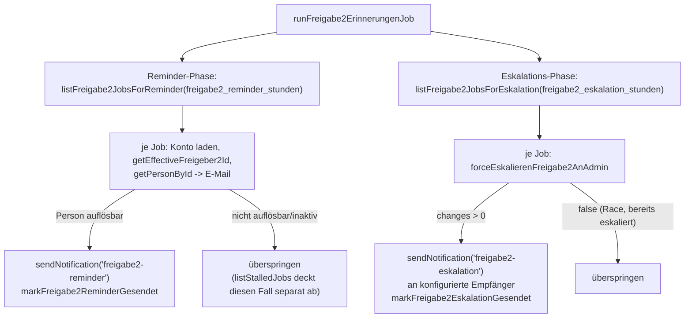

# Freigabe2-Reminder und -Eskalation bei Untätigkeit — Design

Datum: 2026-09-07

## Ausgangslage / Problem

Sobald die Kontierung ohne erklärten Interessenkonflikt abgeschickt wird,
gilt Freigabe 1 automatisch als erteilt und der Job wechselt regulär von
`zugewiesen` auf `freigabe2` (`abschliessenFreigabe1`,
[jobsRepo.js:243-255](../../../src/db/jobsRepo.js#L243-L255)) — unabhängig
vom Rechnungsbetrag, das ist die normale zweite Stufe des
Vier-Augen-Prinzips.

Bleibt der zuständige Freigeber2 danach untätig, passiert aktuell **gar
nichts**: Der einzige zeitbasierte Reminder-/Eskalations-Mechanismus
(`pool-erinnerungen`, [cronJobs.js:67-126](../../../src/services/cronJobs.js#L67-L126))
filtert seine beiden Queries hart auf `status = 'unzugewiesen'`
([jobsRepo.js:434,447](../../../src/db/jobsRepo.js#L434)) und deckt damit
ausschliesslich unbeanspruchte Pool-Rechnungen ab. `listStalledJobs`
([jobsRepo.js:586-607](../../../src/db/jobsRepo.js#L586-L607)) erkennt einen
hängenden `freigabe2`-Job nur, wenn die zuständige Person in ChurchTools
**deaktiviert** oder **nicht mehr auflösbar** ist — nicht wenn eine
weiterhin aktive Person die Freigabe schlicht liegen lässt — und ist zudem
rein passiv (ein Admin muss die Seite **Admin → Personen-Sync** selbst
aufrufen). Ein Job kann damit unbegrenzt in `freigabe2` hängen bleiben,
obwohl Freigabe 1 bereits erteilt und Geld fällig ist.

## Ziel

Zweistufiger, zeitgesteuerter Mechanismus analog zu `pool-erinnerungen`,
aber mit echter Handlungskonsequenz:

1. **Reminder-Stufe**: nach `freigabe2_reminder_stunden` Stunden ohne
   Bearbeitung erhält die aktuell zuständige Person (die tatsächliche
   Zielperson des Jobs, nicht ein konfigurierter Verteiler) eine
   persönliche Erinnerungsmail.
2. **Eskalations-Stufe**: reagiert sie insgesamt `freigabe2_eskalation_stunden`
   Stunden seit Beginn ihrer Zuständigkeit (`freigabe2_seit`, derselbe
   Startpunkt wie bei der Reminder-Stufe, nicht zusätzlich nach der
   Reminder-Stufe gerechnet) nicht, wird der Job automatisch an die
   Admin-Gruppe übergeben (wie bei einer manuellen SYNC-8-Eskalation) und
   die konfigurierte Eskalations-Empfänger-Gruppe informiert.

## Nicht-Ziele (YAGNI)

- Kein analoger Mechanismus für `freigabe1`/`zugewiesen` — diese Anfrage
  betrifft ausdrücklich nur Untätigkeit bei Freigabe 2 (bereits erteilte
  Freigabe 1, wartendes Geld). Ein Freigabe1-Pendant kann bei Bedarf
  später als eigene, gleich strukturierte Spec folgen.
- Keine Änderung an `listStalledJobs`/dem Personen-Sync-Stall-Handling —
  bleibt unverändert als Sicherheitsnetz für den Sonderfall
  deaktivierte/nicht auflösbare Person bestehen, komplementär zu diesem
  neuen, zeitbasierten Mechanismus für weiterhin aktive, aber untätige
  Personen.
- Keine cc-Benachrichtigung an Stellvertreter2 im Reminder-Schritt — die
  Reminder-Mail geht an die per `getEffectiveFreigeber2Id` aufgelöste,
  aktuell tatsächlich zuständige Person (das kann bereits Stellvertreter2
  sein, falls der Job zuvor schon per `eskalierenFreigabe2` weitergegeben
  wurde).
- Keine neue UI-Ansicht — Steuerung ausschliesslich über die bestehende
  `/admin/eskalation`-Seite (neue Felder) und die bestehende
  `/admin/geplante-jobs`-Seite (neuer Job-Eintrag, gleiches Muster wie
  `pool-erinnerungen`).

## Datenmodell

Drei neue nullable Spalten auf `jobs` (Standard-`ALTER TABLE ADD
COLUMN`-Migration, Einträge in `JOBS_TABLE_MIGRATIONS` in
[src/db/index.js:14](../../../src/db/index.js#L14), kein CHECK-Rebuild
nötig, da keine CHECK-Constraint betroffen ist):

| Spalte | Typ | Bedeutung |
|---|---|---|
| `freigabe2_seit` | TEXT | Zeitpunkt des (letzten) Wechsels der Zuständigkeit innerhalb `freigabe2` |
| `freigabe2_reminder_gesendet_at` | TEXT | verhindert Doppelversand der Reminder-Mail |
| `freigabe2_eskalation_gesendet_at` | TEXT | verhindert Doppelversand der Eskalations-Mail |

**Wo `freigabe2_seit` gesetzt/zurückgesetzt wird** — es gibt im gesamten
Repo genau eine Stelle, die den Status auf `freigabe2` setzt, und eine
Stelle, die die Zuständigkeit innerhalb `freigabe2` verändert (per Grep
über `"'freigabe2'"` in `jobsRepo.js` verifiziert):

- `abschliessenFreigabe1` ([jobsRepo.js:243-255](../../../src/db/jobsRepo.js#L243-L255)):
  ergänzt `freigabe2_seit = ?` (aktueller Zeitstempel) in der bestehenden
  `UPDATE`-Anweisung.
- `eskalierenFreigabe2` ([jobsRepo.js:257-259](../../../src/db/jobsRepo.js#L257-L259)):
  Weitergabe an Stellvertreter2 innerhalb der Freigabe-2-Stufe. Setzt
  `freigabe2_seit` ebenfalls neu (die Frist beginnt für die neue
  zuständige Person von vorn) **und** setzt gleichzeitig
  `freigabe2_reminder_gesendet_at`/`freigabe2_eskalation_gesendet_at`
  zurück auf `NULL` — sonst würde die neue Person nie einen Reminder
  bekommen, weil die Marker-Spalten schon vom Vorgänger gesetzt wären.

`eskalierenFreigabe2AnAdmin` ([jobsRepo.js:313-317](../../../src/db/jobsRepo.js#L313-L317))
und `abschliessenFreigabe2` ([jobsRepo.js:261-276](../../../src/db/jobsRepo.js#L261-L276))
brauchen keine Änderung: Beide beenden die Zuständigkeits-Uhr für diesen
Job (Admin-Übergabe bzw. Abschluss), die neuen Reminder-/Eskalations-
Queries filtern ohnehin auf `freigabe2_eskaliert_an_admin = 0` bzw. auf
`status = 'freigabe2'`.

## Neue Repo-Funktionen

Analog zu `listPoolJobsForReminder`/`listPoolJobsForEskalation`
([jobsRepo.js:434-458](../../../src/db/jobsRepo.js#L434-L458)), neu in
`jobsRepo.js`:

```js
export function listFreigabe2JobsForReminder(db, stunden) {
  const schwelle = new Date(Date.now() - stunden * 60 * 60 * 1000).toISOString();
  return db
    .prepare(
      "SELECT * FROM jobs WHERE status = 'freigabe2' AND freigabe2_eskaliert_an_admin = 0 " +
      "AND freigabe2_reminder_gesendet_at IS NULL AND freigabe2_seit < ? ORDER BY freigabe2_seit"
    )
    .all(schwelle);
}

export function markFreigabe2ReminderGesendet(db, jobId) {
  db.prepare('UPDATE jobs SET freigabe2_reminder_gesendet_at = ? WHERE id = ?').run(new Date().toISOString(), jobId);
}

export function listFreigabe2JobsForEskalation(db, stunden) {
  const schwelle = new Date(Date.now() - stunden * 60 * 60 * 1000).toISOString();
  return db
    .prepare(
      "SELECT * FROM jobs WHERE status = 'freigabe2' AND freigabe2_eskaliert_an_admin = 0 " +
      "AND freigabe2_eskalation_gesendet_at IS NULL AND freigabe2_seit < ? ORDER BY freigabe2_seit"
    )
    .all(schwelle);
}

export function markFreigabe2EskalationGesendet(db, jobId) {
  db.prepare('UPDATE jobs SET freigabe2_eskalation_gesendet_at = ? WHERE id = ?').run(new Date().toISOString(), jobId);
}
```

Für die eigentliche Admin-Übergabe in der Eskalations-Stufe wird **keine
neue Funktion** gebraucht: `forceEskalierenFreigabe2AnAdmin(db, jobId)`
([jobsRepo.js:632-637](../../../src/db/jobsRepo.js#L632-L637)) tut exakt
das Richtige — ein guardeter `UPDATE ... WHERE status = 'freigabe2' AND
freigabe2_eskaliert_an_admin = 0`, ohne Akteur/Grund zu erfordern (bisher
genutzt vom Personen-Sync-Stall-Handler, gleiche Situation: Übergabe ohne
handelnde Person). Diese Funktion wird 1:1 wiederverwendet.

## Neuer Cron-Job

Neue Funktion `runFreigabe2ErinnerungenJob(db, config, mailer)` in
`cronJobs.js`, direkt neben `runPoolErinnerungenJob`
([cronJobs.js:67-126](../../../src/services/cronJobs.js#L67-L126)), nach
demselben Aufbau (zwei Phasen in einem Lauf, ein gemeinsamer
`logCronLauf`-Eintrag):



- **Reminder-Phase**: Konto per `getKontoById(db, job.konto_id)` laden,
  `akteurId = getEffectiveFreigeber2Id(job, konto)`
  ([jobsRepo.js:576-578](../../../src/db/jobsRepo.js#L576-L578)),
  `getPersonById(db, akteurId)` ([personenRepo.js:26](../../../src/db/personenRepo.js#L26)).
  Ist die Person aktiv und auflösbar, `sendNotification(db, mailer, {
  to: person.email, typ: 'freigabe2-reminder', jobId: job.id, variablen:
  { jobDateiname, stunden: reminderStunden, link:
  \`${config.publicBaseUrl}/freigabe2\` } })`, danach
  `markFreigabe2ReminderGesendet`. Ist sie **nicht** auflösbar/inaktiv,
  wird der Job in diesem Lauf übersprungen (kein Marker gesetzt, damit es
  beim nächsten Lauf erneut versucht wird, sobald z. B. der Sync die
  Person aktualisiert hat) — dieser Fall bleibt Aufgabe von
  `listStalledJobs`.
- **Eskalations-Phase**: `forceEskalierenFreigabe2AnAdmin(db, job.id)`
  aufrufen; nur bei `true` (Race-Schutz: könnte zwischen Query und
  Update bereits abgeschlossen/eskaliert worden sein) die
  `freigabe2-eskalation`-Mail an `resolveEmpfaenger(db, config,
  getConfigValue(db, 'freigabe2_eskalation_empfaenger'))` verschicken
  und `markFreigabe2EskalationGesendet` setzen — gleiches
  `if (empfaenger.length > 0)`-Gating wie bei `pool-erinnerungen`
  ([cronJobs.js:88,108](../../../src/services/cronJobs.js#L88)).

**Registrierung** (gleiches Muster wie die anderen Cron-Jobs):

- `services/scheduler.js` ([scheduler.js:129-135](../../../src/services/scheduler.js#L129-L135)):
  neuer `scheduleInterval`-Block, Intervall über neuen Config-Key
  `cron_freigabe2_erinnerungen_intervall_minuten` (Default `60`,
  analog zu `cron_pool_erinnerungen_intervall_minuten`).
- `routes/cron.js`: neue Route `POST /freigabe2-erinnerungen`, gleiches
  Muster wie `POST /pool-erinnerungen` ([cron.js:29](../../../src/routes/cron.js#L29)).
- `cron_log.job`-CHECK-Constraint erweitern: neuer Rebuild-Schritt
  `migrateCronLogTableFreigabe2Erinnerungen`, exakt nach dem Muster von
  `migrateCronLogTableMailDigest`
  ([index.js:479-500](../../../src/db/index.js#L479-L500)) — neuer Wert
  `'freigabe2-erinnerungen'`. `schema.sql`s `cron_log`-CREATE TABLE
  ebenfalls direkt erweitern.
- `/admin/geplante-jobs` ([geplanteJobs.js](../../../src/routes/admin/geplanteJobs.js)):
  neuer Abschnitt "Freigabe2-Erinnerungen" nach dem Muster des
  bestehenden `pool-erinnerungen`-Abschnitts (Intervall-Eingabefeld,
  Log-Anzeige via `listRecentCronLog(db, 'freigabe2-erinnerungen',
  LOG_LIMIT)`, "Jetzt ausführen"-Button `POST
  /freigabe2-erinnerungen/jetzt-ausfuehren`).

## Neue Mailtypen und Vorlagen

Zwei neue, admin-editierbare Mailtypen (bewusst eigenständig statt
Wiederverwendung von `reminder`/`eskalation`, da deren bestehende
Vorlagentexte explizit vom Pool sprechen — "unbeansprucht im Pool" passt
fachlich nicht auf eine bereits kontierte, auf eine Person wartende
Freigabe):

- `mail_log.typ`-CHECK-Constraint erweitern: neuer Rebuild-Schritt
  `migrateMailLogTableFreigabe2`, exakt nach dem Muster von
  `migrateMailLogTableGeplantStatus`
  ([index.js:439-467](../../../src/db/index.js#L439-L467)) — neue Werte
  `'freigabe2-reminder'`, `'freigabe2-eskalation'`. `schema.sql`s
  `mail_log`-CREATE TABLE ebenfalls direkt erweitern.
- `TYP_ZU_KEY_INFIX` in `src/services/mailTemplates.js:3-12` um
  `'freigabe2-reminder': 'freigabe2_reminder'` und
  `'freigabe2-eskalation': 'freigabe2_eskalation'` ergänzen.
- Neue Default-Vorlagen in `DEFAULTS` in
  `src/db/adminConfigRepo.js` (gleiche Struktur wie die bestehenden
  `mail_vorlage_reminder_*`/`mail_vorlage_eskalation_*`):

  ```js
  mail_vorlage_freigabe2_reminder_betreff: 'Freigabeportal: Offene Freigabe wartet auf Sie',
  mail_vorlage_freigabe2_reminder_text: 'Hallo %empfaengerName%,\n\ndiese Rechnung wartet seit mehr als %stunden% Stunden auf Ihre Freigabe: %jobDateiname%\n\nBitte im Freigabeportal anmelden: %link%\n\nFreundliche Grüsse\n%portalName%',
  mail_vorlage_freigabe2_eskalation_betreff: 'Freigabeportal: Eskalation – Freigabe seit langem ausstehend',
  mail_vorlage_freigabe2_eskalation_text: 'Diese Rechnung wartet seit mehr als %stunden% Stunden auf Freigabe 2 und wurde an die Administration übergeben: %jobDateiname%\n\nBitte im Freigabeportal anmelden: %link%\n\nFreundliche Grüsse\n%portalName%',
  ```

  (`%empfaengerName%` wird bereits von `sendNotification`/`notify.js`
  generisch für jeden Mailtyp befüllt, siehe bestehende Verwendung bei
  `zuweisung`/`ablehnung`.)
- Beide neuen Vorlagen erscheinen automatisch unter
  `/admin/mail-einstellungen`, da diese Seite generisch über
  `TYP_ZU_KEY_INFIX` iteriert (kein Code an dieser Stelle nötig, sofern
  das bestehende Template-Rendering der Seite bereits generisch ist —
  andernfalls dort ergänzen).
- **Digest-Batching**: keine Sonderbehandlung — beide neuen Typen sind
  **nicht** in `IMMER_SOFORT_TYPEN`
  ([notify.js:12](../../../src/services/notify.js#L12)), verhalten sich
  also wie `reminder`/`eskalation` bereits heute: bei aktivem
  `mail_batching_aktiv` werden sie gebündelt in der täglichen Digest-Mail
  zugestellt statt sofort. Das ist eine bewusste Entscheidung für
  Konsistenz mit dem bestehenden Muster, keine neue Ausnahme.

## Admin-Konfiguration

Neue Felder auf der bestehenden Seite `/admin/eskalation`
([eskalation.js](../../../src/routes/admin/eskalation.js),
`views/admin/eskalation-form.ejs`), gleiche Validierung wie die
bestehenden Felder (`validateEmpfaengerListe`,
[eskalation.js:11-25](../../../src/routes/admin/eskalation.js#L11-L25)):

| Config-Key | Default | Bedeutung |
|---|---|---|
| `freigabe2_reminder_stunden` | `24` | Stunden bis Reminder-Mail an die zuständige Person |
| `freigabe2_eskalation_stunden` | `48` | Stunden bis automatische Übergabe an die Admin-Gruppe |
| `freigabe2_eskalation_empfaenger` | `gruppe:admin` | Empfänger der Eskalations-Mail (Gruppen-Token oder E-Mail-Liste, wie die bestehenden Empfänger-Felder) |

Defaults bewusst identisch zu den Pool-Werten (`reminder_stunden: '24'`,
`eskalation_stunden: '48'`,
[adminConfigRepo.js:2-3](../../../src/db/adminConfigRepo.js#L2-L3)) als
Startpunkt — der Admin kann sie nach der Auslieferung unabhängig
anpassen, das war ja gerade der Zweck der eigenen Config-Keys.
`freigabe2_eskalation_empfaenger` default `gruppe:admin` statt
`gruppe:buchhaltung` (anders als beim Pool), da eine Freigabe-2-Eskalation
eine Übergabe der eigentlichen Freigabe-Berechtigung ist — fachlich näher
an den bestehenden `sync_fehler_empfaenger`/`iban_abweichung_empfaenger`
(beide `gruppe:admin`) als am reinen Pool-Reminder.

## Fehlerfälle

- Konto oder Person zum Zeitpunkt des Cron-Laufs nicht mehr auflösbar
  (gelöschtes Konto, deaktivierte Person) → Reminder-Phase überspringt
  den Job ohne Marker (siehe oben), Eskalations-Phase betrifft das nicht
  (sie prüft keinen Akteur, nur den Status).
- Zwei sich überlappende Cron-Läufe (Interval kürzer als Laufzeit) →
  bestehendes Race wird durch `forceEskalierenFreigabe2AnAdmin`s eigenen
  `WHERE freigabe2_eskaliert_an_admin = 0`-Guard abgefangen, gleiches
  Prinzip wie beim bestehenden Pool-Job (kein zusätzlicher Lock nötig,
  Cron-Läufe sind bereits heute nicht gegeneinander gesperrt).
- Mail-Versand schlägt fehl → `sendNotification` loggt den Fehler bereits
  intern (`mail_log.status = 'fehlgeschlagen'`) und wirft nicht, exakt
  wie bei allen anderen Aufrufern; Marker wird trotzdem gesetzt (gleiches
  Verhalten wie bestehender Pool-Job — kein Retry-Sturm bei dauerhaft
  falscher Adresse).

## Tests

- Unit (`jobsRepo`): `listFreigabe2JobsForReminder`/
  `listFreigabe2JobsForEskalation` (Zeitgrenze, `gesendet_at`-Gating,
  Ausschluss bereits an Admin eskalierter Jobs), `freigabe2_seit`-Reset
  bei `eskalierenFreigabe2` inkl. Zurücksetzen der beiden
  `gesendet_at`-Marker.
- Unit (`cronJobs`): `runFreigabe2ErinnerungenJob` — Reminder-Pfad
  (richtige Empfänger-Auflösung inkl. bereits eskaliertem
  Stellvertreter2-Fall), Eskalations-Pfad (Status-Änderung via
  `forceEskalierenFreigabe2AnAdmin`, Mail an konfigurierte Empfänger,
  Race-Schutz wenn bereits eskaliert), `logCronLauf`-Eintrag.
- Integration: `/admin/eskalation` — neue Felder speichern/validieren.
  `/admin/geplante-jobs` — neuer Abschnitt, "Jetzt ausführen"-Route.
  `/admin/mail-einstellungen` — neue Vorlagen editierbar.
- `csrfSweep.test.js`: neue POST-Route
  `/freigabe2-erinnerungen/jetzt-ausfuehren` ergänzen.
- Migrations-Test (falls ein bestehendes Test-Pattern dafür existiert,
  z. B. `db/index.test.js`): CHECK-Widening für `mail_log.typ` und
  `cron_log.job` auf einer vorbestehenden DB-Datei.

## Doku

- `docs/geplante-jobs-und-benachrichtigungen.md`: neuer Abschnitt
  "Freigabe2-Erinnerungen" analog zum bestehenden Pool-Abschnitt,
  Flow-Diagramm ergänzen.
- `docs/rechnungs-workflow.md`: Hinweis im `freigabe2`-Abschnitt, dass
  Untätigkeit jetzt zeitgesteuert eskaliert (bisher unbegrenztes
  Verharren).
- `docs/admin-bereich.md`: zwei neue Mailtypen in der Beschreibung von
  `/admin/mail-einstellungen` ergänzen, sowie die drei neuen Felder auf
  `/admin/eskalation`.
