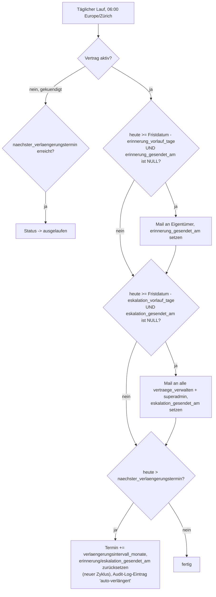

# Vertragsmanagement — Design

Datum: 2026-09-10
Status: Zur Review

## Ziel

Laufende Verträge/Abos (Internet, Versicherungen, Software-Lizenzen,
Miete, Wartungsverträge, ...) werden heute nirgends zentral erfasst —
niemand hat einen Überblick, was es gibt, was es kostet und wann
gekündigt werden müsste. Dieses Feature bildet eine schlanke,
eigenständige Registry im Portal ab: pro Vertrag eine verantwortliche
Person (Eigentümer), automatisch berechnete Kündigungsfristen und
rechtzeitige Erinnerungen mit Eskalation, wenn die Frist näher rückt und
niemand reagiert.

## Nicht-Ziele (bewusst ausgeklammert)

- **Keine Verknüpfung zu Lieferanten-Stammdaten, Rechnungen oder
  Bexio.** Reine Fristen-/Stammdaten-Übersicht, kein Ist-Kosten-Abgleich
  gegen tatsächlich bezahlte Rechnungen. Kann später als eigenes Feature
  nachgezogen werden, falls Bedarf entsteht.
- **Kein automatischer Kündigungsversand.** Das Portal markiert nur den
  Status — die Kündigung selbst (Anruf/Brief/Mail an den Anbieter)
  bleibt Sache der verantwortlichen Person.
- **Kein Mehrfach-Eigentümer pro Vertrag.** Genau eine verantwortliche
  Person; Umzuweisen ist jederzeit durch `vertraege_verwalten` möglich.
- **Keine Kosten-Reporting-Auswertung** (Jahresgesamtkosten pro
  Kategorie o.ä.) — YAGNI für den ersten Wurf, die Übersichtsliste mit
  Filtern deckt den geäusserten Bedarf ("Überblick behalten") ab.
- **Keine Erinnerungen für bereits `gekuendigt`/`ausgelaufen`e Verträge.**

## Datenmodell

### `vertrag_kategorien`

```sql
CREATE TABLE vertrag_kategorien (
  id INTEGER PRIMARY KEY AUTOINCREMENT,
  name TEXT NOT NULL UNIQUE,
  aktiv INTEGER NOT NULL DEFAULT 1
);
```

Admin-pflegbar (analog anderer Stammdaten-Listen im Portal). `aktiv = 0`
statt Löschen, damit bestehende Verträge einer deaktivierten Kategorie
nicht verwaisen — deaktivierte Kategorien verschwinden nur aus dem
Auswahl-Dropdown für neue/bearbeitete Verträge.

### `vertraege`

```sql
CREATE TABLE vertraege (
  id INTEGER PRIMARY KEY AUTOINCREMENT,
  anbieter TEXT NOT NULL,
  kategorie_id INTEGER NOT NULL REFERENCES vertrag_kategorien(id),
  beschreibung TEXT,
  eigentuemer_person_id INTEGER NOT NULL REFERENCES personen(id),
  kosten_betrag TEXT,
  kosten_intervall TEXT CHECK (kosten_intervall IN (
    'monatlich', 'vierteljaehrlich', 'halbjaehrlich', 'jaehrlich', 'einmalig'
  )),
  vertragsbeginn TEXT NOT NULL,
  verlaengerungsintervall_monate INTEGER NOT NULL,
  kuendigungsfrist_tage INTEGER NOT NULL,
  naechster_verlaengerungstermin TEXT NOT NULL,
  status TEXT NOT NULL DEFAULT 'aktiv' CHECK (status IN ('aktiv', 'gekuendigt', 'ausgelaufen')),
  gekuendigt_am TEXT,
  gekuendigt_von_person_id INTEGER REFERENCES personen(id),
  erinnerung_gesendet_am TEXT,
  eskalation_gesendet_am TEXT,
  erstellt_am TEXT NOT NULL DEFAULT (datetime('now')),
  aktualisiert_am TEXT NOT NULL DEFAULT (datetime('now'))
);
```

`kosten_betrag` folgt der bestehenden Konvention (`jobs.betrag` ist
ebenfalls `TEXT`, nicht `REAL`, um Rundungsprobleme zu vermeiden) — CHF
wird angenommen (keine Fremdwährungsverträge im Lastenheft).

`naechster_verlaengerungstermin` ist das Datum, an dem sich der Vertrag
automatisch verlängert, wenn nicht rechtzeitig gekündigt wird. Der
tatsächliche Kündigungsfrist-Stichtag ergibt sich daraus zur Laufzeit als
`date(naechster_verlaengerungstermin, '-' || kuendigungsfrist_tage ||
' days')` — bewusst nicht redundant gespeichert, um kein Drift-Risiko
zwischen zwei Datumsfeldern zu haben.

`erinnerung_gesendet_am`/`eskalation_gesendet_am` merken sich, ob für den
**aktuellen** Verlängerungszyklus bereits gemailt wurde (analog
`reminder_gesendet_at`/`eskalation_gesendet_at` bei Pool-Jobs) — beide
werden zurückgesetzt, sobald der Termin automatisch weiterrückt.

### `vertrag_dokumente`

```sql
CREATE TABLE vertrag_dokumente (
  id INTEGER PRIMARY KEY AUTOINCREMENT,
  vertrag_id INTEGER NOT NULL REFERENCES vertraege(id),
  dateiname TEXT NOT NULL,
  speicherpfad TEXT NOT NULL,
  hochgeladen_von_person_id INTEGER REFERENCES personen(id),
  hochgeladen_am TEXT NOT NULL DEFAULT (datetime('now'))
);
```

Dateien werden analog zu `JOBS_DIR`/`BRANDING_DIR` in einem neuen
`VERTRAEGE_DIR` abgelegt (Env-Variable, gleiche Konvention). PDF/JPG/PNG,
gleiche 20-MB-Grenze wie beim bestehenden Beleg-Upload. **Wichtig:**
`VERTRAEGE_DIR` muss zusätzlich in den `datenbank-sicherung`-Job
aufgenommen werden (`src/services/cronJobs.js`, dort werden aktuell DB +
`JOBS_DIR` + `BRANDING_DIR` gezippt) — sonst gehen Vertragsdokumente bei
einem Restore verloren.

### Additive Rechte — neuer 9. Wert

`person_berechtigungen.berechtigung` CHECK wird um `vertraege_verwalten`
erweitert (gleiches Tabellen-Rebuild-Migrationsmuster wie bei
`pool_zuweisen`, siehe `migrateTable`-Vorlage in `src/db/index.js`).
`superadmin` erhält das Recht automatisch über sein Rollen-Bundle
(`src/middleware/roles.js`/`permissions.js`), wie alle acht bestehenden
Rechte auch.

**Zugriffsmodell auf `/vertraege`:**

| Person hat... | sieht |
|---|---|
| `vertraege_verwalten` (inkl. `superadmin`) | alle Verträge, Filter nach Kategorie/Status/"läuft bald ab", kann anlegen/bearbeiten/löschen/Eigentümer umziehen |
| nichts davon, ist aber `eigentuemer_person_id` bei ≥1 Vertrag | nur die eigenen Verträge, kann Kosten/Dokumente/Beschreibung pflegen und selbst kündigen, aber keinen neuen Vertrag anlegen und keinen Eigentümer ändern |
| keins von beidem | kein Zugriff auf `/vertraege*` |

Eine Person kann beides gleichzeitig sein (z.B. Buchhaltung verwaltet
alle Verträge und ist gleichzeitig Eigentümer der Internet-Verträge) —
dieselbe Seite, nur mit erweiterter statt gefilterter Sicht. Kein
separates `/meine-vertraege` nötig, im Gegensatz zu "Meine Spesen"
(dort ist die Einreich-Rolle strukturell komplett anders als die
Freigabe-Rolle; hier ist "Eigentümer" einfach der Default-Filter für
alle ohne Verwaltungsrecht).

## Status-Workflow

```
aktiv --[Eigentümer/Verwaltung klickt "Kündigen"]--> gekuendigt
aktiv --[Termin erreicht, keine Kündigung]--> aktiv (Termin rückt automatisch weiter, neuer Zyklus)
gekuendigt --[naechster_verlaengerungstermin erreicht]--> ausgelaufen
```

`gekuendigt` heisst: die Kündigung wurde im Portal erfasst, der Vertrag
läuft aber vertragsgemäss noch bis `naechster_verlaengerungstermin`
weiter — der Vertrag bleibt bis dahin in der Übersicht sichtbar (Status
"gekündigt, läuft aus am ..."), erhält aber keine Erinnerungen mehr.
`ausgelaufen` ist der Endzustand, rein informativ für die Übersicht
("was hatten wir mal") — keine weiteren Übergänge.

## Erinnerung, Eskalation, Auto-Verlängerung

Ein neuer täglicher Job `vertrag-erinnerungen` (Scheduler-Muster wie die
bestehenden sechs Jobs, `src/services/cronJobs.js` +
`src/services/scheduler.js`, zusätzlich über `POST
/internal/cron/vertrag-erinnerungen` und einen "Jetzt ausführen"-Button
unter **Admin → Geplante Jobs** erreichbar):



Zwei neue `admin_config`-Schlüssel (eigene Seite **Admin → Verträge**,
zusammen mit der Kategorien-Verwaltung, nicht auf der bestehenden
Eskalationszeiten-Seite — dort sind alle Schwellen stunden- statt
tagesbasiert):

```
vertrag_erinnerung_vorlauf_tage   (Default '30')
vertrag_eskalation_vorlauf_tage   (Default '7')
```

Reihenfolge im Job ist bewusst Erinnerung-dann-Eskalation-dann-Ablauf in
einem einzigen Lauf (nicht vier separate Durchläufe) — ein Vertrag mit
sehr kurzem Vorlauf kann so an einem Tag direkt in den eskalierten
Zustand fallen, ohne auf den nächsten Tag zu warten.

## Mail-Vorlagen

Zwei neue `mail_log.typ`-Werte (`vertrag-erinnerung`,
`vertrag-eskalation`, gleiche CHECK-Rebuild-Migration wie bei den
bestehenden sieben Typen) und zwei neue Vorlagen im bestehenden
Mail-Vorlagen-System (`src/services/mailTemplates.js`,
`docs/superpowers/specs/2026-09-07-mail-vorlagen-und-batching-design.md`):

| Typ | Variablen (zusätzlich zu `%portalName%`) |
|---|---|
| vertrag-erinnerung | `%anbieter%`, `%kategorie%`, `%fristDatum%`, `%link%` |
| vertrag-eskalation | `%anbieter%`, `%kategorie%`, `%eigentuemerName%`, `%fristDatum%`, `%link%` |

Beide respektieren das bestehende Batching (`mail_batching_aktiv`) wie
jeder andere Typ auch — kein Sonderfall nötig, das ist bereits generisch
über `mail_log.typ` gebaut.

## Routen und Seiten

| Route | Zugriff | Zweck |
|---|---|---|
| `GET /vertraege` | `vertraege_verwalten` oder Eigentümer ≥1 Vertrag | Übersicht, gefiltert nach Rolle (siehe Zugriffsmodell oben); Filter Kategorie/Status/"Frist in nächsten 90 Tagen" |
| `GET /vertraege/neu`, `POST /vertraege` | `vertraege_verwalten` | Vertrag anlegen |
| `GET /vertraege/:id` | Eigentümer des Vertrags oder `vertraege_verwalten` | Detailseite: Stammdaten, Dokumente, Verlauf |
| `GET /vertraege/:id/bearbeiten`, `POST /vertraege/:id` | Eigentümer (eigene Felder) oder `vertraege_verwalten` (alle Felder inkl. Eigentümer-Wechsel) | Bearbeiten |
| `POST /vertraege/:id/kuendigen` | Eigentümer oder `vertraege_verwalten` | Status -> `gekuendigt`, `gekuendigt_am`/`gekuendigt_von_person_id` setzen |
| `POST /vertraege/:id/dokumente` | Eigentümer oder `vertraege_verwalten` | PDF/JPG/PNG hochladen (multer memoryStorage, gleiche Grenzen wie Beleg-Upload) |
| `GET /vertraege/:id/dokumente/:docId` | Eigentümer oder `vertraege_verwalten` | Dokument herunterladen |
| `POST /vertraege/:id/loeschen` | `vertraege_verwalten` | Vertrag komplett löschen (inkl. Dokumente) — nur für Fehlerfassungen, kein Soft-Delete nötig, da kein Compliance-Bezug wie bei Rechnungen |
| `GET/POST /admin/vertraege/kategorien` | `vertraege_verwalten` | Kategorien anlegen/deaktivieren |
| `POST /admin/vertraege/einstellungen` | `vertraege_verwalten` | Erinnerungs-/Eskalations-Vorlauftage |

Neuer Navigationspunkt "Verträge" im Hauptmenü, sichtbar für jede Person
mit Zugriff auf mindestens eine der obigen Seiten (gleiche
Sichtbarkeits-Logik wie bei anderen rollenabhängigen Menüpunkten).

## Integration in bestehende Systeme

- **Audit-Log:** Anlegen, Bearbeiten, Kündigen, Auto-Verlängerung und
  Dokument-Upload/-Löschung werden ins bestehende globale Audit-Log
  geschrieben (gleiche Helper-Funktion wie andere Module) — macht das
  Feature von Anfang an durchsuchbar, ohne eigenes Log zu bauen.
- **Backup-Job:** `VERTRAEGE_DIR` wird in `datenbank-sicherung`
  aufgenommen (siehe oben).
- **Geplante Jobs:** `vertrag-erinnerungen` erscheint unter **Admin →
  Geplante Jobs** wie jeder andere Job.

## Tests

- Unit: Berechnung des Fristdatums und der Verlängerungslogik
  (insbesondere Monatsende-Randfälle, z.B. 31. Januar + 1 Monat).
- Unit: Job-Logik für Erinnerung/Eskalation/Auto-Verlängerung/Ablauf mit
  gefaketem "heute".
- Integration: Zugriffskontrolle pro Route (Eigentümer sieht nur eigene,
  `vertraege_verwalten` sieht alle, Person ohne beides bekommt 403).
- `csrfSweep.test.js`-Routenanzahl-Check aktualisieren (neue POST-Routen).

## Offene Punkte für die Review

- Löschen ist hart (kein Soft-Delete) — falls doch eine Historie
  gewünscht ist (z.B. für spätere Auswertung "was hatten wir alles"),
  wäre ein Status `geloescht` statt echtem `DELETE` die Alternative,
  analog zum bestehenden Muster bei Rechnungen.
- `verlaengerungsintervall_monate` als reine Zahl (z.B. 12) statt fixer
  Auswahl (monatlich/jährlich/...) — flexibler für unübliche Intervalle
  (z.B. 24 Monate Mindestlaufzeit), aber weniger selbsterklärend im
  Formular. Kann im Formular als Dropdown mit gängigen Werten +
  "custom"-Eingabe gelöst werden.
