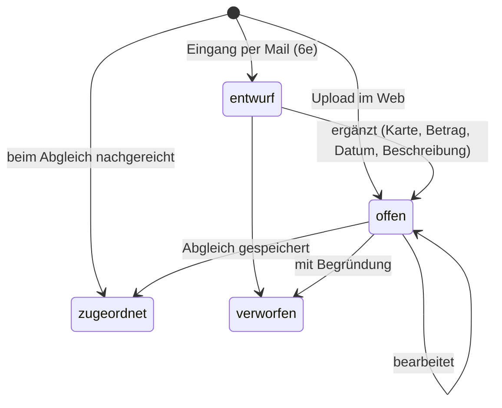

# Kreditkarten-Belege — Design

Datum: 2026-09-27
Status: Freigegeben (2026-09-27)

## Ziel

Belege zu Kreditkartenkäufen sollen **vorab** ins Portal hochgeladen
werden können, ohne dass sie sofort eine Freigabe oder einen Export
auslösen. Trifft später die monatliche Kreditkartenabrechnung ein, gleicht
die für die Karte verantwortliche Person die Abrechnung gegen die offenen
Belege ab; daraus entstehen pro Position Teil-Jobs, die die normale
Freigabe (Freigeber 1/2) durchlaufen und am Ende als **eine**
Splitgruppe gebündelt nach Bexio exportiert werden.

Heute ist das nur über Aufsplitten mit einem Beleg pro Teil möglich —
wofür die kontierende Person alle Belege beim Kontieren schon vorliegen
haben muss (in der Praxis: per Mail zusammensammeln).

Erfolgskriterien:

- Belege lassen sich jederzeit nach dem Kauf hochladen (Web oder Mail).
- Beim Abgleich ist sofort sichtbar, welche Belege zur Abrechnung passen
  und welche Positionen ohne Beleg dastehen.
- Positionen ohne Beleg sind möglich, aber immer begründet und für
  Freigeber sichtbar markiert.
- Der bestehende Kern-Workflow (Status-Modell, Vier-Augen-Prinzip,
  Splitgruppen-Export) bleibt unverändert.

## Getroffene Entscheidungen

| Frage | Entscheid |
|---|---|
| Karten-Modell | Mehrere Karten, jede mit eigener Monatsabrechnung → `kreditkarten` als eigenes Objekt |
| Zeitpunkt der Freigabe | **Erst nach dem Abgleich** — Vorab-Belege sind keine Jobs |
| Wer gleicht ab | Buchhaltung markiert die Abrechnung als „Karte X“, Abgleich durch die **verantwortliche Person** der Karte |
| Positionen ohne Beleg | Erlaubt als **Eigenbeleg mit Pflicht-Begründung** oder als **Gebühr/Zins**; Beleg kann direkt beim Abgleich nachgereicht werden |
| Wer darf Belege erfassen | **Pro Karte konfigurierbar**: alle Personen (Modus A) oder nur eine gepflegte Liste (Modus B) |
| Umsetzung | Eigene Tabellen für Vorab-Belege, Abgleich als erweitertes Aufsplitten (Ansatz 1) |

## Nicht-Ziele

- **Kein vollautomatischer Abgleich.** Die Abrechnungszeilen werden nicht
  strukturiert geparst; das Portal macht nur Zuordnungs-*Vorschläge*
  (Abschnitt 6c), bestätigt wird immer von einem Menschen.
- **Keine Speicherung vollständiger Kartennummern** — nur die letzten
  vier Ziffern.
- **Keine Integration in das native Mail-Empfang-Modul**, da dieses noch
  nicht existiert — der Mail-Eingang läuft vorerst über n8n (6e), die
  Logik liegt aber in einem wiederverwendbaren Service.
- **Keine gemischte Freigabe:** Ein Vorab-Beleg selbst wird nie
  freigegeben, nur die aus dem Abgleich entstehenden Teil-Jobs.

## 1. Datenmodell

### `kreditkarten`

| Spalte | Typ | Bedeutung |
|---|---|---|
| `id` | INTEGER PK | |
| `bezeichnung` | TEXT NOT NULL | z. B. „Visa Bereich Jugend“ |
| `karte_endziffern` | TEXT | letzte 4 Ziffern (CHECK: genau 4 Ziffern oder NULL) — Anzeige + Erkennung (6b) |
| `karteninhaber_name` | TEXT | Freitext, auf wen die Karte ausgestellt ist — reine Anzeige, keine Rechte |
| `verantwortlich_id` | INTEGER NOT NULL → `personen` | gleicht Abrechnungen ab, sieht/verwaltet alle offenen Belege der Karte |
| `erfassung_offen` | INTEGER NOT NULL DEFAULT 1 | 1 = alle dürfen Belege erfassen (Modus A), 0 = nur `kreditkarte_erfasser` + verantwortliche Person (Modus B) |
| `absender_muster` | TEXT | optional, Erkennung eingehender Abrechnungen (6b) |
| `aktiv` | INTEGER NOT NULL DEFAULT 1 | Deaktivieren/Reaktivieren wie bei Konten, kein Löschen |
| `erstellt_am` | TEXT NOT NULL | |

### `kreditkarte_erfasser`

`kreditkarte_id` → `kreditkarten`, `person_id` → `personen`, PK über
beide. Wird nur ausgewertet, wenn `erfassung_offen = 0`. Ein Wechsel von
Modus A zu B lässt bestehende offene Belege unangetastet; die
Einschränkung gilt nur für neue Uploads.

### `kk_belege`

| Spalte | Typ | Bedeutung |
|---|---|---|
| `id` | INTEGER PK | |
| `kreditkarte_id` | INTEGER → `kreditkarten` | bei `entwurf` NULL erlaubt, sonst Pflicht |
| `hochgeladen_von` | INTEGER NOT NULL → `personen` | |
| `gekauft_von` | INTEGER NOT NULL → `personen` | Default = `hochgeladen_von` (6d) |
| `hochgeladen_am` | TEXT NOT NULL | |
| `quelle` | TEXT NOT NULL | `'web'` / `'mail'` / `'abgleich'` (direkt beim Abgleich nachgereicht) |
| `pdf_pfad` | TEXT | Bilder serverseitig in PDF-Seite umgewandelt; NULL nur nach Fristlöschung (6f) |
| `thumbnail_pfad` | TEXT | best effort |
| `betrag` | TEXT | NULL nur bei `entwurf`; negativ erlaubt (Rückerstattung) |
| `waehrung` | TEXT NOT NULL DEFAULT 'CHF' | reine Info; beim Abgleich zählt der CHF-Betrag der Zeile |
| `kaufdatum` | TEXT | NULL nur bei `entwurf`; nicht in der Zukunft |
| `beschreibung` | TEXT | NULL nur bei `entwurf` |
| `konto_id` | INTEGER → `konten` | optionaler Vorschlag für den Abgleich |
| `status` | TEXT NOT NULL | CHECK: `entwurf` / `offen` / `zugeordnet` / `verworfen` |
| `zugeordnet_job_id` | INTEGER → `jobs` | Teil-Job, zu dem der Beleg wurde |
| `zugeordnet_am` | TEXT | |
| `verworfen_grund` | TEXT | Pflicht bei `verworfen` |
| `verworfen_von`, `verworfen_am` | | |
| `letzte_erinnerung_am` | TEXT | Erinnerungs-Cron (6a) |
| `datei_geloescht_am` | TEXT | Fristlöschung verworfener Belege (6f) |

Status-Übergänge:

`zugeordnet` und `verworfen` sind Endzustände. Zugeordnete Belege bleiben
dauerhaft erhalten (sie sind Teil des gestempelten Buchungsdokuments);
bei verworfenen Belegen wird die Datei nach einer Frist gelöscht, die
Datenzeile bleibt als Nachweis erhalten (6f).

### Erweiterung `jobs`

- `kreditkarte_id` INTEGER → `kreditkarten`: gesetzt auf dem
  Abrechnungs-Job (Elternjob), sobald er einer Karte zugeordnet ist.
- `kk_eigenbeleg_grund` TEXT: gesetzt auf einem Teil-Job ohne Beleg —
  Begründung bei Eigenbeleg, fester Text „Gebühr/Zins“ bei Gebühren.
- `kk_markiert_am` TEXT: Zeitpunkt der Markierung (für die
  Abgleich-Erinnerung in 6a).
- `kk_erinnert_am` TEXT: letzte Abgleich-Erinnerung (6a).
- `kk_text_betraege` TEXT: JSON-Cache der aus dem PDF-Text extrahierten
  Beträge/Daten für die Vorschläge (6c).

Migration im bestehenden Muster (`ALTER TABLE ... ADD COLUMN`-Liste in
`src/db/index.js`, `schema.sql` für Neuinstallationen).

### `freigaben`-Aktionen (neu)

- `kk_abrechnung_markiert` — Kommentar enthält Karte und ob manuell oder
  automatisch (6b) markiert.
- `kk_markierung_aufgehoben` — mit Pflicht-Bemerkung.
- `kk_abgleich` — auf dem Elternjob, Kommentar: Anzahl Zeilen je Typ.

Alle erscheinen im Verlauf und auf der Stempelseite.

## 2. Verwaltung

- **Admin-Seite `/admin/kreditkarten`** (Liste, Neu, Bearbeiten,
  Deaktivieren/Reaktivieren) + Kachel im Admin-Dashboard.
  Bearbeiten-Formular: alle Felder oben, Checkbox „Alle Personen dürfen
  Belege erfassen“, bei deaktivierter Checkbox Personen-Mehrfachauswahl
  für `kreditkarte_erfasser`.
- **Neues additives Recht `kreditkarten_verwalten`** (neben
  `konten_verwalten` etc., gleiche Mechanik in `person_berechtigungen`
  und `requirePermission`). `superadmin` hat es implizit.
- **Modul-Schalter `modul_kreditkarten_aktiv`** in `/admin/module`,
  Default **aus** (`'0'`). Gleiches Muster wie `modul_spesen_aktiv`: aus
  ⇒ keine neuen Uploads (Web + n8n-Endpunkt antwortet 409), keine
  Markierung (manuell oder automatisch), Navigationspunkt ausgeblendet.
  Bereits markierte Abrechnungen können weiter abgeglichen werden,
  bestehende Teil-Jobs laufen normal weiter.
- Deaktivierte Karte: keine neuen Uploads/Markierungen auf diese Karte;
  bereits markierte Abrechnungen und offene Belege bleiben abgleichbar.

## 3. Belege erfassen — „Meine Kreditkartenbelege“ (`/kreditkarte`)

Neue Route `src/routes/kreditkarte.js`, View `kreditkarte.ejs`.

**Sichtbarkeit:** Navigationspunkt und Seite, sobald das Modul aktiv ist
**und** die Person auf mindestens eine aktive Karte erfassen darf oder
für eine Karte verantwortlich ist oder eigene Belege (auch als
`gekauft_von`) hat.

**Erfassen (`POST /kreditkarte/belege`):**

- Karte (nur Karten, auf die die Person erfassen darf; bei genau einer
  vorausgewählt), Beleg (Pflicht), Betrag, Kaufdatum (≤ heute),
  Beschreibung (Pflicht), Konto (optional, alle aktiven), „Kauf getätigt
  von“ (optional, Default man selbst, 6d).
- Beleg-Prüfung wie überall: PDF/PNG/JPEG, max. 20 MB, Magic-Byte-Check,
  Bild → PDF-Seite, Thumbnail best effort (bestehende Helfer aus Spesen /
  `belegAnhaengen.js` wiederverwenden).
- Erfass-Recht wird serverseitig nochmals geprüft (403 bei Verstoss).
- Ergebnis: `kk_belege`-Zeile mit `status = 'offen'`, `quelle = 'web'`.

**Listen auf der Seite:**

1. **Zu ergänzen** — eigene Entwürfe (6e), mit Formular zum Ergänzen.
2. **Meine offenen Belege** — hochgeladen von mir oder gekauft von mir,
   sortiert nach Kaufdatum; bearbeiten (inkl. PDF ersetzen), verwerfen.
3. **Offene Belege meiner Karten** — nur für verantwortliche Personen:
   alle offenen Belege ihrer Karten, gleiche Aktionen.
4. **Zugeordnet / verworfen** (einklappbar) — mit Link auf den Teil-Job
   bzw. Verwerfungsgrund.

**Rechte auf einem Beleg (`offen`/`entwurf`):** bearbeiten/verwerfen
darf `hochgeladen_von`, `gekauft_von` oder die verantwortliche Person der
Karte. Wechsel der Karte beim Bearbeiten nur auf Karten, auf die die
bearbeitende Person erfassen darf. `zugeordnet`/`verworfen` sind
gesperrt.

**Downloads:** Beleg-PDF und Thumbnail über die bestehenden signierten
Download-Links; berechtigt sind die drei oben genannten Personen,
`superadmin` und — solange der Beleg auf der Abgleich-Seite angeboten
wird — die Person, der die Abrechnung zugewiesen ist.

**Audit-Log:** Hochladen, Ergänzen, Ändern, Verwerfen, Zuordnen.

## 4. Abrechnung markieren und übergeben

**Manuell** — neue Aktion „Kreditkartenabrechnung → Karte [Auswahl]“ auf
der Pool-Seite (`unzugewiesen`) und der Kontierungsseite (`zugewiesen`),
nur bei aktivem Modul, Auswahl nur aktive Karten. Berechtigt ist, wer den
Job heute beanspruchen bzw. kontieren darf.

`POST /kontierung/:id/als-kk-abrechnung` (Pool-Jobs werden zuerst
implizit beansprucht), gemeinsamer Service `markiereAlsKkAbrechnung`:

1. `jobs.kreditkarte_id`, `kk_markiert_am` setzen,
   `status = 'zugewiesen'`, `zugewiesen_an = verantwortlich_id`.
2. `freigaben`-Eintrag `kk_abrechnung_markiert`.
3. Mail an die verantwortliche Person (neue Vorlage
   `kk-abrechnung-zugewiesen`, respektiert sofort/gebündelt) mit Anzahl
   offener Belege — entfällt, wenn die markierende Person selbst
   verantwortlich ist; diese wird direkt auf die Abgleich-Seite
   weitergeleitet.

Ferienmodus/Stellvertretung greifen wie bei jedem zugewiesenen Job.

**Folgen der Markierung:**

- `GET /kontierung/:id` eines Jobs mit `kreditkarte_id` leitet auf die
  Abgleich-Seite um; Einzelkontierung und normales Aufsplitten sind für
  markierte Jobs gesperrt (auch serverseitig im POST).
- **Markierung aufheben** („Keine Abrechnung dieser Karte“): nur durch
  die zugewiesene Person, Pflicht-Bemerkung; löscht `kreditkarte_id`,
  `kk_markiert_am` und schickt den Job über den bestehenden Rückweg „an
  Gruppe zurück“ in den Pool. `freigaben`-Eintrag
  `kk_markierung_aufgehoben`.

## 5. Abgleich (`/kontierung/:id/kk-abgleich`)

Route in `src/routes/kkAbgleich.js`, View `kk-abgleich.ejs`.

**Autorisierung:** Job hat `kreditkarte_id`, `status = 'zugewiesen'`,
`zugewiesen_an` = aktuelle Person — inkl. derselben Eskalations-
Sonderfälle wie `loadAuthorizedJob` der Kontierung.

**Seitenaufbau:**

- Links das Abrechnungs-PDF (wie Kontierung).
- **Abrechnungstotal** (vorausgefüllt aus `job.betrag`, QR-Betrag oder
  Vorschlag aus 6c).
- **Offene Belege der Karte** (nur `offen`, nicht `entwurf`): Thumbnail
  (Klick = Vorschau), Kaufdatum, Betrag, Beschreibung, gekauft/erfasst
  von, Vorschlags-Badge (6c), Checkbox. Anhaken erzeugt eine Zeile unten,
  Abhaken entfernt sie.
- **Zeilen**, jede genau einer von drei Arten:
  1. **Beleg** — aus der Liste; Betrag und Konto aus dem Beleg
     vorbelegt, änderbar (z. B. CHF-Betrag bei Fremdwährung).
  2. **Beleg nachreichen** — Datei-Upload in der Zeile plus Beschreibung;
     beim Speichern entsteht eine `kk_belege`-Zeile mit
     `quelle = 'abgleich'`, direkt `zugeordnet`.
  3. **Ohne Beleg** mit Unterart **Eigenbeleg** (Begründung Pflicht) oder
     **Gebühr/Zins** (keine Begründung).
- Pro Zeile: Konto (Pflicht), Betrag (Pflicht, negativ erlaubt), Position
  auf der Abrechnung (optional, gleiches `POSITION_PATTERN` wie
  Aufsplitten), Interessenskonflikt-Checkbox (+ gemeinsame Begründung,
  Pflicht bei Konflikt — wie Aufsplitten).
- **Live-Anzeige** Summe / Total / Differenz. Speichern nur bei Differenz
  ≤ 0.005 (auch serverseitig). Mindestens **eine** Zeile.

**Speichern (`POST /kontierung/:id/kk-abgleich`)** — die Split-Logik aus
`POST /kontierung/:id/aufsplitten` wird in einen Service
`src/services/aufsplitten.js` (`erzeugeTeilJobs`) ausgelagert, den beide
Routen nutzen. Alles in **einer DB-Transaktion**; PDF-Dateien werden
vorher in temporäre Pfade geschrieben und bei Rollback entfernt.

1. Elternjob → `status = 'aufgesplittet'`, `betrag = Total`,
   `freigaben`-Eintrag `kk_abgleich`.
2. Pro Zeile ein Teil-Job (`aufgesplittet_von = Eltern`, eigene
   PDF-Kopie der Abrechnung); bei Beleg-Zeilen wird das Beleg-PDF per
   `mergeBelegInPdf` angehängt; bei Ohne-Beleg-Zeilen
   `kk_eigenbeleg_grund` gesetzt. Beschreibung des Belegs wird als
   Bemerkung/Position übernommen, falls keine Position erfasst ist.
   Negativer Betrag ⇒ `typ = 'gutschrift'`, sonst `'rechnung'`.
3. **Freigabe 1** pro Teil-Job:
   - Konto der abgleichenden Person (inkl. Admin-Eskalations-Fallback)
     ohne Konflikt ⇒ Freigabe 1 erteilt, `status = 'freigabe2'`.
   - Mit Konflikt ⇒ Eskalation an Stellvertreter1/Admin wie heute.
   - **Fremdes Konto** ⇒ *Abweichung vom Aufsplitten*: nicht in den
     Pool, sondern direkt `status = 'zugewiesen'`, `zugewiesen_an` =
     Freigeber1 des Kontos (bzw. Stellvertreter1 bei Ferienmodus), mit
     vorausgefüllter Kontierung (Konto, Betrag, Beschreibung) und Mail
     an ihn. Begründung: Das Konto ist bekannt, eine Pool-Triage ist
     überflüssig. Die strikte Freigeber1-Prüfung greift dort wie bei
     jeder normalen Kontierung.
4. Verwendete Belege: `UPDATE kk_belege SET status = 'zugeordnet', ...
   WHERE id = ? AND status = 'offen'` — trifft das nicht genau eine Zeile
   (paralleler Abgleich, zwischenzeitlich verworfen), wird die ganze
   Transaktion abgebrochen: 409 mit Hinweis „Beleg wurde inzwischen
   anderweitig verwendet/verworfen, bitte Seite neu laden“.
5. IBAN-Abgleich und Rechnungsnummer-Duplikat-Check wie beim
   Aufsplitten (gleicher Service).
6. Nicht angehakte offene Belege bleiben `offen` und erscheinen bei der
   nächsten Abrechnung wieder.
7. Export: sind alle Teile `abgeschlossen`, greift unverändert der
   **Splitgruppen-Export** (`pruefeUndFinalisiereSplitGruppe`) — ein
   Dokument, ein Bexio-Eintrag. Muss auch für eine Gruppe mit nur einem
   Teil funktionieren (Test).

**Anzeige für Freigeber:** Kontierungs- und Freigabe-2-Seite zeigen bei
Teil-Jobs mit `kk_eigenbeleg_grund` einen gelben Hinweis „Ohne Beleg:
…“; die Stempelseite (Einzel- und Gruppendokument) enthält dieselbe
Zeile sowie „gekauft von X, erfasst von Y“ bei Beleg-Zeilen.

**Fehlerfälle:** Validierungsfehler ⇒ 400 mit erhaltenen Eingaben
(angehakte Belege, Zeilen); Dateien müssen neu gewählt werden
(Browser-Limit), Hinweistext weist darauf hin. Datei-Prüfung wie überall.

## 6. Erweiterungen

### 6a Erinnerungen (Cron `kk-beleg-erinnerungen`)

- Konfiguration in `/admin/geplante-jobs`: aktiv/inaktiv, „Erinnern nach
  X Tagen“ (Default 45), „Jetzt ausführen“-Button — gleiches Muster wie
  die bestehenden Crons, Lauf in `cron_log`.
- Täglich:
  1. Belege `offen` mit `kaufdatum` bzw. `entwurf` mit `hochgeladen_am`
     älter als X Tage und (`letzte_erinnerung_am` NULL oder älter als X
     Tage) ⇒ Mail an `hochgeladen_von`, `gekauft_von` und die
     verantwortliche Person (Duplikate zusammengefasst), eine Mail pro
     Empfänger mit Liste; `letzte_erinnerung_am` setzen.
  2. Abrechnungs-Jobs mit `kreditkarte_id`, `status = 'zugewiesen'` und
     `kk_markiert_am` älter als X Tage ⇒ Mail an `zugewiesen_an`
     (höchstens alle X Tage, gesteuert über `jobs.kk_erinnert_am`).
- Neue Mail-Vorlage `kk-beleg-erinnerung`, respektiert sofort/gebündelt.

### 6b Automatische Kartenerkennung

Nach erfolgreichem `POST /api/n8n/jobs`, nur bei aktivem Modul:

1. `absender` gegen `absender_muster` aller aktiven Karten (gleiche
   Matching-Funktion wie Zuweisungsregeln).
2. PDF-Text per mupdf; Suche nach Endziffern-Mustern
   (`\*{4}\s?\d{4}`, `X{4}(\s?X{4}){2}\s?\d{4}`, `•{4}\s?\d{4}` u. ä.),
   verglichen mit `karte_endziffern` aktiver Karten.

Ergibt die Vereinigung beider Prüfungen **genau eine** Karte ⇒
`markiereAlsKkAbrechnung` mit markierender Person „System“ und Kommentar
„automatisch erkannt: Absender/Endziffern“. Die Kartenerkennung hat
Vorrang vor der Debitor-Zuweisungsregel. Kein oder mehrdeutiger Treffer
⇒ normaler Ablauf. Fehler bei der Textextraktion werden geloggt, nie an
n8n zurückgegeben (Upload bleibt erfolgreich).

### 6c Zuordnungs-Vorschläge

Beim ersten Laden der Abgleich-Seite (Ergebnis in
`jobs.kk_text_betraege` gecacht):

- PDF-Text extrahieren, alle Beträge im Format `1'234.50`, `1234.50`,
  `1 234,50`, optional mit `-`/`CR` normalisieren.
- Offener Beleg, dessen Betrag im Text vorkommt ⇒ vorab angehakt, Badge
  „Vorschlag: Betrag gefunden“; liegt zusätzlich ein Datum ±3 Tage zum
  Kaufdatum in derselben Textzeile ⇒ „Vorschlag: Betrag + Datum“. Bei
  mehreren Belegen mit gleichem Betrag nur so viele vorab anhaken, wie der
  Betrag im Text vorkommt (Datum-Treffer zuerst).
- Abrechnungstotal leer ⇒ Betrag in derselben Zeile wie „Total“, „Saldo“,
  „zu bezahlen“, „Rechnungsbetrag“ (erste Fundstelle) vorschlagen.
- Extraktion fehlgeschlagen ⇒ keine Vorschläge, Seite funktioniert.

Reine Hilfe — Validierung und Speichern sind unabhängig davon.

### 6d Für jemand anderen hochladen

Feld „Kauf getätigt von“ im Upload- und Ergänzen-Formular;
`gekauft_von` erhält dieselben Sicht- und Bearbeitungsrechte wie
`hochgeladen_von`. Erfass-Recht (Modus A/B) prüft die hochladende Person.
Anzeige auf Abgleich-Seite und Stempelseite.

### 6e Belege per Mail (über n8n)

- **`POST /api/n8n/kk-belege`** (X-API-Key wie bestehende n8n-Routen,
  multipart `pdf` + `absender`), Service `src/services/kkBelegEingang.js`
  (später auch vom nativen Mail-Modul nutzbar).
- Absender-Adresse ⇒ Person über `personen.email` (case-insensitive).
  Kein Treffer ⇒ **422** `{ fehler: 'absender_unbekannt' }`, n8n kann
  antworten. Modul aus ⇒ **409**.
- Anlage mit `status = 'entwurf'`, `quelle = 'mail'`,
  `hochgeladen_von = gekauft_von = Person`. Darf die Person auf genau
  eine aktive Karte erfassen ⇒ `kreditkarte_id` vorbelegt. Betrag:
  QR-Betrag, falls QR erkannt, sonst erster Betrag nahe „Total“ (gleiche
  Heuristik wie 6c) als Vorschlag. Kaufdatum: erstes Datum im Text als
  Vorschlag.
- Mail an die Person „Beleg eingegangen, bitte ergänzen“ (Vorlage
  `kk-beleg-eingegangen`, sofort) mit Link auf `/kreditkarte`.
- Ergänzen ⇒ Pflichtfelder prüfen, Erfass-Recht für gewählte Karte
  prüfen, `status = 'offen'`.
- Entwürfe erscheinen nicht auf der Abgleich-Seite.
- `docs/n8n-schnittstelle.md` bekommt einen Abschnitt „Kreditkarten-Beleg-
  Eingang“ inkl. Beispiel-Workflow (Postfach → Anhänge einzeln posten).
  Mehrere Anhänge ⇒ ein Request pro Anhang.

### 6f Fristlöschung verworfener Belege

- Erweiterung des bestehenden nächtlichen Crons `pdf-bereinigung`
  (kein neuer Cron): Einstellung „Verworfene Kreditkartenbelege löschen
  nach X Tagen“ in `/admin/geplante-jobs`, Default **90**.
- Betroffen: `kk_belege` mit `status = 'verworfen'`, `verworfen_am`
  älter als X Tage, `datei_geloescht_am IS NULL`. Gilt ebenso für
  verworfene Entwürfe.
- Aktion: PDF und Thumbnail vom Dateisystem entfernen, `pdf_pfad` und
  `thumbnail_pfad` auf NULL, `datei_geloescht_am` setzen. Die Zeile
  selbst (Karte, Betrag, Datum, Beschreibung, wer/wann/warum verworfen)
  bleibt als Nachweis erhalten; Audit-Log-Eintrag pro Lauf mit Anzahl.
- Datei fehlt bereits ⇒ trotzdem als gelöscht markieren (idempotent).
- Anzeige: im Bereich „Zugeordnet / verworfen“ statt Vorschau-Link
  „Datei gelöscht am …“.

## 7. Rechte (Übersicht)

| Aktion | Berechtigt |
|---|---|
| Karten verwalten, Erfasser pflegen | `superadmin`, Recht `kreditkarten_verwalten` |
| Beleg hochladen | Modus A: alle angemeldeten Personen · Modus B: `kreditkarte_erfasser` + verantwortliche Person |
| Beleg bearbeiten/verwerfen/ergänzen | `hochgeladen_von`, `gekauft_von`, verantwortliche Person der Karte |
| Abrechnung markieren | wer den Job beanspruchen/kontieren darf; automatisch: System |
| Markierung aufheben, Abgleich | `zugewiesen_an` (+ Eskalations-Sonderfälle) |
| Freigabe der Teil-Jobs | unverändert (Freigeber 1/2, Vier-Augen-Prinzip) |

Alle neuen POST-Routen mit CSRF-Schutz (bei multipart nach multer, wie
Aufsplitten); `csrfSweep.test.js` muss sie abdecken.

## 8. Mail-Vorlagen (neu)

| Vorlage | Auslöser | Modus |
|---|---|---|
| `kk-abrechnung-zugewiesen` | Markierung (manuell/automatisch) | sofort/gebündelt |
| `kk-beleg-erinnerung` | Cron 6a | sofort/gebündelt |
| `kk-beleg-eingegangen` | Mail-Eingang 6e | immer sofort |

Variablen im bestehenden `%variable%`-Schema (u. a. `%karte%`,
`%anzahl_belege%`, `%link%`, `%belege_liste%`).

## 9. Umsetzung in zwei Etappen

1. **Kern:** Abschnitte 1–5, 7, 8 (ohne die Vorlagen aus 6), inkl.
   Refactor Aufsplitten → Service.
2. **Erweiterungen:** 6a–6f.

Etappe 1 ist allein nutzbar; Etappe 2 ändert keine Kern-Schnittstellen,
nur zusätzliche Spalten (`gekauft_von` wird in Etappe 1 schon angelegt
und auf `hochgeladen_von` gesetzt, damit keine spätere Migration nötig
ist; `entwurf` ist im CHECK von Anfang an enthalten).

## 10. Tests

**Unit:** Repos für `kreditkarten`/`kreditkarte_erfasser`/`kk_belege`;
Erfass-Rechtsprüfung Modus A/B; Summenvalidierung inkl. negativer
Beträge; Betrags-/Datums-/Endziffern-Extraktion (6b/6c) an
Text-Fixtures; Vorschlagslogik bei doppelten Beträgen.

**Integration:**

- Upload: erlaubt (A, B), 403 (B ohne Eintrag), falscher Dateityp,
  zu gross, Datum in der Zukunft; Bild → PDF.
- Bearbeiten/Verwerfen durch hochladende, kaufende, verantwortliche
  Person; 403 für Dritte; gesperrt nach Zuordnung.
- Markieren aus Pool und Kontierung; Umleitung Kontierung → Abgleich;
  Aufsplitten/Kontierung auf markiertem Job serverseitig gesperrt;
  Markierung aufheben.
- Abgleich mit allen drei Zeilenarten; eigenes Konto ⇒ `freigabe2`;
  Konflikt ⇒ Eskalation; fremdes Konto ⇒ `zugewiesen` an Freigeber1 mit
  Vorbelegung; negative Zeile ⇒ `typ = 'gutschrift'`; Summe ≠ Total ⇒
  400; übrige Belege bleiben `offen`.
- Paralleler Abgleich desselben Belegs ⇒ 409, keine Teil-Jobs, keine
  verwaisten Dateien.
- Splitgruppen-Export mit einer und mit mehreren Zeilen, Stempelseite
  enthält Eigenbeleg-Hinweis.
- Modul aus ⇒ Upload/Markieren/n8n-Endpunkt blockiert, laufender Abgleich
  funktioniert.
- Cron 6a: Erinnerung einmal pro Intervall, Empfänger-Dedup.
- 6f: verworfener Beleg nach Frist ⇒ Dateien weg, Zeile bleibt,
  `datei_geloescht_am` gesetzt; vor Frist und `zugeordnet` unberührt;
  zweiter Lauf idempotent.
- 6b: eindeutiger Treffer markiert automatisch, mehrdeutig nicht.
- 6e: bekannter Absender ⇒ Entwurf + Mail; unbekannt ⇒ 422; Ergänzen ⇒
  `offen`.
- **Regression:** bestehende Aufsplitten-Tests bleiben nach dem Auslagern
  in `erzeugeTeilJobs` unverändert grün.

## 11. Doku

Neu `docs/kreditkarten-belege.md`; ergänzen: `datenmodell.md`,
`rechnungs-workflow.md` (Hinweis bei Aufsplitten + Status-Diagramm),
`auth-und-rechte.md`, `admin-bereich.md`,
`geplante-jobs-und-benachrichtigungen.md`, `n8n-schnittstelle.md`,
`README.md`.

## Offene Punkte

Keine — geklärt in der Review vom 2026-09-27: Erinnerungsfrist 45 Tage
bestätigt; verworfene Belege werden nach Frist gelöscht (6f).
