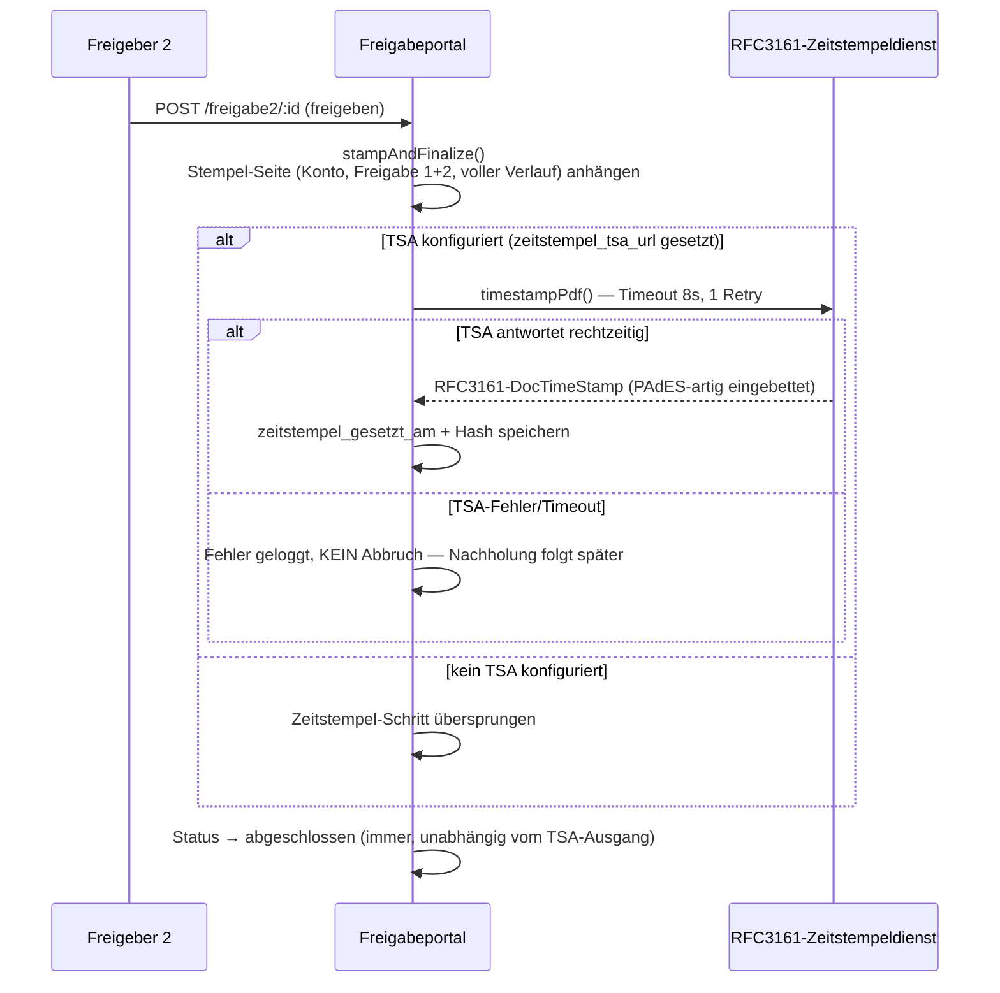
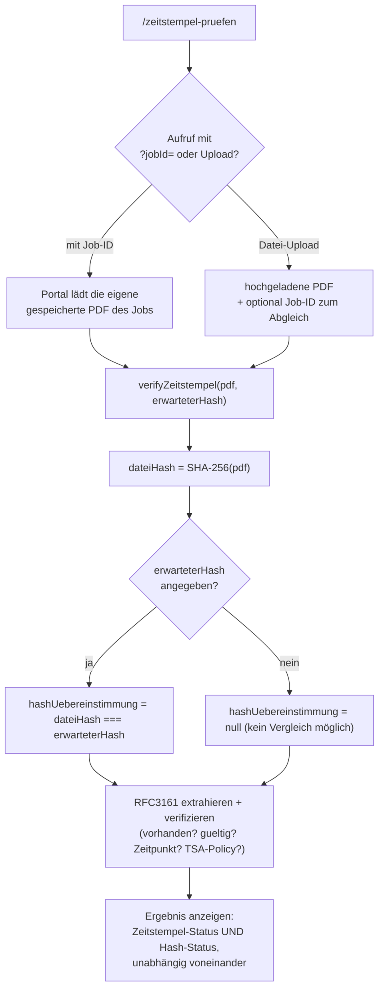

# RFC3161-Zeitstempel und Prüfbescheinigung

Ziel: nach Abschluss der zweiten Freigabe kryptographisch beweisbar
machen, dass die finale (gestempelte) PDF seither unverändert ist —
Voraussetzung für die langfristige Absicht, die physische
Papier-Rechnungsablage vollständig abzulösen. Die Funktion ist optional:
solange keine TSA-URL konfiguriert ist, läuft das Portal wie zuvor, nur
ohne Zeitstempel.

## Stempelung bei Freigabe 2

Wichtige Design-Entscheidung: **die Zeitstempelung ist best effort und
blockiert Freigabe 2 nie.** Ein TSA-Ausfall darf die eigentliche,
fachlich entscheidende Freigabe nicht verzögern. Ein fehlgeschlagener
Versuch wird stattdessen regelmässig vom Hintergrund-Job
`zeitstempel-nachholen` erneut versucht (siehe
[geplante-jobs-und-benachrichtigungen.md](geplante-jobs-und-benachrichtigungen.md)) —
**nur solange die PDF-Datei noch auf dem Portal-Server liegt**, also
bevor n8n den Job abgeholt hat. Danach ist ein Nachholen technisch nicht
mehr möglich.

`n8n` sieht einen fertigen Job über `GET /api/n8n/jobs/abholbereit`
**erst, wenn** die TSA-Funktion aktiv ist **und** der Zeitstempel
tatsächlich gesetzt wurde — ein Job ohne Zeitstempel bleibt so lange
unsichtbar für die Abholung.

**Splitgruppen** (siehe
[rechnungs-workflow.md](rechnungs-workflow.md#6-splitgruppen--kombinierter-export-statt-n-einzel-buchungen))
laufen durch denselben Mechanismus, aber einmal für das **kombinierte**
Gruppen-Dokument statt einmal je Teil-Job: `gruppe_zeitstempel_gesetzt_am`/
`gruppe_zeitstempel_datei_hash` auf dem Elternjob, nachgeholt vom eigenen
`split-gruppen-nachholen`-Job statt von `zeitstempel-nachholen`.

## Verifikation (`/zeitstempel-pruefen`)

Zwei unabhängige Prüfungen laufen bei jeder Verifikation, unabhängig
voneinander:

1. **RFC3161-Gültigkeit**: enthält die PDF einen eingebetteten Zeitstempel,
   und ist dessen kryptographische Signatur gegen den aktuellen Inhalt der
   Datei gültig? (`extractTimestamps` + `verifyTimestamp` aus `pdf-rfc3161`.)
   Beweist "diese Datei ist seit dem Zeitstempel unverändert" — aber nicht,
   dass es sich um *die* Datei handelt, die zu einem bestimmten Job gehört.
2. **Hash-Abgleich gegen den in der Datenbank gespeicherten Hash**
   (`jobs.zeitstempel_datei_hash`, gesetzt beim Stempeln): SHA-256 der
   hochgeladenen/angezeigten Datei wird mit dem gespeicherten Hash
   verglichen. Schliesst die Lücke von Punkt 1 — beweist "das ist wirklich
   die Datei, die zu diesem Job gehört", unabhängig vom TSA-Ergebnis.

Der Hash-Abgleich ist ein **optionales Job-ID-Feld**: Zugriff auf den
gespeicherten Hash setzt dieselbe Job-Autorisierung voraus wie das
Ansehen der PDF selbst (`canViewJobPdf`, siehe
[auth-und-rechte.md](auth-und-rechte.md)) — man kann also nicht über einen
fremden Job-ID-Parameter prüfen, ob eine beliebige Datei zu einer fremden
Rechnung passt.

## Prüfbescheinigung (`/zeitstempel-pruefen/zertifikat`)

Eine druckfertige, eigenständige Seite, die das Verifikationsergebnis
menschenlesbar zusammenfasst (Job-Details, Zeitstempel-Zeitpunkt,
TSA-Policy, Hash-Übereinstimmung, Ersteller/Erstellzeitpunkt der
Bescheinigung selbst) — gedacht als Ausdruck/PDF-Export für die externe
Revision oder Steuerprüfung, ohne dass die prüfende Stelle selbst Zugriff
auf das Portal braucht.

## Konfiguration (**Admin → Zeitstempel**, `superadmin`-exklusiv)

TSA-URL, optionaler Benutzername/Passwort (HTTP-Basic-Auth, von Hand als
Header gebaut — die verwendete Bibliothek hat kein eingebautes
Auth-Konzept), und eine Warnschwelle in Stunden: **Admin-Dashboard** zeigt
eine Warnung, sobald abgeschlossene Jobs länger als diese Schwelle ohne
gesetzten Zeitstempel warten (nur relevant, solange eine TSA-URL
konfiguriert ist).
