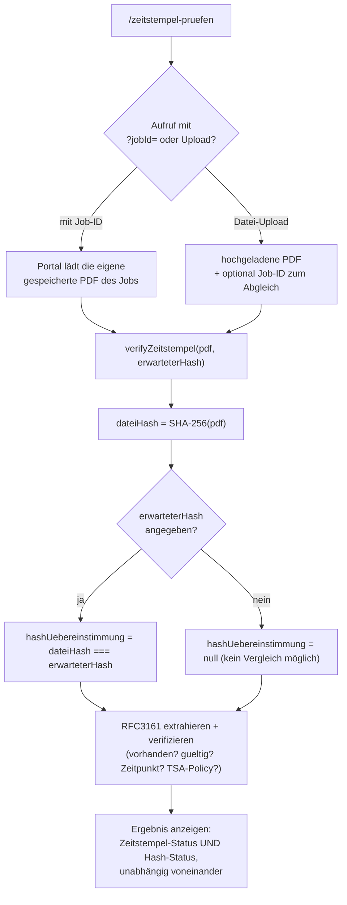

# RFC3161-Zeitstempel und Prüfbescheinigung

**Stand 2026-09-30:** Neue Zeitstempel werden vor der Übernahme gegen
lokale Vertrauensanker und aktuelle CRLs geprüft; die verwendete Evidenz
wird gespeichert. Die Upload-Prüfansicht kontrolliert dagegen Signatur,
vollständige ByteRange-Abdeckung und optional den gespeicherten Dateihash,
führt aber keine historische Ketten- oder Sperrprüfung durch. Die konkrete
DigiCert-Konfiguration ist noch nicht betrieblich abgenommen. Die
Prüfbescheinigung ist kein vollständiger Vertrauens- oder Langzeitnachweis.
Siehe [offene Abnahmepunkte](audit-umsetzungsstand-2026-09-27.md).

**Ergaenzung 2026-09-28:** Vor dem Speichern neuer Zeitstempel werden der
Erfolgsstatus, TSTInfo-Version/-Inhaltstyp, genau ein Unterzeichner,
SHA-256-Dokumenthash und die Nonce gegen die konkrete Anfrage geprueft.
Danach werden die Signatur, das Vorhandensein eines ESS-Attributs und die
vollstaendige ByteRange-Abdeckung der resultierenden PDF kontrolliert.
Fremde, wiederverwendete oder manipulierte Antworten gelten als fehlgeschlagener
TSA-Versuch, nicht als gesetzter Zeitstempel. Diese Anfragebindung entspricht
den Pruefanforderungen aus [RFC 3161, Abschnitt 2.2](https://www.rfc-editor.org/rfc/rfc3161.html#section-2.2).
Zusaetzlich muss das eindeutig ueber Aussteller/Seriennummer bestimmte
Signierzertifikat zum behaupteten Zeitstempel- und lokalen Empfangszeitpunkt
gueltig sein. Es braucht genau eine kritische EKU ausschliesslich fuer
`timeStamping`. ESSCertID bzw. ESSCertIDv2 werden gegen den Hash des tatsaechlichen
Signierzertifikats geprueft, einschliesslich Aussteller/Seriennummer, falls angegeben.
Bei ESSv2 werden SHA-256/384/512 unterstuetzt, bei ESSv1 SHA-1 ausschliesslich als
historischer Zertifikatsbezeichner. Der Signatur-Digest muss SHA-256/384/512 sein.
Andere Unterzeichnerkennungen als Aussteller/Seriennummer werden vorerst abgewiesen.
Die ESS-Bindung richtet sich nach [RFC 5035](https://www.rfc-editor.org/rfc/rfc5035.html).

Fuer neue Zeitstempel ist jetzt zusaetzlich eine Kette zu lokal freigegebenen,
per Dateihash festgelegten Root-CAs erforderlich. Fehlende oder falsche
Vertrauensanker verhindern die Uebernahme. [Konfiguration](tsa-vertrauensanker.md).
Neue Zeitstempel verlangen ausserdem aktuelle lokale, direkt signierte CRLs fuer
alle Nicht-Root-Zertifikate. Fehlende, veraltete oder ungueltige Listen und
gesperrte Zertifikate verhindern die Uebernahme. Kein automatischer Netzabruf;
Bereitstellung und Erneuerung erfolgen extern, siehe die verlinkte Konfiguration.
Die konkrete DigiCert-Root-/CRL-Zuordnung und Betriebsabnahme, OCSP,
zusaetzliche ESS-Kettenbeschraenkungen und historische Langzeitvalidierung bleiben offen.
Die lokale Uhr ist dabei eine
Betriebsvoraussetzung, keine unabhaengige Zeitquelle. Die Upload-Pruefansicht
prueft weiterhin nur Dokumentintegritaet/Signatur und behauptet kein Zertifikatsvertrauen.
Es wird keine automatische LTV-Anreicherung ausgefuehrt;
dadurch werden weder unsignierte Nachtraege noch automatische Abrufe von
Zertifikats-/Sperrlisten-URLs aus der Antwort vorgenommen. Token muessen in den
festen 32-KiB-Signaturplatzhalter passen; bei Ueberschreitung scheitert der Versuch.

Die TSA-Erfolgstests verwenden jetzt OpenSSL als lokalen, selbstsignierten Test-TSA
und signieren jeweils die tatsaechliche Anfrage. `openssl` muss deshalb fuer den
Testlauf installiert sein; der Produktionscode benoetigt kein OpenSSL-CLI.
Ein erfolgreicher Test mit diesem Testzertifikat ist kein DigiCert-Vertrauensnachweis.

Ziel: nach Abschluss der zweiten Freigabe kryptographisch beweisbar
machen, dass die finale (gestempelte) PDF seither unverändert ist —
Voraussetzung für die langfristige Absicht, die physische
Papier-Rechnungsablage vollständig abzulösen. Die Funktion ist optional:
solange keine TSA-URL konfiguriert ist, läuft das Portal wie zuvor, nur
ohne Zeitstempel.

## Stempelung bei Freigabe 2

```mermaid
sequenceDiagram
    participant F as Freigeber 2
    participant P as Freigabeportal
    participant TSA as RFC3161-Zeitstempeldienst

    F->>P: POST /freigabe2/:id (freigeben)
    P->>P: stampAndFinalize()<br/>Stempel-Seite (Konto, Freigabe 1+2, voller Verlauf) anhängen
    alt TSA konfiguriert (zeitstempel_tsa_url gesetzt)
        P->>TSA: timestampPdf() — Timeout 8s, 1 Retry
        alt TSA antwortet rechtzeitig
            TSA-->>P: RFC3161-DocTimeStamp (PAdES-artig eingebettet)
            P->>P: zeitstempel_gesetzt_am + Hash speichern
        else TSA-Fehler/Timeout
            P->>P: Fehler geloggt, KEIN Abbruch — Nachholung folgt später
        end
    else kein TSA konfiguriert
        P->>P: Zeitstempel-Schritt übersprungen
    end
    P->>P: Neue PDF-Datei dauerhaft schreiben
    P->>P: Zustand/Berechtigung erneut prüfen; Freigabe, Snapshot, Dateizeiger und Hash atomar speichern
```

Ein TSA-Netzwerkfehler wird weiterhin zur spaeteren Nachholung vorgemerkt.
Datei-, Datenbank- und Konsistenzfehler brechen dagegen die Finalisierung ab;
ohne vollstaendige Speicherung gibt es keinen erfolgreichen Abschluss.
Ein fehlgeschlagener TSA-
Versuch wird stattdessen regelmässig vom Hintergrund-Job
`zeitstempel-nachholen` erneut versucht (siehe
[geplante-jobs-und-benachrichtigungen.md](geplante-jobs-und-benachrichtigungen.md)) —
**nur solange die PDF-Datei noch auf dem Portal-Server liegt**, also
bevor n8n den Job abgeholt hat. Danach ist ein Nachholen technisch nicht
mehr möglich.

Ist die TSA-Funktion aktiv, sieht n8n einen fertigen Job erst mit gesetztem
Zeitstempel. Neue Einzeljobs speichern diese Pflicht bei Freigabe dauerhaft;
das spaetere Abschalten der globalen TSA-Einstellung umgeht sie nicht.
Ohne TSA-Konfiguration abgeschlossene Einzeljobs koennen weiterhin ohne Zeitstempel
exportiert werden. Gruppen speichern die Pflicht vor der Finalisierung dauerhaft,
sobald eine TSA konfiguriert ist oder ein aktiver Teilbeleg sie verlangt.
Nach einem Ausfall muss die TSA fuer den erneuten Versuch wieder verfuegbar sein;
das Abschalten erlaubt keinen ungestempelten Ersatzexport. Auch die alte
Abholliste und Transportbestaetigung beachten die gespeicherte Pflicht.

**Splitgruppen** (siehe
[rechnungs-workflow.md](rechnungs-workflow.md#6-splitgruppen--kombinierter-export-statt-n-einzel-buchungen))
laufen durch denselben Mechanismus, aber einmal für das **kombinierte**
Gruppen-Dokument statt einmal je Teil-Job: `gruppe_zeitstempel_gesetzt_am`/
`gruppe_zeitstempel_datei_hash` auf dem Elternjob, nachgeholt vom eigenen
`split-gruppen-nachholen`-Job statt von `zeitstempel-nachholen`.
Die neue Gruppen-PDF wird exklusiv mit Modus 0600 geschrieben und per fsync
gesichert. Unmittelbar vor dem Datenbank-Commit werden Gruppenstand, Freigaben
und Quelldateien erneut verglichen. Dateizeiger und finaler SHA-256 werden
gemeinsam gespeichert; `gruppe_final_datei_hash` schuetzt auch Gruppen ohne TSA.
Die Originaldateien werden dabei nicht ersetzt. Nach SIGKILL vor dem Commit
kann eine unreferenzierte neue Datei zurueckbleiben; die Gruppe bleibt fuer den
Nachholjob offen. `pdf-bereinigung` verschiebt eindeutig verwaiste `final-<uuid>.pdf` nach
der Wartefrist (Default 24 Stunden) in Quarantäne. Referenzen, bekannte
Hashes und laufende Nachholjobs verhindern die Verschiebung. Endgültiges
Löschen oder Zurückholen erfolgt begründet durch einen Superadmin unter
`/admin/dateiquarantaene`; siehe [Audit-Härtung](audit-paket-haertung-2026-09-29.md).

## Verifikation (`/zeitstempel-pruefen`)

Zwei unabhängige Prüfungen laufen bei jeder Verifikation, unabhängig
voneinander:

1. **RFC3161-Gültigkeit**: enthält die PDF einen eingebetteten Zeitstempel,
   und ist dessen kryptographische Signatur gegen den aktuellen Inhalt der
   Datei gültig? (`extractTimestamps` + `verifyTimestamp` aus `pdf-rfc3161`.)
   Zusaetzlich muss der Zeitstempel die gesamte aktuelle Datei abdecken;
   angehaengte, nicht signierte Revisionen reichen nicht aus. Ohne Truststore
   bleibt die Identitaet und Vertrauenswuerdigkeit der TSA ungeprueft.
2. **Hash-Abgleich gegen den in der Datenbank gespeicherten Hash**
   (`jobs.zeitstempel_datei_hash`, gesetzt beim Stempeln): SHA-256 der
   hochgeladenen/angezeigten Datei wird mit dem gespeicherten Hash
   verglichen. Das bindet die Datei an den gespeicherten Jobstand, sofern
   die Referenzdatenbank vertrauenswuerdig ist. Fuer Gruppen werden Gruppen-PDF
   und Gruppenhash verwendet, nicht das urspruengliche Rechnungsdokument.

```mermaid
flowchart TD
    A["/zeitstempel-pruefen"] --> B{"Aufruf mit<br/>?jobId= oder Upload?"}
    B -- "mit Job-ID" --> C["Portal lädt die eigene<br/>gespeicherte PDF des Jobs"]
    B -- "Datei-Upload" --> D["hochgeladene PDF<br/>+ optional Job-ID zum Abgleich"]
    C --> E["verifyZeitstempel(pdf, erwarteterHash)"]
    D --> E
    E --> F["dateiHash = SHA-256(pdf)"]
    F --> G{"erwarteterHash<br/>angegeben?"}
    G -- ja --> H["hashUebereinstimmung = dateiHash === erwarteterHash"]
    G -- nein --> I["hashUebereinstimmung = null (kein Vergleich möglich)"]
    H --> J["RFC3161 extrahieren + verifizieren<br/>(vorhanden? gueltig? Zeitpunkt? TSA-Policy?)"]
    I --> J
    J --> K["Ergebnis anzeigen:<br/>Zeitstempel-Status UND Hash-Status,<br/>unabhängig voneinander"]
```

Der Hash-Abgleich ist ein **optionales Job-ID-Feld**: Zugriff auf den
gespeicherten Hash setzt dieselbe Job-Autorisierung voraus wie das
Ansehen der PDF selbst (`canViewJobPdf`, siehe
[auth-und-rechte.md](auth-und-rechte.md)) — man kann also nicht über einen
fremden Job-ID-Parameter prüfen, ob eine beliebige Datei zu einer fremden
Rechnung passt.

## Prüfbescheinigung (`/zeitstempel-pruefen/zertifikat`)

Eine druckfertige, eigenständige Seite, die das Verifikationsergebnis
menschenlesbar zusammenfasst (Job-Details, Zeitstempel-Zeitpunkt,
TSA-Policy, Hash-Übereinstimmung, Ersteller/Erstellzeitpunkt der
Bescheinigung selbst) — gedacht als Ausdruck/PDF-Export für die externe
Revision oder Steuerprüfung, ohne dass die prüfende Stelle selbst Zugriff
auf das Portal braucht.

## Konfiguration (**Admin → Zeitstempel**, `superadmin`-exklusiv)

TSA-URL, optionaler Benutzername/Passwort (HTTP-Basic-Auth, von Hand als
Header gebaut — die verwendete Bibliothek hat kein eingebautes
Auth-Konzept), und eine Warnschwelle in Stunden: **Admin-Dashboard** zeigt
eine Warnung, sobald abgeschlossene Jobs länger als diese Schwelle ohne
gesetzten Zeitstempel warten (nur relevant, solange eine TSA-URL
konfiguriert ist).
